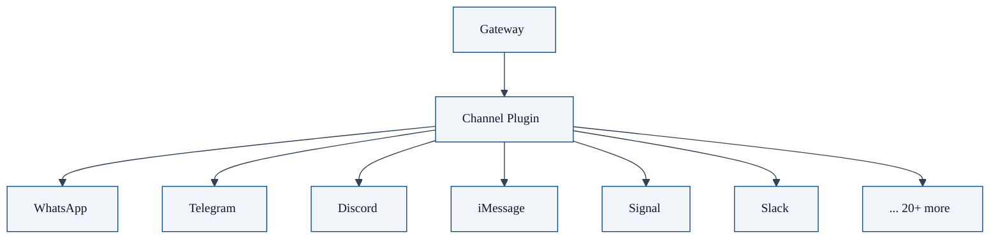

# 第四章：多渠道接入 —— 如何支持 25+ 聊天平台

OpenClaw 最方便的一点就是：**你不用换聊天软件**，AI 直接出现在你天天都用的聊天软件里。

本章我们讲解 OpenClaw 怎么做到支持 25+ 聊天平台，架构设计是什么样的。

## 什么是多渠道接入

"多渠道"就是：

- 你天天用 WhatsApp → OpenClaw 接进去，你就在 WhatsApp 用 AI
- 你团队在 Discord → OpenClaw 接进去，你就在 Discord 用 AI
- 你喜欢苹果生态，用 iMessage → OpenClaw 接进去，你就在 iMessage 用 AI
- 甚至你喜欢用网页 → OpenClaw 内置 WebChat，直接浏览器用

一句话：**AI 跟着你走，你不用换环境**。

## 架构设计：渠道即插件

OpenClaw 设计：**每个渠道都是独立插件**。



### 插件接口

每个渠道插件只要实现几个方法：

```typescript
interface Channel {
  // 启动渠道，连接到平台
  start(): Promise<void>;
  // 停止渠道
  stop(): Promise<void>;
  // 收到用户消息 → 交给 Gateway 处理
  onMessage(message: IncomingMessage): Promise<void>;
  // Gateway 处理完 → 把结果发回给用户
  sendMessage(recipient: Recipient, text: string): Promise<void>;
}
```

就这么简单。新增渠道只要写个新插件，不用改核心代码。

### 为什么这样设计

**好处**：

- 正交：核心网关不需要关心渠道细节
- 可扩展：社区想加新渠道，不用碰核心，发个 PR 就行
- 可替换：这个渠道实现不好，换一个实现就行
- 可配置：你只用 Telegram，就只开 Telegram，其他不用开，节省资源

## 渠道统一抽象

虽然渠道五花八门，OpenClaw 把渠道抽象成几个统一概念：

| 概念 | 含义 |
|------|------|
| `channel` | 哪个渠道（telegram/discord/...） |
| `accountId` | 哪个账号（如果你登了多个） |
| `from` | 谁发的消息（用户账号） | |
| `threadId` | 哪个线程/频道（Discord 线程，Telegram 群） |
| `groupId` | 哪个群/组 |

这些概念抽象之后，核心路由不管你是什么渠道，都能正确路由到会话。

## 会话键生成算法

路由的核心是生成唯一**会话键**：

```typescript
// 伪代码
function resolveSessionKey(config, channel, from, threadId) {
  const scope = config.session?.scope ?? "per-sender";
  switch (scope) {
    case "per-sender":
      // 每个用户一个会话
      return `${channel}:${accountId}:${from}`;
    case "per-thread":
      // 每个线程一个会话
      return `${channel}:${accountId}:${from}:${threadId}`;
  }
}
```

不同渠道不同配置，生成不同的会话键。这样：

- 群聊里，每个人都有自己独立的 AI 会话
- 同一个人不同线程，也能分开

## 已支持渠道列表

截止目前，OpenClaw 官方支持这些渠道：

**聊天消息**：

- WhatsApp
- Telegram
- Discord
- iMessage (macOS)
- Signal
- Matrix
- Slack
- Mastodon
- Line
- Mattermost
- Twitch
- Bluesky
- ... 还有很多

**原生应用**：

- macOS 菜单栏 app
- iOS app
- Android app

**其他**：

- CLI 命令行
- WebChat 网页

完整列表看 [OpenClaw 官方](https://github.com/openclaw/openclaw)。

## 渠道权限控制

每个渠道可以独立配置，配置写在你的**主配置文件** `~/.openclaw/openclaw.json` 的 `channels` 下：

```json5
{
  channels: {
    discord: {
      enabled: true,
      token: "xxx",
      pairing: {
        // 允许哪些用户
        allowUsers: ["your-user-id"],
      },
    },
    telegram: {
      enabled: true,
      token: "yyy",
      pairing: {
        allowUsers: ["your-account"],
      },
    },
  },
}
```

你不用的渠道关掉就行，节省资源。

## 我的日常使用场景

举个实际例子：

- **上班**：公司用 Slack → OpenClaw 在 Slack 里
- **私下聊天**：用 Telegram → OpenClaw 在 Telegram 里
- **苹果电脑**：菜单栏有 app，点一下就能聊
- **iOS**：手机上也有 app，随时随地

无论你在哪里，AI 都在那里。不用切 APP，不用重新登录，体验一致。

## 为什么多渠道接入很重要

很多 AI 助手要求你**来我的网站/APP 用**，这其实违背用户习惯：

- 用户已经有习惯的聊天软件了
- 为什么要用户换环境？
- 为什么不能 AI 适应用户，而是用户适应 AI？

OpenClaw 的哲学：**用户在哪里，AI 就去哪里**。

## 本章小结

- OpenClaw 支持 25+ 聊天平台，用户不用换软件，AI 适应用户
- 架构：每个渠道都是独立插件，新增渠道不用改核心
- 统一抽象：channel/account/from/thread → 生成唯一会话键
- 独立配置：每个渠道可以单独开/关、单独配置权限
- 哲学：用户在哪里，AI 就去哪里

---

---

**系列目录**：
- [第一章：OpenClaw 是什么 —— 自托管个人 AI 助手的终极形态](./01-what-is-openclaw.md)
- [第二章：核心架构总览 —— Gateway 为什么是中心控制平面](./02-architecture-overview.md)
- [第三章：Gateway —— 核心网关服务到底做了什么](./03-gateway.md)
- 第四章：多渠道接入 —— 如何支持 25+ 聊天平台 👈 当前位置
- [第五章：ACP —— 如何对接外部 AI 客户端](./05-acp.md) 👉 下一章
- [第六章：消息路由 —— 消息如何正确送到对的会话](./06-routing.md)
- [第七章：安全模型 —— 配对白名单如何保护你](./07-security-model.md)
- [第八章：为什么你需要一个多智能体框架 —— 单智能体的困境](./../02-multi-agent/08-why-you-need-multi-agent-framework.md)
- [第九章：sessions_spawn —— 多智能体协作的核心原语](./../02-multi-agent/09-sessions-spawn-core-primitive.md)
- [第十章：协作架构模式 —— 从 Master-Worker 到 Hub-and-Spoke](./../02-multi-agent/10-collaboration-architecture-patterns.md)
- [第十一章：隔离设计 —— 为什么每个子智能体需要独立会话](./../02-multi-agent/11-isolation-design.md)
- [第十二章：嵌套协作 —— 如何实现 Orchestrator-Worker 模式](./../02-multi-agent/12-nested-collaboration.md)
- [第十三章：实践案例 —— 从零构建一个代码评审团队](./../02-multi-agent/13-practical-case-code-review-team.md)
- [第十四章：platforms —— 全平台安装部署指南](./../03-core-concepts/14-platforms.md)
- [第十五章：providers —— 各大模型提供者配置大全](./../03-core-concepts/15-providers.md)
- [第十六章：plugins —— 插件系统开发指南](./../03-core-concepts/16-plugins.md)
- [第十七章： refactor —— OpenClaw 重构原则与工作流](./../03-core-concepts/17-refactor.md)
- [第十八章：reference —— 完整配置、模板、CLI 命令参考](./../03-core-concepts/18-reference.md)
- [第十九章：skills —— 技能系统核心概念与开发指南](./../03-core-concepts/19-skills.md)
- [第二十章：ClawHub —— 技能市场如何分享和获取技能](./../03-core-concepts/20-clawhub.md)
- [第二十一章：Canvas A2UI —— 实时可视化协作 workspace](./../04-client-ux/21-canvas.md)
- [第二十二章：语音唤醒 (Voice Wake) —— 语音交互体验](./../04-client-ux/22-voice-wake.md)
- [第二十三章：WebChat —— Gateway WebSocket 聊天界面](./../04-client-ux/23-webchat.md)
- [第二十四章：工具系统 (Tools) —— OpenClaw 工具调用框架设计](./../05-tools-automation/24-tools.md)
- [第二十五章：内置浏览器 —— 网页抓取和交互](./../05-tools-automation/25-browser.md)
- [第二十六章：Cron 自动化 —— 定时任务自动化](./../05-tools-automation/26-cron.md)
- [第二十七章：Onboarding —— 新手引导流程设计](./../05-tools-automation/27-onboarding.md)
- [第二十八章：blogwatcher —— 博客与 RSS 更新监控](./../06-builtin-skills/28-live-covers.md)
- [第二十九章：gh-issues —— GitHub Issues 自动修复编排](./../06-builtin-skills/29-gh-issues.md)
- [第三十章：coding-agent —— 调用外部编码代理](./../06-builtin-skills/30-coding-agent.md)
- [第三十一章：模型故障转移 (Model Failover) —— 如何提高可用性](./../07-ops-best-practices/31-failover.md)
- [第三十二章：调试技巧 —— 如何排查 OpenClaw 问题](./../07-ops-best-practices/32-debugging.md)
- [第三十三章：成本优化 —— 如何用模型分级降低总成本](./../07-ops-best-practices/33-cost-optimization.md)
- [第三十四章：部署运维 —— OpenClaw 网关生产环境最佳实践](./../07-ops-best-practices/34-deployment.md)
