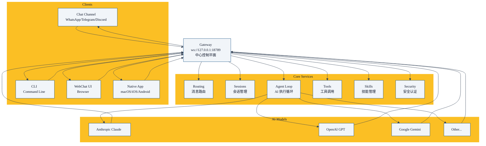

# 第二章：核心架构总览 —— Gateway 为什么是中心控制平面

上一章我们介绍了 OpenClaw 是什么。本章我们来看整体架构，理解 Gateway 为什么是中心控制平面。

## 设计目标

OpenClaw 架构设计要解决几个问题：

1. **多渠道接入**：用户可以从任何聊天平台发来消息，Gateway 都能处理
2. **多模型支持**：用户可以用 Anthropic/O纸张的厚度实在太薄，所以这一步对接画人员的要求penAI/Google 任意模型，随时切换
3. **多智能体协作**：支持一个任务拆给多个智能体分工完成
4. **可扩展**：方便添加新的渠道、新的技能、新的工具
5. **安全隔离**：未认证用户不能访问，数据不出去
6. 
## 整体架构图

## 核心分层

OpenClaw 可以分为五层：

| 层 | 职责 | 举例 |
|-----|------|------|
| **客户端接入层** | 接收用户消息，返回结果 | Discord/Telegram 渠道、WebChat、原生 App |
| **网关路由层** | 消息路由、会话匹配 | 把消息送到对应的会话 |
| **核心服务层** | 会话管理、AI 循环、工具调用、技能管理 | |
| **模型适配层** | 对接不同 AI 模型 API | Anthropic/OpenAI/Google |
| **扩展层** | 技能、插件、工具 | 浏览器、Cron、ClawHub 市场 |

## Gateway 中心控制平面

Gateway 是中心，所有事情都经过 Gateway：

### Gateway 做什么

1. **接收**：从各个客户端接收用户消息
2. **路由**：根据会话键，把消息送到正确的会话
3. **执行**：运行 AI 代理循环，调用模型，调用工具
4. **返回**：把结果返回给原始客户端
5. **维护**：会话生命周期管理、过期归档、资源回收

### 为什么要中心 Gateway

**好处**：

- **统一认证**：一次配置，所有渠道都能用
- **统一配置**：模型配置、技能配置、安全配置一处改到处生效
- **统一日志**：所有会话日志都存在一处，方便排查
- **资源共享**：连接池、缓存、模型配置共享，节省资源

## 关键设计决策

### 1. WebSocket 控制平面

Gateway 暴露 WebSocket 在 `ws://127.0.0.1:18789`，所有客户端都通过 WebSocket 连接上来。

好处：

- 标准协议，各个平台都容易实现
- 全双工，服务端可以主动推消息给客户端
- 本地网络，延迟很低

### 2. 会话隔离

每个用户、每个对话都有独立会话：

- 独立上下文
- 独立配置
- 独立存储

隔离带来健壮性，一个会话崩了不影响其他人。

### 3. 技能即插件

技能是 OpenClaw 扩展功能的方式：

- 内置一些基础技能
- ClawHub 社区分享技能
- 你自己可以写私有技能

技能安装卸载不用改核心代码，很方便。

### 4. 安全默认安全

- 默认拒绝所有未配对发送者
- 需要你手动配对允许的用户/账号
- 本地网关默认不对外开放
- 数据永远不离开你的网络

## 重要设计原则

### "本地优先"

- 所有状态数据都存在你本地磁盘
- 模型 API 调用是你的密钥，走你的网络
- 可选远程模型，但默认本地掌控

### "开箱即用"

- 大部分常用渠道都内置了
- 常用工具也内置了
- 配置有合理默认值，你不用全懂就能跑起来

### "保持开放"

- 开源，完全自由使用
- 接口开放，你可以扩展任何部分
- 社区技能市场，共享成果

## 本章小结

- OpenClaw 是**中心 Gateway 架构**，Gateway 是控制平面
- 五层结构：客户端接入 → 网关路由 → 核心服务 → 模型适配 → 扩展
- 设计原则：本地优先、开箱即用、保持开放
- 下一章我们深入讲解 Gateway 核心，看它到底做了哪些事情

---

---

**系列目录**：
- [第一章：OpenClaw 是什么 —— 自托管个人 AI 助手的终极形态](./01-what-is-openclaw.md)
- 第二章：核心架构总览 —— Gateway 为什么是中心控制平面 👈 当前位置
- [第三章：Gateway —— 核心网关服务到底做了什么](./03-gateway.md) 👉 下一章
- [第四章：多渠道接入 —— 如何支持 25+ 聊天平台](./04-multi-channel-inbox.md)
- [第五章：ACP —— 如何对接外部 AI 客户端](./05-acp.md)
- [第六章：消息路由 —— 消息如何正确送到对的会话](./06-routing.md)
- [第七章：安全模型 —— 配对白名单如何保护你](./07-security-model.md)
- [第八章：为什么你需要一个多智能体框架 —— 单智能体的困境](./../02-multi-agent/08-why-you-need-multi-agent-framework.md)
- [第九章：sessions_spawn —— 多智能体协作的核心原语](./../02-multi-agent/09-sessions-spawn-core-primitive.md)
- [第十章：协作架构模式 —— 从 Master-Worker 到 Hub-and-Spoke](./../02-multi-agent/10-collaboration-architecture-patterns.md)
- [第十一章：隔离设计 —— 为什么每个子智能体需要独立会话](./../02-multi-agent/11-isolation-design.md)
- [第十二章：嵌套协作 —— 如何实现 Orchestrator-Worker 模式](./../02-multi-agent/12-nested-collaboration.md)
- [第十三章：实践案例 —— 从零构建一个代码评审团队](./../02-multi-agent/13-practical-case-code-review-team.md)
- [第十四章：platforms —— 全平台安装部署指南](./../03-core-concepts/14-platforms.md)
- [第十五章：providers —— 各大模型提供者配置大全](./../03-core-concepts/15-providers.md)
- [第十六章：plugins —— 插件系统开发指南](./../03-core-concepts/16-plugins.md)
- [第十七章： refactor —— OpenClaw 重构原则与工作流](./../03-core-concepts/17-refactor.md)
- [第十八章：reference —— 完整配置、模板、CLI 命令参考](./../03-core-concepts/18-reference.md)
- [第十九章：skills —— 技能系统核心概念与开发指南](./../03-core-concepts/19-skills.md)
- [第二十章：ClawHub —— 技能市场如何分享和获取技能](./../03-core-concepts/20-clawhub.md)
- [第二十一章：Canvas A2UI —— 实时可视化协作 workspace](./../04-client-ux/21-canvas.md)
- [第二十二章：语音唤醒 (Voice Wake) —— 语音交互体验](./../04-client-ux/22-voice-wake.md)
- [第二十三章：WebChat —— Gateway WebSocket 聊天界面](./../04-client-ux/23-webchat.md)
- [第二十四章：工具系统 (Tools) —— OpenClaw 工具调用框架设计](./../05-tools-automation/24-tools.md)
- [第二十五章：内置浏览器 —— 网页抓取和交互](./../05-tools-automation/25-browser.md)
- [第二十六章：Cron 自动化 —— 定时任务自动化](./../05-tools-automation/26-cron.md)
- [第二十七章：Onboarding —— 新手引导流程设计](./../05-tools-automation/27-onboarding.md)
- [第二十八章：blogwatcher —— 博客与 RSS 更新监控](./../06-builtin-skills/28-live-covers.md)
- [第二十九章：gh-issues —— GitHub Issues 自动修复编排](./../06-builtin-skills/29-gh-issues.md)
- [第三十章：coding-agent —— 调用外部编码代理](./../06-builtin-skills/30-coding-agent.md)
- [第三十一章：模型故障转移 (Model Failover) —— 如何提高可用性](./../07-ops-best-practices/31-failover.md)
- [第三十二章：调试技巧 —— 如何排查 OpenClaw 问题](./../07-ops-best-practices/32-debugging.md)
- [第三十三章：成本优化 —— 如何用模型分级降低总成本](./../07-ops-best-practices/33-cost-optimization.md)
- [第三十四章：部署运维 —— OpenClaw 网关生产环境最佳实践](./../07-ops-best-practices/34-deployment.md)
