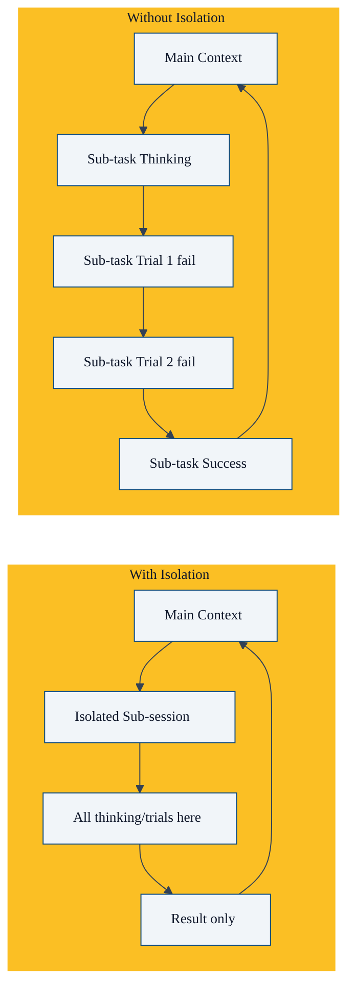

很多人第一次接触 `sessions_spawn` 会有疑问：不就是让另一个 AI 干活吗，为什么非要搞个独立会话？直接在当前上下文调用不行吗？

答案很简单：**隔离带来健壮性**。没有隔离，多智能体协作很容易变成一团乱麻。

## 什么是隔离

OpenClaw 中，每次 `sessions_spawn` 都会创建一个**全新的独立会话**：

- 独立的对话历史上下文
- 独立的工具调用权限配置
- 独立的模型配置
- 独立的存储路径

这个会话只干一件事：完成你交给它的那个任务。干完就结束，不会打扰你当前会话。

## 为什么需要隔离

我们一个个来看隔离带来的好处。

### 1. 上下文隔离：避免污染主上下文

这是最重要的好处。

想象一下：你是主协调智能体，你手头有用户需求、整体架构设计、当前进度。现在你 spawn 一个子智能体去写测试用例。

如果不隔离，子智能体写测试用例的过程（试错、思考、工具调用）全都会加到你的上下文里。几百个 token 就这么没了，而且这些内容对主协调智能体来说大多是噪音。

更糟糕的是，如果试错好几次，上下文会迅速膨胀，很快就把上下文窗口占满了。

**有了隔离**：子智能体整个过程都在自己会话里折腾，最后只把结果返回给你。主上下文只存结果，不存过程。主上下文保持干净。



### 2. 权限隔离：最小权限原则

不同子任务需要不同的工具权限。比如：

- 代码评审智能体：只需要 `read` 权限，不需要 `write` 权限
- 部署智能体：需要 `exec` 权限，这很危险，限制它只能在部署会话用
- 调研智能体：需要 `fetch` 权限，不需要文件写权限

如果没有隔离，所有工具权限都给主智能体，主智能体一不小心就会调用危险操作。

**有了隔离**：你可以给每个子智能体配置最小必要权限。主智能体权限大，但它很少直接做危险操作，都是分发子任务，风险可控。

OpenClaw 默认策略：

- 深度 0（主智能体）：完整工具权限
- 深度 1（子智能体，叶子）：默认没有会话工具权限（包括 `sessions_spawn`）
- 深度 1（编排器，当 `maxSpawnDepth >= 2`）：只开放 `sessions_spawn` 等必要会话工具

这就是**深度依赖的权限模型**，天然符合最小权限原则。

### 3. 认证隔离：灵活合并，专人专用

子智能体的认证是这样处理的：

1. 子智能体优先用自己 agent 配置里的认证
2. 如果没有，fallback 用主智能体的认证

这样很灵活：

- 如果某个子智能体需要用专门的 API key（比如它需要访问某个特定服务），直接配置在它自己的 agent 里
- 如果就是用和主智能体一样的认证，不用额外配置，直接继承

不会混在一起，要改的时候也好改。

### 4. 生命周期隔离：错了重来不影响全局

子任务失败了怎么办？

比如：子智能体超时了，或者跑出异常了，或者结果不符合要求。

**没有隔离**：失败过程已经把主上下文污染了，你得自己清理，很麻烦。

**有了隔离**：整个会话删掉重来就行。主上下文一点影响都没有。

```typescript
// 不行就是删掉重来，干净利落
await callGateway({
  method: "sessions.delete",
  params: { key: childSessionKey },
});
```

### 5. 自动归档：资源自动回收

自动归档配置写在你的**主配置文件** `~/.openclaw/openclaw.json` 的 `agents.defaults.subagents` 下：

```json5
{
  agents: {
    defaults: {
      subagents: {
        archiveAfterMinutes: 60, // 60 分钟后自动归档
      },
    },
  },
}
```

归档就是：

- 保留对话历史文件（改个名）
- 内存里不再保留活跃状态

不占内存资源，文件还在，需要看的时候还能找到。

## 清理策略：keep vs delete

你可以通过 `cleanup` 参数选择完成后怎么处理：

| 策略 | 说明 | 适用场景 |
|------|------|----------|
| `keep`（默认） | 保留会话文件，自动归档 | 绝大多数场景，需要审计的时候可以回看 |
| `delete` | 完成后立即删除会话文件 | 一次性临时任务，不关心历史 |

**建议**：除非你真的磁盘空间紧张，否则都用默认 `keep`。留着历史没坏处，出问题了方便排查。

## 会话键设计

OpenClaw 的会话键设计也体现了隔离思想：

```
agent:<agentId>:subagent:<uuid>
```

- 每个子会话都属于特定的 agent
- uuid 保证全局唯一
- 层级结构清晰，方便查找和级联删除

当你杀死一个父会话，所有它 spawn 的子会话都会被级联杀死。不会留下僵尸会话。

## 隔离的代价

隔离当然也有代价：

1. **启动开销**：每个新会话需要一点启动时间
2. **Token 重复**：如果子任务也需要一些上下文，需要传给子会话，会有一点重复的 token 消耗
3. **通信成本**：结果需要回传，有一点额外开销

但是，**这点代价相比于隔离带来的健壮性，完全值得**。

在生产环境，健壮性比那一毛钱 token 成本重要多了。

## 最佳实践

1. ****保持原子性**：一个子会话只做一件事。不要让一个子会话干好几个不相关的活。
2. ****按需授权**：给子智能体只开放它需要的工具权限，不要全开。
3. **默认保留历史**：除非明确要删，都 `keep`。占不了多少空间，排查问题的时候救命。
4. **不要太深**：深度超过 2，隔离层数太多，结果回传链路太长，容易出问题。

## 本章小结

- 隔离是多智能体协作健壮性的基石
- 独立会话带来：上下文隔离、权限隔离、认证隔离、生命周期隔离
- 自动归档帮你自动回收资源
- 默认 `cleanup: keep` 就好，留着历史没坏处
- 隔离的代价很小，收益很大，生产环境必须要有

---

