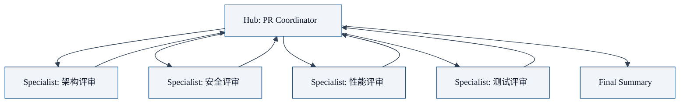

前面五章我们讲完了理论：为什么需要多智能体、核心原语 `sessions_spawn`、协作架构模式、隔离设计、嵌套协作。

本章我们来做一个完整的实践案例：**用 OpenClaw 构建一个自动化代码评审团队**。看完这个案例，你就可以照着做，构建自己的多智能体协作系统。

## 需求分析

我们想要一个这样的代码评审系统：

- 当有一个新 PR 开过来，自动触发评审
- 多个不同领域专家从不同角度评审代码：
  1. **架构专家**：看整体架构是否合理，接口设计是否干净
  2. **安全专家**：找潜在的安全漏洞，比如注入、硬编码密钥、错误的权限控制
  3. **性能专家**：看算法复杂度、是否有可以优化的地方
  4. **测试专家**：检查测试覆盖率是否足够，测试用例是否合理
- 最后由主协调者汇总所有专家意见，给出总结和评分

## 架构选择

我们选什么模式？**Hub-and-Spoke**，完美匹配：



- Hub = PR Coordinator，负责接收 PR，分发任务给专家，汇总结果
- Spokes = 各个领域专家，各自评审自己擅长的领域
- 专家之间不通信，所有通信走 Hub

因为只有一层，深度 1 就够了，`maxSpawnDepth: 1` 足够。

## 项目文件结构

在你的 OpenClaw 配置目录里，这个代码评审团队的文件结构长这样：

```
~/.config/openclaw/
├── config.json          # 主配置文件，我们会在这里注册所有 agent
└── skills/
    └── code-review/
        ├── index.ts      # 主 Coordinator 的执行逻辑（就是我们后面讲的 spawn 专家那部分代码）
        └── prompts.ts   # 可选：把所有专家的系统 prompt 存在这里方便管理
```

**说明**：

- 主 Coordinator 的执行逻辑（那个 spawn 四个专家的代码）放在**自定义 Skill** 里，也就是 `skills/code-review/index.ts`
- 如果你想把 prompts 分离出来方便维护，可以放在 `prompts.ts`
- 所有专家 agent 配置在主 `config.json` 里注册

这样结构清晰，方便版本控制。你可以把整个 `code-review/` 目录 git 托管，分享给团队其他人用。

## 配置文件

所有 agent 配置写在你的**主配置文件** `~/.openclaw/openclaw.json` 的 `agents` 下：

```json5
{
  // ... 其他基础配置 ...

  agents: {
    defaults: {
      subagents: {
        maxSpawnDepth: 1,         // 一层嵌套足够
        maxChildrenPerAgent: 5,   // 最多 4 个专家 + 1，够了
        maxConcurrent: 4,         // 4 个专家并发评审
        runTimeoutSeconds: 900,  // 15 分钟超时，够了
      },
    },

    // 主 Coordinator
    "pr-coordinator": {
      model: "anthropic/claude-3-5-sonnet",
      description: "PR 协调者，汇总所有专家意见",
      subagents: {
        allowAgents: ["*"], // 允许 spawn 所有专家
      },
    },

    // 架构评审专家
    "architecture-reviewer": {
      model: "anthropic/claude-3-5-sonnet",
      description: "架构评审专家",
      // 不用开 spawn，因为它是叶子
    },

    // 安全评审专家
    "security-reviewer": {
      model: "anthropic/claude-3-5-haiku", // 安全规则检查可以用便宜模型
      description: "安全评审专家",
    },

    // 性能评审专家
    "performance-reviewer": {
      model: "anthropic/claude-3-5-sonnet",
      description: "性能评审专家",
    },

    // 测试评审专家
    "testing-reviewer": {
      model: "anthropic/claude-3-5-haiku", // 规则检查可以用便宜模型
      description: "测试评审专家",
    },
  },
}
```

**成本优化技巧**：不是所有专家都需要最贵的模型。像安全检查、测试检查这种规则比较明确的，可以用便宜的 Haiku，省钱。

## 系统 Prompt 设计

每个专家需要清晰的系统 Prompt，告诉它该做什么。

### 主 Coordinator Prompt

```
你是 PR 协调者，负责组织一次完整的代码评审。

工作流程：
1. 拿到 PR 的变更内容和上下文
2. spawn 四个不同领域专家分别评审：
   - architecture-reviewer：架构设计评审
   - security-reviewer：安全漏洞检查
   - performance-reviewer：性能优化建议
   - testing-reviewer：测试覆盖评审
3. 收集所有专家的评审意见
4. 汇总成一份清晰的评审报告，包含：
   - 总体评分（1-10）
   - 必须解决的问题（blocker）
   - 建议改进的问题
   - 可以接受的问题

记住：你只负责协调和汇总，具体评审交给专家。不要抢专家的活。
```

### 架构专家 Prompt

```
你是架构评审专家，专注于代码结构和接口设计。

评审重点：
1. 这个变更符合项目整体架构吗？
2. 接口设计是否清晰？命名是否准确？
3. 代码职责分离合理吗？有没有单个函数太长？
4. 错误处理是否正确？
5. 是否引入了不必要的依赖？

给出具体的改进建议，不要泛泛而谈。
```

### 安全专家 Prompt

```
你是安全评审专家，专注于找代码中的安全漏洞。

检查重点：
1. 是否有硬编码的密钥、密码、token？
2. 是否有 SQL 注入风险？
3. 是否有命令注入风险？
4. 是否有路径遍历风险？
5. 输入验证是否完整？
6. 权限控制是否正确？

找到问题请给出具体位置和修复建议。如果没找到问题，就说"未发现明显安全问题"。
```

### 性能专家 Prompt

```
你是性能评审专家，专注于性能优化。

检查重点：
1. 算法复杂度是否合理？有没有 O(n^2) 可以优化成 O(n log n)？
2. 是否有不必要的内存分配？
3. 循环有没有可以提前退出的地方？
4. 数据库查询有没有 N+1 问题？
5. 是否可以缓存结果避免重复计算？

给出具体优化建议。
```

### 测试专家 Prompt

```
你是测试评审专家，专注于测试质量。

检查重点：
1. 新增代码有没有对应的测试？
2. 测试用例覆盖了正常路径和异常路径吗？
3. 测试命名清晰吗？
4. 有没有测试冗余？

给出具体改进建议。
```

## 执行流程（代码逻辑）

**这段代码放在哪里**？就是我们刚才说的 `skills/code-review/index.ts` —— 这是你自定义的 Skill，由 OpenClaw 加载运行。

主 Coordinator 的执行流程：

```typescript
// 1. 接收 PR 信息
const prInfo = getPrInfo(); // 包含 diff、文件列表、上下文

// 2. spawn 所有专家，并行执行
const experts = [
  {
    agentId: "architecture-reviewer",
    task: `请评审以下 PR 变更，重点关注架构设计：\n\n${prInfo.diff}`,
    label: "Architecture review for PR #123",
  },
  {
    agentId: "security-reviewer",
    task: `请检查以下 PR 变更是否有安全漏洞：\n\n${prInfo.diff}`,
    label: "Security review for PR #123",
  },
  {
    agentId: "performance-reviewer",
    task: `请分析以下 PR 变更，给出性能优化建议：\n\n${prInfo.diff}`,
    label: "Performance review for PR #123",
  },
  {
    agentId: "testing-reviewer",
    task: `请检查这个 PR 的测试质量：\n\n${prInfo.diff}`,
    label: "Testing review for PR #123",
  },
];

// 并行 spawn，OpenClaw 会控制并发
const results = await Promise.all(
  experts.map(exp =>
    sessions_spawn(exp)
  )
);

// 3. 等待所有专家完成，收集结果
// OpenClaw 自动 announce 结果回来

// 4. 汇总结果，生成最终报告
const finalReport = `
# PR 评审报告

## 概述
PR: #${prInfo.number} ${prInfo.title}

## 架构评审
${results[0].result}

## 安全评审
${results[1].result}

## 性能评审
${results[2].result}

## 测试评审
${results[3].result}

## 总结评分
// 这里 Coordinator 根据四个专家结果给出总体评分和结论
`;

return finalReport;
```

就是这么简单。整个流程不到 100 行代码。

## 为什么这样设计

我们来回顾一下，这个设计用到了前面讲的所有原则：

| 原则 | 应用 |
|------|------|
| **分工专业化** | 每个专家只评审自己擅长的领域，更专注 |
| **隔离独立** | 每个专家评审在独立会话，不影响别人 |
| **Hub-and-Spoke** | 协调者负责流程，专家负责专业，职责清晰 |
| **成本优化** | 不同专家用不同模型，省钱 |
| **深度控制** | 一层足够，不需要嵌套，避免上下文漂移 |

## 如何扩展

如果你想再加一个专家，比如"文档专家"检查文档是否更新了，很简单：

1. 在配置里加一个 `documentation-reviewer` agent
2. 在 Coordinator 的专家列表里加上它
3. 给它写好系统 Prompt

就完了。不需要改其他代码。

## 进阶：质量闸门

如果你想再加一步质量闸门，可以在汇总之后：

- 如果有 **blocker** 问题，就标签 PR 为 `needs revision`，要求开发者修改
- 如果都是 `suggestion`，就标签 PR 为 `approved`

这个质量闸门逻辑需要你在应用层实现，OpenClaw 核心不提供，但因为有了隔离，你很容易加。

## 运行效果

实际跑起来是这样：

1. 开发者开 PR → webhook 触发 OpenClaw → `pr-coordinator` 启动
2. `pr-coordinator` spawn 四个专家 → 四个专家并行评审
3. 每个专家评审完，结果自动返回 `pr-coordinator`
4. `pr-coordinator` 汇总结果 → 评论到 PR 上

整个过程不需要人干预，开发者去喝杯咖啡，回来就能看到完整的评审报告。

## 完整安装步骤

总结一下，从零开始安装这个代码评审团队只需要四步：

### 第一步：创建文件

```bash
# 创建 skill 目录
mkdir -p ~/.config/openclaw/skills/code-review

# 创建主文件
touch ~/.config/openclaw/skills/code-review/index.ts
touch ~/.config/openclaw/skills/code-review/prompts.ts
```

### 第二步：编写代码

把本文"执行流程"中的代码复制到 `index.ts`，把所有 prompts 放到 `prompts.ts` 导出。

### 第三步：注册到配置

在你的 `~/.openclaw/openclaw.json` 的 `agents`  section，按照本文"配置文件"一节添加 `pr-coordinator` 和四个专家的配置。

### 第四步：重启 Gateway

```bash
# 重启 OpenClaw Gateway 让配置生效
openclaw restart
```

完成！现在你可以用了：

```
openclaw run --agent=pr-coordinator --prompt="请评审 PR #123"
```

## 本章小结

通过这个完整案例，我们看到：

- 用 Hub-and-Spoke 模式构建多专家协作系统非常简单
- 每个专家专注自己领域，结果更准确
- 隔离保证了一个专家错了不影响其他人
- 可以根据领域特点选择不同模型，优化成本
- 扩展方便，加新专家只要加配置

现在你已经看完了整个系列：

1. 理解了单智能体的痛点
2. 掌握了 `sessions_spawn` 核心原语
3. 知道了选择哪种协作模式
4. 理解了隔离为什么重要
5. 知道什么时候用嵌套协作
6. 看到了完整案例，可以照着做

**系列完结**。希望这个系列能帮助你理解 OpenClaw 多智能体协作的设计哲学，动手构建自己的第一个多智能体协作系统。

---

