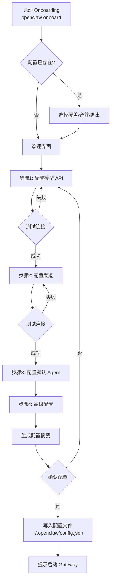
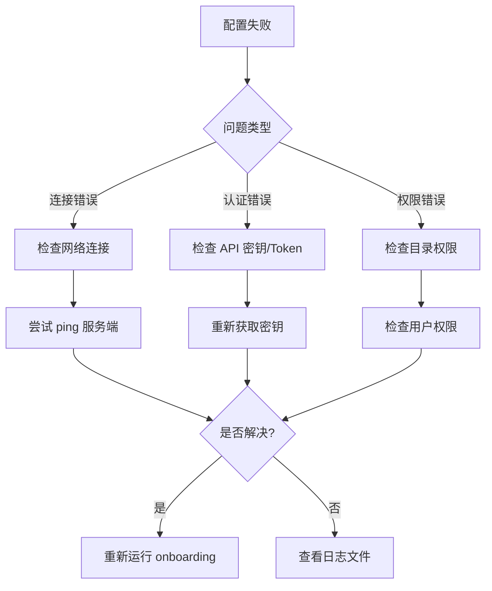

Onboarding 是 OpenClaw 的新手安装配置引导流程，帮助你从零一键完成配置，不用手改 JSON。本章介绍 Onboarding 工作流程、交互界面和最佳实践。

## 什么是 Onboarding

Onboarding = **交互式命令行配置向导**：

- 你刚安装完 OpenClaw
- 跑 `openclaw onboard`
- 一步步问你问题
- 自动生成配置文件
- 不用你手敲 JSON，不容易错

**目标**：让新手 5 分钟从安装到能用。

## 设计原则

1. **渐进式**：先让你跑起来，高级配置后面再改
2. **尽早失败**：每一步测试，错了立刻改，不要到最后才报错
3. **不黑箱**：生成的配置就是标准配置，你随时能手动改
4. **默认安全**：安全选项默认安全设置，你不用记
5. **自动化优先**：能自动发现就自动发现，不用你输（比如 Ollama 自动发现模型）

## Onboarding 流程



### 步骤详解

```text
$ openclaw onboard

👉 欢迎来到 OpenClaw！让我们一步步配置你的 Gateway。

━━━━━━━━━━━━━━━━━━━━━━━━━━━━━━━━━━━━━━━━━━━━━━━━━━━━━━━━━
步骤 1/4: 配置模型 API
━━━━━━━━━━━━━━━━━━━━━━━━━━━━━━━━━━━━━━━━━━━━━━━━━━━━━━━━━

选择你想用的模型提供者：
  [1] Anthropic (Claude)
  [2] OpenAI (GPT)
  [3] Google Gemini
  [4] Ollama (本地)
  [5] LiteLLM (自定义)
> 1

请输入 Anthropic API Key:
> sk-ant-xxx

正在测试连接... ✅ 连接成功！

━━━━━━━━━━━━━━━━━━━━━━━━━━━━━━━━━━━━━━━━━━━━━━━━━━━━━━━━━
步骤 2/4: 配置聊天渠道
━━━━━━━━━━━━━━━━━━━━━━━━━━━━━━━━━━━━━━━━━━━━━━━━━━━━━━━━━

选择你想用的聊天渠道：
  [1] Telegram
  [2] WebChat (浏览器)
  [3] Discord
  [4] Slack
> 1

请输入 Telegram Bot Token (从 @BotFather 获取):
> 123456:ABC-DEF...

正在测试连接... ✅ Bot 可用！

━━━━━━━━━━━━━━━━━━━━━━━━━━━━━━━━━━━━━━━━━━━━━━━━━━━━━━━━━
步骤 3/4: 配置默认 Agent
━━━━━━━━━━━━━━━━━━━━━━━━━━━━━━━━━━━━━━━━━━━━━━━━━━━━━━━━━

默认模型: claude-sonnet-4-6
Fallback 模型: claude-haiku-4-5
工作区目录: ~/openclaw-workspace

按 Enter 使用默认值，或输入自定义值。
>

━━━━━━━━━━━━━━━━━━━━━━━━━━━━━━━━━━━━━━━━━━━━━━━━━━━━━━━━━
步骤 4/4: 高级配置 (可选)
━━━━━━━━━━━━━━━━━━━━━━━━━━━━━━━━━━━━━━━━━━━━━━━━━━━━━━━━━

是否配置高级选项？ [Y/n]: n

━━━━━━━━━━━━━━━━━━━━━━━━━━━━━━━━━━━━━━━━━━━━━━━━━━━━━━━━━
配置摘要
━━━━━━━━━━━━━━━━━━━━━━━━━━━━━━━━━━━━━━━━━━━━━━━━━━━━━━━━━

模型提供者: Anthropic (claude-sonnet-4-6)
聊天渠道: Telegram
工作区: ~/openclaw-workspace

配置文件将保存到: ~/.openclaw/config.json

确认写入配置？ [Y/n]: Y

✅ 配置已保存！

运行以下命令启动 Gateway:
  openclaw gateway start

然后去 Telegram 找你的 bot，就可以开始聊天了！
```

**配置文件位置**：

```text
~/.openclaw/config.json
```

## 支持的配置项

### 模型提供者配置

| 提供者 | Onboarding 支持 | 需要输入 |
|--------|----------------|----------|
| Anthropic (Claude) | ✅ | API key |
| Anthropic setup-token | ✅ | 粘贴 token（会自动换取 API key） |
| OpenAI (GPT) | ✅ | API key |
| OpenAI Codex | ✅ | 自动从配置获取 |
| Google Gemini | ✅ | API key |
| Ollama (本地) | ✅ | 自动发现本地模型 |
| LiteLLM | ✅ | baseURL + API key（可选） |

### 聊天渠道配置

| 渠道 | Onboarding 支持 | 需要输入 |
|------|----------------|----------|
| Telegram | ✅ | Bot token（从 @BotFather 获取） |
| WebChat | ✅ | 端口（默认 3000）、认证方式 |
| Discord | ✅ | Bot token |
| Slack | ✅ | Bot token + Signing Secret |
| 其他 | ⚙️ | 部分支持，逐步完善中 |

### Agent 配置

| 配置项 | 说明 | 默认值 |
|--------|------|--------|
| 默认模型 | Agent 使用的首选模型 | 根据提供者自动选择 |
| Fallback 模型 | 备用模型（主模型失败时） | Haiku 系列 |
| 工作区目录 | Agent 读写文件的基础目录 | `~/openclaw-workspace` |

### 高级配置（可选）

| 配置项 | 说明 | 默认值 |
|--------|------|--------|
| Gateway 端口 | HTTP 服务器端口 | 3000 |
| 绑定地址 | 监听地址 | 127.0.0.1 |
| 插件开关 | 是否启用插件系统 | true |
| 心跳任务 | 是否启用定时心跳 | true |
| 日志级别 | 日志详细程度 | info |

## 生成的配置文件示例

Onboarding 完成后，生成的 `~/.openclaw/config.json` 如下：

```json
{
  "gateway": {
    "port": 3000,
    "bindAddress": "127.0.0.1"
  },
  "providers": {
    "anthropic": {
      "apiKey": "sk-ant-xxx"
    }
  },
  "channels": {
    "telegram": {
      "botToken": "123456:ABC-DEF..."
    }
  },
  "agents": {
    "default": {
      "model": "claude-sonnet-4-6",
      "fallbackModel": "claude-haiku-4-5",
      "workspace": "~/openclaw-workspace"
    }
  },
  "features": {
    "plugins": true,
    "heartbeat": true
  }
}
```

**注意**：这是一个标准配置文件，你可以随时手动编辑。

## 为什么这么设计

### 新手痛点

手动配置 JSON 新手常遇到：
- 不知道格式对不对
- 找不到哪里错了
- 少逗号引号 JSON 解析错
- 不知道哪些配置项必需哪些可选
- 复制粘贴错格式

Onboarding 解决这些问题：
- 交互式一问一答
- 自动生成正确 JSON
- 每一步测试连接对不对
- 错了立即告诉你重来
- 最后才写入配置文件

### 不锁死用户

- Onboarding 生成的配置就是标准配置
- 生成完你随时可以手动编辑
- 自动和手动配置可以混用
- 老手也能用 Onboarding 快速新建配置

## 非交互式使用

脚本自动化安装或 Docker 部署时，可以使用命令行参数跳过交互：

```bash
# 全自动化，完全无交互
openclaw onboard \
  --anthropic-api-key "$ANTHROPIC_API_KEY" \
  --telegram-bot-token "$TELEGRAM_BOT_TOKEN" \
  --default-workspace "~/my-workspace" \
  --yes
```

**使用场景**：

| 场景 | 说明 |
|------|------|
| Docker 容器启动 | 通过环境变量注入配置 |
| CI/CD 自动化 | 脚本化部署，无人值守 |
| 批量部署 | 一次配置多个实例 |
| 配置管理 | 通过配置文件或配置管理工具 |

**重要参数**：

| 参数 | 说明 | 必需 |
|------|------|------|
| `--anthropic-api-key` | Anthropic API 密钥 | 是 |
| `--openai-api-key` | OpenAI API 密钥 | 或 Anthropic |
| `--telegram-bot-token` | Telegram Bot Token | 可选 |
| `--discord-bot-token` | Discord Bot Token | 可选 |
| `--default-workspace` | 默认工作区目录 | 可选 |
| `--yes` | 跳过所有确认提示 | 推荐配合自动化使用 |

## 重新配置与更新

已经有配置了，想添加新渠道或更改模型：

```bash
openclaw configure
```

**交互式选项**：

| 选项 | 说明 |
|------|------|
| 添加新渠道 | 保留现有配置，只添加新的聊天渠道 |
| 修改模型配置 | 更改默认模型或添加新的提供者 |
| 更新渠道配置 | 修改现有渠道的参数 |
| 删除配置项 | 移除不再需要的渠道或配置 |

**迁移旧配置**：

Onboarding 可以读取你的旧配置，交互式升级，改完后写回去，格式自动适配新版本。

```bash
# 配置迁移模式
openclaw configure --migrate
```

### 环境配置

对于开发/生产多环境场景，可以使用不同的配置文件：

```bash
# 开发环境
openclaw --config ~/.openclaw/config.dev.json configure

# 生产环境
openclaw --config ~/.openclaw/config.prod.json configure
```

## 常见问题处理

Onboarding 会自动处理常见问题，让你快速定位并解决：

| 问题 | Onboarding 行为 | 解决方法 |
|------|----------------|----------|
| API 密钥无效 | 测试返回 401，提示重输 | 检查密钥是否正确、是否过期 |
| 网络连接失败 | 测试超时 | 检查网络连接、代理设置 |
| 端口被占用 | 检测到端口被占用 | 选择其他端口或停止占用进程 |
| 目录不存在 | 询问是否创建 | 允许自动创建或手动指定 |
| 配置文件已存在 | 提供覆盖/合并/跳过选项 | 根据需求选择 |
| Bot Token 无效 | Telegram API 返回错误 | 从 @BotFather 重新获取 token |

### 故障排查流程



## 最佳实践

### 新手第一次安装

```bash
# 1. 安装 OpenClaw
# (根据你的平台选择安装方式)

# 2. 运行 Onboarding
openclaw onboard

# 3. 跟着向导走，每一步等待测试通过再继续

# 4. 完成后启动 Gateway
openclaw gateway start

# 5. 去你配置的聊天渠道，开始使用
```

### 添加新渠道

```bash
# 启动配置工具
openclaw configure

# 选择"添加新渠道"选项
# 按提示输入新渠道的参数
# 现有配置不会被修改
```

### Docker 部署

```dockerfile
FROM openclaw/openclaw:latest

# 通过环境变量传递配置
ENV ANTHROPIC_API_KEY=sk-ant-xxx
ENV TELEGRAM_BOT_TOKEN=123456:ABC-DEF...

# 自动运行 Onboarding（非交互模式）
RUN openclaw onboard \
  --anthropic-api-key $ANTHROPIC_API_KEY \
  --telegram-bot-token $TELEGRAM_BOT_TOKEN \
  --yes

# 启动 Gateway
CMD ["openclaw", "gateway", "start"]
```

### 多环境管理

| 环境 | 配置文件 | 用途 |
|------|----------|------|
| 开发 | `config.dev.json` | 本地开发测试 |
| 测试 | `config.test.json` | CI/CD 环境测试 |
| 生产 | `config.prod.json` | 生产环境部署 |

```bash
# 指定配置文件启动
openclaw --config ~/.openclaw/config.prod.json gateway start
```

## 验证配置

配置完成后，使用以下命令验证一切正常：

```bash
# 检查配置文件语法
openclaw config validate

# 检查 Gateway 状态
openclaw gateway status

# 检查所有配置的渠道
openclaw channels test
```

如果所有检查都通过，说明配置成功，可以开始使用。

## 本章小结

- Onboarding 是交互式配置向导，让新手 5 分钟从零到可用
- 支持模型认证、渠道、Agent 等常见配置，支持交互式和非交互式两种模式
- 每一步自动测试连接，失败立即提示，不把问题留到最后
- 生成标准配置文件（`~/.openclaw/config.json`），随时可手动编辑
- 使用 `openclaw configure` 重新配置或添加新渠道，不会丢失现有配置

