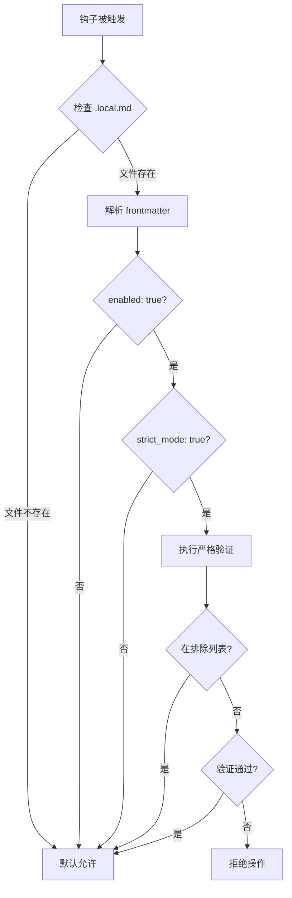
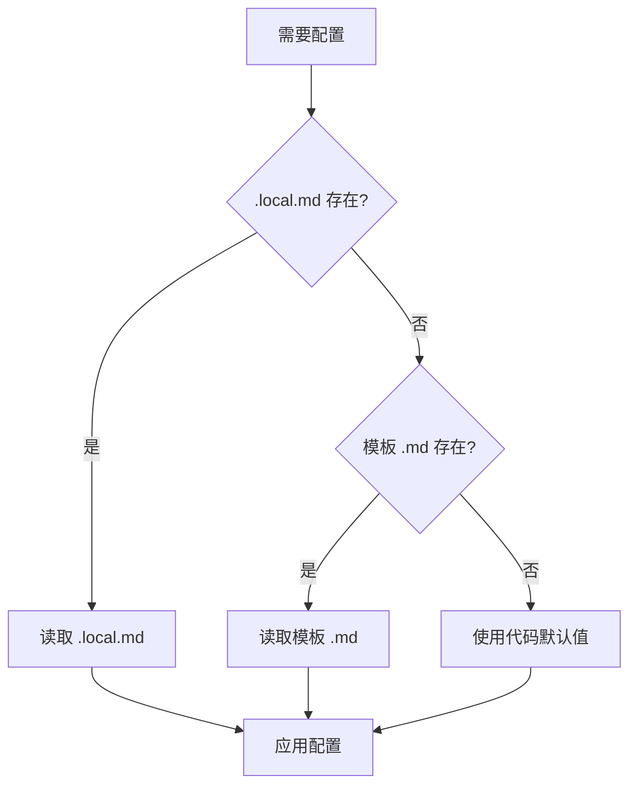

插件需要配置——启用/禁用开关、阈值参数、路径列表、模式选择。但你不想把这些硬编码在插件代码里，也不想让用户修改插件源文件。怎么办？

答案就是 **.local.md 模式**——一个优雅的、gitignore 友好的、易于解析的配置方案。

## 为什么不用 JSON/YAML 配置文件？

你可能在想：配置不就应该用 JSON 或 YAML 文件吗？为什么用 `.md`？

三个原因：

### 1. Gitignore 友好

`.local.md` 后缀是一种约定——带 `.local` 的文件通常被 gitignore，这意味着**每个用户可以有自己的配置**，不会干扰版本控制：

```gitignore
# .gitignore
*.local.md
.claude/*.local.md
```

### 2. 结构化 + 自由文本

YAML frontmatter 提供结构化数据，markdown 正文提供自由格式的笔记和说明：

```markdown
---
enabled: true
mode: strict
threshold: 80
---

## 项目备注
- 严格模式已为此项目启用
- 团队约定 threshold 不低于 75
```

JSON 做不到这一点。YAML 可以，但 `.local.md` 还享受 gitignore 约定。

### 3. 易于 Bash 解析

Bash 是 Claude Code 钩子的主要脚本语言。解析 markdown 文件中的 YAML frontmatter 比解析 JSON/YAML 更直观——你只需要在两个 `---` 之间提取行。

## .local.md 文件格式

### 基本结构

```markdown
---
key1: value1
key2: value2
boolean_key: true
number_key: 42
list_key:
  - item1
  - item2
nested_key:
  sub_key: sub_value
---

可选的 markdown 正文，提供额外上下文和说明。
```

### 格式要点

1. **文件必须以 `---` 开头**（第一行）
2. **YAML frontmatter 在两个 `---` 之间**
3. **markdown 正文在第二个 `---` 之后**
4. **frontmatter 是可选的**——可以只有 markdown 正文
5. **正文是可选的**——可以只有 frontmatter

### 文件位置

`.local.md` 配置文件通常放在项目的 `.claude/` 目录下：

```
project/
├── .claude/
│   ├── settings.json              # Claude Code 项目设置
│   ├── my-plugin.local.md         # my-plugin 的配置
│   ├── ralph-wiggum.local.md      # ralph-wiggum 的配置
│   └── multi-agent.local.md       # multi-agent 的配置
├── src/
└── ...
```

**命名约定**：`<plugin-name>.local.md`

## 在 Bash 中解析 Frontmatter

这是 .local.md 模式的核心操作——在 shell 脚本中提取配置值。

### 基本解析模式

```bash
#!/bin/bash
SETTINGS_FILE="$CLAUDE_PROJECT_DIR/.claude/my-plugin.local.md"

if [ -f "$SETTINGS_FILE" ]; then
  # 提取 YAML frontmatter 之间的内容
  FRONTMATTER=$(sed -n '/^---$/,/^---$/p' "$SETTINGS_FILE")

  # 提取特定字段
  ENABLED=$(echo "$FRONTMATTER" | grep 'enabled:' | awk '{print $2}')
  MODE=$(echo "$FRONTMATTER" | grep 'mode:' | awk '{print $2}')
  THRESHOLD=$(echo "$FRONTMATTER" | grep 'threshold:' | awk '{print $2}')

  echo "Enabled: $ENABLED"
  echo "Mode: $MODE"
  echo "Threshold: $THRESHOLD"
fi
```

### 提取列表值

```bash
#!/bin/bash
SETTINGS_FILE="$CLAUDE_PROJECT_DIR/.claude/my-plugin.local.md"

if [ -f "$SETTINGS_FILE" ]; then
  FRONTMATTER=$(sed -n '/^---$/,/^---$/p' "$SETTINGS_FILE")

  # 提取列表项（以 "  - " 开头的行，在 paths: 之后）
  PATHS=""
  IN_PATHS=false
  while IFS= read -r line; do
    if [[ "$line" == "paths:" ]]; then
      IN_PATHS=true
      continue
    fi
    if $IN_PATHS && [[ "$line" =~ ^[[:space:]]+"- ".+ ]]; then
      # 提取列表项的值
      ITEM=$(echo "$line" | sed 's/.*- //' | tr -d '"')
      PATHS="$PATHS $ITEM"
    elif $IN_PATHS && [[ ! "$line" =~ ^[[:space:]] ]]; then
      IN_PATHS=false
    fi
  done <<< "$FRONTMATTER"

  echo "Paths:$PATHS"
fi
```

### 安全解析函数

把解析逻辑封装成可复用的函数：

```bash
#!/bin/bash
# parse-settings.sh - 可复用的 .local.md 解析工具

# 从 .local.md 文件中提取单个字段值
# 用法: get_setting <file> <key>
get_setting() {
  local file="$1"
  local key="$2"

  if [ ! -f "$file" ]; then
    echo ""
    return 1
  fi

  local value
  value=$(sed -n '/^---$/,/^---$/p' "$file" | grep "^${key}:" | head -1 | awk '{print $2}')

  # 去除引号
  value=$(echo "$value" | tr -d '"')

  echo "$value"
}

# 检查布尔值是否为 true
# 用法: is_enabled <file> <key>
is_enabled() {
  local file="$1"
  local key="${2:-enabled}"
  local value
  value=$(get_setting "$file" "$key")
  [ "$value" = "true" ]
}
```

使用：

```bash
source "${CLAUDE_PLUGIN_ROOT}/scripts/parse-settings.sh"

SETTINGS="$CLAUDE_PROJECT_DIR/.claude/my-plugin.local.md"

# 获取单个值
MODE=$(get_setting "$SETTINGS" "mode")
echo "Mode: $MODE"

# 检查是否启用
if is_enabled "$SETTINGS" "enabled"; then
  echo "Plugin is enabled"
else
  echo "Plugin is disabled"
fi
```

## 真实案例

### ralph-wiggum 的 .local.md

ralph-wiggum 插件用 `.local.md` 管理迭代循环的启用状态：

```markdown
---
enabled: true
max_iterations: 20
auto_continue: true
---

## Ralph Wiggum 迭代配置
- 循环已启用，最大 20 次迭代
- 自动继续模式：AI 完成子任务后自动开始下一个
```

钩子脚本读取这个配置决定是否拦截 Stop 事件：

```bash
#!/bin/bash
SETTINGS_FILE="${CLAUDE_PROJECT_DIR}/.claude/ralph-wiggum.local.md"

if [ -f "$SETTINGS_FILE" ]; then
  ENABLED=$(sed -n '/^---$/,/^---$/p' "$SETTINGS_FILE" | grep 'enabled:' | awk '{print $2}')
  if [ "$ENABLED" != "true" ]; then
    echo '{"decision":"allow"}'
    exit 0
  fi
fi

# 继续迭代逻辑...
echo '{"decision":"deny","reason":"Loop is active, continue iterating."}'
```

### 多代理插件的 .local.md

multi-agent-swarm 插件用 `.local.md` 配置代理群的行为：

```markdown
---
enabled: true
swarm_size: 3
parallel_execution: true
timeout_per_agent: 120
agents:
  - researcher
  - coder
  - reviewer
---

## 群配置
- 3 个代理并行工作
- researcher 负责信息收集
- coder 负责实现
- reviewer 负责质量检查
```

## 临时激活钩子 + .local.md

这是 .local.md 最强大的应用——让钩子根据配置**动态激活/停用**：

```bash
#!/bin/bash
# strict-validation.sh - 只在配置启用时才进行严格验证

SETTINGS="${CLAUDE_PROJECT_DIR}/.claude/my-plugin.local.md"

# 默认不激活
STRICT_MODE="false"

if [ -f "$SETTINGS" ]; then
  STRICT_MODE=$(sed -n '/^---$/,/^---$/p' "$SETTINGS" | grep 'strict_mode:' | awk '{print $2}')
fi

if [ "$STRICT_MODE" != "true" ]; then
  # 严格模式未启用，允许所有操作
  echo '{"decision":"allow"}'
  exit 0
fi

# 严格模式逻辑
INPUT=$(cat)
TOOL_NAME=$(echo "$INPUT" | jq -r '.tool_name // empty')
FILE_PATH=$(echo "$INPUT" | jq -r '.tool_input.file_path // empty')

# 获取排除路径
EXCLUDE=$(sed -n '/^---$/,/^---$/p' "$SETTINGS" | grep 'exclude_paths:' -A 10 | grep '  - ' | sed 's/.*- //' | tr '\n' ' ')

# 检查文件是否在排除路径中
for path in $EXCLUDE; do
  if [[ "$FILE_PATH" == *"$path"* ]]; then
    echo '{"decision":"allow"}'
    exit 0
  fi
done

# 获取阈值
THRESHOLD=$(sed -n '/^---$/,/^---$/p' "$SETTINGS" | grep 'threshold:' | awk '{print $2}')
THRESHOLD=${THRESHOLD:-80}

# 执行严格验证
# ...（验证逻辑）

echo '{"decision":"allow"}'
```



## 从命令创建/更新配置

插件的斜杠命令可以直接创建或更新 `.local.md` 文件，让用户通过对话管理配置：

### 创建配置的命令

```markdown
---
description: Configure plugin settings
allowed-tools: Write
---

Read the current settings from `.claude/my-plugin.local.md` (create if not exists).
Then update the configuration based on the user's request.

Available settings:
- enabled (boolean): Enable or disable the plugin
- mode (string): "strict" or "lenient"
- threshold (number): Validation threshold (0-100)
- paths (list): Source directories to check
- exclude (list): Directories to exclude

Always preserve any existing settings that the user doesn't explicitly change.
Always preserve the markdown body (notes section) unless the user asks to modify it.
```

### 更新逻辑

命令需要读取现有配置、合并更改、写回文件。关键是**不要覆盖用户未提及的字段**：

```
User: "Set mode to strict and threshold to 90"

1. Read current .local.md
2. Parse existing frontmatter
3. Update only 'mode' and 'threshold'
4. Preserve all other fields
5. Preserve markdown body
6. Write updated file
```

### 原子文件更新

直接写入文件可能导致竞态条件。使用临时文件 + `mv` 实现原子更新：

```bash
#!/bin/bash
# 原子更新 .local.md 文件
SETTINGS_FILE="$CLAUDE_PROJECT_DIR/.claude/my-plugin.local.md"
NEW_CONTENT="$1"  # 新的文件内容

# 写入临时文件
TMP_FILE="${SETTINGS_FILE}.tmp"
echo "$NEW_CONTENT" > "$TMP_FILE"

# 原子替换
mv "$TMP_FILE" "$SETTINGS_FILE"
```

`mv` 在同一文件系统上是原子操作——不会出现写了一半的情况。

## Gitignore 管理

`.local.md` 文件包含**用户特定配置**，不应提交到版本控制：

```gitignore
# .gitignore
# Claude Code 插件本地配置
.claude/*.local.md
```

### 团队共享默认配置

如果你想提供默认配置模板，用**不带 `.local` 的 .md 文件**：

```
project/
├── .claude/
│   ├── my-plugin.md           # 默认配置模板（提交到 git）
│   └── my-plugin.local.md     # 用户自定义配置（gitignored）
```

`my-plugin.md` 作为模板提交到版本控制，用户复制为 `my-plugin.local.md` 并修改：

```markdown
---
# my-plugin 默认配置
# 复制为 my-plugin.local.md 并根据需要修改
enabled: false
mode: lenient
threshold: 80
---

## 使用说明
1. 复制此文件为 `my-plugin.local.md`
2. 修改配置值
3. 运行 `/my-plugin-configure` 验证配置
```

脚本中的回退逻辑：

```bash
#!/bin/bash
# 先查找 .local.md，回退到模板
SETTINGS="${CLAUDE_PROJECT_DIR}/.claude/my-plugin.local.md"
if [ ! -f "$SETTINGS" ]; then
  SETTINGS="${CLAUDE_PROJECT_DIR}/.claude/my-plugin.md"
fi

if [ ! -f "$SETTINGS" ]; then
  # 使用代码中的默认值
  ENABLED="false"
  MODE="lenient"
  THRESHOLD="80"
else
  ENABLED=$(sed -n '/^---$/,/^---$/p' "$SETTINGS" | grep 'enabled:' | awk '{print $2}')
  MODE=$(sed -n '/^---$/,/^---$/p' "$SETTINGS" | grep 'mode:' | awk '{print $2}')
  THRESHOLD=$(sed -n '/^---$/,/^---$/p' "$SETTINGS" | grep 'threshold:' | awk '{print $2}')
fi
```



## 完整配置模式

一个完善的插件配置应该涵盖所有场景：

```markdown
---
# === 开关 ===
enabled: true
strict_mode: false
debug: false

# === 参数 ===
mode: lenient
threshold: 80
max_retries: 3
timeout: 30

# === 路径 ===
paths:
  - src/
  - lib/
  - test/
exclude:
  - node_modules/
  - vendor/
  - .git/
  - dist/

# === 输出 ===
format: compact
color: true
verbose: false
---

## 项目配置说明

- 当前使用宽松模式（lenient），如需严格验证请设置 `strict_mode: true`
- 阈值 80 意味着覆盖率达到 80% 即视为通过
- 排除目录不会进行任何检查
- 使用 `/my-plugin-configure` 命令修改配置
```

## 工具脚本

插件可以提供验证和解析工具：

### validate-settings.sh

```bash
#!/bin/bash
# 验证 .local.md 文件格式
SETTINGS_FILE="${1:-$CLAUDE_PROJECT_DIR/.claude/my-plugin.local.md}"

if [ ! -f "$SETTINGS_FILE" ]; then
  echo "Warning: Settings file not found: $SETTINGS_FILE"
  exit 0  # 不是错误——使用默认值
fi

# 检查 frontmatter 起始和结束标记
FIRST_LINE=$(head -1 "$SETTINGS_FILE")
if [ "$FIRST_LINE" != "---" ]; then
  echo "Error: Settings file must start with '---'"
  exit 1
fi

# 计算分隔符数量
DELIMITER_COUNT=$(grep -c '^---$' "$SETTINGS_FILE")
if [ "$DELIMITER_COUNT" -lt 2 ]; then
  echo "Error: Missing closing '---' in frontmatter"
  exit 1
fi

# 验证必需字段
FRONTMATTER=$(sed -n '/^---$/,/^---$/p' "$SETTINGS_FILE")

for field in enabled mode; do
  if ! echo "$FRONTMATTER" | grep -q "^${field}:"; then
    echo "Warning: Missing field '$field' in settings"
  fi
done

# 验证字段值类型
ENABLED=$(echo "$FRONTMATTER" | grep 'enabled:' | awk '{print $2}')
if [ -n "$ENABLED" ] && [ "$ENABLED" != "true" ] && [ "$ENABLED" != "false" ]; then
  echo "Error: 'enabled' must be true or false, got: $ENABLED"
  exit 1
fi

echo "Settings validation passed: $SETTINGS_FILE"
```

### parse-frontmatter.sh

```bash
#!/bin/bash
# 通用 frontmatter 解析器
# 用法: parse-frontmatter.sh <file> [key]
# 不指定 key 时输出整个 frontmatter

FILE="${1:?Usage: parse-frontmatter.sh <file> [key]}"
KEY="$2"

if [ ! -f "$FILE" ]; then
  echo "Error: File not found: $FILE" >&2
  exit 1
fi

FRONTMATTER=$(sed -n '/^---$/,/^---$/p' "$FILE")

if [ -z "$FRONTMATTER" ]; then
  echo "Error: No frontmatter found in $FILE" >&2
  exit 1
fi

if [ -n "$KEY" ]; then
  # 输出特定字段
  VALUE=$(echo "$FRONTMATTER" | grep "^${KEY}:" | head -1 | awk '{$1=""; print substr($0,2)}' | tr -d '"')
  echo "$VALUE"
else
  # 输出整个 frontmatter
  echo "$FRONTMATTER"
fi
```

## 本章小结

**一句话记住**：.local.md = YAML frontmatter（机器读）+ Markdown 正文（人读）+ `.local` 后缀（git 忽略）——三者合一实现每用户独立配置。

**决策规则**：
- 需要结构化配置 + 自由备注 → `.local.md`
- 只需要简单 JSON/YAML 配置 → 考虑其他格式
- 团队共享默认值 → 提供模板 `.md`（提交到 git），用户复制为 `.local.md` 修改
- 钩子需要动态开关 → 钩子读 `.local.md` 中的 `enabled` 字段
- 更新配置文件 → 写临时文件 + `mv` 原子替换

**最容易踩的坑**：忘记将 `*.local.md` 加入 `.gitignore`，导致用户个人配置被提交到版本控制，覆盖其他团队成员的本地设置。

**现在就试**：在项目 `.claude/` 下创建一个 `my-plugin.local.md`，用 `---` 包裹一段 YAML frontmatter（设置 `enabled: true`），再用 `sed -n '/^---$/,/^---$/p'` 提取并在其中 grep 一个字段值，验证解析流程。

👉 接下来我们看社区优秀插件，理解官方插件之外的完整工作流方案

