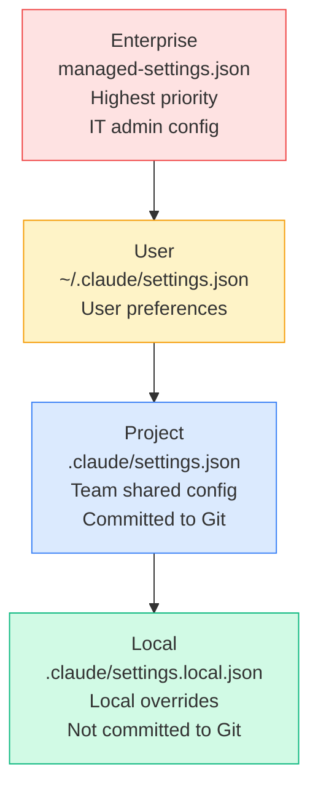
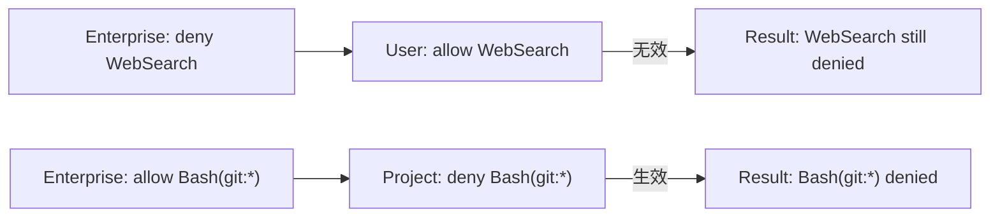
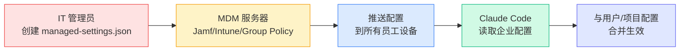
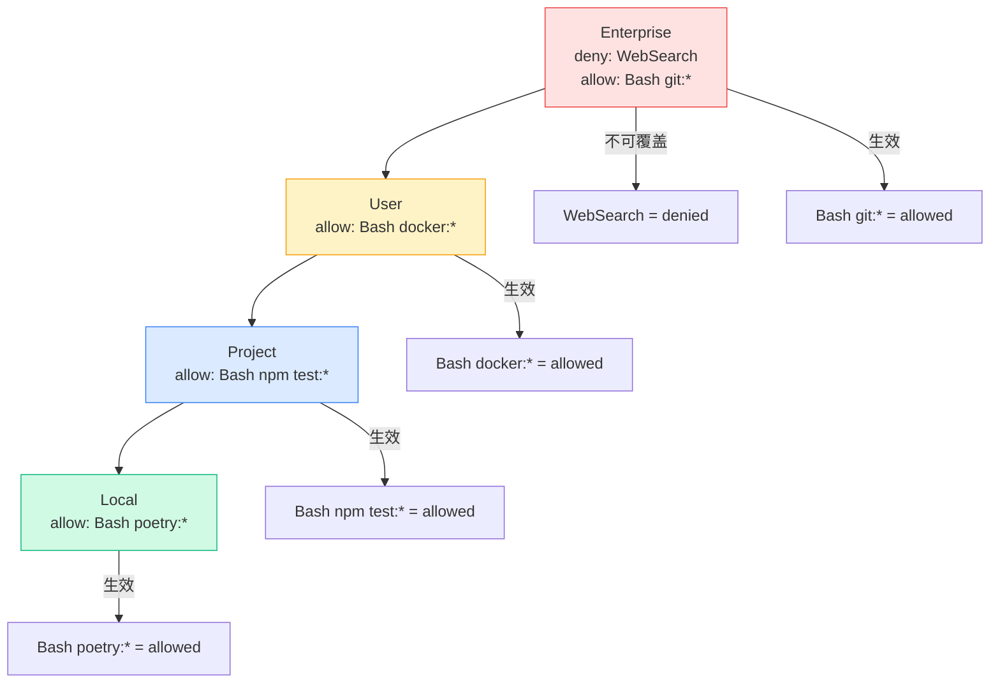

Claude Code 的配置系统有清晰的层级结构。理解这个层级，才能在个人、团队和企业之间找到平衡。

## 四层设置体系



| 层级 | 文件位置 | 作用域 | 谁配置 | 提交到 Git |
|------|---------|--------|--------|-----------|
| Enterprise | managed-settings.json | 全公司 | IT 管理员 | 否（MDM 推送） |
| User | ~/.claude/settings.json | 当前用户 | 开发者个人 | 否 |
| Project | .claude/settings.json | 当前项目 | 团队 | 是 |
| Local | .claude/settings.local.json | 当前项目 | 开发者个人 | 否（gitignore） |

## 优先级规则

**高层级可以收紧权限，但不能放松低层级已收紧的限制。**



规则：
- **deny 不可被覆盖**：一旦某层级 deny 了某个工具，更低层级无法 allow
- **allow 可以被收紧**：低层级可以把 allow 改成 ask 或 deny
- **ask 可以被收紧**：低层级可以把 ask 改成 deny

## 各层级详解

### Enterprise 级

企业级配置通过 MDM（移动设备管理）推送到所有员工设备。

**专有字段（只在 enterprise 级生效）：**

| 字段 | 作用 |
|------|------|
| `disableBypassPermissionsMode` | 永久禁用 `--dangerously-skip-permissions` |
| `allowManagedPermissionRulesOnly` | 只允许企业级定义 allow/ask/deny |
| `allowManagedHooksOnly` | 只允许企业级定义钩子 |
| `strictKnownMarketplaces` | 限制允许的插件市场来源 |

这些字段即使用户写在本地配置中也会被忽略。只有企业级 MDM 推送才生效。

**典型企业配置：**

```json
{
  "permissions": {
    "disableBypassPermissionsMode": "disable",
    "deny": [
      "WebSearch",
      "WebFetch"
    ]
  },
  "allowManagedPermissionRulesOnly": true,
  "allowManagedHooksOnly": true,
  "strictKnownMarketplaces": ["official-marketplace"],
  "sandbox": {
    "network": {
      "allowedDomains": ["api.github.com", "registry.npmjs.org"]
    }
  }
}
```

这意味着：
- 禁止 `--dangerously-skip-permissions`
- 禁止 Web 搜索和抓取
- 用户不能自定义权限规则
- 用户不能自定义钩子
- 只允许官方市场的插件
- 沙箱限制网络访问

### 企业配置工作原理

企业级配置通过 **MDM（Mobile Device Management，移动设备管理）** 系统推送到所有员工设备。这是 IT 管理员统一管理公司设备的标准方式。

#### MDM 推送流程



#### 配置存储位置

| 平台 | 配置文件位置 | MDM 配置键 |
|------|-------------|-----------|
| macOS | `~/Library/Application Support/com.anthropic.claudecode/managed-settings.json` | `ManagedSettings` |
| Windows | `%APPDATA%\Claude Code\managed-settings.json` | `ManagedSettings` |
| Linux | `~/.config/claude-code/managed-settings.json` | `ManagedSettings` |

#### 对员工的影响

当企业配置推送到员工设备后：

1. **自动生效**：员工无需手动操作，配置自动加载
2. **强制执行**：企业级 `deny` 规则无法被用户或项目配置覆盖
3. **透明可见**：员工可以在 Claude Code 中查看当前生效的配置
4. **实时更新**：IT 管理员修改配置后，下次启动 Claude Code 时自动生效

#### 员工视角的使用体验

假设企业配置了：
```json
{
  "permissions": {
    "deny": ["WebSearch", "WebFetch"],
    "allow": ["Bash(git:*)", "Bash(npm:*)"]
  }
}
```

员工使用时：
- ✅ 可以执行 `git commit`、`npm install` 等命令（企业已允许）
- ❌ 无法使用 Web 搜索功能（企业已禁止）
- 🔒 即使员工在个人配置中 `allow WebSearch`，仍然无效（企业 deny 不可覆盖）
- ✅ 员工可以在项目级添加更细粒度的规则，如 `Bash(npm test:*)`

#### 配置优先级示例



#### 常见企业配置场景

**场景 1：禁止外部网络访问**
```json
{
  "permissions": {
    "deny": ["WebSearch", "WebFetch"]
  },
  "sandbox": {
    "network": {
      "allowedDomains": ["api.internal.company.com"],
      "allowLocalBinding": true
    }
  }
}
```

**场景 2：只允许特定 Git 操作**
```json
{
  "permissions": {
    "allow": ["Bash(git:clone)", "Bash(git:pull)", "Bash(git:status)"],
    "ask": ["Bash(git:push)"],
    "deny": ["Bash(git:*)"]
  }
}
```

**场景 3：强制沙箱模式**
```json
{
  "sandbox": {
    "autoAllowBashIfSandboxed": true,
    "enableWeakerNestedSandbox": false
  }
}
```

#### 员工如何查看当前配置

员工可以通过以下方式查看当前生效的配置：

1. **查看合并后的配置**：运行 `/settings` 命令
2. **查看权限状态**：运行 `/permissions` 命令
3. **查看沙箱状态**：运行 `/sandbox` 命令

这些命令会显示所有层级配置合并后的最终结果。

### User 级

用户个人偏好，对所有项目生效。

```json
{
  "permissions": {
    "allow": [
      "Bash(git:*)",
      "Bash(npm:*)",
      "Bash(node:*)",
      "Bash(cargo:*)"
    ],
    "deny": [
      "Bash(rm -rf:*)",
      "Bash(sudo:*)"
    ]
  }
}
```

适合放：
- 常用工具的 allow 规则
- 个人偏好的 deny 规则
- 不依赖项目的通用配置

### Project 级

团队共享配置，提交到 Git，确保团队成员行为一致。

```json
{
  "permissions": {
    "allow": [
      "Bash(npm test:*)",
      "Bash(npm run lint:*)",
      "Bash(npm run build:*)"
    ]
  }
}
```

适合放：
- 项目构建/测试/lint 命令的 allow 规则
- 项目级别的工具限制
- 团队约定的安全策略

### Local 级

本地覆盖，不提交到 Git。每个人可以有自己的调整。

```json
{
  "permissions": {
    "allow": [
      "Bash(docker:*)"
    ]
  }
}
```

适合放：
- 个人开发环境的特殊配置
- 临时调试的权限扩展
- 不想影响团队的个人偏好

## Settings 字段参考

### permissions

```json
{
  "permissions": {
    "allow": ["tool-name", "Bash(prefix:*)"],
    "ask": ["tool-name"],
    "deny": ["tool-name"]
  }
}
```

**allow、ask、deny 的工具格式：**

| 格式 | 含义 | 示例 |
|------|------|------|
| `ToolName` | 完整工具名 | `Read`、`Write` |
| `Bash(prefix:*)` | Bash 命令前缀 | `Bash(git:*)`、`Bash(npm:*)` |
| `mcp__server__tool` | MCP 工具 | `mcp__asana__create_task` |

### sandbox

```json
{
  "sandbox": {
    "autoAllowBashIfSandboxed": false,
    "excludedCommands": ["npm start"],
    "network": {
      "allowedDomains": ["api.example.com"],
      "allowLocalBinding": true,
      "allowUnixSockets": [],
      "allowAllUnixSockets": false,
      "httpProxyPort": null,
      "socksProxyPort": null
    },
    "enableWeakerNestedSandbox": false
  }
}
```

### 其他字段

| 字段 | 类型 | 作用 |
|------|------|------|
| `hooks` | Object | 钩子配置 |
| `env` | Object | 环境变量 |
| `apiKeyHelper` | String | API Key 辅助程序路径 |
| `model` | String | 默认模型 |

## 三种预置模板对比

源码中提供了三种配置模板：

| 特性 | 宽松 (lax) | 严格 (strict) | 沙箱 (sandbox) |
|------|:----------:|:------------:|:-------------:|
| 禁用 skip-permissions | ✅ | ✅ | - |
| 阻止插件市场 | ✅ | ✅ | - |
| 阻止用户自定义权限 | - | ✅ | ✅ |
| 阻止用户自定义钩子 | - | ✅ | - |
| 拒绝 Web 工具 | - | ✅ | - |
| Bash 需要确认 | - | ✅ | - |
| Bash 在沙箱中运行 | - | - | ✅ |

**选择建议：**
- **个人开发者**：宽松或默认
- **团队项目**：严格
- **高安全要求**：沙箱

## 配置合并示例

假设：

- Enterprise: `deny: ["WebSearch"]`
- User: `allow: ["Bash(git:*)"]`, `deny: ["Bash(sudo:*)"]`
- Project: `allow: ["Bash(npm test:*)"]`
- Local: `allow: ["Bash(docker:*)"]`

合并结果：
- WebSearch：**denied**（Enterprise 决定，不可覆盖）
- Bash(git:*)：**allowed**（User 决定）
- Bash(sudo:*)：**denied**（User 决定）
- Bash(npm test:*)：**allowed**（Project 决定）
- Bash(docker:*)：**allowed**（Local 决定）
- 其他 Bash：**默认 ask**
- 其他工具：**默认行为**

## 本章小结

**一句话记住**：配置如漏斗 —— 上层收紧的口子，下层永远打不开。

**决策规则**：
- 需要全团队遵守的规则 → 放 Project 级（提交 Git）
- 只有你自己需要的调整 → 放 Local 级（不提交 Git）
- 需要跨项目通用 → 放 User 级（~/.claude/）
- 必须强制执行不可覆盖 → 放 Enterprise 级（MDM 推送）

**最容易踩的坑**：在 User 级 `deny` 了一个工具，然后去 Project 级试图 `allow` 它 —— deny 不可被覆盖，配置白写了。

**个人开发者也能用**：即使没有企业 MDM，你也能享受层级的好处 —— 把 `Bash(npm:*)`、`Bash(git:*)` 放 User 级一劳永逸，项目级只放团队共建命令，Local 级放你的 Docker 临时权限。三层分离，再也不会每次启动都弹出权限确认。

**现在就试**：打开 `~/.claude/settings.json`，把你最常输入的 3 条 Bash allow 规则加进去，下次启动就不会再被反复询问了。

👉 接下来我们看 MDM 如何把 Enterprise 级配置推送到每台设备

