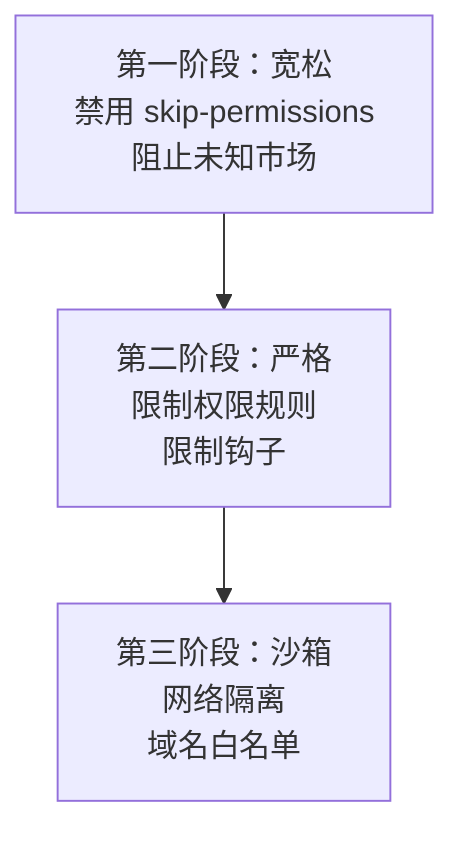

## 术语表

| 术语 | 全称 | 说明 |
|------|------|------|
| **MDM** | Mobile Device Management | 移动设备管理，用于集中管理和配置企业设备 |
| **Jamf** | - | 专业的 macOS 设备管理平台，用于企业级管理 Apple 设备 |
| **Kandji** | - | macOS 设备管理平台，专注于 Apple 设备的企业管理 |
| **Intune** | Microsoft Intune | 微软的云端设备管理服务，支持 Windows、macOS 等多平台 |
| **Group Policy** | - | Windows 组策略，用于集中管理 Windows 计算机配置 |

企业级部署 Claude Code，需要把安全策略推送到每台员工设备。这就是 MDM（Mobile Device Management）的用武之地。

## 为什么需要 MDM 部署

当你的团队有 10 人以上使用 Claude Code，你会面临这些问题：

- **如何确保所有人遵守安全策略？** 不能指望每个人自己配 settings.json
- **如何统一管理插件来源？** 不能让人随意安装未知市场的插件
- **如何防止权限绕过？** 不能让人用 `--dangerously-skip-permissions`
- **如何批量更新策略？** 改一个规则要通知所有人手动改太低效

MDM 解决了这些问题：**一条策略，全团队自动生效**。

## 支持的 MDM 平台

| 平台 | 操作系统 | 配置方式 |
|------|---------|---------|
| Jamf | macOS | .mobileconfig 文件 |
| Kandji (Iru) | macOS | .mobileconfig 文件 |
| Intune | Windows | .admx/.adml 文件 |
| Group Policy | Windows | .admx/.adml 文件 |

## 部署流程


1. **编写 managed-settings.json**：定义企业的安全策略
2. **转换为 MDM 格式**：通过平台特定模板
3. **推送到设备**：MDM 自动分发
4. **Claude Code 读取**：启动时自动应用

## 源码中的 MDM 模板

源码 `examples/mdm/` 目录提供了部署模板：

```
examples/mdm/
├── README.md
├── macos/
│   └── (Jamf/Kandji 模板)
└── windows/
    └── (Intune/Group Policy 模板)
```

### macOS 模板

用于 Jamf 和 Kandji，生成 `.mobileconfig` 文件。

关键配置项：
- 禁用 `--dangerously-skip-permissions`
- 设置允许的域名
- 限制插件市场
- 部署 managed-settings.json 到指定路径

### Windows 模板

用于 Intune 和 Group Policy，生成 `.admx`/`.adml` 文件。

关键配置项：
- 同样的安全策略
- Windows 特定的路径和注册表配置

## managed-settings.json 的关键配置

### 基础安全策略

```json
{
  "permissions": {
    "disableBypassPermissionsMode": "disable",
    "deny": [
      "WebSearch",
      "WebFetch"
    ]
  }
}
```

### 完整企业策略

```json
{
  "permissions": {
    "disableBypassPermissionsMode": "disable",
    "ask": [
      "Bash"
    ],
    "deny": [
      "WebSearch",
      "WebFetch"
    ]
  },
  "allowManagedPermissionRulesOnly": true,
  "allowManagedHooksOnly": true,
  "strictKnownMarketplaces": ["claude-code-marketplace"],
  "sandbox": {
    "autoAllowBashIfSandboxed": false,
    "excludedCommands": [],
    "network": {
      "allowUnixSockets": [],
      "allowAllUnixSockets": false,
      "allowLocalBinding": false,
      "allowedDomains": ["api.github.com", "registry.npmjs.org"],
      "httpProxyPort": null,
      "socksProxyPort": null
    },
    "enableWeakerNestedSandbox": false
  }
}
```

### 各字段解释

| 字段 | 值 | 含义 |
|------|---|------|
| `disableBypassPermissionsMode` | "disable" | 永久禁用 `--dangerously-skip-permissions` |
| `allowManagedPermissionRulesOnly` | true | 用户不能自定义 allow/ask/deny |
| `allowManagedHooksOnly` | true | 用户不能自定义钩子 |
| `strictKnownMarketplaces` | ["claude-code-marketplace"] | 只允许官方市场插件 |
| `sandbox.network.allowedDomains` | [...] | 沙箱白名单域名 |
| `sandbox.enableWeakerNestedSandbox` | false | 禁止降级沙箱 |

## 部署步骤

### macOS (Jamf)

1. **创建配置文件**

使用源码模板创建 `.mobileconfig`：

```bash
# 从源码获取模板
cp examples/mdm/macos/managed-settings.mobileconfig /tmp/
```

2. **在 Jamf 中上传**

- 登录 Jamf Pro
- Configuration Profiles → New
- 上传 .mobileconfig 文件
- 设置作用域（哪些设备/用户）

3. **部署**

Jamf 自动推送到目标设备，用户无需操作。

### Windows (Intune)

1. **创建配置**

使用源码模板创建 ADMX 策略：

```bash
# 从源码获取模板
cp examples/mdm/windows/ -r /tmp/
```

2. **在 Intune 中配置**

- 登录 Microsoft Intune
- Devices → Configuration profiles → Create
- 导入 ADMX 模板
- 设置作用域

3. **部署**

Intune 自动推送到目标设备。

## 验证部署

部署后，在用户设备上验证：

```bash
# 查看当前设置
claude /config

# 检查是否生效
# managed-settings.json 中的配置应显示为 "managed"
```

用户尝试修改被管控的字段时，会收到提示：

```
This setting is managed by your organization and cannot be changed.
```

## 渐进式部署策略

不建议一步到位用最严格的配置，推荐渐进式：



**第一阶段（宽松）：** 基本安全护栏，不干扰日常开发

```json
{
  "permissions": {
    "disableBypassPermissionsMode": "disable"
  },
  "strictKnownMarketplaces": []
}
```

**第二阶段（严格）：** 限制自定义能力

```json
{
  "permissions": {
    "disableBypassPermissionsMode": "disable",
    "deny": ["WebSearch", "WebFetch"]
  },
  "allowManagedPermissionRulesOnly": true,
  "allowManagedHooksOnly": true
}
```

**第三阶段（沙箱）：** 最严格，网络隔离

```json
{
  "permissions": {
    "disableBypassPermissionsMode": "disable",
    "ask": ["Bash"],
    "deny": ["WebSearch", "WebFetch"]
  },
  "allowManagedPermissionRulesOnly": true,
  "allowManagedHooksOnly": true,
  "sandbox": {
    "network": {
      "allowedDomains": ["api.github.com"]
    }
  }
}
```

## 常见问题

**策略没有生效？**
- 确认 managed-settings.json 在正确路径
- 确认文件格式正确（必须是合法 JSON）
- 检查 MDM 推送状态
- 重启 Claude Code

**用户仍然能绕过？**
- `disableBypassPermissionsMode: "disable"` 确保了 `--dangerously-skip-permissions` 不可用
- `allowManagedPermissionRulesOnly: true` 确保用户不能自定义 allow 规则
- 这两个字段只在 enterprise 级生效

**沙箱太严格影响开发？**
- 用 `excludedCommands` 排除特定命令
- 在 `allowedDomains` 中添加必要的域名
- 考虑 `autoAllowBashIfSandboxed: true` 让沙箱内 Bash 自动允许

## 本章小结

**一句话记住**：MDM 是配置的"广播塔" —— 写一次策略，全团队自动收到，没人能偷偷改回去。

**决策规则**：
- 团队 10 人以下 → Project 级 settings.json + Git 就够了，不需要 MDM
- 团队 10 人以上且需要强制策略 → 开始用 MDM，从宽松模板起步
- 发现有人绕过安全规则 → 立即启用 `disableBypassPermissionsMode` 和 `allowManagedPermissionRulesOnly`
- 沙箱太严影响开发 → 先用 `excludedCommands` 和 `allowedDomains` 开口子，别直接降级

**最容易踩的坑**：一步到位上最严格的沙箱配置，结果开发者连 `npm install` 都跑不了，全员绕过 MDM 用回裸装。渐进式部署才是正确姿势。

**个人开发者也能用**：虽然你没有 Jamf/Intune，但 MDM 的配置理念对你同样适用 —— 在 `~/.claude/settings.json` 中设置 `deny: ["Bash(sudo:*)", "Bash(rm -rf:*)"]`，就等于给自己建了一道"个人防火墙"。你还可以把 `disableBypassPermissionsMode` 写在 User 级配置里，防止自己在赶工期时偷懒用 `--dangerously-skip-permissions`。

**现在就试**：在你的 User 级 settings.json 里加上 `"deny": ["Bash(sudo:*)"]`，给自己加一道安全底线。

👉 接下来我们看 Marketplace 如何让插件一键安装、团队共享

---

## 附录：MDM 平台详解

### Jamf

**Jamf** 是业界领先的 Apple 设备管理平台，专门用于企业级管理 macOS、iOS、iPadOS 和 tvOS 设备。

**核心功能：**
- 配置文件管理（Configuration Profiles）：通过 `.mobileconfig` 文件推送系统设置、应用配置、安全策略
- 应用分发：批量安装和更新企业应用
- 设备注册：自动化设备配置和用户引导
- 安全策略：强制执行密码策略、加密、防火墙规则
- 远程管理：远程擦除、锁定、诊断设备

**在 Claude Code 部署中的作用：**
Jamf 通过推送 `.mobileconfig` 配置文件，将 `managed-settings.json` 部署到指定路径，并设置系统级权限，确保 Claude Code 的安全策略在企业环境中强制执行。

**适用场景：**
- 企业主要使用 Apple 设备（MacBook、iPhone、iPad）
- 需要精细化的 Apple 设备管理
- 已有 Jamf Pro 基础设施

### Kandji

**Kandji** 是专注于 Apple 设备的现代化 MDM 平台，以简洁的界面和强大的自动化能力著称。

**核心功能：**
- 配置文件管理：类似 Jamf，通过 `.mobileconfig` 推送配置
- 应用管理：支持 App Store 应用和企业应用
- 自动化脚本：在设备上执行自定义脚本
- 合规性监控：实时监控设备合规状态
- 用户自助服务：员工自助安装授权应用

**在 Claude Code 部署中的作用：**
与 Jamf 类似，Kandji 通过 `.mobileconfig` 文件将 Claude Code 的企业配置推送到 macOS 设备，实现安全策略的统一管理。

**适用场景：**
- 企业主要使用 Apple 设备
- 偏好现代化、简洁的管理界面
- 需要强大的自动化能力

### Jamf vs Kandji 对比

| 特性 | Jamf | Kandji |
|------|------|--------|
| 市场成熟度 | 行业标准，历史悠久 | 新兴平台，快速增长 |
| 界面设计 | 功能丰富但复杂 | 简洁直观 |
| 学习曲线 | 较陡峭 | 较平缓 |
| 定价 | 较高 | 中等 |
| 自动化能力 | 强大但需要脚本 | 内置自动化引擎 |
| 社区支持 | 庞大 | 快速增长 |
| Claude Code 支持 | ✅ 完全支持 | ✅ 完全支持 |

**选择建议：**
- 已有 Jamf 基础设施 → 继续使用 Jamf
- 新建 Apple 设备管理 → 优先考虑 Kandji（更易上手）
- 需要深度定制 → Jamf 更灵活
- 追求简洁体验 → Kandji 更友好

