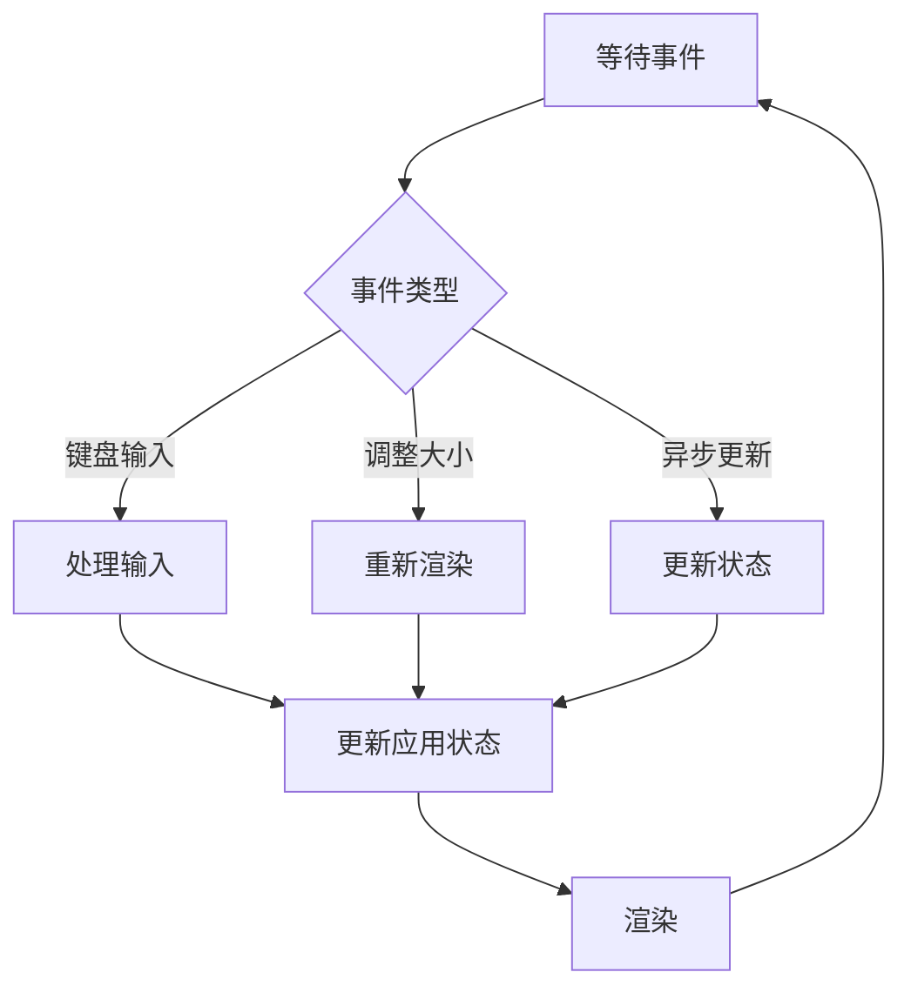

Codex 的 TUI 是一个复杂的 Ratatui 应用，让我们深入了解它的结构。

## TUI Crate 结构

```
tui/
├── src/
│   ├── app.rs              # 主应用
│   ├── chatwidget.rs       # 聊天组件
│   ├── bottom_pane/        # 底部面板
│   │   ├── mod.rs
│   │   ├── chat_composer.rs  # 输入框
│   │   └── footer.rs       # 状态栏
│   ├── wrapping.rs         # 文本换行
│   └── ...
├── frames/                 # 快照测试帧
├── tests/                  # 测试
├── styles.md               # 样式规范
└── tooltips.txt            # 提示文本
```

## 核心组件

### 1. App — 主应用

`src/app.rs` 是 TUI 的核心，负责：
- 事件循环
- 状态管理
- 组件协调
- 渲染流程

### 2. ChatWidget — 聊天组件

`src/chatwidget.rs` 负责：
- 显示对话历史
- 渲染用户消息
- 渲染 AI 响应
- 显示工具调用和结果

### 3. BottomPane — 底部面板

包含两个子组件：

#### ChatComposer（输入框）
- 文本输入
- 历史浏览
- 快捷键处理

#### Footer（状态栏）
- 显示状态
- 快捷键提示
- 进度指示器

## 样式规范

参考 `styles.md`，Codex 有严格的样式规范：

### 颜色使用

| 用途 | 颜色 |
|-----|------|
| 用户提示、选择、状态 | cyan |
| 成功、添加 | green |
| 错误、失败、删除 | red |
| Codex 品牌 | magenta |
| 次要文本 | dim |
| 标题 | bold |

### 避免的做法

- ❌ 自定义颜色（主题兼容性）
- ❌ black/white 作为前景色
- ❌ blue/yellow（当前规范未使用）

## 文本换行

`src/wrapping.rs` 提供智能文本换行：
- 处理 ANSI 转义码
- 保持样式正确
- 支持边界对齐

## 快照测试

使用 `insta` 进行 UI 快照测试：

```
frames/
├── *.snap  # 快照文件
└── ...
```

测试验证 UI 渲染的正确性。

## 事件循环



## 快捷键处理

在 TUI 中按 `?` 查看帮助。

## 与 Core 的交互

TUI 通过 `codex-core` crate 与核心逻辑交互：
- 发送用户输入
- 接收 AI 响应
- 触发工具执行
- 更新 UI 状态

## 本章小结

**一句话记住**：TUI 是基于 Ratatui 的复杂应用，有清晰的组件划分和严格的样式规范。

