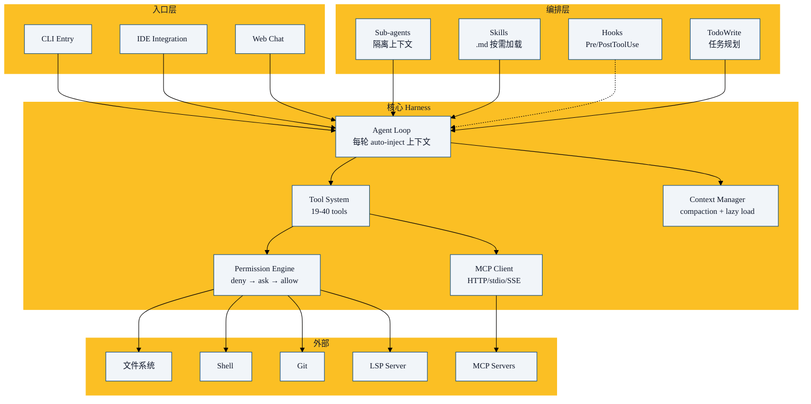

2026 年 3 月 31 日，Anthropic 意外泄露了 Claude Code 的完整源码（~51 万行 TypeScript，1,906 个文件）。这是 Harness 工程史上最重要的一次"文档发布"——虽然是事故，但它让全世界第一次看到了一个生产级 Agent Harness 的内部设计。

本章基于社区对泄露源码的分析、开源复现项目（OpenHarness、learn-claude-code）以及 Anthropic 官方文档。

## 总体架构



## 第一层：Agent Loop

### Auto-Inject 策略（核心创新）

Claude Code 每轮循环都**自动注入**以下上下文：

```typescript
// 每轮 auto-inject 的内容
const autoInjectContext = [
  systemPrompt,           // CLAUDE.md + 规则文件
  gitStatus,              // 增量 git 状态快照
  recentMessages,         // 最近的对话
  availableTools,         // 工具列表（仅名称和描述）
  todoList,               // 当前 TodoWrite 状态
];
```

为什么这么做？**让模型始终知道自己在哪、有什么工具、要做什么**——不需要用户每次都描述。

代价：每轮 token 消耗更高。收益：需要的总轮数更少。综合下来，**auto-inject 策略在复杂任务上的总 token 效率更高**。

### 流式处理

Agent Loop 全程流式——用户实时看到模型的思考过程和工具调用。这对 UX 至关重要——等待的焦虑感大大降低。

## 第二层：Tool System

### 工具数量

社区分析发现约 **19-40 个工具**（取决于配置和插件）：

| 类别 | 工具 | 数量 |
|------|------|------|
| 文件读取 | Read, Glob, Grep | 3 |
| 文件写入 | Write, Edit | 2 |
| 命令执行 | Bash | 1 |
| 版本控制 | Git（多个子命令） | 5+ |
| 网络 | WebFetch, WebSearch | 2 |
| 任务管理 | TodoWrite, Task | 3 |
| 子代理 | Agent, TaskCreate | 2 |
| MCP | MCP tools（动态发现） | 动态 |
| LSP | 语言服务器工具 | 3+ |

### 工具 Schema 设计

```typescript
// 每个工具的定义
interface ToolDefinition {
  name: string;
  description: string;      // 给模型看的
  inputSchema: JSONSchema;  // 参数格式
  handler: (params) => Promise<ToolResult>;
  permission: PermissionRule;
}
```

### Base64 编码的大文件策略

对于大文件（图片、PDF），Claude Code 使用 Base64 编码内联到消息中，而不是给模型一个"路径"。这让模型能直接"看到"内容，而不是通过中介文本描述。

## 第三层：Permission System

### 三级管道

```
┌──────┐     ┌──────┐     ┌──────┐
│ DENY │────▶│ ASK  │────▶│ALLOW │
│ 规则  │     │ 规则  │     │ 规则  │
└──────┘     └──────┘     └──────┘
   │ 命中        │ 命中        │ 命中
   ▼             ▼             ▼
 BLOCK       用户确认       EXECUTE
```

Deny 优先级最高——一旦匹配 deny 规则，无论 ask/allow 规则如何，该操作都被阻止。这确保了**安全规则不可绕过**。

### Auto Mode (2026.3)

Claude Code 引入了 Auto Mode——一个后台分类器（运行在 Sonnet 4.6 上）评估模糊的工具调用，自动决定是否允许执行。

设计关键：分类器**故意看不到 Agent 的 prose（推理文本）**，只能看到工具调用本身。这防止了 prompt injection——即使 Agent 被诱导，分类器也只看"执行了什么"，不看"为什么执行"。

## 第四层：Context Management

### Compaction

当上下文使用达到 ~98% 窗口时触发压缩：

```
压缩前:
[完整对话历史, 包括中间推理、错误尝试、调试信息]

压缩后:
[系统上下文, 早期消息摘要, 关键工具结果, 近期完整消息]
```

保留的：关键决策点、工具调用结果、错误信息。
丢弃的：中间推理步骤、已完成的子任务细节、冗余的文件内容。

### MCP Lazy Loading

MCP 服务器在会话启动时**只加载工具名称**（用于告诉模型有哪些工具可用）。搜索、发现等功能按需加载。这节省了 ~95% 的 MCP 相关上下文。

### 工作内存

- **MEMORY.md**（持久）：跨会话的长期记忆
- **TodoWrite**（会话级）：当前任务的进度追踪
- **对话历史**（循环级）：最近的执行上下文

## LSP 集成——Claude Code 的独有优势

Claude Code 内置了 Language Server Protocol 客户端——这是它相对于其他编码 Agent 的最大差异化能力。

```typescript
// LSP 能力示例
- goToDefinition(symbol) → 精确跳转到定义
- findReferences(symbol) → 查找所有引用
- getDiagnostics(file) → 获取编译错误/警告
- getHoverInfo(position) → 获取类型信息
- getCompletions(position) → 代码补全建议
```

为什么这很重要？
- 传统 Agent 靠 grep 搜索符号 → **不可靠（同名、注释中的引用）**
- LSP 提供**编译器级别的语义理解** → 精确、高效
- 精度提升意味着**更少的工具调用** → 更低的 token 消耗

## 多 Agent

Claude Code 支持子代理生成——对于大型任务，主 Agent 可以派生子 Agent：

```
主 Claude Agent
    │
    ├──→ 子 Agent: "研究这个库的 OAuth 实现"（独立上下文）
    ├──→ 子 Agent: "重构 auth 模块"（独立上下文，git worktree）
    └──→ 子 Agent: "更新测试"（独立上下文）
```

每个子 Agent 有独立的上下文窗口和工具权限。Worktree 模式让子 Agent 在隔离的 git worktree 中工作，互不干扰。

## Hook 系统

事件驱动的自动化：

```json
{
  "hooks": {
    "PreToolUse": [
      {
        "matcher": "Bash",
        "hooks": [{"type": "command", "command": "pre-check.sh"}]
      }
    ],
    "PostToolUse": [
      {
        "matcher": "Write|Edit",
        "hooks": [{"type": "command", "command": "npx prettier --write $FILE"}]
      }
    ],
    "Stop": [
      {
        "hooks": [{"type": "command", "command": "npm test"}]
      }
    ]
  }
}
```

## 关键设计原则总结

1. **Auto-inject 上下文**：让模型始终知道自己在哪，减少描述开销
2. **Deny 优先的安全**：安全规则不可绕过
3. **LSP 语义理解**：比 grep 更精确、更高效的代码理解
4. **流式体验**：用户实时看到进展
5. **分层隔离**：子 Agent 独立上下文，防止污染
6. **懒加载**：能力按需激活，节省上下文

## 本章小结

- Claude Code 的 Harness 是一个四层架构：循环 → 工具 → 控制 → 编排
- Auto-inject 策略：每轮注入上下文，总 token 效率更高
- 权限系统：deny → ask → allow 三级管道，deny 优先
- LSP 集成：编译级别的代码理解，Claude Code 的独有优势
- 子 Agent 支持独立上下文的并行工作
- 下一章：Codex 的 Harness 架构剖析

