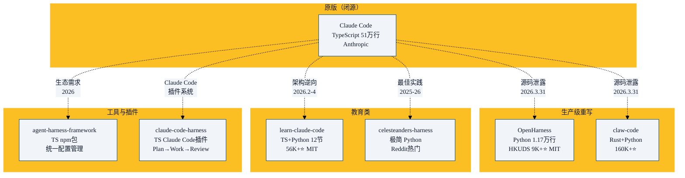

2026 年 3 月 31 日，Claude Code 源码意外泄露。在 Anthropic 的 DMCA 下架潮中，社区反而爆发出一系列**清洁室重写**的开源 Harness 项目。本章详解当前最重要的 6 个开源 Harness 实现。

> 所有源码都在本仓库 `source/` 目录下，可对照阅读。

## 生态全景图



## 1. OpenHarness（HKUDS）

**仓库**: `github.com/HKUDS/OpenHarness` | **Stars**: 9,100+ | **协议**: MIT | **语言**: Python

### 定位

**最完整的清洁室重写**——用 1.17 万行 Python 覆盖了 Claude Code 98% 的核心功能。

### 核心数据

| 指标 | 数据 |
|------|------|
| 代码行数 | ~11,700 行 Python |
| 相对 Claude Code | **44× 代码压缩** |
| 工具数量 | 43 个内置工具 |
| 覆盖范围 | 98% 核心工具 + 61% 命令 |

### 架构亮点

```python
# OpenHarness 的核心结构
openharness/
├── engine/          # Agent Loop + 流式工具调用
├── tools/           # 43 内置工具
├── skills/          # 按需技能加载
├── memory/          # MEMORY.md + 上下文压缩
├── permissions/     # 多级权限治理
├── coordination/    # 子Agent + 团队注册
└── ui/              # React/Ink TUI
```

### 特色功能

- **ohmo 个人 Agent**：内建的个人 AI 助手，支持飞书/Slack/Telegram/Discord
- **多提供商支持**：Claude、OpenAI、Copilot、Codex、Kimi、GLM、Gemini、Ollama
- **一键安装**：`curl -fsSL https://raw.githubusercontent.com/HKUDS/OpenHarness/main/scripts/install.sh | bash`

## 2. learn-claude-code（shareAI-lab）

**仓库**: `github.com/shareAI-lab/learn-claude-code` | **Stars**: 56,000+ | **协议**: MIT | **语言**: TypeScript + Python

### 定位

**最好的教学资源**——12 节渐进式课程，从零构建 Harness。

### 核心理念

> "One loop & Bash is all you need."

### 12 节课程

| 阶段 | 课程 | 核心内容 | 格言 |
|------|------|---------|------|
| 一：核心循环 | s01 | Agent Loop | "One loop & Bash is all you need" |
| | s02 | 工具使用 | "Adding a tool means adding one handler" |
| 二：规划与知识 | s03 | TodoWrite | "An agent without a plan drifts" |
| | s04 | 子代理 | "Break big tasks down; each gets clean context" |
| | s05 | 按需技能 | "Load knowledge when needed, not upfront" |
| | s06 | 上下文压缩 | "Context will fill up; make room" |
| 三：持久化 | s07 | 任务系统 | "Break goals into small tasks, persist to disk" |
| | s08 | 后台任务 | "Slow ops in background; agent keeps thinking" |
| 四：多 Agent | s09 | Agent 团队 | "When too big for one, delegate" |
| | s10 | 团队协议 | "Shared communication rules" |
| | s11 | 自治 Agent | "Teammates claim tasks themselves" |
| | s12 | Worktree 隔离 | "Each in own directory, no interference" |

每节课有独立的 Python 脚本，可以直接运行。

## 3. claw-code（ultraworkers）

**仓库**: `github.com/ultraworkers/claw-code` | **Stars**: 160,000+ | **语言**: Rust (96%) + Python

### 定位

**最快达到 10 万 star 的 GitHub 仓库**——从泄露到 Rust 清洁室重写只用了几个小时。

### 架构

双层设计：

```
Python 编排层 (60+ 模块)
    ↓
Rust 执行层 (高性能、内存安全)
```

### 关键模块

- **QueryEnginePort**：查询引擎抽象，支持多模型
- **Inventory**：清单系统，追踪文件状态
- **compat-harness**：兼容层，桥接不同 Harness 版本
- **parity_audit**：审计工具，确保行为与原始 Claude Code 一致
- **MCP 编排**：MCP 客户端/服务器集成
- **LSP 集成**：语言服务器协议支持

> ⚠️ **注意**：由于 claw-code 起源于 Claude Code 泄露源码，社区存在恶意 fork 携带恶意软件（Vidar 信息窃取器、GhostSocks 代理）。本仓库克隆的是原始清洁室重写版本。

## 4. celesteanders/harness

**仓库**: `github.com/celesteanders/harness` | **语言**: Python

### 定位

**极简实用的 Harness**——Reddit 社区热门，基于 Anthropic 最佳实践。不依赖任何 Agent 框架（LangChain、LangGraph 等）。

### 核心设计

```
Planner → Generator → Evaluator
```

三个角色分离：
- **Planner**：制定计划（生成 JSON 任务列表）
- **Generator**：按计划执行（写代码、调工具）
- **Evaluator**：评估结果（检查是否正确执行）

这种分离让每个阶段的 prompt 可以独立优化，且 Evaluator 提供了内置的**质量检查**。

## 5. @madebywild/agent-harness-framework

**npm**: `@madebywild/agent-harness-framework` | **版本**: 1.9.0 | **语言**: TypeScript

### 定位

**"Shadcn for agent harnesses"**——统一的 AI Agent 配置管理工具。

### 核心特性

单一 `.harness/` 目录管理所有 Agent 配置，生成多提供商输出：

| Entity | Claude Code 输出 | Copilot 输出 | Codex 输出 |
|--------|-----------------|-------------|-----------|
| prompt | `.claude/CLAUDE.md` | `.github/copilot-instructions.md` | `AGENTS.md` |
| skill | `.claude/skills/<id>/` | `.github/skills/<id>/` | `.codex/skills/<id>/` |
| mcp | `.mcp.json` | `.vscode/mcp.json` | `.codex/config.toml` |
| subagent | `.claude/agents/<id>/` | `.github/agents/<id>/` | `.codex/agents/<id>/` |
| hook | `.claude/settings.json` | `.github/hooks/` | `.codex/hooks/` |

一次配置，多平台输出——解决了多提供商生态下配置碎片化的问题。

## 6. claude-code-harness（Chachamaru127）

**仓库**: `github.com/Chachamaru127/claude-code-harness` | **Stars**: 426 | **协议**: MIT | **语言**: TypeScript

### 定位

**Claude Code 的 Guardrail 插件**——在 Claude Code 之上叠加纪律层。

### 核心命令

| 命令 | 功能 |
|------|------|
| `/plan-with-agent` | 头脑风暴 → 结构化计划 |
| `/work` | 执行计划（支持并行） |
| `/harness-review` | 多视角代码审查 |
| `/harness-init` | 初始化 Harness |

### Safety Hooks

- 阻止写入 `.git/`、`.env`、密钥文件
- 阻止 `rm -rf`、`sudo`、force push
- Quality Gate：自动在合适时机建议 TDD、安全检查、性能审查

## 选型指南

| 如果你想... | 推荐 |
|------------|------|
| 学习 Harness 怎么实现 | **learn-claude-code** |
| 运行一个开源的 Claude Code 替代品 | **OpenHarness** |
| 研究最高性能的 Harness 实现 | **claw-code** (Rust) |
| 用最简单的代码理解 Harness | **celesteanders/harness** |
| 统一管理多提供商的 Agent 配置 | **agent-harness-framework** |
| 在 Claude Code 上加纪律层 | **claude-code-harness** |

## 本章小结

- Claude Code 源码泄露催生了 Harness 开源生态的爆发
- OpenHarness：最完整的生产级 Python 重写，44× 代码压缩
- learn-claude-code：最好的教育资源，12 节渐进式课程
- claw-code：最快增长的开源项目，Rust 清洁室重写
- 其他项目覆盖了从极简实现到配置管理到纪律层的各个 niche
- Harness 工程从大厂独家变成了**可学习、可复现的公共知识**
- 下一章：Agent Loop 深入——Harness 的心跳

