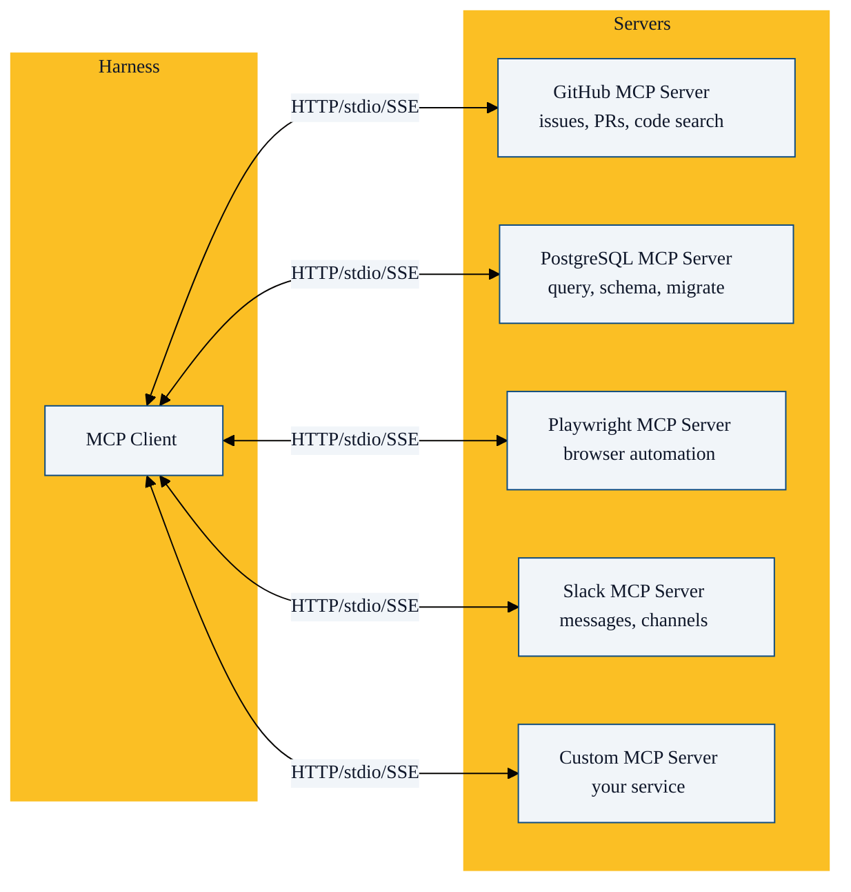

Model Context Protocol (MCP) 是 Anthropic 在 2024 年底提出的开放协议，用于连接 AI 模型和外部工具/数据源。它是 Harness 工具系统的**扩展接口**。

## MCP 解决什么问题

在 MCP 之前，每个工具都要 Harness 自己实现：

```
Harness 开发者 → 为每个服务写工具代码 → Jira 工具、GitHub 工具、Slack 工具...
```

有了 MCP：

```
Harness 开发者 → 实现一次 MCP Client → 任何 MCP Server 的工具自动可用
服务开发者 → 写 MCP Server → 被所有 MCP Client 使用
```

MCP 把 **M×N 问题**（M 个 Harness × N 个服务）变成了 **M+N 问题**。

## MCP 架构



## 三种传输模式

| 模式 | 协议 | 适用场景 |
|------|------|---------|
| **stdio** | 标准输入/输出 | 本地进程，最低延迟 |
| **HTTP** | HTTP + SSE | 远程服务，推荐用于生产 |
| **SSE** | Server-Sent Events | 兼容模式 |

```json
// .mcp.json 配置示例
{
  "mcpServers": {
    "github": {
      "type": "http",
      "url": "https://mcp.github.com",
      "headers": {
        "Authorization": "Bearer ${GITHUB_TOKEN}"
      }
    },
    "postgres": {
      "type": "stdio",
      "command": "npx",
      "args": ["-y", "@anthropic/mcp-server-postgres"],
      "env": {
        "DATABASE_URL": "${DATABASE_URL}"
      }
    },
    "playwright": {
      "type": "http",
      "url": "http://localhost:3001/mcp"
    }
  }
}
```

## MCP 在 Harness 中的集成方式

### 1. 工具发现

```
Harness 启动
    │
    ▼
连接所有 MCP Server
    │
    ▼
调用 tools/list → 获取工具列表
    │
    ▼
合并到 Agent 可用的工具列表中
    │
    ▼
Agent 看到: Read, Write, Bash, ..., github_create_issue, postgres_query, playwright_navigate...
```

### 2. 惰性加载（节省上下文）

```python
class MCPClient:
    def __init__(self):
        self.servers = {}          # 连接池
        self.tool_names = []       # 仅工具名（启动时加载）
        self.tool_schemas = {}     # 完整 schema（按需加载）

    async def connect_all(self):
        """启动时：只加载工具名"""
        for server in config.servers:
            conn = await connect(server)
            names = await conn.list_tool_names()  # 仅名称
            self.tool_names.extend(names)
            self.servers[server.name] = conn

    async def get_tool_schema(self, tool_name: str):
        """按需：加载完整 schema"""
        if tool_name not in self.tool_schemas:
            server = self.find_server_for(tool_name)
            schema = await server.get_tool_schema(tool_name)
            self.tool_schemas[tool_name] = schema
        return self.tool_schemas[tool_name]
```

### 3. 工具调用代理

```python
async def execute_mcp_tool(tool_name: str, params: dict) -> str:
    server = find_server_for(tool_name)
    # MCP Server 负责实际的执行
    result = await server.call_tool(tool_name, params)
    # 结果直接返回给 Agent
    return result
```

Harness 本身不执行 MCP 工具——它只是**代理**调用到对应的 MCP Server。

## MCP Server 示例

```python
# 一个最小的 Python MCP Server
from mcp.server import Server, stdio_server
from mcp.types import Tool, TextContent

server = Server("my-service")

@server.list_tools()
async def list_tools():
    return [
        Tool(
            name="get_weather",
            description="获取指定城市的天气",
            inputSchema={
                "type": "object",
                "required": ["city"],
                "properties": {
                    "city": {"type": "string", "description": "城市名"}
                }
            }
        )
    ]

@server.call_tool()
async def call_tool(name: str, arguments: dict):
    if name == "get_weather":
        city = arguments["city"]
        weather = await fetch_weather(city)
        return [TextContent(type="text", text=weather)]

async def main():
    async with stdio_server() as (read, write):
        await server.run(read, write)
```

## MCP 的推荐配置

Anthropic 建议：
- **5-6 个活跃 MCP Server** —— 再多会导致工具列表过长，模型选择困难
- **HTTP 模式用于生产** —— stdio 用于本地开发
- **工具输出限制** —— 默认 25K tokens，可配置到 500K 字符

## MCP 生态

截至 2026 年 5 月，主要 MCP Server：

| 类别 | Server | 功能 |
|------|--------|------|
| 代码平台 | GitHub MCP | Issues, PRs, Code Search, Actions |
| 数据库 | PostgreSQL MCP | Query, Schema, Migration |
| 浏览器 | Playwright MCP | 页面导航、交互、截图 |
| 搜索 | Brave Search MCP | Web 搜索 |
| 文件 | Filesystem MCP | 文件系统操作 |
| 内存 | Memory MCP | 知识图谱存储 |
| 设计 | Figma MCP | 设计文件访问 |

## 本章小结

- MCP 把 M×N 工具集成问题变成 M+N，是 Harness 工具系统的关键扩展机制
- 三种传输模式：stdio（本地）、HTTP（生产推荐）、SSE（兼容）
- 惰性加载策略：启动时只载入工具名，按需加载完整 schema，省 95% 上下文
- Harness 是 MCP Client，不是执行者——它代理工具调用到 MCP Server
- 推荐 5-6 个活跃 MCP Server
- 下一章：技能系统——按需注入领域知识

