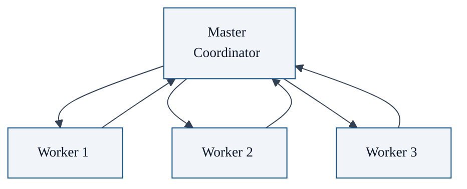
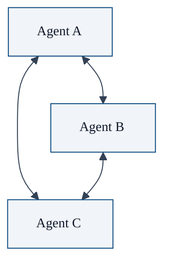
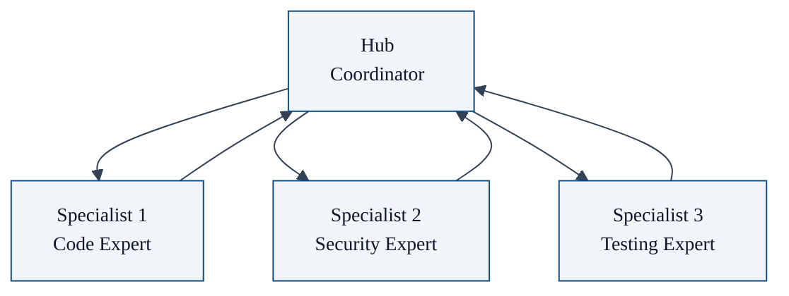
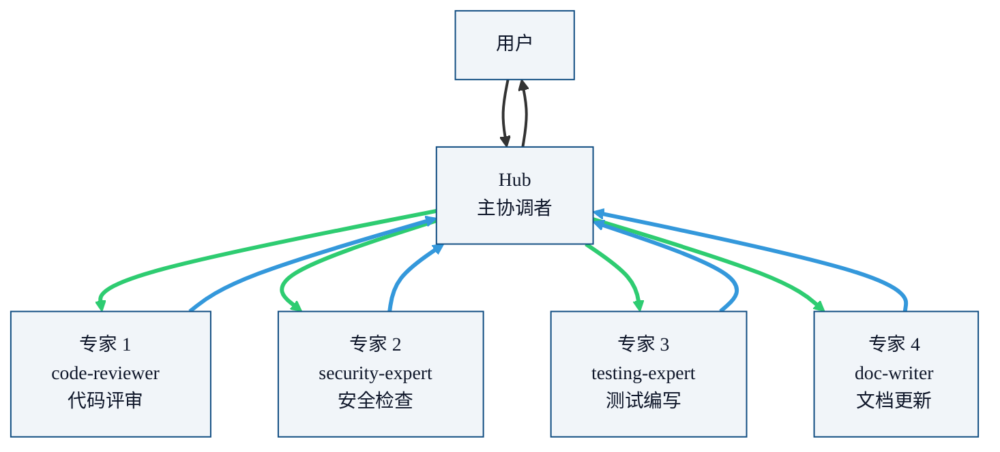

有了 `sessions_spawn` 这个核心原语，我们就可以构建不同的多智能体协作架构。OpenClaw 并不强制你用某种特定模式，你可以根据任务特点选择最合适的模式。

本文介绍四种常见的协作模式，我们会分析每种模式的优缺点，以及什么时候该用它。

## 四种常见协作模式

### 1. Master-Worker 模式



**结构**：一个协调者（Master）把任务分解给多个工人（Workers），工人完成后把结果返回给协调者，协调者汇总结果。

**特点**：
- ✅ 简单直观，容易实现
- ✅ 可以并行执行多个工人同时干活
- ❌ 单点故障：所有决策都在 Master，容易成为瓶颈
- ❌ Master 需要自己分解任务和汇总结果，对 Master 上下文压力大

**适用场景**：
- 任务可以清晰分解为多个独立子任务
- 每个子任务相对独立，不需要互相通信
- 比如：并行调研多个技术方案，每个方案一个工人

**OpenClaw 配置：`maxSpawnDepth: 1` 就够了

### 2. Peer-to-Peer 模式



**结构**：所有智能体平等，可以互相 spawn 和通信，没有中心协调者。

**特点**：
- ✅ 去中心化，没有单点瓶颈
- ✅ 非常灵活
- ❌ 难以控制，容易出现"聊天死锁"，两个智能体聊起来没完没了
- ❌ 上下文扩散，每个智能体都需要保存整个对话历史
- ❌ 结果没人汇总，最后谁来做最终决定？

**适用场景**：
- 头脑风暴，多个专家辩论一个问题
- 多方协商，需要多个角色交换意见

**OpenClaw 配置**：需要 `maxSpawnDepth: 1`，每个智能体都能 spawn 对方

**风险提示**：绝大多数生产场景不推荐 Peer-to-Peer。容易失控，成本很高。

### 3. Pipeline 模式


**结构**：任务按阶段顺序执行，前一个阶段输出是下一个阶段输入。

**特点**：
- ✅ 分工清晰，每个阶段专注一件事
- ✅ 符合软件开发流程
- ❌ 必须顺序执行，不能并行
- ❌ 上游错了，下游全错

**适用场景**：
- 有清晰的流程依赖，必须按顺序来
- 比如：需求 → 设计 → 实现 → 测试 → 部署

**OpenClaw 配置**：`maxSpawnDepth: 1 足够，协调者按顺序 spawn 每个阶段。

### 4. Hub-and-Spoke 模式（推荐）



**结构**：一个中心协调者（Hub），多个领域专家（Spokes）。Hub 负责：
1. 理解用户需求
2. 分解任务给不同专家
3. 收集专家结果
4. 汇总给用户

专家只负责自己领域的专门任务，专家之间不直接通信，所有通信都经过 Hub。

**特点**：
- ✅ 职责清晰：Hub 管协调，专家管专业
- ✅ 专家之间完全隔离，不会上下文不互相污染
- ✅ 可控性好，不会失控
- ✅ 成本可控：专家可以用适合自己领域的模型配置
- ✅ 容易扩展：加新专家只要加新 agent 就行
- ❌ 所有通信都经过 Hub，Hub 是中心，但因为 Hub 只做协调不做 heavy 计算，不会成为瓶颈

**适用场景**：
- **绝大多数生产场景都推荐这个模式**
- 特别是：一个复杂任务涉及多个不同领域 expertise
- 比如：软件开发项目，需求分析师 + 架构师 + 工程师 + 安全专家 + 测试专家

**OpenClaw 配置**：`maxSpawnDepth: 1` 足够。Hub 是主智能体，直接 spawn 各个专家。

## 为什么推荐 Hub-and-Spoke

OpenClaw 官方推荐 **Hub-and-Spoke** 作为生产场景的默认模式。理由：

### 1. 符合人类组织的最佳实践

大公司做复杂项目，不也是这样吗？一个项目经理（Hub）协调多个领域专家（Spokes），专家之间不跨领域瞎聊，所有沟通走项目经理。这已经被人类社会验证过了。

### 2. 上下文负担均衡

- Hub 只保存：用户需求 + 各个专家结果摘要
- 每个专家只保存：自己的任务 + 自己领域的知识
- 不会出现某一个智能体上下文爆炸

### 3. 成本可控

- 不同专家可以配置不同模型：
  - Hub 协调：可以用好模型（Sonnet/Opus）
  - 专家干活：可以用便宜模型（Haiku/Sonnet）
- 不用的专家会话做完就放那儿，不占 Hub 上下文

### 4. 错误容易定位

哪个专家出问题，重新 spawn 那个专家就行，不影响其他人。

## 各种模式对比

| 模式 | 复杂度 | 可控性 | 并行性 | 适用场景 | 推荐度 |
|------|----------|----------|----------|----------|--------|
| Master-Worker | 低 | 高 | 高 | 可分解独立子任务 | ⭐⭐⭐⭐ |
| Peer-to-Peer | 高 | 低 | 中 | 头脑风暴辩论 | ⭐⭐ |
| Pipeline | 中 | 高 | 低 | 顺序阶段流程 | ⭐⭐⭐ |
| Hub-and-Spoke | 中 | 高 | 中高 | 多领域专家协作（生产级） | ⭐⭐⭐⭐⭐ |

## 配置示例（Hub-and-Spoke）

下面是一个完整的配置示例，展示 Hub（主协调者）和多个专家之间的关系：

### Hub-and-Spoke 完整关系图



### 配置代码

完整的 Hub-and-Spoke 配置写在你的**主配置文件** `~/.openclaw/openclaw.json` 的 `agents` 下：

```json5
{
  agents: {
    defaults: {
      subagents: {
        maxSpawnDepth: 1, // Hub 直接 spawn 专家，深度 1 足够
        maxChildrenPerAgent: 5, // 最多同时 5 个专家并发
      }
    },
    // Hub：主协调者 agent，负责理解需求、分发任务、汇总结果
    "hub": {
      model: "anthropic/claude-3-5-sonnet", // 协调需要较好理解能力
      thinking: "high",
      // 权限控制：hub 允许 spawn 哪些专家
      subagents: {
        allowAgents: [
          "code-reviewer",
          "security-expert",
          "testing-expert",
          "doc-writer"
        ]
      }
    },
    // 专家 1：代码评审专家
    "code-reviewer": {
      model: "anthropic/claude-3-5-sonnet",
      description: "专门负责代码评审，找 bug 和代码质量问题",
      // 专家默认不允许再 spawn 子智能体（maxSpawnDepth 继承 defaults = 1，专家本身在 depth 1，所以不能再 spawn）
      // 这正好符合 Hub-and-Spoke 设计：专家只干活，不再分包
    },
    // 专家 2：安全专家
    "security-expert": {
      model: "anthropic/claude-3-5-opus", // 安全评审重要，用好模型
      description: "专门检查代码安全漏洞，OWASP Top 10",
    },
    // 专家 3：测试专家
    "testing-expert": {
      model: "anthropic/claude-3-5-haiku", // 生成测试模板比较简单，用便宜模型
      description: "专门编写单元测试和集成测试",
    },
    // 专家 4：文档专家
    "doc-writer": {
      model: "anthropic/claude-3-5-sonnet",
      description: "专门更新和编写文档",
    }
  }
}
```

### 主 Hub 和专家的关系


### 主 Hub 和专家的关系

| 角色 | 职责 | 权限 |
|------|------|------|
| **Hub（主协调者）** | 理解用户需求 → 分解任务 → 调用专家 → 汇总结果 → 交给用户 | 可以 spawn 所有白名单内的专家 |
| **各个专家** | 只专注自己领域的具体任务 | 默认**不能**再 spawn 其他智能体（深度限制），专家之间不直接通信 |

所有通信都经过 Hub：
- Hub → 任务 → 专家
- 专家 → 结果 → Hub
- 专家 ↔ 专家 （不直接通信）

这样设计保证了：
1. **职责清晰**：协调归协调，专业归专业
2. **隔离性好**：专家之间上下文不污染
3. **可控性高**：不会出现失控的嵌套 spawn

**关于层级关系**：

- **专家之间如何协作**：专家之间**不直接协作**，所有通信都经过 Hub。专家只把结果返回给 Hub，由 Hub 负责汇总和协调。
- **是否只有一层树形关系**：是的，在 `maxSpawnDepth: 1` 默认配置下，就是**一层树形关系**：
  - Depth 0: Hub（根节点）
  - Depth 1: 各个专家（叶子节点）
  - 专家不能再 spawn 更深的子子智能体

如果你需要更深层次（比如 Hub → 编排器 → 专家），可以把 `maxSpawnDepth: 2`，但绝大多数场景一层足够。

## 本章小结

- OpenClaw 支持多种协作架构模式，你可以按需选择
- Master-Worker：简单并行独立任务
- Peer-to-Peer：灵活但难以控制，生产环境谨慎使用
- Pipeline：顺序阶段流程，适合有依赖的任务
- **Hub-and-Spoke**：推荐绝大多数生产场景，一个协调者 + 多个专家，可控性好，成本可控，错误容易定位

---

---

**系列目录**：
- [第一章：OpenClaw 是什么 —— 自托管个人 AI 助手的终极形态](./../01-intro/01-what-is-openclaw.md)
- [第二章：核心架构总览 —— Gateway 为什么是中心控制平面](./../01-intro/02-architecture-overview.md)
- [第三章：Gateway —— 核心网关服务到底做了什么](./../01-intro/03-gateway.md)
- [第四章：多渠道接入 —— 如何支持 25+ 聊天平台](./../01-intro/04-multi-channel-inbox.md)
- [第五章：ACP —— 如何对接外部 AI 客户端](./../01-intro/05-acp.md)
- [第六章：消息路由 —— 消息如何正确送到对的会话](./../01-intro/06-routing.md)
- [第七章：安全模型 —— 配对白名单如何保护你](./../01-intro/07-security-model.md)
- [第八章：为什么你需要一个多智能体框架 —— 单智能体的困境](./08-why-you-need-multi-agent-framework.md)
- [第九章：sessions_spawn —— 多智能体协作的核心原语](./09-sessions-spawn-core-primitive.md)
- 第十章：协作架构模式 —— 从 Master-Worker 到 Hub-and-Spoke 👈 当前位置
- [第十一章：隔离设计 —— 为什么每个子智能体需要独立会话](./11-isolation-design.md) 👉 下一章
- [第十二章：嵌套协作 —— 如何实现 Orchestrator-Worker 模式](./12-nested-collaboration.md)
- [第十三章：实践案例 —— 从零构建一个代码评审团队](./13-practical-case-code-review-team.md)
- [第十四章：platforms —— 全平台安装部署指南](./../03-core-concepts/14-platforms.md)
- [第十五章：providers —— 各大模型提供者配置大全](./../03-core-concepts/15-providers.md)
- [第十六章：plugins —— 插件系统开发指南](./../03-core-concepts/16-plugins.md)
- [第十七章： refactor —— OpenClaw 重构原则与工作流](./../03-core-concepts/17-refactor.md)
- [第十八章：reference —— 完整配置、模板、CLI 命令参考](./../03-core-concepts/18-reference.md)
- [第十九章：skills —— 技能系统核心概念与开发指南](./../03-core-concepts/19-skills.md)
- [第二十章：ClawHub —— 技能市场如何分享和获取技能](./../03-core-concepts/20-clawhub.md)
- [第二十一章：Canvas A2UI —— 实时可视化协作 workspace](./../04-client-ux/21-canvas.md)
- [第二十二章：语音唤醒 (Voice Wake) —— 语音交互体验](./../04-client-ux/22-voice-wake.md)
- [第二十三章：WebChat —— Gateway WebSocket 聊天界面](./../04-client-ux/23-webchat.md)
- [第二十四章：工具系统 (Tools) —— OpenClaw 工具调用框架设计](./../05-tools-automation/24-tools.md)
- [第二十五章：内置浏览器 —— 网页抓取和交互](./../05-tools-automation/25-browser.md)
- [第二十六章：Cron 自动化 —— 定时任务自动化](./../05-tools-automation/26-cron.md)
- [第二十七章：Onboarding —— 新手引导流程设计](./../05-tools-automation/27-onboarding.md)
- [第二十八章：blogwatcher —— 博客与 RSS 更新监控](./../06-builtin-skills/28-live-covers.md)
- [第二十九章：gh-issues —— GitHub Issues 自动修复编排](./../06-builtin-skills/29-gh-issues.md)
- [第三十章：coding-agent —— 调用外部编码代理](./../06-builtin-skills/30-coding-agent.md)
- [第三十一章：模型故障转移 (Model Failover) —— 如何提高可用性](./../07-ops-best-practices/31-failover.md)
- [第三十二章：调试技巧 —— 如何排查 OpenClaw 问题](./../07-ops-best-practices/32-debugging.md)
- [第三十三章：成本优化 —— 如何用模型分级降低总成本](./../07-ops-best-practices/33-cost-optimization.md)
- [第三十四章：部署运维 —— OpenClaw 网关生产环境最佳实践](./../07-ops-best-practices/34-deployment.md)

