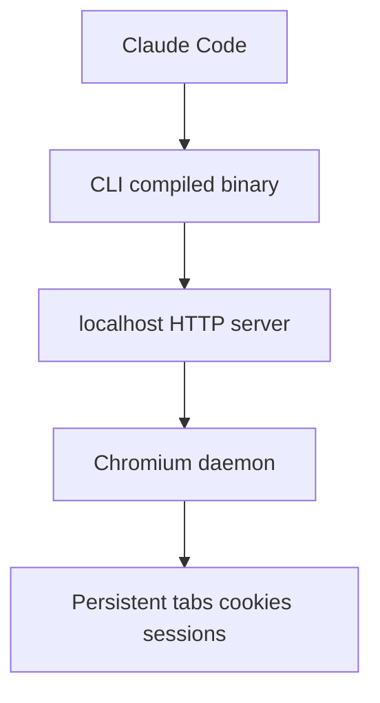
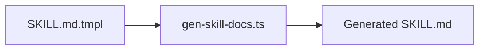

# 第六章：GStack架构与实现机制

## 引言

上一章解释的是 GStack 如何把 AI 组织成虚拟团队；这一章继续往下看，官方真正公开了哪些实现机制。

如果只看表面，GStack 像是一组 slash commands。但官方 `ARCHITECTURE.md` 说得很直接：**浏览器是最难的部分，其他很多东西本质上是 Markdown。**

## GStack 架构的核心判断

官方文档给出的核心判断可以概括成一句话：

GStack 给 Claude Code 提供了两样关键东西：

- 一个持久化浏览器
- 一组有方法论约束的工作流技能

其中真正复杂、真正需要专门工程化设计的，是浏览器这部分。

## 持久化浏览器为什么是关键？

官方解释得非常明确：如果 AI 每次操作浏览器都要冷启动，就会有两个问题：

- 每次工具调用都要等待数秒
- 浏览器状态会在命令之间丢失

这对 QA、狗粮测试、真实网页交互来说几乎不可接受。于是 GStack 采用了“长生命周期 Chromium 守护进程”的模式。

### 官方架构关系

下面这张图是根据官方 `ARCHITECTURE.md` 的 ASCII 图改写的结构图，表达的是同一件事：

它对应的是 GStack 官方明确描述的实际链路：

- Claude Code 发起工具调用
- CLI 二进制读取状态文件并发起本地 HTTP 请求
- 本地服务把命令分发给 Chromium
- Chromium 维持持久化页面状态

## 为什么官方强调“守护进程模型”？

官方给出的原因主要有三类。

### 1. 状态持久

浏览器只要不中断，Cookie、标签页、登录状态和 localStorage 都能延续。

### 2. 延迟更低

第一次启动大约数秒，但之后每次命令只是本地 HTTP 请求，官方文档给出的体验量级是约 100-200 毫秒。

### 3. 生命周期自动管理

它会在首次调用时自动启动，在空闲超时后自动关闭，用户不需要自己管理进程。

这三点合起来，才让 `/browse` 和 `/qa` 这种技能真正可用。

## GStack 为什么选择 Bun？

官方 `ARCHITECTURE.md` 对这件事解释得很细。不是因为“Bun 更潮”，而是因为它在 GStack 的目标场景里更合适。

### 官方列出的几个主要原因

- **可编译为单个二进制**：减少运行时依赖和安装复杂度
- **原生 SQLite**：方便直接读取 Chromium Cookie 数据库
- **原生 TypeScript 支持**：开发时不用额外的运行层
- **内建 HTTP 服务**：足够支撑本地命令服务

这些点都不是抽象偏好，而是围绕“把浏览器能力稳定装进技能系统里”来做的工程取舍。

## 状态文件与自动重连

官方架构文档明确写到了状态文件 `.gstack/browse.json`。它会记录类似下面这些信息：

- 浏览器相关进程 ID
- 本地服务端口
- 认证 token
- 启动时间
- 当前二进制版本

这让 CLI 可以做几件事：

- 找到当前正在运行的服务
- 判断服务是否仍然存活
- 在版本变化时自动重启旧服务

也就是说，GStack 的浏览器能力并不是“每次命令现开现关”，而是围绕一个可恢复、可验证的本地运行状态来设计的。

## 安全模型也是官方明确写出来的

这一部分很重要，因为它不是理论推演，而是官方文档里明确列出的设计。

### 1. 只绑定 localhost

服务不是对外网暴露，而是只监听本机地址。

### 2. Bearer Token 认证

每个服务实例都会生成 token，本地请求需要带认证头。

### 3. Cookie 处理有边界

官方文档明确说明：

- 首次导入浏览器 Cookie 需要用户批准
- 解密发生在进程内存里
- 数据库是复制后只读访问，不修改用户原始 Cookie 数据库
- Cookie 值不会在日志中完整暴露

### 4. 避免 Shell 注入

浏览器注册表和路径拼接都尽量使用固定常量和参数数组，而不是把用户输入直接拼进 shell 字符串。

这些内容构成了 GStack 浏览器能力的安全边界。

## GStack 如何让 AI 稳定地指向页面元素？

官方文档还解释了一个很实用的机制：`@e1`、`@e2`、`@c1` 这类引用系统。

### Refs 机制

它的思路是：

1. 先让浏览器做一次页面快照
2. 基于可访问性树生成一组可引用元素
3. 给元素分配 `@e1` 这类引用名
4. 后续点击、检查等命令直接使用这些引用

这带来两个好处：

- AI 不用反复编写脆弱的 CSS 选择器
- 页面变化后，旧引用失效会被显式报错，而不是静默点错

这也是官方浏览器实现里非常关键的一层“给 AI 用的交互抽象”。

## SKILL.md 不是手写散装文档

GStack 另一个被官方明确说明的机制，是 SKILL 文档的模板生成体系。

### 官方模板链路

官方文档强调这样做是为了避免文档和代码漂移。

它的意思是：

- 人写模板和方法论说明
- 生成脚本从源码元数据里提取命令和占位块
- 最终输出给 Claude 读取的 `SKILL.md`

这也是为什么 GStack 很强调“很多东西本质上是 Markdown”但又不是随便写的 Markdown，它背后有自动生成和校验机制。

## 每个技能前面的 preamble 也属于真实实现

官方 `ARCHITECTURE.md` 还写到了一个容易被忽略的点：很多技能在正文开始前都会跑一段公共 preamble。

官方列出的作用包括：

- 更新检查
- 会话跟踪
- learnings 加载
- 统一的问题询问格式
- 搜索优先于盲建的工作原则

这意味着技能之间虽然角色不同，但它们共享一套底层运行约定。

## 从官方架构看，GStack 的真实“系统边界”是什么？

如果只依据官方资料，可以把 GStack 的系统边界理解成下面四部分：

### 1. 技能层

也就是各种按角色定义的 slash commands。

### 2. 工作流层

这些技能并不是乱序调用，而是按冲刺流程组织。

### 3. 浏览器基础设施层

这是 GStack 最有工程壁垒的一层：守护进程、状态文件、Ref 系统、安全模型、日志与生命周期管理。

### 4. 技能生成与维护层

通过 `SKILL.md.tmpl`、生成脚本和统一 preamble 机制，让技能文档、命令和方法论保持同步。

## 总结

从官方资料看，GStack 的架构重点并不在抽象智能体理论，而在两件非常具体的事上：

- 用技能和流程把 AI 组织成团队化工作方式
- 用持久化浏览器和技能生成系统把这种方式工程化落地

这也是为什么 GStack 看起来像一组命令，但真正有效的部分，来自它背后的运行机制。

---

**下一篇预告**：第七章《工具调用与外部集成》，继续看 GStack 的技能如何和浏览器、命令行以及外部系统发生真实交互。
