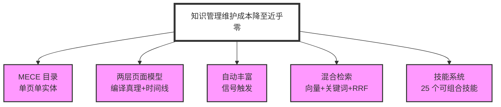
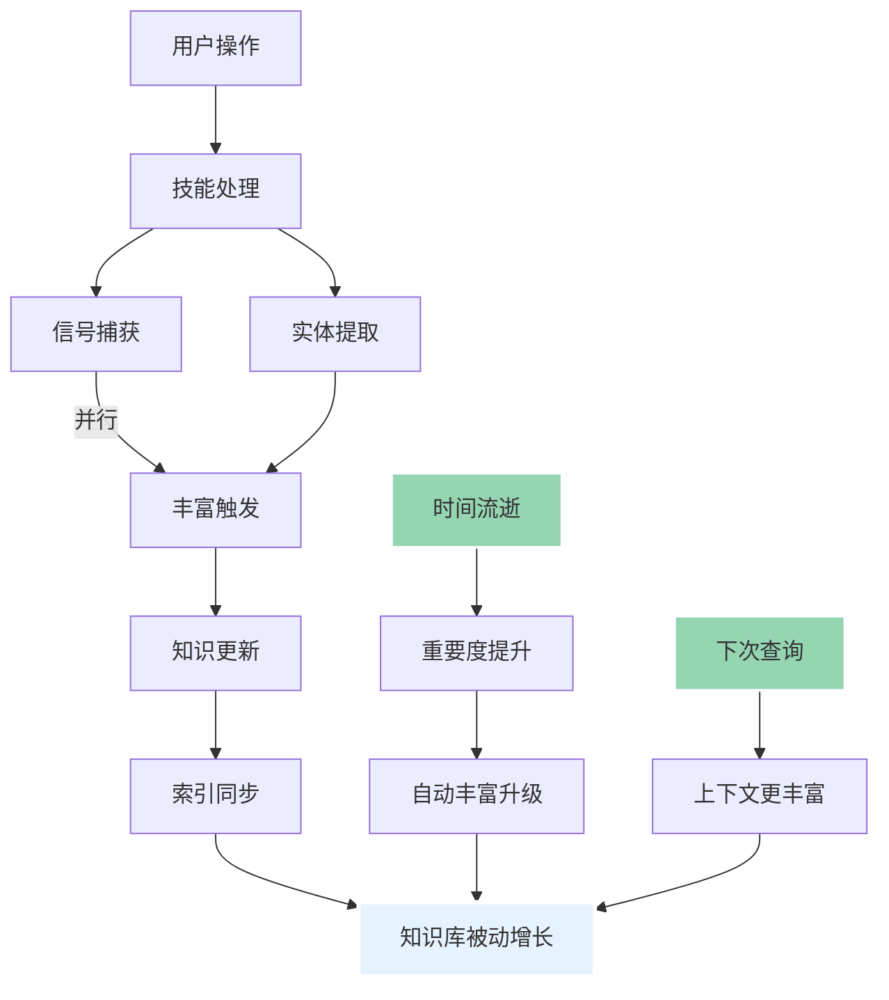
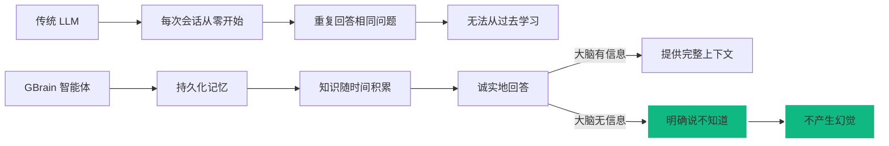

GBrain 通过以下核心设计实现将知识管理维护成本降至近乎零的个人智能系统：

## 五大核心设计

### 1. MECE 目录

- 单页单实体，防止知识腐烂
- 每个知识片段通过决策树落入精确一个目录
- 无重复页面，无歧义
- inbox/ 作为模式演进标志

### 2. 两层页面模型

- 编译真理：可重写，始终当前，结构化状态
- 时间线：仅追加，不可重写，反向时间序证据
- 合成预计算，不像 RAG 每次查询都从头推导

### 3. 自动丰富

- 每个信号触发丰富流水线，无需人工记忆
- 分层策略：Tier 3（存根）→ Tier 2（Web+社交）→ Tier 1（完整）
- 重要度自动提升，无需显式告知

### 4. 混合检索

- 向量搜索：HNSW 余弦相似度，语义理解
- 关键词搜索：tsvector 全文搜索，精确匹配
- RRF 融合：兼顾两者优势
- 4 层去重：源感知 + 编译真理保证

### 5. 技能系统

- 25 个可组合技能
- 技能路由系统（RESOLVER.md）
- 链式调用机制
- Always-on 技能（signal-detector, brain-ops）

## 系统自成长机制

系统在睡眠中自我成长——每个周期都增加知识。智能体在会议后丰富人物页面，下次该人物出现时，智能体已具备上下文。差异每日累积。

## 关键特性

| 特性 | 说明 |
|------|------|
| 脑优先 | 从不对外部 API，先查大脑 |
| 诚实地回答 | 大脑没有信息时，明确说"不知道" |
| 不产生幻觉 | 永远不知道它不知道的事 |
| 预计算合成 | 响应更快，质量更一致 |
| 自动维护 | 知识库在正常操作的副作用中增长 |

