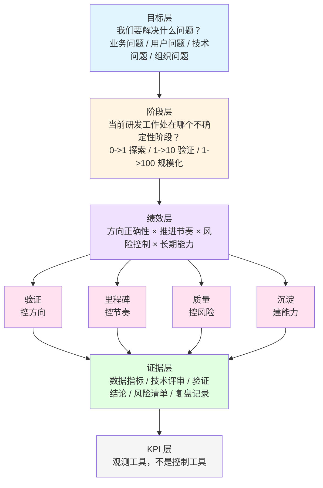
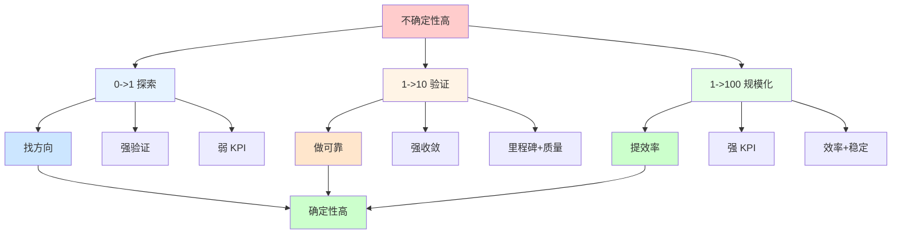

这一页用于把前面几篇文章压缩成一个管理框架。它不是完整论证，而是方便讨论、评审和对齐。

## 1. 总体框架



核心顺序：

```text
问题 -> 阶段 -> 绩效结构 -> 证据 -> KPI
```

不要反过来从 KPI 推导研发目标。

## 2. 阶段判断



| 阶段 | 核心问题 | 绩效重点 | 不适合的做法 |
|------|----------|----------|--------------|
| 0->1 探索 | 能不能做，值不值得做 | 假设验证、学习速度、止损能力 | 用按期交付率强压 |
| 1->10 验证 | 能不能稳定做好 | 里程碑收敛、质量闭环、方案迭代 | 只看 Demo 或功能完成 |
| 1->100 规模化 | 能不能高效复制 | 效率、稳定性、成本、复用 | 继续用探索期松散规则 |

## 3. 绩效结构

| 维度 | 管理目的 | 典型证据 | 可选 KPI |
|------|----------|----------|----------|
| 验证 | 保证方向 | 假设清单、实验结果、用户反馈、技术验证 | 关键假设验证率、验证周期、结论有效性 |
| 里程碑 | 保证节奏 | 阶段目标、风险变化、决策记录 | 里程碑达成率、阻塞关闭周期、范围变更次数 |
| 质量 | 控制风险 | 缺陷闭环、测试覆盖、事故复盘、技术债台账 | 严重缺陷数、缺陷关闭周期、线上事故、回滚次数 |
| 沉淀 | 建设长期能力 | 文档、组件复用、自动化、平台能力 | 复用率、自动化覆盖率、技术债关闭率、接入成本 |

评价重点：

```text
不要只看完成度，要看验证度、收敛度、风险下降和能力沉淀。
```

## 4. KPI 使用原则

| 原则 | 含义 |
|------|------|
| KPI 是观测工具 | 指标提示异常，但不能自动给出绩效结论 |
| KPI 要匹配阶段 | 探索期弱 KPI，规模化阶段强 KPI |
| KPI 要成组使用 | 效率必须和质量一起看，结果必须和风险一起看 |
| KPI 要允许解释 | 同样的延期、缺陷、变更，背后原因可能完全不同 |
| KPI 要定期校准 | 团队阶段变化后，指标也要变化 |

## 5. 奖惩逻辑

| 行为特征 | 绩效评价 | 管理含义 |
|----------|----------|----------|
| 有假设、有验证、有数据、有结论，即使失败 | 正常或高 | 鼓励高质量探索 |
| 有推进、有风险暴露、有阶段调整 | 正常 | 鼓励透明和收敛 |
| 有尝试但无复盘、无闭环 | 中等 | 要求提升过程质量 |
| 无验证、拍脑袋、风险不透明 | 低 | 惩罚低质量行为 |
| 结果完成但严重透支质量和长期能力 | 不应高 | 防止短期主义 |

基本原则：

```text
惩罚低质量行为，而不是惩罚经过验证后的失败结果。
```

## 6. 收敛机制

研发绩效体系必须允许探索，但不能允许无限探索。

| 机制 | 要求 |
|------|------|
| 验证周期 | 通常 2 到 4 周一个周期 |
| 阶段结论 | 每轮输出 Go / No-Go / Pivot / Hold |
| 风险清单 | 技术、质量、依赖、成本风险必须记录和关闭 |
| 退出标准 | 关键假设被证伪或连续无法收敛时，必须调整或停止 |

## 7. 评审模板

| 模块 | 要回答的问题 |
|------|--------------|
| 目标 | 本阶段要解决什么问题 |
| 阶段 | 当前是 0->1、1->10 还是 1->100 |
| 假设 | 哪些关键假设需要验证 |
| 里程碑 | 本阶段要收敛哪些问题 |
| 指标 | 用哪些 KPI 观察状态 |
| 风险 | 当前主要风险和处理计划是什么 |
| 质量 | 缺陷、稳定性、技术债是否可控 |
| 沉淀 | 是否形成可复用能力 |
| 结论 | Go / No-Go / Pivot / Hold |

## 8. 最终原则

1. 用目标定义方向，而不是用 KPI 定义方向；
2. 用验证管理不确定性，而不是用承诺掩盖不确定性；
3. 用里程碑推动收敛，而不是只做进度汇报；
4. 用质量和风险约束速度，而不是用短期交付透支未来；
5. 用沉淀建设长期能力，而不是让每个项目从头再来；
6. 用 KPI 观察状态，而不是让 KPI 替代判断。

