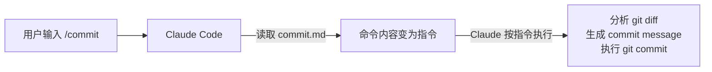
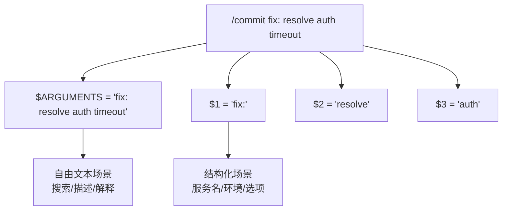
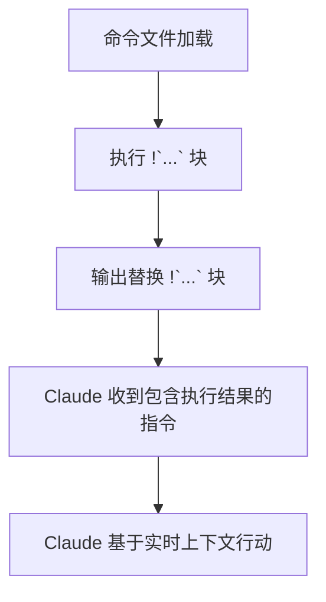
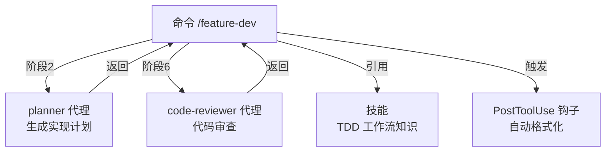
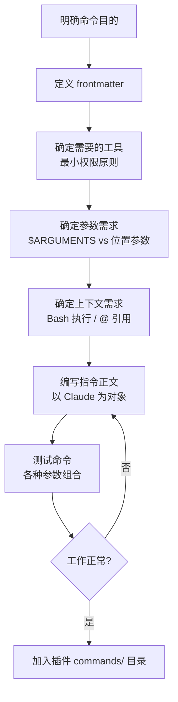

命令是插件最直观的交互入口。用户输入 `/commit`，Claude 就按预定义的流程工作——这就是命令的力量。但命令的本质是什么？怎么写？怎么传参数？怎么获取运行时上下文？本章一一拆解。

## 命令的本质：写给 Claude 的指令

**命令是 Markdown 文件，内容是指令 FOR Claude，不是消息 TO 用户。**

这是一个关键认知转变：当你写 `/commit` 命令时，你不是在写一个给用户看的说明，而是在写一份 Claude 应该遵循的操作手册。当用户调用 `/commit`，命令文件的内容就变成了 Claude 的指令——Claude 会按照这些指令去思考、去行动。



所以，写命令时请保持这个视角：**你在告诉 Claude 该做什么**，而不是告诉用户这个命令能做什么。

## YAML Frontmatter

每个命令文件都以 YAML frontmatter 开头，定义命令的元数据和行为约束。

```markdown
---
description: Analyze changes and create a git commit
allowed-tools: Read, Bash(git:*)
model: sonnet
argument-hint: "[scope] [convention]"
disable-model-invocation: false
---

[命令正文：Claude 应该遵循的指令]
```

### 字段详解

| 字段 | 必需 | 类型 | 说明 |
|------|:----:|------|------|
| `description` | 是 | string | 在 `/help` 中显示的简介，**不超过 60 字符** |
| `allowed-tools` | 否 | string 或 array | 限制 Claude 可用的工具 |
| `model` | 否 | string | 指定模型：sonnet、opus、haiku |
| `argument-hint` | 否 | string | 文档化预期参数，如 `"[pr-number] [priority]"` |
| `disable-model-invocation` | 否 | boolean | 阻止程序化调用（防止代理递归调用） |

### allowed-tools 模式

这是**安全控制的核心**。通过限制工具，你可以确保命令只做它应该做的事：

```yaml
# 精确列举：只允许这些工具
allowed-tools: Read, Write, Edit

# 模式匹配：允许所有 git 操作
allowed-tools: Bash(git:*)

# 通配符：允许所有工具（谨慎使用）
allowed-tools: "*"

# 数组形式
allowed-tools:
  - Read
  - Grep
  - Bash(git:*)
```

**最小权限原则**：只给命令完成工作所需的最少工具。一个只做 git commit 的命令不应该有 `Write` 工具。

## 动态参数

命令可以接收用户输入的参数，这是从静态指令变成动态工作流的关键。

### 参数变量

| 变量 | 含义 | 示例 |
|------|------|------|
| `$ARGUMENTS` | 所有参数作为单个字符串 | `fix the login bug` |
| `$1` | 第一个位置参数 | `login` |
| `$2` | 第二个位置参数 | `critical` |
| `$3` | 第三个位置参数 | `v2` |

### 组合使用

参数变量可以嵌入到命令正文的任何位置：

```markdown
---
description: Deploy service to environment
argument-hint: "[service] [environment] [options]"
---

Deploy the service $1 to the $2 environment.

Additional options: $3

If no options provided, use default configuration.
```

调用方式：

```
/deploy api production --force
```

Claude 收到的指令会变成：

```
Deploy the service api to the production environment.

Additional options: --force

If no options provided, use default configuration.
```

### $ARGUMENTS vs 位置参数

- `$ARGUMENTS` 保留原始输入，包括空格和引号——适合自由文本输入
- `$1`/`$2`/`$3` 按空格分割——适合结构化参数



**选择原则**：当参数是自然语言描述时用 `$ARGUMENTS`，当参数是固定格式时用位置参数。

## 文件引用：@ 语法

命令可以用 `@` 语法引用文件内容，让 Claude 直接读取文件作为上下文。

### 引用方式

```markdown
# 引用参数指定的文件
Review the following file: @$1

# 引用已知路径的文件
Check the project configuration: @package.json

# 引用多个文件
Compare the implementations:
- Old version: @src/old.js
- New version: @src/new.js

# 混合使用
Analyze @$1 against the baseline @test/fixtures/expected.json
```

### 工作机制


`@` 语法在命令被加载时就解析，文件内容会被直接嵌入到 Claude 的上下文中。这意味着：

- 引用的文件必须存在，否则会报错
- 大文件会消耗上下文窗口——谨慎引用
- 适合配置文件、模板、参考文档等小型文件

## Bash 执行：! 语法

这是命令系统最强大的特性之一。用反引号包裹的 `!` 前缀命令会在 Claude 处理指令**之前**执行，结果直接嵌入到指令文本中。

### 语法

```markdown
Current branch: !`git branch --show-current`
Recent commits: !`git log --oneline -5`
```

执行流程：



### 典型用途

| 场景 | Bash 命令 | 获取的上下文 |
|------|----------|-------------|
| Git 状态 | `!`git status --short`` | 当前变更列表 |
| 当前分支 | `!`git branch --show-current`` | 分支名称 |
| 环境变量 | `!`echo $NODE_ENV`` | 运行环境 |
| 项目版本 | `!`cat package.json | jq .version`` | 版本号 |
| 测试状态 | `!`npm test -- --last-failed 2>&1 | head -20`` | 最近测试结果 |

### 注意事项

- Bash 执行是**同步的**，会阻塞命令加载
- 命令应该快速完成，避免长时间运行的操作
- 输出会被截断到合理长度
- 错误输出也会被捕获——做好容错处理

## 插件命令的自动发现

插件中的命令放在 `commands/` 目录下，Claude Code 自动发现并注册。

### 目录结构到命令映射

```
commands/
├── commit.md          → /commit (plugin:plugin-name)
├── review.md          → /review (plugin:plugin-name)
└── utils/
    ├── helper.md      → /helper (plugin:plugin-name:utils)
    └── format.md      → /format (plugin:plugin-name:utils)
```

**命名规则：**
- 文件名（不含 `.md`）就是命令名
- 子目录创建命名空间
- 命令名使用 kebab-case
- 路径中用 `${CLAUDE_PLUGIN_ROOT}` 确保可移植

### 命名空间

命令会被自动加上插件命名空间，避免冲突：

```
code-review 插件的 /review    → 完整标识: plugin:code-review:review
feature-dev 插件的 /review    → 完整标识: plugin:feature-dev:review
```

用户可以用完整标识调用，也可以在无歧义时只用短名。

## 命令组织模式

### 扁平模式（5-15 个命令）

```
commands/
├── build.md
├── deploy.md
├── test.md
├── lint.md
└── commit.md
```

适合：命令数量适中、主题单一的插件。

### 命名空间模式（15+ 个命令）

```
commands/
├── git/
│   ├── commit.md
│   ├── rebase.md
│   └── squash.md
├── deploy/
│   ├── staging.md
│   ├── production.md
│   └── rollback.md
└── test/
    ├── unit.md
    ├── integration.md
    └── e2e.md
```

适合：命令多、有清晰分类的插件。

**选择标准**：如果用户需要翻列表才能找到命令，就该用命名空间了。

## 实战案例

### 案例 1：commit 命令

来自 `commit-commands` 插件的精简版——用 Bash 执行获取 git 上下文，限制工具到 git 操作：

```markdown
---
description: Smart git commit with context
allowed-tools: Read, Bash(git:*)
argument-hint: "[convention]"
---

Analyze the current changes and create a git commit.

## Current Context

Branch: !`git branch --show-current`
Recent commits: !`git log --oneline -5`

## Process

1. Run `git diff --staged` to understand what changed
2. If nothing staged, run `git diff` and suggest what to stage
3. Write a clear commit message following conventional commits
4. Use the convention specified in $ARGUMENTS if provided

## Commit Message Format

If $ARGUMENTS contains a convention hint (e.g. "fix", "feat"), use it as the type prefix.
Otherwise, infer the type from the changes.

Format: <type>: <description>

Types: feat, fix, refactor, docs, test, chore, perf, ci
```

**设计要点：**
- `allowed-tools` 限制为 `Read` + `Bash(git:*)`——只能读代码和操作 git
- Bash 执行获取分支和提交历史——让 Claude 了解上下文
- `$ARGUMENTS` 接收可选的 convention 类型——灵活但不是必需的

### 案例 2：feature-dev 命令

来自 `feature-dev` 插件的 7 阶段工作流——复杂命令的典范：

```markdown
---
description: 7-phase feature development workflow
allowed-tools:
  - Read
  - Write
  - Edit
  - Bash
  - Grep
  - Glob
  - WebSearch
argument-hint: "[feature-description]"
---

Implement the feature described in: $ARGUMENTS

## 7-Phase Workflow

### Phase 1: Research
- Search GitHub for existing implementations
- Check package registries for relevant libraries
- Review codebase for similar patterns

### Phase 2: Plan
- Create implementation plan using the planner agent
- Identify dependencies and risks
- Break work into phases

### Phase 3: TDD - Red
- Write tests first for the feature
- Verify tests fail without implementation

### Phase 4: TDD - Green
- Write minimal implementation to pass tests
- Do not over-engineer

### Phase 5: TDD - Improve
- Refactor for clarity and efficiency
- Ensure test coverage >= 80%

### Phase 6: Code Review
- Use code-reviewer agent for quality check
- Address CRITICAL and HIGH issues

### Phase 7: Commit
- Write detailed conventional commit message
- Verify all tests pass before committing
```

**设计要点：**
- `$ARGUMENTS` 接收完整的 feature 描述——自由文本输入
- 多阶段流程用清晰的标题组织——Claude 一步步执行
- 工具权限较多但都有明确用途——复杂工作流需要综合能力
- 可以在指令中调用代理——命令是编排者

### 案例 3：代码审查命令

审查模式——用 Bash 获取 diff，限制到安全工具集：

```markdown
---
description: Review code changes for quality
allowed-tools:
  - Read
  - Grep
  - Glob
  - Bash(git:*)
argument-hint: "[pr-number]"
disable-model-invocation: true
---

Perform a thorough code review.

## Context

Current diff: !`git diff HEAD~1`

$1 is provided, fetch PR diff:
!`git diff main...HEAD`

## Review Checklist

1. **Security**: Hardcoded secrets, SQL injection, XSS, path traversal
2. **Correctness**: Logic errors, edge cases, error handling
3. **Performance**: N+1 queries, missing pagination, unbounded operations
4. **Maintainability**: Function size, file size, nesting depth, naming
5. **Testing**: Coverage, test quality, missing test cases

## Output Format

| Severity | Finding | Location | Recommendation |
|----------|---------|----------|----------------|
| CRITICAL | ... | file:line | ... |
| HIGH | ... | file:line | ... |

End with: APPROVE / WARN / BLOCK
```

**设计要点：**
- `disable-model-invocation: true`——防止代理自动调用这个审查命令
- Bash 执行获取实时 diff——审查总是基于最新代码
- 输出格式固定——结构化结果便于后续处理

## 多组件集成

命令不是孤立存在的，它可以协调其他组件：



**集成模式：**
- **命令 → 代理**：命令编排工作流，代理执行专业任务
- **命令 → 技能**：命令引用技能获取领域知识
- **命令 → 钩子**：命令触发的操作可能激活钩子

命令是**编排层**，代理是**执行层**，技能是**知识层**——三者协同构成完整的插件能力。

## 常见陷阱

### 1. 把命令写成用户文档

```markdown
# 错误：在给用户解释
This command helps you commit your changes. It will look at your
git diff and generate a nice commit message for you.

# 正确：在给 Claude 下达指令
Analyze the staged changes and create a conventional commit.
Run git diff --staged, then write a commit message with type prefix.
```

### 2. 忘记限制工具

```yaml
# 危险：命令可以做任何事
allowed-tools: "*"

# 安全：只给必需的工具
allowed-tools: Read, Bash(git:*)
```

### 3. Bash 执行耗时操作

```markdown
# 错误：可能阻塞很久
Full test suite: !`npm test`

# 正确：快速获取状态
Test status: !`npm test -- --last-failed 2>&1 | head -20`
```

### 4. 参数不做容错

```markdown
# 脆弱：$1 可能不存在
Deploy to environment: $1

# 健壮：提供默认值指引
Deploy to environment: $1
If $1 is not provided, ask the user which environment to deploy to.
```

## 命令开发流程



**开发检查清单：**
- [ ] description 不超过 60 字符
- [ ] allowed-tools 使用最小权限
- [ ] 参数有容错处理
- [ ] Bash 执行是快速操作
- [ ] 指令是写给 Claude 的，不是写给用户的
- [ ] 路径使用 `${CLAUDE_PLUGIN_ROOT}`
- [ ] 命令名使用 kebab-case

## 本章小结

**一句话记住**：命令文件的内容是指令 FOR Claude，不是说明 TO 用户——你在写操作手册，不是写帮助文档。

**决策规则**：
- 参数是自然语言描述 → 用 `$ARGUMENTS`
- 参数是固定格式（服务名/环境/选项） → 用 `$1`/`$2`/`$3`
- 需要文件内容作上下文 → 用 `@` 引用
- 需要运行时动态信息（分支名、测试结果） → 用 `!` Bash 执行
- 命令数 ≤ 15 → 扁平模式；> 15 → 命名空间模式

**最容易踩的坑**：忘记限制 `allowed-tools`，让命令拥有全部权限——一个只做 git commit 的命令不应该能写文件。

**现在就试**：写一个最简命令文件，`allowed-tools` 只写 `Read, Bash(git:*)`，用 `!`git diff --staged`` 获取暂存变更，体会"指令视角"的写作方式。

👉 接下来我们深入代理开发，看看如何让 Claude 自主决定何时启动专业子进程

---

**系列目录**：
- [第一章：Claude Code 是什么 —— 终端里的 AI 编码伙伴](./../01-intro/01-what-is-claude-code.md)
- [第二章：安装与上手 —— 从 curl 到第一个命令](./../01-intro/02-installation-setup.md)
- [第三章：权限模型 —— ask/allow/deny 与沙箱](./../01-intro/03-permission-model.md)
- [第四章：斜杠命令 —— 自定义提示词的标准化方法](./../02-core/04-slash-commands.md)
- [第五章：Hooks 系统 —— 事件驱动的自动化引擎](./../02-core/05-hooks-system.md)
- [第六章：两种钩子对比 —— Prompt 钩子 vs Command 钩子](./../02-core/06-prompt-hooks-vs-command-hooks.md)
- [第七章：插件架构 —— 目录结构、自动发现与清单](./07-plugin-architecture.md)
- 第八章：插件命令开发 —— frontmatter、动态参数、bash 执行 👈 当前位置
- [第九章：插件代理开发 —— 触发机制、系统提示词设计](./09-plugin-agents.md) 👉 下一章
- [第十章：插件技能开发 —— 渐进式披露与 SKILL.md](./10-plugin-skills.md)
- [第十一章：插件钩子开发 —— hooks.json 与可移植路径](./11-plugin-hooks.md)
- [第十二章：MCP 集成 —— stdio/SSE/HTTP/WebSocket 四种模式](./12-mcp-integration.md)
- [第十三章：插件配置 —— .local.md 模式与 YAML frontmatter](./13-plugin-settings.md)
- [第十六章：commit-commands —— 最简命令插件](./../04-plugin-deep-dives/16-commit-commands.md)
- [第十七章：security-guidance —— 安全钩子实战](./../04-plugin-deep-dives/17-security-guidance.md)
- [第十八章：code-review —— 多代理并行审查](./../04-plugin-deep-dives/18-code-review.md)
- [第十九章：feature-dev —— 7 阶段功能开发工作流](./../04-plugin-deep-dives/19-feature-dev.md)
- [第二十章：hookify —— 零代码创建钩子规则](./../04-plugin-deep-dives/20-hookify.md)
- [第二十一章：plugin-dev —— 用插件开发插件的元工具](./../04-plugin-deep-dives/21-plugin-dev-toolkit.md)
- [第二十二章：设置层级 —— 企业/用户/项目三层配置](./../05-enterprise/22-settings-hierarchy.md)
- [第二十三章：MDM 部署 —— Jamf/Intune/Group Policy 推送](./../05-enterprise/23-mdm-deployment.md)
- [第二十四章：Marketplace —— 插件发布与分发](./../05-enterprise/24-marketplace.md)
- [第二十五章：多代理模式 —— 并行代理编排与工作流](./../06-advanced/25-multi-agent-patterns.md)
- [第二十六章：Hookify 进阶 —— 多条件规则与操作符](./../06-advanced/26-hookify-advanced-rules.md)
- [第二十七章：从零构建完整插件 —— 端到端实战](./../06-advanced/27-building-complete-plugin.md)

