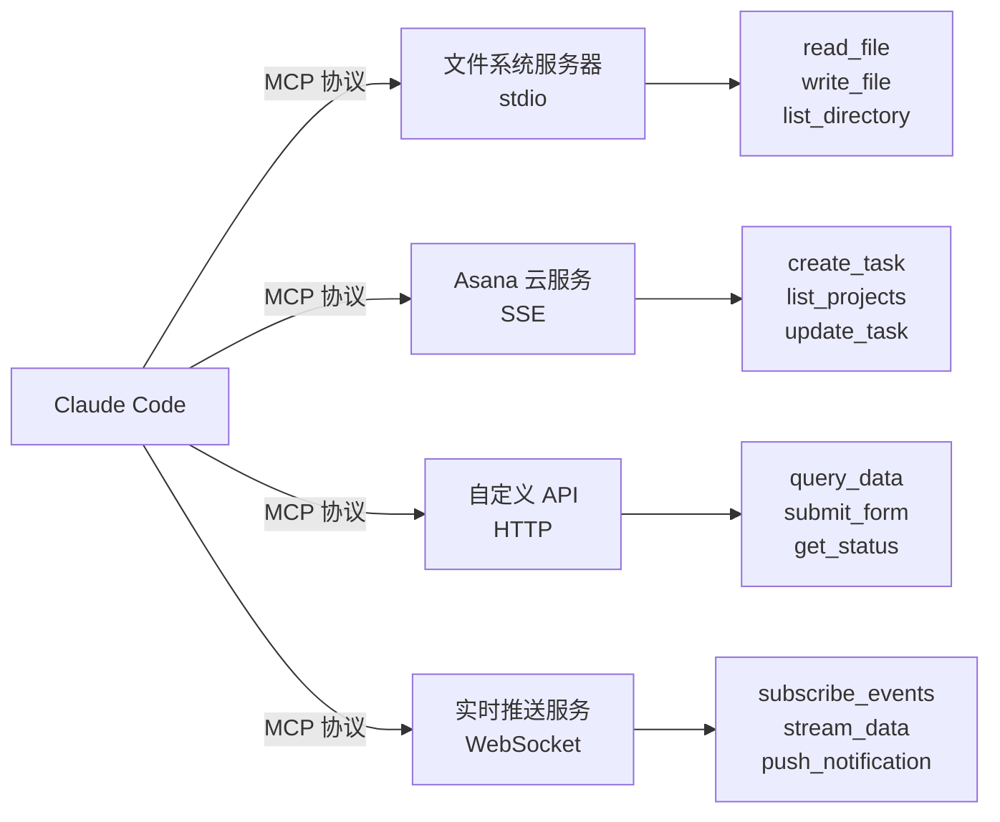
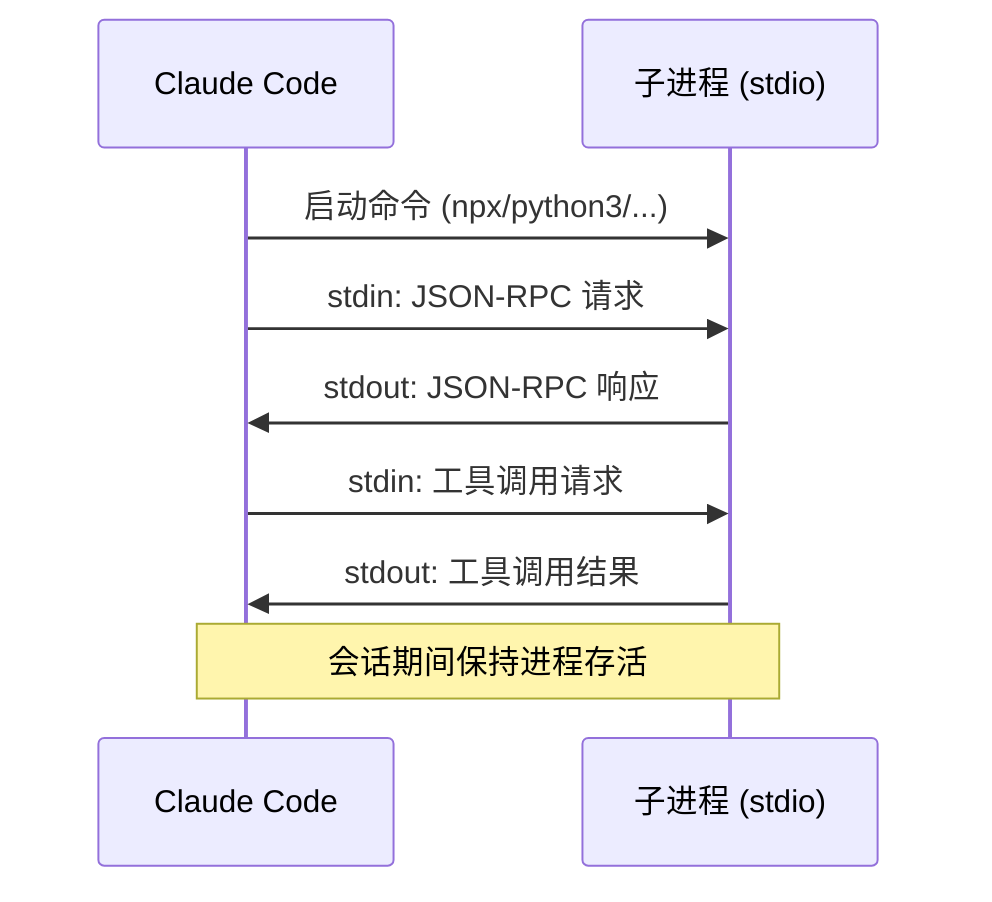
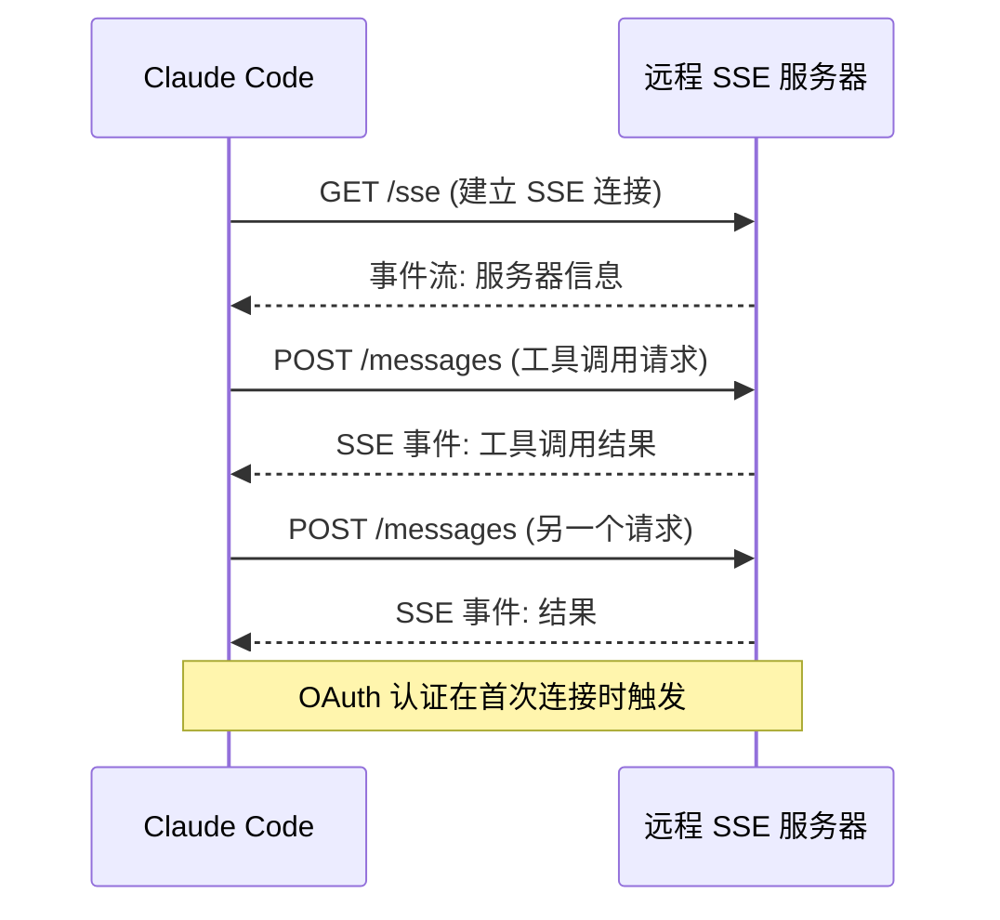
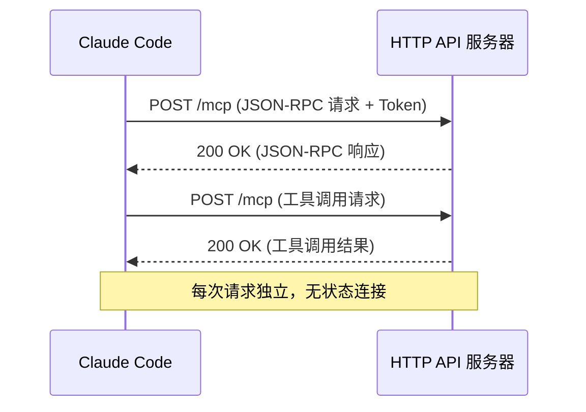
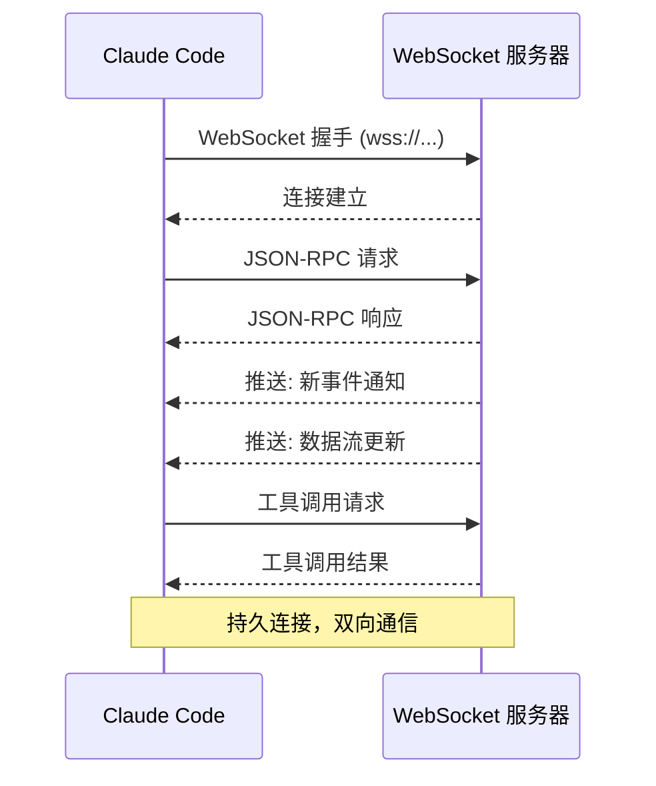
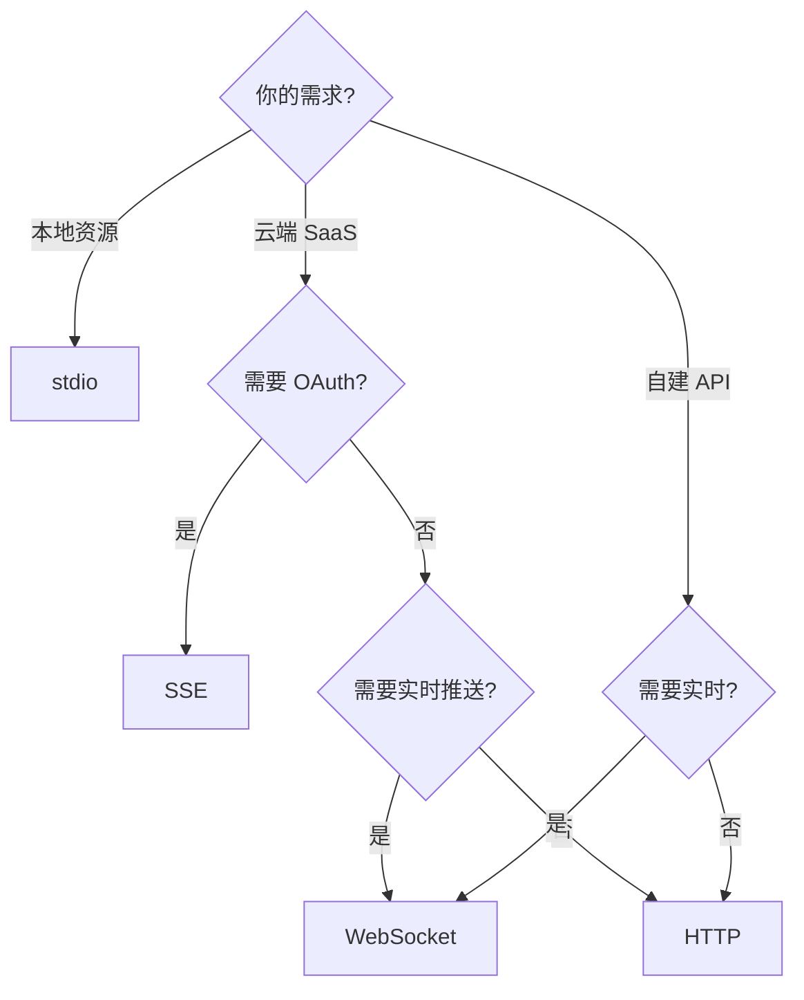
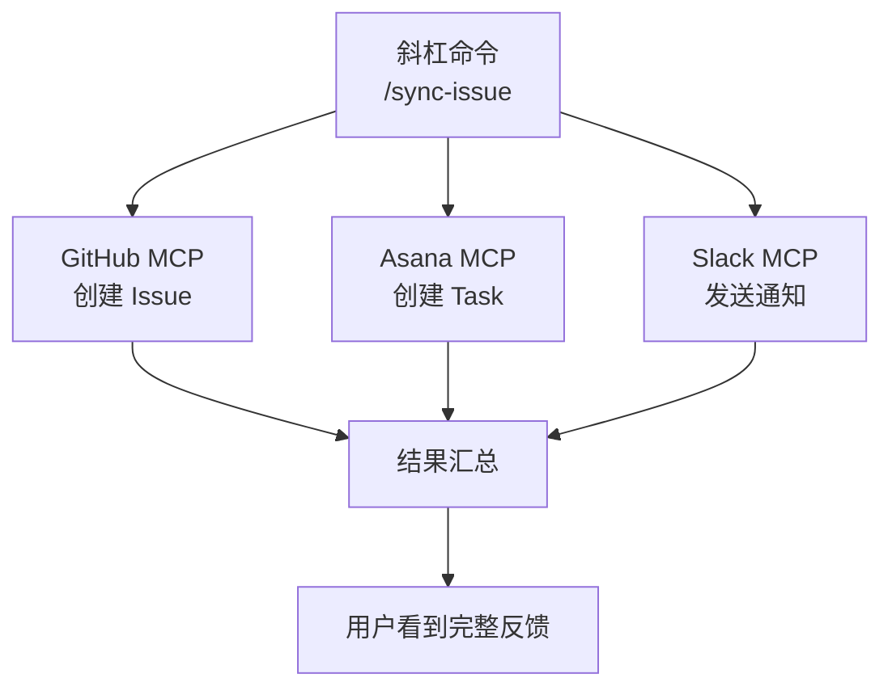
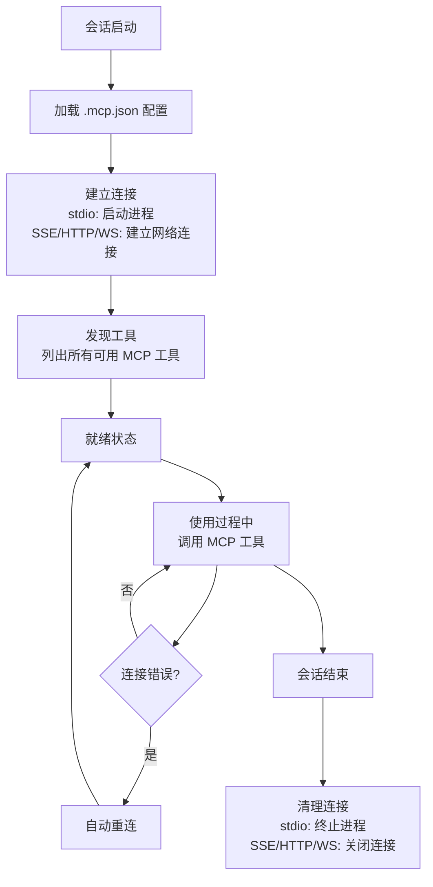

你的插件需要调用外部服务——查询 Asana 任务、读取数据库、连接实时 API。怎么办？从头写 HTTP 客户端？不，Claude Code 提供了一个更优雅的方案：**MCP（Model Context Protocol）**。

MCP 是一个开放协议，让 Claude Code 能够以**结构化工具**的方式接入外部服务。你的插件只需声明 MCP 服务器配置，Claude Code 就能自动发现服务提供的工具，并在对话中无缝调用。

## MCP 是什么

**Model Context Protocol（MCP）** 是一种标准化协议，定义了 AI 模型如何与外部工具和数据源交互。它不是 Anthropic 的私有协议——而是一个**开放标准**，越来越多的服务提供商正在支持它。



核心概念：

- **MCP Server**：提供工具的服务端，可以是本地进程或远程服务
- **MCP Tool**：Server 暴露的操作，Claude Code 可以像调用内置工具一样调用它
- **MCP Client**：Claude Code 内置的 MCP 客户端，管理连接和工具调用

## 两种配置方式

插件可以通过两种方式声明 MCP 服务器：

### 方式 1：独立 .mcp.json（推荐）

在插件根目录创建 `.mcp.json` 文件：

```
my-plugin/
├── .claude-plugin/
│   └── plugin.json
├── .mcp.json           ← MCP 服务器配置
├── commands/
└── agents/
```

```json
{
  "mcpServers": {
    "filesystem": {
      "command": "npx",
      "args": ["-y", "@modelcontextprotocol/server-filesystem", "/allowed/path"],
      "env": {
        "LOG_LEVEL": "debug"
      }
    }
  }
}
```

**优点**：配置独立，职责清晰，易于维护。

### 方式 2：内联在 plugin.json

在清单文件的 `mcpServers` 字段中直接定义：

```json
{
  "name": "my-plugin",
  "mcpServers": {
    "api-service": {
      "type": "http",
      "url": "https://api.example.com/mcp",
      "headers": {
        "Authorization": "Bearer ${API_TOKEN}"
      }
    }
  }
}
```

**优点**：单文件配置，适合只有一个 MCP 服务器的简单插件。

### 如何选择

| 维度 | 独立 .mcp.json | 内联 plugin.json |
|------|---------------|-----------------|
| 复杂度 | 多文件 | 单文件 |
| 可维护性 | 高（职责分离） | 中（混合在一起） |
| 适用场景 | 多服务器、复杂配置 | 单服务器、简单配置 |
| 团队协作 | 易于分工 | 集中管理 |
| **推荐度** | 推荐 | 可选 |

## 四种服务器类型

MCP 支持四种传输模式，每种适合不同的场景。

### 1. stdio —— 本地进程模式

启动本地进程作为 MCP 服务器，通过标准输入/输出通信。

```json
{
  "mcpServers": {
    "filesystem": {
      "command": "npx",
      "args": ["-y", "@modelcontextprotocol/server-filesystem", "/allowed/path"],
      "env": {
        "LOG_LEVEL": "debug"
      }
    },
    "local-db": {
      "command": "python3",
      "args": ["${CLAUDE_PLUGIN_ROOT}/mcp/db_server.py"],
      "env": {
        "DB_PATH": "${PROJECT_DB_PATH}"
      }
    }
  }
}
```

**工作原理：**



**配置字段：**

| 字段 | 必需 | 说明 |
|------|------|------|
| `command` | 是 | 要执行的命令 |
| `args` | 否 | 命令参数数组 |
| `env` | 否 | 环境变量（追加到系统环境） |

**适用场景：**
- 文件系统访问
- 本地数据库操作
- 自定义 Python/Node 服务器
- NPM 包安装的 MCP 服务器

**优点**：零网络依赖，低延迟，完全控制。
**缺点**：需要本地安装运行时，不支持远程共享。

### 2. SSE —— Server-Sent Events 模式

连接远程 MCP 服务器，通过 HTTP SSE 通信，支持 OAuth 认证。

```json
{
  "mcpServers": {
    "asana": {
      "type": "sse",
      "url": "https://mcp.asana.com/sse"
    },
    "github-mcp": {
      "type": "sse",
      "url": "https://mcp.github.com/sse",
      "headers": {
        "Authorization": "Bearer ${GITHUB_TOKEN}"
      }
    }
  }
}
```

**工作原理：**



**配置字段：**

| 字段 | 必需 | 说明 |
|------|------|------|
| `type` | 是 | 必须为 `"sse"` |
| `url` | 是 | SSE 端点 URL |
| `headers` | 否 | 自定义请求头 |

**适用场景：**
- 云端 SaaS 服务（Asana、GitHub、Slack 等）
- 需要 OAuth 认证的服务
- 第三方托管的 MCP 服务器

**优点**：无需本地运行时，自动 OAuth 认证，服务端升级对客户端透明。
**缺点**：依赖网络，延迟较高，服务端需要支持 SSE。

### 3. HTTP —— REST API 模式

通过 HTTP REST API 与 MCP 服务器通信，使用 Token 认证。

```json
{
  "mcpServers": {
    "api-service": {
      "type": "http",
      "url": "https://api.example.com/mcp",
      "headers": {
        "Authorization": "Bearer ${API_TOKEN}",
        "X-Custom-Header": "custom-value"
      }
    },
    "internal-api": {
      "type": "http",
      "url": "https://internal.company.com/mcp/v1",
      "headers": {
        "Authorization": "Bearer ${INTERNAL_API_KEY}"
      }
    }
  }
}
```

**工作原理：**



**配置字段：**

| 字段 | 必需 | 说明 |
|------|------|------|
| `type` | 是 | 必须为 `"http"` |
| `url` | 是 | API 端点 URL |
| `headers` | 否 | 自定义请求头（通常包含认证） |

**适用场景：**
- 自建 API 后端
- 需要 Token 认证的服务
- 企业内部 API
- 不支持 SSE 的 REST 服务

**优点**：简单直接，兼容标准 REST API，易于部署和维护。
**缺点**：无推送能力，每次请求独立，不支持实时更新。

### 4. WebSocket —— 实时双向模式

通过 WebSocket 建立持久双向连接，支持实时数据推送。

```json
{
  "mcpServers": {
    "realtime-service": {
      "type": "ws",
      "url": "wss://mcp.example.com/ws",
      "headers": {
        "Authorization": "Bearer ${WS_TOKEN}"
      }
    },
    "streaming-data": {
      "type": "ws",
      "url": "wss://stream.company.com/mcp",
      "headers": {
        "Authorization": "Bearer ${STREAM_TOKEN}"
      }
    }
  }
}
```

**工作原理：**



**配置字段：**

| 字段 | 必需 | 说明 |
|------|------|------|
| `type` | 是 | 必须为 `"ws"` |
| `url` | 是 | WebSocket URL（wss://） |
| `headers` | 否 | 连接时的自定义请求头 |

**适用场景：**
- 实时数据流（股票行情、IoT 数据）
- 持久连接服务（聊天、协作）
- 推送通知
- 需要服务器主动推送的场景

**优点**：双向通信，低延迟，服务器可主动推送，适合实时场景。
**缺点**：实现复杂，需要维护连接状态，对网络稳定性要求高。

### 四种模式对比

| 维度 | stdio | SSE | HTTP | WebSocket |
|------|-------|-----|------|-----------|
| 传输方式 | 标准输入/输出 | HTTP + SSE | HTTP REST | WebSocket |
| 通信方向 | 双向 | 客户端请求 + 服务端推送 | 请求-响应 | 双向实时 |
| 认证方式 | 本地进程 | OAuth | Token | Token |
| 网络需求 | 无 | 必需 | 必需 | 必需 |
| 延迟 | 极低 | 中 | 中 | 低 |
| 实时推送 | 否 | 是（单向） | 否 | 是（双向） |
| 连接状态 | 进程存活 | 长连接 | 无状态 | 持久连接 |
| 典型场景 | 文件/DB/工具 | SaaS 云服务 | API 后端 | 实时服务 |
| 安全性 | 本地隔离 | HTTPS + OAuth | HTTPS + Token | WSS + Token |
| 复杂度 | 低 | 中 | 低 | 高 |



## MCP 工具命名

Claude Code 为插件 MCP 工具自动生成命名空间，避免冲突：

**格式**：`mcp__plugin_<plugin-name>_<server-name>__<tool-name>`

**示例**：

| 插件名 | 服务器名 | 工具名 | 完整工具 ID |
|--------|---------|--------|------------|
| asana | asana | create_task | `mcp__plugin_asana_asana__asana_create_task` |
| my-plugin | filesystem | read_file | `mcp__plugin_my-plugin_filesystem__read_file` |
| data-tools | api-service | query | `mcp__plugin_data-tools_api-service__query` |

理解命名规则很重要——你需要在命令和代理中引用这些工具 ID。

## 预授权工具

默认情况下，MCP 工具需要用户在会话中手动授权。但你可以通过 YAML frontmatter 预授权特定工具，减少交互提示：

```markdown
---
description: Create an Asana task for the current work
allowed-tools:
  - mcp__plugin_asana_asana__asana_create_task
  - mcp__plugin_asana_asana__asana_list_projects
---

Create a new Asana task with the following details:
- Project: Use the default project
- Task name: Based on the current discussion
- Description: Summarize the context
```

### 安全原则

**预授权特定工具，不要使用通配符：**

```markdown
# BAD - 授权所有 Asana 工具，包括删除操作
allowed-tools:
  - mcp__plugin_asana_asana__*

# GOOD - 只授权需要的工具
allowed-tools:
  - mcp__plugin_asana_asana__asana_create_task
  - mcp__plugin_asana_asana__asana_list_projects
```

**为什么？** 通配符会授权该服务器的所有工具，包括删除、修改等危险操作。最小权限原则同样适用于 MCP。

## 环境变量扩展

MCP 配置支持环境变量扩展，实现动态配置：

### 插件路径变量

```json
{
  "mcpServers": {
    "local-tool": {
      "command": "python3",
      "args": ["${CLAUDE_PLUGIN_ROOT}/mcp/server.py"]
    }
  }
}
```

`${CLAUDE_PLUGIN_ROOT}` 在运行时替换为插件的实际安装路径，确保配置可移植。

### 用户环境变量

```json
{
  "mcpServers": {
    "api-service": {
      "type": "http",
      "url": "https://api.example.com/mcp",
      "headers": {
        "Authorization": "Bearer ${API_TOKEN}"
      }
    },
    "database": {
      "command": "python3",
      "args": ["${CLAUDE_PLUGIN_ROOT}/mcp/db_server.py"],
      "env": {
        "DB_URL": "${DATABASE_URL}",
        "DB_PASSWORD": "${DB_PASSWORD}"
      }
    }
  }
}
```

用户需要在环境中设置这些变量：

```bash
# ~/.zshrc 或 ~/.bashrc
export API_TOKEN="your-api-token"
export DATABASE_URL="postgresql://localhost:5432/mydb"
export DB_PASSWORD="your-password"
```

### 变量扩展规则

| 变量 | 来源 | 用途 |
|------|------|------|
| `${CLAUDE_PLUGIN_ROOT}` | Claude Code 运行时 | 插件内文件路径 |
| `${CLAUDE_PROJECT_DIR}` | Claude Code 运行时 | 当前项目路径 |
| `${API_KEY}` / `${DB_URL}` | 用户环境 | 外部服务凭据 |

**注意**：如果环境变量未设置，扩展结果为空字符串。对于必需的凭据，建议在插件文档中明确说明需要的环境变量。

## 三种集成模式

### 模式 1：简单工具封装

命令使用 MCP 工具，添加验证和上下文：

```markdown
---
description: Create a GitHub issue from the current discussion
allowed-tools:
  - mcp__plugin_gh_gh__create_issue
  - mcp__plugin_gh_gh__list_labels
---

Before creating the issue:
1. Summarize the current discussion into a clear title and description
2. Ask the user which repository to create it in
3. List available labels and suggest appropriate ones
4. Create the issue using the GitHub MCP tool
```

**特点**：命令作为"智能封装层"，为 MCP 工具调用添加验证、上下文和用户交互。

### 模式 2：自主代理

代理自主决定何时调用 MCP 工具：

```markdown
---
description: Agent that manages project tasks
allowed-tools:
  - mcp__plugin_asana_asana__asana_create_task
  - mcp__plugin_asana_asana__asana_list_tasks
  - mcp__plugin_asana_asana__asana_update_task
  - mcp__plugin_asana_asana__asana_list_projects
---

You are a project task manager. When the user discusses work items,
proactively create and update Asana tasks. Use your judgment to:
- Create tasks for action items mentioned in conversation
- Update task status when work is completed
- Organize tasks into appropriate projects
```

**特点**：代理拥有自主权，根据对话上下文决定何时、如何调用 MCP 工具。

### 模式 3：多服务器集成

同时连接多个 MCP 服务，组合不同数据源：

```json
{
  "mcpServers": {
    "github": {
      "type": "sse",
      "url": "https://mcp.github.com/sse"
    },
    "asana": {
      "type": "sse",
      "url": "https://mcp.asana.com/sse"
    },
    "slack": {
      "type": "sse",
      "url": "https://mcp.slack.com/sse"
    }
  }
}
```

```markdown
---
description: Cross-platform project sync
allowed-tools:
  - mcp__plugin_sync_github__create_issue
  - mcp__plugin_sync_asana__create_task
  - mcp__plugin_sync_slack__post_message
---

When the user reports a bug or feature request:
1. Create a GitHub issue for tracking
2. Create an Asana task for project management
3. Post a summary to the relevant Slack channel
```

**特点**：一个操作触发多个服务，实现跨平台同步。



## 生命周期管理

MCP 服务器的生命周期由 Claude Code 管理，但理解它有助于调试：



### 健康检查

在会话中使用 `/mcp` 命令查看 MCP 服务器状态：

```
> /mcp

MCP Servers:
  filesystem (stdio): Connected
    Tools: read_file, write_file, list_directory, search_files
  asana (sse): Connected
    Tools: create_task, list_tasks, update_task, list_projects
  api-service (http): Error - Connection refused
    Tools: (unavailable)
```

### 常见问题

**服务器无法连接：**
- 检查 URL 是否正确
- 确认网络可达
- 验证认证凭据（Token/OAuth）
- 对于 stdio，确认命令可执行

**工具未发现：**
- 确认服务器已成功连接
- 检查 `/mcp` 输出中的工具列表
- 重启会话重新发现

**权限被拒绝：**
- 确认 `allowed-tools` 中的工具 ID 格式正确
- 检查 Token 是否有效
- 对于 SSE，确认 OAuth 授权已完成

## 安全最佳实践

### 1. 始终使用 HTTPS/WSS

```json
// BAD - 明文传输
{
  "url": "http://api.example.com/mcp"
}

// GOOD - 加密传输
{
  "url": "https://api.example.com/mcp"
}
```

### 2. 永远不硬编码 Token

```json
// BAD - 硬编码凭据
{
  "headers": {
    "Authorization": "Bearer sk-abc123deadbeef"
  }
}

// GOOD - 使用环境变量
{
  "headers": {
    "Authorization": "Bearer ${API_TOKEN}"
  }
}
```

### 3. 预授权特定工具，不用通配符

```markdown
# BAD
allowed-tools: ["mcp__plugin_my-plugin_*"]

# GOOD
allowed-tools: ["mcp__plugin_my-plugin_api__query_data"]
```

### 4. 最小权限原则

只连接需要的服务器，只授权需要的工具：

```json
{
  "mcpServers": {
    "readonly-db": {
      "command": "python3",
      "args": ["${CLAUDE_PLUGIN_ROOT}/mcp/db_server.py", "--readonly"],
      "env": {
        "DB_URL": "${READONLY_DB_URL}"
      }
    }
  }
}
```

## 完整案例：项目管理插件

把所有知识整合成一个使用 MCP 的完整插件：

```
project-manager/
├── .claude-plugin/
│   └── plugin.json
├── .mcp.json              # MCP 服务器配置
├── commands/
│   ├── create-task.md     # 创建任务命令
│   └── sync-status.md     # 同步状态命令
├── agents/
│   └── task-manager.md    # 自主任务管理代理
└── README.md
```

**.mcp.json：**

```json
{
  "mcpServers": {
    "asana": {
      "type": "sse",
      "url": "https://mcp.asana.com/sse"
    },
    "github": {
      "type": "sse",
      "url": "https://mcp.github.com/sse"
    },
    "local-notes": {
      "command": "python3",
      "args": ["${CLAUDE_PLUGIN_ROOT}/mcp/notes_server.py"],
      "env": {
        "NOTES_DIR": "${CLAUDE_PROJECT_DIR}/.notes"
      }
    }
  }
}
```

**commands/create-task.md：**

```markdown
---
description: Create a task across Asana and GitHub
allowed-tools:
  - mcp__plugin_project-manager_asana__create_task
  - mcp__plugin_project-manager_asana__list_projects
  - mcp__plugin_project-manager_github__create_issue
---

Create a task based on the current discussion:

1. Summarize the discussion into a task title and description
2. Ask which Asana project to add it to (list available projects)
3. Create the Asana task
4. Create a corresponding GitHub issue linking to the Asana task
5. Report back with both task and issue URLs
```

三种 MCP 服务器协同工作：Asana（SSE）做项目管理，GitHub（SSE）做代码追踪，本地笔记服务（stdio）做上下文记录。

## 本章小结

**一句话记住**：MCP 让 Claude Code 用结构化工具调用外部服务——选对传输模式是关键，安全授权是底线。

**决策规则**：
- 本地文件/数据库/工具 → stdio（零网络依赖）
- 云端 SaaS + 需要 OAuth → SSE
- 自建 REST API + Token 认证 → HTTP
- 实时推送/双向通信 → WebSocket
- 多服务器复杂配置 → 独立 `.mcp.json`；单服务器简单配置 → 内联 `plugin.json`
- 命令加智能封装 → 简单工具封装模式；代理自主决策调用 → 自主代理模式

**最容易踩的坑**：在 `allowed-tools` 中使用通配符 `mcp__plugin_xxx_*` 预授权——这会把该服务器的删除、修改等危险操作也一并授权，违反最小权限原则。

**现在就试**：在 Claude Code 会话中运行 `/mcp` 查看已连接的 MCP 服务器和可用工具列表，理解命名格式 `mcp__plugin_<plugin>_<server>__<tool>` 的三层结构。

👉 接下来我们看插件配置，用 .local.md 模式管理每用户独立配置

---

**系列目录**：
- [第一章：Claude Code 是什么 —— 终端里的 AI 编码伙伴](./../01-intro/01-what-is-claude-code.md)
- [第二章：安装与上手 —— 从 curl 到第一个命令](./../01-intro/02-installation-setup.md)
- [第三章：权限模型 —— ask/allow/deny 与沙箱](./../01-intro/03-permission-model.md)
- [第四章：斜杠命令 —— 自定义提示词的标准化方法](./../02-core/04-slash-commands.md)
- [第五章：Hooks 系统 —— 事件驱动的自动化引擎](./../02-core/05-hooks-system.md)
- [第六章：两种钩子对比 —— Prompt 钩子 vs Command 钩子](./../02-core/06-prompt-hooks-vs-command-hooks.md)
- [第七章：插件架构 —— 目录结构、自动发现与清单](./07-plugin-architecture.md)
- [第八章：插件命令开发 —— frontmatter、动态参数、bash 执行](./08-plugin-commands.md)
- [第九章：插件代理开发 —— 触发机制、系统提示词设计](./09-plugin-agents.md)
- [第十章：插件技能开发 —— 渐进式披露与 SKILL.md](./10-plugin-skills.md)
- [第十一章：插件钩子开发 —— hooks.json 与可移植路径](./11-plugin-hooks.md)
- 第十二章：MCP 集成 —— stdio/SSE/HTTP/WebSocket 四种模式 👈 当前位置
- [第十三章：插件配置 —— .local.md 模式与 YAML frontmatter](./13-plugin-settings.md) 👉 下一章
- [第十六章：commit-commands —— 最简命令插件](./../04-plugin-deep-dives/16-commit-commands.md)
- [第十七章：security-guidance —— 安全钩子实战](./../04-plugin-deep-dives/17-security-guidance.md)
- [第十八章：code-review —— 多代理并行审查](./../04-plugin-deep-dives/18-code-review.md)
- [第十九章：feature-dev —— 7 阶段功能开发工作流](./../04-plugin-deep-dives/19-feature-dev.md)
- [第二十章：hookify —— 零代码创建钩子规则](./../04-plugin-deep-dives/20-hookify.md)
- [第二十一章：plugin-dev —— 用插件开发插件的元工具](./../04-plugin-deep-dives/21-plugin-dev-toolkit.md)
- [第二十二章：设置层级 —— 企业/用户/项目三层配置](./../05-enterprise/22-settings-hierarchy.md)
- [第二十三章：MDM 部署 —— Jamf/Intune/Group Policy 推送](./../05-enterprise/23-mdm-deployment.md)
- [第二十四章：Marketplace —— 插件发布与分发](./../05-enterprise/24-marketplace.md)
- [第二十五章：多代理模式 —— 并行代理编排与工作流](./../06-advanced/25-multi-agent-patterns.md)
- [第二十六章：Hookify 进阶 —— 多条件规则与操作符](./../06-advanced/26-hookify-advanced-rules.md)
- [第二十七章：从零构建完整插件 —— 端到端实战](./../06-advanced/27-building-complete-plugin.md)

