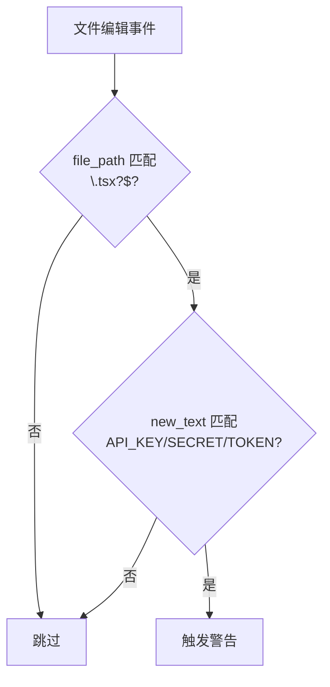

第二十章我们介绍了 Hookify 的基本用法 —— 用 Markdown 文件零代码创建钩子。现在深入它的高级能力：多条件组合、操作符、字段匹配。

## 回顾：简单规则

```markdown
---
name: block-dangerous-rm
enabled: true
event: bash
pattern: rm\s+-rf
action: block
---

⚠️ **Dangerous rm command detected!**
```

一条规则 = 一个事件 + 一个模式 + 一个动作。简单直接。

但现实场景更复杂：**只有 TypeScript 文件里写 API_KEY 才需要警告，配置文件里不需要。**

## 多条件规则

多条件规则使用 `conditions` 数组，**所有条件必须同时满足**才触发：

```markdown
---
name: api-key-in-typescript
enabled: true
event: file
action: warn
conditions:
  - field: file_path
    operator: regex_match
    pattern: \.tsx?$
  - field: new_text
    operator: regex_match
    pattern: (API_KEY|SECRET|TOKEN)\s*=\s*["']
---

🔐 **Hardcoded credential in TypeScript!**

Use environment variables instead of hardcoded values.
```

这个规则只有当**同时满足**两个条件时才触发：
1. 文件路径匹配 `.ts` 或 `.tsx`
2. 新写入的文本包含 API_KEY/SECRET/TOKEN 赋值



## 操作符详解

Hookify 支持 6 种操作符：

| 操作符 | 含义 | 示例 |
|--------|------|------|
| `regex_match` | 正则匹配 | `pattern: \.tsx?$` |
| `contains` | 包含子串 | `pattern: console.log` |
| `equals` | 完全相等 | `pattern: production` |
| `not_contains` | 不包含子串 | `pattern: npm test` |
| `starts_with` | 以...开头 | `pattern: https://` |
| `ends_with` | 以...结尾 | `pattern: .env` |

### regex_match（最常用）

Python 正则语法，最强大最灵活：

```yaml
conditions:
  - field: file_path
    operator: regex_match
    pattern: \.(test|spec)\.(ts|js)x?$   # 测试文件
```

### contains

简单的字符串包含，不需要转义：

```yaml
conditions:
  - field: new_text
    operator: contains
    pattern: console.log     # 任何包含 console.log 的内容
```

### not_contains

反向匹配，用于"缺少某内容"的场景：

```yaml
conditions:
  - field: transcript
    operator: not_contains
    pattern: npm test|pytest|cargo test    # 会话中没有测试命令
```

### equals

精确匹配，区分大小写：

```yaml
conditions:
  - field: file_path
    operator: equals
    pattern: .env            # 只匹配 .env，不匹配 .env.local
```

## 字段详解

不同事件类型提供不同的字段：

### bash 事件

| 字段 | 含义 | 示例值 |
|------|------|--------|
| `command` | Bash 命令字符串 | `rm -rf /tmp/test` |

```yaml
conditions:
  - field: command
    operator: regex_match
    pattern: (rm\s+-rf|dd\s+if=|mkfs|format)
```

### file 事件

| 字段 | 含义 | 适用操作 |
|------|------|---------|
| `file_path` | 文件路径 | Edit, Write, MultiEdit |
| `new_text` | 新写入的内容 | Edit, Write |
| `old_text` | 被替换的旧内容 | Edit |
| `content` | 完整文件内容 | Write |

```yaml
conditions:
  - field: file_path
    operator: regex_match
    pattern: \.env$|credentials|secrets
  - field: new_text
    operator: contains
    pattern: KEY
```

### prompt 事件

| 字段 | 含义 | 示例值 |
|------|------|--------|
| `user_prompt` | 用户提交的提示词 | "Deploy to production" |

```yaml
conditions:
  - field: user_prompt
    operator: regex_match
    pattern: (deploy|release).*production
```

### stop 事件

使用通用会话状态匹配：

```yaml
conditions:
  - field: transcript
    operator: not_contains
    pattern: npm test|pytest|cargo test
```

## 实战模式

### 模式一：渐进式安全

不同文件类型，不同安全级别：

```markdown
---
name: env-file-strict
enabled: true
event: file
action: block
conditions:
  - field: file_path
    operator: regex_match
    pattern: \.env($|\.)
---

🛑 **.env 文件修改被阻止！**

环境变量文件不应通过代码编辑器修改。
```

```markdown
---
name: config-file-warn
enabled: true
event: file
action: warn
conditions:
  - field: file_path
    operator: regex_match
    pattern: config\.(ts|js|json)$
  - field: new_text
    operator: regex_match
    pattern: (password|secret|token)\s*[:=]
---

⚠️ **配置文件中可能包含敏感信息！**

确保敏感值通过环境变量注入，不要硬编码。
```

### 模式二：测试保障

确保不会在没有运行测试的情况下停止：

```markdown
---
name: require-tests-before-stop
enabled: false
event: stop
action: block
conditions:
  - field: transcript
    operator: not_contains
    pattern: npm test|jest|vitest|pytest|cargo test|go test
---

**Tests not detected in transcript!**

Before stopping, please run tests to verify your changes work correctly.
```

注意 `enabled: false` —— 默认关闭，只在需要严格模式时启用。

### 模式三：危险命令防护

组合多个危险模式：

```markdown
---
name: block-destructive-ops
enabled: true
event: bash
action: block
conditions:
  - field: command
    operator: regex_match
    pattern: rm\s+-rf|dd\s+if=|mkfs|format|chmod\s+777|>\s*/dev/sd
---

🛑 **Destructive operation detected!**

This command can cause data loss. Operation blocked.
```

### 模式四：调试代码检测

```markdown
---
name: no-debug-in-production
enabled: true
event: file
action: warn
conditions:
  - field: file_path
    operator: regex_match
    pattern: \.(ts|js|tsx|jsx)$
  - field: new_text
    operator: regex_match
    pattern: console\.log\(|debugger;|print\(|fmt\.Println\(
---

🐛 **Debug code detected in source file**

Remember to remove debugging statements before committing.
```

### 模式五：敏感信息泄露防护

```markdown
---
name: prevent-secret-leak
enabled: true
event: bash
action: block
conditions:
  - field: command
    operator: regex_match
    pattern: (curl|wget).*API_KEY|git\s+push.*\.env|scp.*secret
---

🔐 **Potential secret leak detected!**

Command may expose sensitive information. Blocked for safety.
```

## 规则管理

### 启用/禁用

编辑 `.local.md` 文件，切换 `enabled` 字段：

```yaml
---
name: my-rule
enabled: true   # 改为 false 即禁用
---
```

或使用交互式管理：

```
/hookify:configure
```

### 查看所有规则

```
/hookify:list
```

### 删除规则

```bash
rm .claude/hookify.my-rule.local.md
```

### 即时生效

**修改规则后无需重启 Claude Code**，下一次工具使用就会应用新规则。这是 Hookify 相比直接编辑 hooks.json 的一大优势。

## 性能考虑

- **保持正则简单**：复杂正则拖慢每次工具调用
- **指定具体事件**：用 `bash` 或 `file` 而非 `all`
- **限制规则数量**：活跃规则不要超过 10 个
- **优先用 contains**：简单场景不需要正则

## 本章小结

**一句话记住**：多条件规则就是"精确打击" —— 用 conditions 数组把触发范围从"所有文件"缩小到"只在该场景下触发"。

**决策规则**：
- 需要同时满足多个条件 → 用 `conditions` 数组（AND 逻辑）
- 只需简单字符串匹配 → 用 `contains`，别上来就写正则
- 需要精确匹配完整值 → 用 `equals`
- 需要"缺少某内容"时触发 → 用 `not_contains`（如 stop 钩子检测"会话中没有测试命令"）
- 规则只是偶尔需要 → 设 `enabled: false`，需要时再开

**最容易踩的坑**：对每种事件类型用了不存在的字段 —— 比如在 bash 事件里写 `file_path`，在 file 事件里写 `command`。字段跟事件类型绑定，写错字段规则永远不触发，而且不会报错。

**现在就试**：用 `/hookify:hookify` 创建一条多条件规则：当 `.env` 文件被编辑且新内容包含 `KEY` 或 `SECRET` 时发出警告。观察 conditions 如何把范围从"所有编辑"缩小到"仅敏感文件"。

👉 接下来是最终章，我们把所有知识串联起来，从零构建一个完整插件

---

**系列目录**：
- [第一章：Claude Code 是什么 —— 终端里的 AI 编码伙伴](./../01-intro/01-what-is-claude-code.md)
- [第二章：安装与上手 —— 从 curl 到第一个命令](./../01-intro/02-installation-setup.md)
- [第三章：权限模型 —— ask/allow/deny 与沙箱](./../01-intro/03-permission-model.md)
- [第四章：斜杠命令 —— 自定义提示词的标准化方法](./../02-core/04-slash-commands.md)
- [第五章：Hooks 系统 —— 事件驱动的自动化引擎](./../02-core/05-hooks-system.md)
- [第六章：两种钩子对比 —— Prompt 钩子 vs Command 钩子](./../02-core/06-prompt-hooks-vs-command-hooks.md)
- [第七章：插件架构 —— 目录结构、自动发现与清单](./../03-plugins/07-plugin-architecture.md)
- [第八章：插件命令开发 —— frontmatter、动态参数、bash 执行](./../03-plugins/08-plugin-commands.md)
- [第九章：插件代理开发 —— 触发机制、系统提示词设计](./../03-plugins/09-plugin-agents.md)
- [第十章：插件技能开发 —— 渐进式披露与 SKILL.md](./../03-plugins/10-plugin-skills.md)
- [第十一章：插件钩子开发 —— hooks.json 与可移植路径](./../03-plugins/11-plugin-hooks.md)
- [第十二章：MCP 集成 —— stdio/SSE/HTTP/WebSocket 四种模式](./../03-plugins/12-mcp-integration.md)
- [第十三章：插件配置 —— .local.md 模式与 YAML frontmatter](./../03-plugins/13-plugin-settings.md)
- [第十六章：commit-commands —— 最简命令插件](./../04-plugin-deep-dives/16-commit-commands.md)
- [第十七章：security-guidance —— 安全钩子实战](./../04-plugin-deep-dives/17-security-guidance.md)
- [第十八章：code-review —— 多代理并行审查](./../04-plugin-deep-dives/18-code-review.md)
- [第十九章：feature-dev —— 7 阶段功能开发工作流](./../04-plugin-deep-dives/19-feature-dev.md)
- [第二十章：hookify —— 零代码创建钩子规则](./../04-plugin-deep-dives/20-hookify.md)
- [第二十一章：plugin-dev —— 用插件开发插件的元工具](./../04-plugin-deep-dives/21-plugin-dev-toolkit.md)
- [第二十二章：设置层级 —— 企业/用户/项目三层配置](./../05-enterprise/22-settings-hierarchy.md)
- [第二十三章：MDM 部署 —— Jamf/Intune/Group Policy 推送](./../05-enterprise/23-mdm-deployment.md)
- [第二十四章：Marketplace —— 插件发布与分发](./../05-enterprise/24-marketplace.md)
- [第二十五章：多代理模式 —— 并行代理编排与工作流](./25-multi-agent-patterns.md)
- 第二十六章：Hookify 进阶 —— 多条件规则与操作符 👈 当前位置
- [第二十七章：从零构建完整插件 —— 端到端实战](./27-building-complete-plugin.md) 👉 下一章

