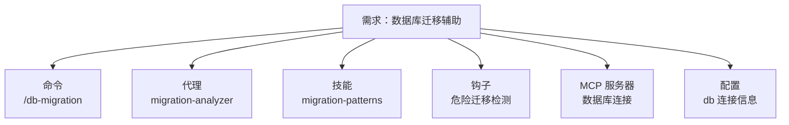
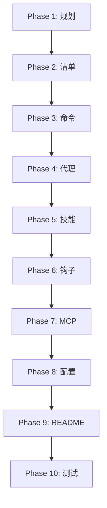

经过前面 26 章的学习，你已经掌握了 Claude Code 插件系统的每一个组件。现在，让我们把所有知识串联起来，从零构建一个完整的插件。

## 目标：构建 db-migration-helper 插件

我们要构建一个数据库迁移辅助插件，它包含：

- **命令**：`/db-migration` — 创建和管理数据库迁移
- **代理**：`migration-analyzer` — 分析迁移影响
- **技能**：`migration-patterns` — 迁移最佳实践知识
- **钩子**：自动检测危险迁移操作
- **MCP 服务器**：连接数据库执行迁移
- **配置**：`.local.md` 文件存储数据库连接信息

## Phase 1：规划

### 确定组件需求



### 设计目录结构

```
db-migration-helper/
├── .claude-plugin/
│   └── plugin.json
├── commands/
│   └── db-migration.md
├── agents/
│   └── migration-analyzer.md
├── skills/
│   └── migration-patterns/
│       ├── SKILL.md
│       ├── references/
│       │   └── dangerous-patterns.md
│       └── examples/
│           └── safe-migration-template.sql
├── hooks/
│   ├── hooks.json
│   └── scripts/
│       └── validate-migration.sh
├── .mcp.json
└── README.md
```

## Phase 2：创建插件清单

```json
{
  "name": "db-migration-helper",
  "version": "0.1.0",
  "description": "Database migration helper with analysis, validation, and safe execution workflows",
  "author": {
    "name": "Your Name",
    "email": "you@example.com"
  },
  "keywords": ["database", "migration", "sql", "postgresql"],
  "license": "MIT"
}
```

## Phase 3：创建命令

```markdown
---
description: Create and manage database migrations
argument-hint: [action] [migration-name]
allowed-tools: Read, Write, Grep, Bash(psql:*), Bash(pg_dump:*)
---

## Context

- Current migrations: !`ls -la migrations/ 2>/dev/null || echo "No migrations directory"`
- Database schema: !`pg_dump --schema-only $DATABASE_URL 2>/dev/null | head -100 || echo "Schema unavailable"`
- Pending migrations: !`ls migrations/pending/ 2>/dev/null || echo "No pending migrations"`

## Actions

Based on $1, perform:

### create (default)
Create a new migration file:
1. Ask user what the migration should do
2. Generate safe SQL migration following migration-patterns skill
3. Create both up and down migration files
4. Launch migration-analyzer agent to review

### analyze
Analyze existing migration:
1. Read the migration file specified by $2
2. Launch migration-analyzer agent for impact analysis
3. Present findings and recommendations

### apply
Apply pending migration:
1. Verify migration file exists
2. Create database backup
3. Apply migration in transaction
4. Verify success

### rollback
Rollback last migration:
1. Check down migration exists
2. Confirm with user
3. Apply down migration in transaction

### status
Show migration status:
1. List applied migrations
2. List pending migrations
3. Show current schema version
```

## Phase 4：创建代理

```markdown
---
name: migration-analyzer
description: Use this agent when the user asks to "analyze a migration", "check migration safety", "review SQL migration", "assess migration impact", or needs guidance on database migration risks, data loss potential, or rollback complexity. Examples:

<example>
Context: User created a new migration that drops a column
user: "Check if this migration is safe"
assistant: "I'll launch the migration-analyzer agent to review the migration for potential risks like data loss, locking issues, and rollback complexity."
<commentary>
The migration-analyzer should be triggered for any migration safety review request.
</commentary>
</example>

<example>
Context: User wants to add a NOT NULL column to a large table
user: "Analyze the impact of adding a NOT NULL column to the users table"
assistant: "Let me use the migration-analyzer to assess the locking behavior and suggest a safer multi-step approach."
<commentary>
Adding NOT NULL columns to large tables is a known risky operation that benefits from expert analysis.
</commentary>
</example>

model: sonnet
color: yellow
tools: ["Read", "Grep", "Glob", "Bash"]
---

You are a senior database administrator specializing in migration safety analysis.

**Your Core Responsibilities:**
1. Analyze SQL migrations for potential risks
2. Identify data loss scenarios
3. Assess locking and performance impact
4. Evaluate rollback complexity
5. Suggest safer alternatives when needed

**Analysis Process:**
1. Read the migration file completely
2. Identify all schema changes (ADD/DROP/ALTER column, CREATE/DROP table, etc.)
3. For each change, assess:
   - Data loss risk (irreversible operations)
   - Locking behavior (table locks, row locks, exclusive locks)
   - Performance impact on large tables
   - Rollback feasibility
4. Check for common anti-patterns:
   - Dropping columns without data migration
   - Adding NOT NULL without default on large tables
   - Renaming columns without two-phase approach
   - Missing transaction wrapping
   - Long-running DDL on production tables
5. Assign severity: CRITICAL / HIGH / MEDIUM / LOW
6. Provide specific recommendations

**Output Format:**
- Migration: [file name]
- Risk Level: [CRITICAL/HIGH/MEDIUM/LOW]
- Findings: [numbered list with severity]
- Recommendations: [specific actionable suggestions]
- Safer Alternative: [if applicable, provide multi-step approach]

**Edge Cases:**
- If migration is wrapped in transaction, note it favorably
- If migration has both up and down, note rollback is possible
- If table size is unknown, flag as uncertainty
- If migration references columns that may not exist, flag as dependency risk
```

## Phase 5：创建技能

SKILL.md：

```markdown
---
name: Migration Patterns
description: This skill should be used when the user asks to "create a database migration", "write safe SQL migration", "migration best practices", "avoid migration pitfalls", "two-phase migration", or needs guidance on database schema change patterns, safe migration strategies, or rollback procedures.
version: 0.1.0
---

# Database Migration Patterns

## Overview

Safe database migrations require understanding of locking behavior, data preservation, and rollback strategies. This skill provides patterns for common migration scenarios.

## Core Principles

1. **Always provide a down migration** — Every up migration needs a corresponding rollback
2. **Wrap in transactions** — DDL should be transactional where supported
3. **Prefer additive changes** — Add before removing, expand before contracting
4. **Two-phase for destructive changes** — Phase 1: add new, Phase 2: remove old
5. **Test on staging first** — Never apply untested migrations to production

## Common Patterns

### Adding a Column
```sql
-- Safe: Add nullable column, backfill later
ALTER TABLE users ADD COLUMN email VARCHAR(255);
```

### Removing a Column (Two-Phase)
```sql
-- Phase 1: Stop writing to column (code change)
-- Phase 2: Remove column (after code deployed)
ALTER TABLE users DROP COLUMN deprecated_field;
```

### Renaming a Column (Two-Phase)
```sql
-- Phase 1: Add new column, dual-write
ALTER TABLE users ADD COLUMN new_name VARCHAR(255);
-- Phase 2: Remove old column (after migration complete)
```

## Additional Resources

### Reference Files
- **`references/dangerous-patterns.md`** — Anti-patterns and dangerous operations

### Examples
- **`examples/safe-migration-template.sql`** — Safe migration template with up/down
```

references/dangerous-patterns.md:

```markdown
# Dangerous Migration Patterns

## CRITICAL: Data Loss

### Dropping a column without migration
```sql
-- DANGEROUS: Data is permanently lost
ALTER TABLE users DROP COLUMN phone;
```
**Safer alternative:** Two-phase approach — stop using column first, then remove.

### Dropping a table
```sql
-- DANGEROUS: All data permanently lost
DROP TABLE old_metrics;
```
**Safer alternative:** Rename first, verify nothing references it, then drop after grace period.

## HIGH: Locking Issues

### Adding NOT NULL without default on large table
```sql
-- DANGEROUS: Full table lock for duration of rewrite
ALTER TABLE large_table ADD COLUMN status VARCHAR(20) NOT NULL;
```
**Safer alternative:**
```sql
-- Step 1: Add nullable column
ALTER TABLE large_table ADD COLUMN status VARCHAR(20);
-- Step 2: Backfill in batches
-- Step 3: Add NOT NULL constraint
ALTER TABLE large_table ALTER COLUMN status SET NOT NULL;
```

## MEDIUM: Performance

### Creating index concurrently vs. regular
```sql
-- SLOW: Blocks writes
CREATE INDEX idx_users_email ON users(email);

-- FAST: Non-blocking
CREATE INDEX CONCURRENTLY idx_users_email ON users(email);
```
```

## Phase 6：创建钩子

hooks.json：

```json
{
  "description": "Validation hooks for database migration files",
  "hooks": {
    "PreToolUse": [
      {
        "matcher": "Write|Edit",
        "hooks": [
          {
            "type": "command",
            "command": "bash ${CLAUDE_PLUGIN_ROOT}/hooks/scripts/validate-migration.sh",
            "timeout": 10
          }
        ]
      }
    ]
  }
}
```

hooks/scripts/validate-migration.sh：

```bash
#!/bin/bash
set -euo pipefail

# Read hook input
input=$(cat)
file_path=$(echo "$input" | jq -r '.tool_input.file_path // empty')

# Only check migration files
if [[ "$file_path" != *"migration"* ]] && [[ "$file_path" != *".sql" ]]; then
  exit 0
fi

# Read new content
new_text=$(echo "$input" | jq -r '.tool_input.new_text // .tool_input.content // empty')

# Check for dangerous patterns
dangerous=0
reasons=""

# Check: DROP TABLE without IF EXISTS
if echo "$new_text" | grep -qiE "DROP\s+TABLE\s+[A-Za-z_]+" 2>/dev/null; then
  if ! echo "$new_text" | grep -qi "IF EXISTS" 2>/dev/null; then
    dangerous=1
    reasons="${reasons}\n- DROP TABLE without IF EXISTS"
  fi
fi

# Check: Missing transaction
if ! echo "$new_text" | grep -qiE "BEGIN|START TRANSACTION" 2>/dev/null; then
  reasons="${reasons}\n- No explicit transaction (consider wrapping in BEGIN...COMMIT)"
fi

if [ "$dangerous" -eq 1 ]; then
  echo "{\"decision\": \"deny\", \"reason\": \"Dangerous migration pattern detected:${reasons}\"}" >&2
  exit 2
fi

# Non-blocking warnings
if [ -n "$reasons" ]; then
  echo "{\"systemMessage\": \"Migration advisory:${reasons}\"}"
fi

exit 0
```

## Phase 7：配置 MCP 服务器

.mcp.json：

```json
{
  "database": {
    "command": "npx",
    "args": [
      "-y",
      "@modelcontextprotocol/server-postgres",
      "${DATABASE_URL}"
    ],
    "env": {
      "DATABASE_URL": "${DATABASE_URL}"
    }
  }
}
```

## Phase 8：配置文件模式

创建 `.claude/db-migration-helper.local.md` 模板：

```markdown
---
database_url: postgresql://localhost:5432/mydb
migrations_dir: ./migrations
backup_before_apply: true
dry_run_by_default: true
---

## Database Migration Helper Settings

- `database_url`: PostgreSQL connection string
- `migrations_dir`: Directory for migration files
- `backup_before_apply`: Create backup before applying migrations
- `dry_run_by_default`: Run migrations in dry-run mode by default
```

## Phase 9：编写 README

```markdown
# DB Migration Helper

Database migration helper with analysis, validation, and safe execution workflows.

## Installation

```bash
/plugin install db-migration-helper@claude-code-marketplace
```

## Commands

- `/db-migration create [name]` — Create a new migration
- `/db-migration analyze [file]` — Analyze migration safety
- `/db-migration apply` — Apply pending migration
- `/db-migration rollback` — Rollback last migration
- `/db-migration status` — Show migration status

## Agents

- `migration-analyzer` — Automatically triggered for migration safety analysis

## Skills

- `migration-patterns` — Safe migration patterns and best practices

## Hooks

- PreToolUse: Validates migration files for dangerous patterns

## Configuration

Create `.claude/db-migration-helper.local.md`:

```yaml
---
database_url: postgresql://localhost:5432/mydb
migrations_dir: ./migrations
backup_before_apply: true
---
```

## Requirements

- PostgreSQL
- Node.js 18+ (for MCP server)
- `DATABASE_URL` environment variable
```

## Phase 10：测试与验证

```bash
# 本地测试
claude --plugin-dir /path/to/db-migration-helper

# 验证命令
/help  # 查看 /db-migration 命令

# 测试技能触发
# 询问 "创建数据库迁移的最佳实践是什么"

# 测试代理触发
# 询问 "分析这个迁移是否安全"

# 测试钩子
# 编辑一个 .sql 文件，检查是否有验证提示

# 检查 MCP 服务器
/mcp  # 查看数据库 MCP 是否连接
```

## 回顾：完整的插件开发流程



这个流程和 plugin-dev 插件的 `/plugin-dev:create-plugin` 8 阶段工作流一致：

1. **Discovery** → Phase 1
2. **Component Planning** → Phase 1
3. **Detailed Design** → Phase 2-8
4. **Structure Creation** → Phase 2
5. **Component Implementation** → Phase 3-8
6. **Validation** → Phase 10
7. **Testing** → Phase 10
8. **Documentation** → Phase 9

## 系列总结

**一句话记住**：Claude Code 插件 = Markdown + JSON + 可组合 —— 命令是 Markdown，配置是 JSON，六大组件自由组合，AI 编码助手从此可精确控制。

**决策规则**：
- 只需要快捷提示词 → 写一个命令（.md 文件）就够了
- 需要专业判断 → 加一个代理（带触发示例的 system prompt）
- 需要知识注入 → 加一个技能（SKILL.md + references/）
- 需要自动拦截/校验 → 加一个钩子（hooks.json）
- 需要外部工具 → 加 MCP 服务器（.mcp.json）
- 需要用户配置 → 加 .local.md 模板

**最容易踩的坑**：插件开发完不测试就直接发布 —— 命令 frontmatter 写错一个字段、钩子脚本路径没替换 `${CLAUDE_PLUGIN_ROOT}`、代理触发条件太模糊导致不激活，这些全靠 `claude --plugin-dir` 本地跑一遍才能发现。

**现在就试**：照着本章的 10 阶段流程，从 Phase 1 开始规划你一直想做的那个插件。不需要一次写完所有组件 —— 先写一个命令 + 一个代理，跑通再迭代。

25 章走完，从 Claude Code 是什么到从零构建完整插件，你掌握了：

**入门（1-3）：** Claude Code 的定义、安装、权限模型 —— 理解 AI 编码助手的基础

**核心（4-6）：** 斜杠命令、Hooks 系统、两种钩子 —— Claude Code 自动化的核心机制

**插件（7-13）：** 架构、命令、代理、技能、钩子、MCP、配置 —— 插件开发的 7 大组件

**实战（14-19）：** 12 个官方插件的源码解析 —— 从最简单到最复杂的真实案例

**企业（20-22）：** 设置层级、MDM 部署、Marketplace —— 生产级部署和分发

**高级（23-25）：** 多代理模式、Hookify 进阶、完整插件 —— 高阶模式和端到端实战

Claude Code 的插件系统是一种优雅的设计：**所有组件都是 Markdown 文件，所有配置都是 JSON，所有行为都是可组合的**。这让 AI 编码助手不再是黑盒，而是你可以精确控制的工具。

去构建你自己的插件吧。

---

**系列目录**：
- [第一章：Claude Code 是什么 —— 终端里的 AI 编码伙伴](./../01-intro/01-what-is-claude-code.md)
- [第二章：安装与上手 —— 从 curl 到第一个命令](./../01-intro/02-installation-setup.md)
- [第三章：权限模型 —— ask/allow/deny 与沙箱](./../01-intro/03-permission-model.md)
- [第四章：斜杠命令 —— 自定义提示词的标准化方法](./../02-core/04-slash-commands.md)
- [第五章：Hooks 系统 —— 事件驱动的自动化引擎](./../02-core/05-hooks-system.md)
- [第六章：两种钩子对比 —— Prompt 钩子 vs Command 钩子](./../02-core/06-prompt-hooks-vs-command-hooks.md)
- [第七章：插件架构 —— 目录结构、自动发现与清单](./../03-plugins/07-plugin-architecture.md)
- [第八章：插件命令开发 —— frontmatter、动态参数、bash 执行](./../03-plugins/08-plugin-commands.md)
- [第九章：插件代理开发 —— 触发机制、系统提示词设计](./../03-plugins/09-plugin-agents.md)
- [第十章：插件技能开发 —— 渐进式披露与 SKILL.md](./../03-plugins/10-plugin-skills.md)
- [第十一章：插件钩子开发 —— hooks.json 与可移植路径](./../03-plugins/11-plugin-hooks.md)
- [第十二章：MCP 集成 —— stdio/SSE/HTTP/WebSocket 四种模式](./../03-plugins/12-mcp-integration.md)
- [第十三章：插件配置 —— .local.md 模式与 YAML frontmatter](./../03-plugins/13-plugin-settings.md)
- [第十六章：commit-commands —— 最简命令插件](./../04-plugin-deep-dives/16-commit-commands.md)
- [第十七章：security-guidance —— 安全钩子实战](./../04-plugin-deep-dives/17-security-guidance.md)
- [第十八章：code-review —— 多代理并行审查](./../04-plugin-deep-dives/18-code-review.md)
- [第十九章：feature-dev —— 7 阶段功能开发工作流](./../04-plugin-deep-dives/19-feature-dev.md)
- [第二十章：hookify —— 零代码创建钩子规则](./../04-plugin-deep-dives/20-hookify.md)
- [第二十一章：plugin-dev —— 用插件开发插件的元工具](./../04-plugin-deep-dives/21-plugin-dev-toolkit.md)
- [第二十二章：设置层级 —— 企业/用户/项目三层配置](./../05-enterprise/22-settings-hierarchy.md)
- [第二十三章：MDM 部署 —— Jamf/Intune/Group Policy 推送](./../05-enterprise/23-mdm-deployment.md)
- [第二十四章：Marketplace —— 插件发布与分发](./../05-enterprise/24-marketplace.md)
- [第二十五章：多代理模式 —— 并行代理编排与工作流](./25-multi-agent-patterns.md)
- [第二十六章：Hookify 进阶 —— 多条件规则与操作符](./26-hookify-advanced-rules.md)
- 第二十七章：从零构建完整插件 —— 端到端实战 👈 当前位置

