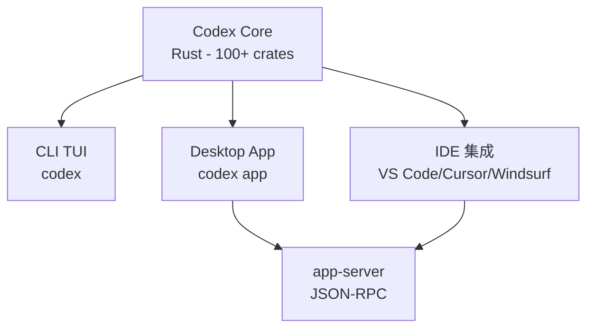

安装 Codex 有三种方式，选择最适合你的：

## 方式一：npm（推荐，跨平台）

```bash
npm install -g @openai/codex
```

这是最简单的方式，支持 macOS、Linux、Windows。

## 方式二：Homebrew（macOS）

```bash
brew install --cask codex
```

macOS 用户可以用 Homebrew Cask 安装。

## 方式三：二进制文件（手动）

去 GitHub Releases 下载对应平台的二进制：
- macOS Apple Silicon：`codex-aarch64-apple-darwin.tar.gz`
- macOS Intel：`codex-x86_64-apple-darwin.tar.gz`
- Linux x86_64：`codex-x86_64-unknown-linux-musl.tar.gz`
- Linux ARM64：`codex-aarch64-unknown-linux-musl.tar.gz`

下载后解压，把二进制文件放到 PATH 里。

## 验证安装

安装完成后，运行：

```bash
codex --version
```

如果显示版本号，说明安装成功。

## 第一次运行

直接运行：

```bash
codex
```

这会启动交互式 TUI（终端 UI）。

### 认证选择

第一次运行会让你选择认证方式：
1. **Sign in with ChatGPT**（推荐）
2. **Sign in with API Key**

选择 ChatGPT 登录的话，会打开浏览器让你授权。

### 第一个命令

登录成功后，试试：

```
这个项目是做什么的？
```

Codex 会分析当前目录的文件，给你解释。

## 常用命令

```bash
codex              # 启动交互式 TUI
codex app          # 打开桌面应用
codex --help       # 查看帮助
```

## 命令行与桌面应用的关系

Codex 采用**共享核心、多前端**的架构，命令行（CLI）和桌面应用（APP）只是不同的前端界面，底层使用同一个核心引擎。

### 架构关系



### 三种使用方式对比

| 方式 | 命令 | 界面 | 使用场景 | 特点 |
|------|------|------|----------|------|
| **命令行** | `codex` | TUI（终端 UI） | 终端、SSH、Docker 容器 | 纯文本界面，适合远程环境 |
| **桌面应用** | `codex app` | GUI（图形界面） | 本地开发 | 富文本、多面板、更好的视觉体验 |
| **IDE 集成** | 安装扩展 | IDE 侧边栏面板 | 边写代码边和 AI 对话 | 与编辑器深度集成 |

### app-server 的作用

`codex app-server` 是核心组件，负责：
- 使用 JSON-RPC 2.0 协议进行双向通信
- 支持多种传输方式：stdio、websocket、unix socket
- 为桌面应用和 IDE 扩展提供后端服务

### 互通关系

**是的，它们是完全互通的**：

1. **共享认证**：CLI、桌面应用、IDE 集成使用相同的认证状态
2. **共享配置**：配置文件 `~/.config/codex/config.toml` 对所有前端生效
3. **共享会话**：可以在不同前端之间切换，会话状态保持一致
4. **共享核心**：所有前端都调用同一个 Codex Core

### 总结

- **命令行** = TUI 前端 + Codex Core
- **桌面应用** = GUI 前端 + app-server + Codex Core
- **IDE 集成** = IDE 插件前端 + app-server + Codex Core

它们只是**不同的前端界面**，底层使用同一个核心引擎，数据和配置完全互通。

## 配置文件

Codex 的配置文件在：
- macOS：`~/.config/codex/`
- Linux：`~/.config/codex/`
- Windows：`%APPDATA%\codex\`

主要配置文件是 `config.toml`，我们会在[第三章](./03-authentication.md)详细讲解。

## 本章小结

**一句话记住**：npm install -g @openai/codex → codex → 开始用。

**最容易踩的坑**：忘记把二进制文件放到 PATH 里（如果用手动安装的话）。

**现在就试**：安装 → 运行 `codex` → 登录 → 问它"你能做什么？"

---

**系列目录**：
- [第一章：Codex 是什么 —— OpenAI 的本地编码代理](./01-what-is-codex.md) 👈 上一章
- 第二章：安装与上手 —— npm/brew/二进制三种方式 👈 当前位置
- [第三章：认证与配置 —— ChatGPT 账号 vs API Key](./03-authentication.md) 👉 下一章

