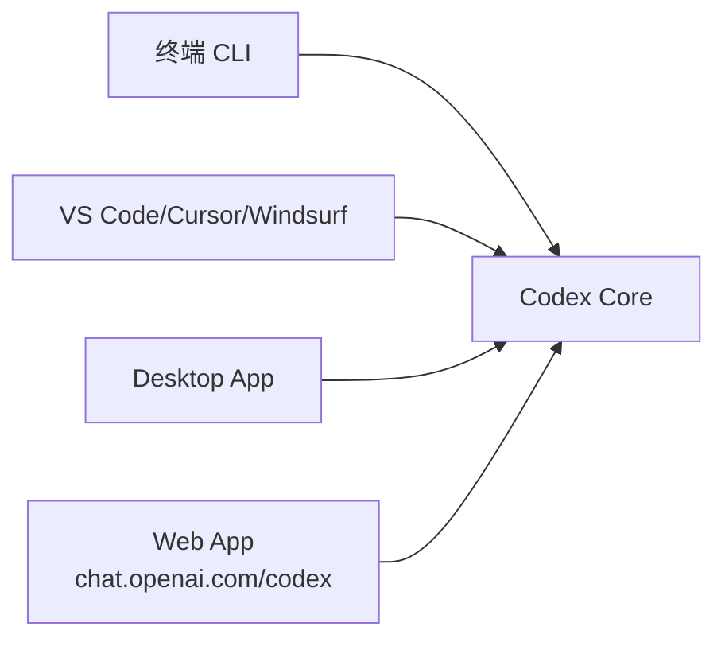
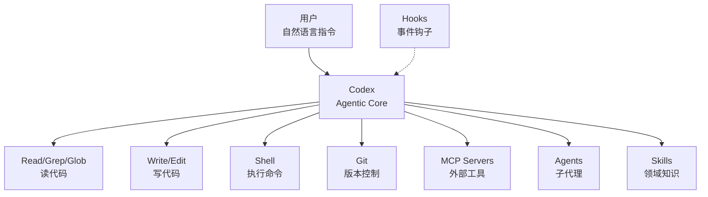

你在终端里敲代码，突然发现：

- 这个配置文件格式好复杂，改对了吗？
- 这个仓库是做什么的？帮我理解一下
- 跑测试失败了，能帮我 debug 吗？
- 这个 Python 脚本需要重构，能帮我弄吗？

如果你有一个 AI 伙伴住在终端里，直接用自然语言对话，然后它自主读文件、分析代码、执行命令——这就是 **Codex**。

## Codex vs Claude Code：两大编码代理对比

市面上有两个主要的 agentic coding tool：OpenAI 的 **Codex** 和 Anthropic 的 **Claude Code**。它们都提供本地运行的 AI 编码代理，但在设计理念、技术实现和使用体验上有显著差异。

### 核心差异概览

| 维度 | Codex | Claude Code |
|------|-------|-------------|
| **开发商** | OpenAI | Anthropic |
| **主要模型** | GPT-4o, GPT-4o-mini | Claude 3.5 Sonnet, Claude 3 Opus |
| **实现语言** | Rust（核心）+ Node.js（CLI） | TypeScript |
| **认证方式** | ChatGPT 账号 / API Key | Claude 账号 |
| **终端体验** | TUI（基于 ratatui） | REPL（交互式） |
| **沙箱执行** | ✅ 原生支持（三平台） | ❌ 直接执行 Bash |
| **GitHub 集成** | ❌ 无原生集成 | ✅ @claude PR/Issue 集成 |
| **插件分发** | 社区生态 | 官方 Marketplace |
| **架构复杂度** | 100+ Rust crates | 单体 TypeScript 应用 |

### 详细对比

#### 1. 架构设计

**Codex** 采用模块化的 Rust 架构，核心由 100+ 个 crate 组成：
- `core/`：核心逻辑
- `tui/`：终端 UI
- `exec/`：沙箱执行
- `plugin/`：插件系统
- `skills/`：技能系统

这种设计带来更好的性能和安全性，但部署包较大。

**Claude Code** 是单体 TypeScript 应用，架构更简洁：
- 核心逻辑和 UI 在同一代码库
- 通过插件系统扩展功能
- 部署包更小，启动更快

#### 2. 安全模型

**Codex** 的沙箱执行是其核心安全特性：
- macOS：Seatbelt sandbox
- Linux：Linux sandbox
- Windows：Windows sandbox

所有命令执行都在隔离环境中进行，防止恶意代码影响系统。

**Claude Code** 直接执行 Bash 命令，没有沙箱隔离：
- 依赖用户权限控制
- 执行速度更快
- 安全性依赖用户信任和权限管理

#### 3. 使用体验

**Codex** 的 TUI 界面：
- 基于 ratatui 的终端 UI
- 支持多面板、快捷键
- 更接近传统终端工具体验

**Claude Code** 的 REPL 界面：
- 类似 Node.js REPL 的交互体验
- 更自然的对话流
- 支持富文本输出

#### 4. 扩展性

**Codex** 的插件系统：
- Commands、Skills、Hooks、Agents、MCP 服务器
- 社区驱动，无官方 Marketplace
- 需要手动安装和管理

**Claude Code** 的插件系统：
- 同样支持 Commands、Skills、Hooks、Agents、MCP
- 官方 Marketplace，一键安装
- 12 个官方插件开箱即用

#### 5. 集成能力

**Codex**：
- VS Code、Cursor、Windsurf 集成
- 桌面应用和 Web 应用
- 无原生 GitHub 集成

**Claude Code**：
- VS Code、JetBrains 集成
- 桌面应用和 Web 应用
- **GitHub @claude**：在 PR/Issue 中直接调用 AI

#### 6. 适用场景

**选择 Codex 如果你**：
- 需要 OpenAI 模型（GPT-4o）
- 关注安全，需要沙箱隔离
- 在企业环境，需要严格的权限控制
- 偏好 Rust 生态和模块化架构

**选择 Claude Code 如果你**：
- 需要 Claude 模型（Claude 3.5 Sonnet）
- 需要 GitHub PR/Issue 集成
- 希望快速上手，使用官方插件
- 偏好简洁的 TypeScript 架构

### 互补而非竞争

Codex 和 Claude Code 并非简单的竞争关系，它们代表了两种不同的设计哲学：

- **Codex**：安全优先、模块化、企业级
- **Claude Code**：体验优先、简洁、开发者友好

许多团队会同时使用两者，根据任务需求选择合适的工具。

## 这个系列讲什么

本系列从 Codex 的基础概念出发，逐步深入到架构和企业级部署：

1. **入门认识**：Codex 是什么、怎么装、认证
2. **核心机制**：CLI 使用、TUI、核心概念
3. **深入架构**：Rust crate 结构、执行模型
4. **高级特性**：插件、钩子、技能、MCP
5. **企业级部署**：配置、安全、沙箱

## Codex 定义

Codex 是 OpenAI 官方的 **agentic coding tool**，直接运行在你的本地电脑上，用自然语言理解需求，然后自主执行编码任务。

> "Codex CLI is a coding agent from OpenAI that runs locally on your computer." —— 官方 README

关键词拆解：

- **Agentic**：不只是问答，它能自主规划、执行多步操作
- **Runs locally**：在你的机器上运行，数据更安全
- **Understands your codebase**：可以读文件、搜代码、跑命令，拥有完整上下文
- **Natural language commands**：说人话就行，不需要记特殊语法

## 三种使用方式

Codex 有三个入口：

### 1. 终端 CLI（主力）

```bash
codex
```

进入交互式 TUI（终端 UI），直接和 AI 对话。这是最常用的方式。

### 2. IDE 集成

- **VS Code**：侧边栏面板
- **Cursor**：支持
- **Windsurf**：支持

### 3. 桌面应用 / Web 应用

- 运行 `codex app` 打开桌面应用
- 访问 chat.openai.com/codex 使用 Web 版本



## 核心架构

Codex 主要用 **Rust** 编写，有 100+ 个 crate，外加一个 Node.js CLI 包装器：



核心 crate 结构（在 `source/codex/codex-rs/`）：

| Crate | 作用 |
|-------|------|
| `core/` | 核心逻辑 |
| `tui/` | 终端 UI（基于 ratatui） |
| `cli/` | CLI 命令 |
| `plugin/` | 插件系统 |
| `skills/` | 技能系统 |
| `hooks/` | 钩子系统 |
| `mcp-server/` | MCP 服务器实现 |
| `exec/` | 沙箱执行 |
| `app-server/` | App 服务器协议 |
| ... | 还有 100+ 个 crate |

## 认证方式：两种选择

Codex 支持两种认证方式：

### 1. ChatGPT 账号（推荐）

使用你的 ChatGPT Plus/Pro/Business/Enterprise 账号登录，最简单。

### 2. API Key

使用 OpenAI API Key，需要额外配置。

我们会在[第二章](./02-installation-setup.md)详细讲解安装和认证。

## 核心特性

### 工具使用能力

Codex 不只是"写代码给你看"，它能调用多种工具：

- **文件操作**：Read, Write, Edit, Glob, Grep
- **命令执行**：Shell（在沙箱里）
- **版本控制**：Git
- **外部集成**：MCP 服务器
- **子代理**：专门化的 AI 代理

### Skills（技能）

给 AI 注入专业领域知识。Codex 自带核心技能，也可以自定义。

### Hooks（钩子）

在关键时刻自动执行逻辑，比如：
- 执行命令前的检查
- 写文件前的验证

### MCP 集成

支持 Model Context Protocol（MCP），可以连接各种外部服务。

### 沙箱执行

命令执行在沙箱里，更安全。支持：
- macOS Seatbelt sandbox
- Linux sandbox
- Windows sandbox

## 扩展性：插件系统

Codex 有完整的插件系统，可以自定义：
- Commands（命令）
- Skills（技能）
- Hooks（钩子）
- Agents（代理）
- MCP 服务器

## 本章小结

**一句话记住**：Codex = OpenAI 的本地编码代理，住在终端里，用自然语言对话，自主完成任务。

**决策规则**：
- 想用 OpenAI 模型在本地编码 → Codex 是官方工具
- 需要在终端/SSH/容器里用 → CLI 原生支持
- 关注数据安全 → 本地运行，沙箱执行

**最容易踩的坑**：把 Codex 当作"问答工具"——问它代码怎么写，然后手动复制粘贴。正确用法是让它**直接执行**：修 bug、写测试、重构代码，一条指令完成端到端任务。

**现在就试**：先安装 → `codex` → 输入"这个项目是做什么的？" → 感受 AI 如何理解你的代码库。

👉 接下来我们安装并上手

---

**系列目录**：
- 第一章：Codex 是什么 —— OpenAI 的本地编码代理 👈 当前位置
- [第二章：安装与上手 —— npm/brew/二进制三种方式](./02-installation-setup.md) 👉 下一章
- [第三章：认证与配置 —— ChatGPT 账号 vs API Key](./03-authentication.md)

