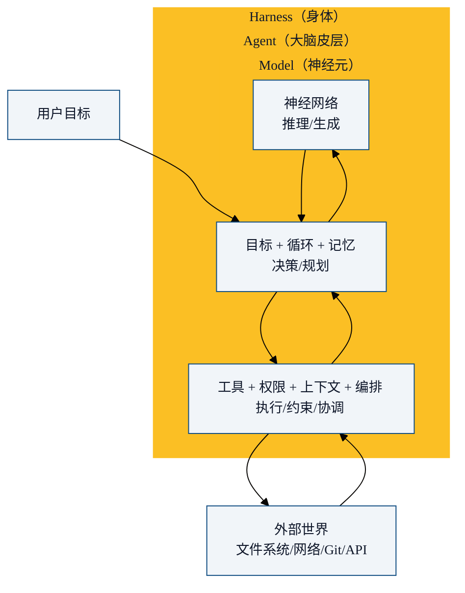
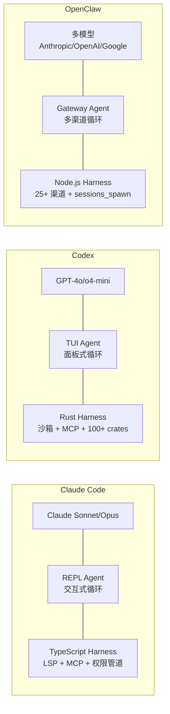

前面我们分别讲了 Agent 的历史和 Harness 的架构。但三个核心概念——**Model、Agent、Harness**——到底什么关系？这一章把它们放在一起，精确定义每个概念及其边界。

## 三个概念的精确定义

### Model（模型）

**定义**：一个能接收输入、产生输出的神经网络。

```
模型输入:  文本 + 可选(图像/文件/工具结果)
模型输出:  文本 + 可选(工具调用请求)
```

模型**只会做一件事**：根据输入预测下一个 token。它不知道外面有文件系统、有 git、有互联网——除非你通过工具告诉它。它不知道自己在一个循环里，不知道有权限约束，不知道上下文快满了。

**核心能力**：推理、生成、模式识别
**核心限制**：无状态、无感知、无动作

### Agent（智能体）

**定义**：一个能自主感知环境、做出决策、执行动作的系统。

```
Agent = Model + 目标 + 循环 + 历史消息
```

Agent 给了模型一个**身份**和**目标**。它让模型进入循环——每次看到工具执行的结果，决定下一步做什么。它维护着对话历史，形成了一种"工作记忆"。

**Agent 管理的是"思考"**：理解目标、制定计划、选择下一步、解读结果、决定何时结束。

### Harness（基础设施）

**定义**：Agent 运行的**环境**和**约束**。

```
Harness = 工具 + 权限 + 上下文管理 + 多Agent编排 + 技能 + ...
```

Harness 不给模型提供"智力"，它提供**能力边界**。它决定 Agent 能做什么、不能做什么、能记住多少、能给谁派活。

**Harness 管理的是"行动"**：执行工具、检查权限、压缩上下文、生成子 Agent、加载技能。

## 三者的关系图



更直观的类比：

| 概念 | 人体类比 | 职责 |
|------|---------|------|
| **Model** | 大脑皮层 | 推理、模式识别、生成 |
| **Agent** | 意识 | 目标导向的决策循环 |
| **Harness** | 身体 + 环境 | 感知、行动、约束 |
| **User** | 意志 | 设定最终目标 |

## 三者可以独立变化

这是一个关键认知：**Model、Agent、Harness 可以独立选择和组合**。

```
同一个 Harness（Claude Code 的架构），
  可以接入 Claude 模型 → 得到 Claude Code
  可以接入 GPT 模型 → 得到 Codex-like 行为
  可以接入 Kimi 模型 → 得到 Kimi Coder

同一个 Model（Claude Sonnet 4），
  在 Claude Code 的 Harness 里 → 可靠编码 Agent
  在 OpenClaw 的 Harness 里 → 多渠道聊天 Agent
  在 LangChain 的框架里 → Chain-based Agent
```

这意味着：
- **换模型**：成本/能力的权衡（用 Haiku 省钱，用 Opus 攻坚）
- **换 Harness**：可靠性/功能的改变（用沙箱更安全，用 MCP 更多工具）
- **换 Agent 策略**：行为模式的改变（自主性高低、规划风格）

## Claude Code、Codex、OpenClaw 的三者对比

把 Model/Agent/Harness 框架应用到三个实际产品：



关键差异：

| 维度 | Claude Code | Codex | OpenClaw |
|------|------------|-------|----------|
| **Model** | Claude only | GPT only | Any model |
| **Agent 模式** | REPL 交互 | TUI 面板 | 网关消息 |
| **Harness 亮点** | LSP 集成 | 沙箱安全 | 25+ 渠道 |
| **安全模型** | 权限管道 | OS 级沙箱 | 配对白名单 |
| **多 Agent** | 子代理 | 子代理 | sessions_spawn |
| **适用场景** | 编码 | 编码 | 个人 AI 助手 |

### 这意味着什么？

1. **Harness 决定"上限"**：Codex 的沙箱让它在企业环境更安全，Claude Code 的 LSP 让它代码理解更精准，OpenClaw 的多渠道让它无处不在
2. **Model 决定"下限"**：模型太差，再好的 Harness 也救不了；模型够好，Harness 决定了它能走多远
3. **Agent 模式是"人格"**：REPL（对话式）、TUI（面板式）、Gateway（消息式）——同样的 Model + Harness，不同的 Agent 模式给用户完全不同的体验

## 一个常见误解

> "Claude Code 是一个 Agent。"

准确的说法是：**Claude Code 是一个 Harness，其中的 Agent 由 Claude 模型驱动**。

这个区分不是咬文嚼字。它意味着：
- Claude Code 的工具体系、权限管道、上下文压缩——这些是 Harness
- Claude 模型在其中进行推理、规划、决策——这些是 Agent 行为
- 你可以把 Harness 提取出来，换上另一个模型

事实上，OpenHarness 和 learn-claude-code 正是这么做的——提取 Claude Code 的 Harness 架构，但不绑定 Claude 模型。

## 本章小结

- **Model = 推理引擎**：输入→推理→输出。无状态，无感知，无动作。
- **Agent = 决策循环**：Model + 目标 + 记忆 + 循环。管理"思考"。
- **Harness = 能力边界**：工具 + 权限 + 上下文 + 编排。管理"行动"。
- 三者可独立变化——同一 Model 配不同 Harness 得到不同产品
- 竞争焦点已从 Model 转移到 Harness：模型能力趋同，Harness 设计成为差异化关键
- 下一章：Claude Code 的 Harness 架构剖析

---

**系列目录**：
- [第一章：从符号AI到深度学习 —— Agent的70年简史](../01-history/01-agent-70-years-history.md)
- [第二章：LLM时代的Agent革命 —— 2023-2026爆发期](../01-history/02-llm-era-agent-revolution.md)
- [第三章：Harness概念溯源 —— "模型是大脑，Harness是身体"](./03-harness-concept-origin.md)
- [第四章：Harness的核心架构 —— 四层模型详解](./04-harness-core-architecture.md)
- 第五章：Harness vs Agent vs Model —— 三者关系辨析 👈 当前位置
- [第六章：Claude Code的Harness架构剖析](../03-implementations/06-claude-code-harness-architecture.md) 👉 下一章

