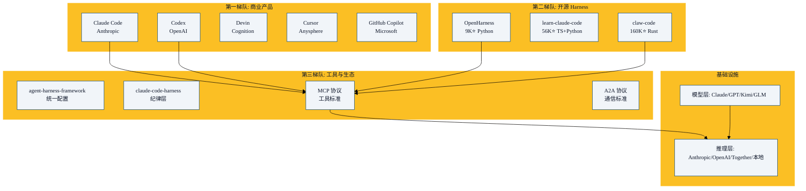

从 2023 到 2026，AI Agent 领域的竞争焦点发生了根本转移。这一章描绘 2026 年的 Harness 生态全景。

## 范式转移：从模型竞争到 Harness 竞争

```
2023: 谁的模型更强？        → GPT-4 vs Claude 2 vs Gemini
2024: 谁的 Agent 更可靠？   → Claude Code vs Devin vs Cursor
2025: 谁的 Harness 更好？   → 工具系统、沙箱、MCP、多Agent
2026: Harness 即产品        → Meta $2B 收购 Manus（买的是 Harness）
```

核心逻辑：
- **模型 commoditizing**：各家模型差距缩小，价格持续下降
- **Harness 成为 moat**：用户感知的不是模型能力，而是"任务完成率"
- **任务完成率由 Harness 决定**：工具丰富度 × 权限安全性 × 上下文管理 × 多 Agent 协作

## 2026 年 Harness 生态图谱



## 关键趋势

### 1. 多 Agent 成为标配

2026 年 2 月，两周内所有主要工具同步发布多 Agent 功能。不是巧合——是 Harness 基础设施成熟后的必然演进。

多 Agent 的核心价值不是"做更多事"，而是**隔离复杂度**。当每个子 Agent 有独立上下文，整体系统可以处理远超单个上下文窗口的复杂度。

### 2. 安全从"建议"到"架构"

```
2023: "请不要删除重要文件"（prompt 里的建议）
2024: 权限规则 deny 列表（Harness 级拦截）
2025: OS 级沙箱（OS 强制执行）
2026: 多模型分类器（独立模型审查 Agent 行为）
```

安全不是一层，是多层。每一层有不同的信任模型和失败模式。深度防御。

### 3. MCP 协议成为标准

截至 2026 年 5 月，MCP 已被 Claude Code、Codex、Cursor、OpenClaw、OpenHarness 等采用。尽管 Google 和 Microsoft 仍在推动自己的协议，但 MCP 的生态势头已经不可逆。

就像 HTTP 之于 Web、SQL 之于数据库——协议标准化带来生态繁荣。

### 4. 从 Prompt Engineering 到 Harness Engineering

```
Prompt Engineering (2023):
  "你是一个专业的 Python 开发者，请遵循 PEP 8..."
  → 说服模型，脆弱，模型版本一变就失效

Harness Engineering (2026):
  - 注入 Python Skill → 领域知识
  - 工具: Read/Write/Bash → 执行能力
  - 权限: 阻止危险操作 → 安全边界
  - MCP: 连接外部服务 → 能力扩展
  → 结构性约束，可靠，与模型版本解耦
```

### 5. 清洁室重写的意义

Claude Code 源码泄露后，社区没有简单地 fork 源码（会被 DMCA），而是通过**清洁室重写**提取架构模式。这证明了：

- 架构模式不受版权保护
- 好的架构可以被学习、复现、改进
- Harness 工程的知识正在民主化

OpenHarness 的 44× 代码压缩比例说明：**理解架构后，你可以用远少于原始的代码实现同样的功能**。

## 谁在什么场景用什么

| 场景 | 推荐 Harness | 原因 |
|------|------------|------|
| 个人编码 | Claude Code | 体验最好，社区最大 |
| 企业编码 | Codex | 沙箱安全，Rust 可靠 |
| 学习 Harness | learn-claude-code | 12 节课从零开始 |
| 自建 Agent | OpenHarness | MIT 协议，可定制 |
| 多渠道助手 | OpenClaw | 25+ 平台支持 |
| 统一配置 | agent-harness-framework | 一次配置多平台输出 |

## 本章小结

- 竞争焦点已从模型转移到 Harness——用户为任务完成率付费，不是为模型付费
- 2026 生态分为三层：商业产品 → 开源 Harness → 工具/协议生态
- 多 Agent、安全架构化、MCP 标准化、Harness Engineering 是四大趋势
- 清洁室重写证明了 Harness 知识可以民主化传播
- 下一章：从规则到环境——Agent 工程的下一个范式转移

---

**系列目录**：
- [第二十四章：添加MCP与多智能体支持](../07-build-your-own/24-adding-mcp-and-multi-agent.md)
- 第二十五章：2026年Harness生态全景 👈 当前位置
- [第二十六章：从规则到环境 —— Agent工程的下一个范式转移](./26-from-rules-to-environment.md) 👉 下一章
- [第二十七章：智能体的未来 —— 自主性、安全性与AGI](./27-future-of-agents.md)

