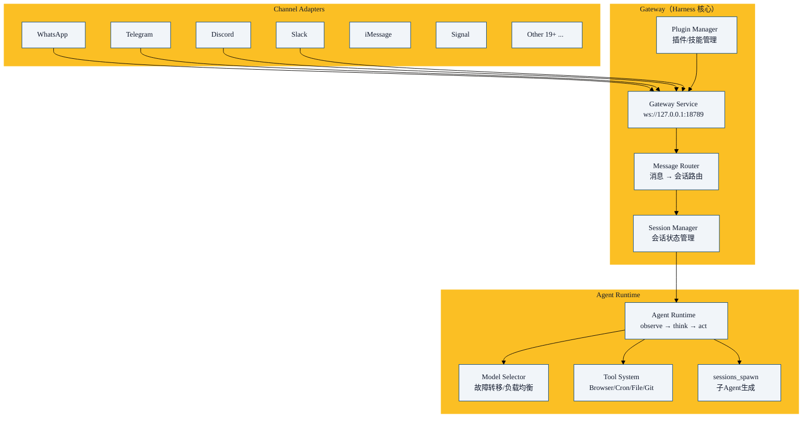

OpenClaw 是一个自托管个人 AI 助手网关，支持 25+ 聊天平台。它的 Harness 架构与 Claude Code/Codex 有本质区别——它面向的是**多渠道消息处理**而非单一编码任务。

> 完整的 OpenClaw 34 章系列请参阅本知识库的 `01-openclaw/blog/` 目录。本章只聚焦其 Harness 架构设计。

## Harness 角色定位

```
Claude Code Harness:    编码 Agent 的操作系统
Codex Harness:          安全沙箱里的编码 Agent 操作系统
OpenClaw Harness:       多渠道 AI 网关的操作系统
```

三者都是 Harness，但服务的 Agent 类型不同。

## 核心架构



## OpenClaw Harness 的独特设计

### 1. Gateway 模式

和 Claude Code 的单用户终端模式不同，OpenClaw 用的是**中心 Gateway**：

```typescript
// Gateway 监听本地 WebSocket
const gateway = new WebSocketServer({ port: 18789 });

gateway.on('connection', (ws) => {
  ws.on('message', async (msg) => {
    const session = sessionManager.getOrCreate(msg.userId, msg.channelType);
    const response = await agentRuntime.process(msg, session);
    ws.send(response);
  });
});
```

Gateway 让所有渠道（WhatsApp, Telegram, Discord...）连接到同一个 Agent 后端。Agent 不关心消息从哪来——这是 Harness 的**接口抽象**。

### 2. sessions_spawn —— 多 Agent 原语

```javascript
// 核心多 Agent 原语
await sessions.spawn({
  role: "code-reviewer",
  instruction: "Review PR #42 for security issues",
  context: { pr_number: 42 },
  tools: ["read_file", "grep", "github_api"],
});
```

这是 OpenClaw Harness 中最具创新性的设计——**一个 API 调用产生一个隔离的子 Agent**。和 Claude Code 的子代理不同，OpenClaw 的子 Agent 可以在不同的聊天渠道中和用户交互。

### 3. 安全模型：配对白名单

```
每个渠道 + 用户 = 一个配对

配对规则:
├── WhatsApp: +86-138xxxx → allow
├── Telegram: @myusername → allow
├── Discord: user#1234 → allow
├── 未配对: → block + 通知管理员
```

和 Claude Code 的 deny→ask→allow 管道不同，OpenClaw 的安全模型是**身份认证驱动**——先确认你是谁，再给访问权。

### 4. 模型故障转移

```
模型调用:
├── 首选: Claude Sonnet 4
├── 故障转移 1: Claude Haiku 4.5
├── 故障转移 2: GPT-4o
└── 故障转移 3: 本地 Ollama
```

这是 Harness 层面的**可用性保障**——Agent 不感知模型切换，Harness 透明处理。

## 三种 Harness 设计哲学对比

| 设计维度 | Claude Code | Codex | OpenClaw |
|---------|------------|-------|----------|
| **服务模式** | 单用户终端 | 单用户终端/TUI | 多用户网关 |
| **主要场景** | 编码 | 编码 | 个人 AI 助手 |
| **安全思路** | 权限管道 | OS 沙箱 | 身份白名单 |
| **多 Agent** | 子代理 (内部) | 子代理 (内部) | sessions_spawn (跨渠道) |
| **扩展机制** | MCP + Plugins | MCP + Plugins + Crates | MCP + Plugins + ClawHub |
| **上下文策略** | auto-inject | auto-inject + SQLite | 会话隔离 |
| **UI 范式** | REPL | TUI | 多渠道消息 |

核心洞察：**同样的四层 Harness 框架（循环-执行-控制-编排），不同的场景导致完全不同的设计选择**。

## 本章小结

- OpenClaw 的 Harness 是一个**Gateway 模式**——中心服务连接多个渠道到同一个 Agent
- `sessions_spawn` 是创新的多 Agent 原语——一个 API 调用产生隔离的子 Agent
- 安全模型是**身份白名单**而非操作权限管道——先认证再授权
- 模型故障转移是 Harness 层面的可用性保障
- 三种 Harness 针对不同场景：Claude Code 偏编码体验，Codex 偏安全模块化，OpenClaw 偏多渠道可达性
- 下一章：开源 Harness 生态全景

---

**系列目录**：
- [第六章：Claude Code的Harness架构剖析](./06-claude-code-harness-architecture.md)
- [第七章：Codex的Harness架构剖析](./07-codex-harness-architecture.md)
- 第八章：OpenClaw的Harness架构 👈 当前位置
- [第九章：开源Harness生态全景](./09-open-source-harness-ecosystem.md) 👉 下一章

