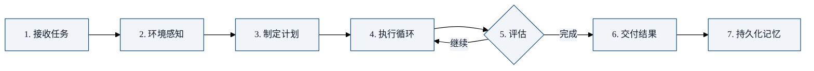

一个 Agent 从接收到用户的任务到完成，经历了什么？这一章追踪 Agent 的完整生命周期。

## 生命周期全景



## 阶段 1：接收任务

用户发起请求：

```
User: 为这个项目添加 GitHub OAuth 登录
```

Harness 在这一阶段做的事：

```python
# 会话初始化
session = {
    "task": "为这个项目添加 GitHub OAuth 登录",
    "context": {
        "cwd": os.getcwd(),
        "git_branch": get_current_branch(),
        "project_type": detect_project_type(),  # "Python/FastAPI"
    },
    "auto_inject": build_auto_inject(),  # CLAUDE.md + rules + git status
    "tools": get_available_tools(),
    "skills": get_skill_list(),  # 仅名称+描述
}
```

## 阶段 2：环境感知

Agent 开始理解自己在哪、有什么：

```
Agent 看到:
  "你在一个 Python/FastAPI 项目中。
   当前分支: main
   相关文件: src/auth.py, src/models/user.py, requirements.txt
   项目规则: 使用 JWT 认证..."
```

Agent 的第一轮推理：

```
Thought: 这是一个 Python FastAPI 项目，需要添加 GitHub OAuth。
我先了解现有的认证代码结构，然后查看依赖是否有 OAuth 库。
我需要读取 src/auth.py 和 requirements.txt。
```

## 阶段 3：制定计划

Agent 生成 TodoWrite：

```markdown
## 为项目添加 GitHub OAuth 登录

1. [pending] 了解现有认证代码结构
2. [pending] 安装 OAuth 依赖 (authlib)
3. [pending] 创建 GitHub OAuth 配置
4. [pending] 实现 OAuth 回调端点
5. [pending] 实现登录/登出路由
6. [pending] 添加前端登录按钮
7. [pending] 写测试
8. [pending] 更新文档
```

**关键**：计划是 Agent 生成的，但用户可以看到并调整（"不要做前端，只做后端"）——这是 Harness 提供的**人机协作界面**。

## 阶段 4：执行循环

Agent 进入核心循环。每一步：

```
Turn N:
  1. Observe: 看到上一步的工具结果
  2. Think:   "auth.py 使用了自定义的 JWT 验证。我需要
               在现有架构上添加 OAuth 流程..."
  3. Act:     调用 Write 工具，修改 auth.py
  4. Feedback: "文件已写入，共修改 45 行"
  
  Context usage: 45%
  
Turn N+1:
  1. Observe: 看到文件修改成功
  2. Think:   "现在需要创建 OAuth 配置..."
  ...
```

每轮消耗 ~15K tokens，auto-inject 确保 Agent 始终知道自己在哪。

## 阶段 5：评估（循环中的判断）

每一轮，Agent 都在评估：

```
评估问题:
  ✅ 任务完成了吗？        → 否 → 继续循环
  ✅ 遇到困难了吗？        → 是 → 调整策略
  ✅ 需要更多信息吗？      → 是 → 读文件/搜索
  ✅ 上下文快满了吗？      → 是 → 触发压缩
  ✅ 达到轮次上限了吗？    → 是 → 交付当前进度
```

对于复杂任务，Agent 可能会**自我修正**：

```
Turn 12: Agent 发现 OAuth 回调 URL 配置错误
  → 回读配置文件
  → 发现 GitHub 要求 https，本地开发是 http
  → 调整: 使用环境变量区分开发/生产环境
```

## 阶段 6：交付结果

Agent 认为任务完成，交付结果：

```
Agent: 已完成 GitHub OAuth 登录的实现。以下是变更摘要：

修改的文件:
  - src/auth.py: 添加了 OAuth 流程
  - src/config.py: 添加了 GitHub OAuth 配置
  - .env.example: 添加了需要的环境变量
  - requirements.txt: 添加了 authlib 依赖

新增文件:
  - src/oauth.py: OAuth 客户端封装
  - tests/test_oauth.py: OAuth 测试

测试结果: 12 passed, 0 failed
```

## 阶段 7：持久化记忆

会话结束后，Agent 将关键经验写入 MEMORY.md：

```markdown
# 新增记忆

## 2026-05-05: 添加 GitHub OAuth
- 认证架构: 在现有 JWT 基础上增加了 OAuth 流程，用户首次
  OAuth 登录后签发 JWT
- 环境变量: GITHUB_CLIENT_ID, GITHUB_CLIENT_SECRET,
  OAUTH_REDIRECT_URI（开发环境为 http://localhost:8000/auth/callback）
- 依赖: authlib>=1.3.0
- 注意事项: GitHub OAuth App 的 callback URL 必须精确匹配，
  开发/生产环境需要分别配置
```

下一次会话，Agent 会自动加载这些记忆。

## 生命周期中的 Harness 介入

在整个生命周期中，Harness 在多个点介入：

| 阶段 | Harness 介入 | 机制 |
|------|------------|------|
| 接收任务 | 注入上下文 | Auto-inject |
| 环境感知 | 提供工具 | Tool System |
| 制定计划 | 结构化计划界面 | TodoWrite |
| 执行循环 | 执行 + 权限检查 | Tool Execute + Permission |
| 评估 | 上下文监控 | Compaction Trigger |
| 交付 | 文件变更清单 | Git Diff Summary |
| 持久化 | 记忆写入 | MEMORY.md |

Agent 是"司机"，但 Harness 提供了**整个驾驶环境**——仪表盘、油门、刹车、安全带。

## 本章小结

- Agent 生命周期：接收 → 感知 → 计划 → 执行 → 评估 → 交付 → 记忆
- 每个阶段都有 Harness 的介入——Agent 自主决策，Harness 提供能力和约束
- TodoWrite 是 Agent 和用户之间的**协作界面**——Agent 制定计划，用户可以调整
- MEMORY.md 让 Agent 具备**跨会话学习能力**
- 下一章：Harness是Agent的操作系统

---

**系列目录**：
- [第十五章：技能系统](../04-deep-dive/15-skills-system.md)
- 第十六章：Agent的生命周期 👈 当前位置
- [第十七章：Harness是Agent的操作系统](./17-harness-as-os.md) 👉 下一章
- [第十八章：Agent-Harness协作模式](./18-agent-harness-collaboration.md)

