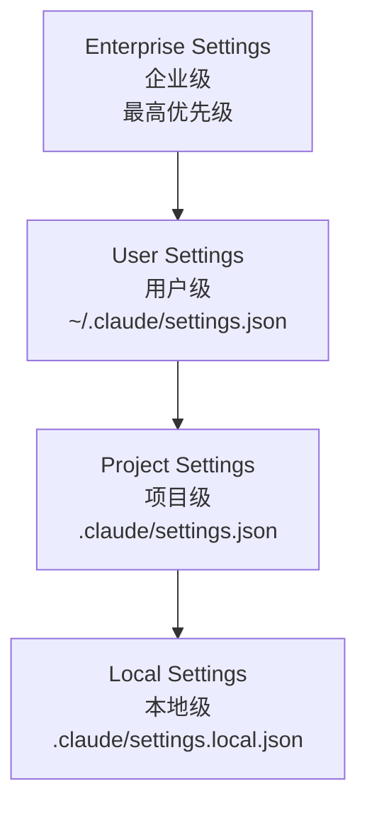
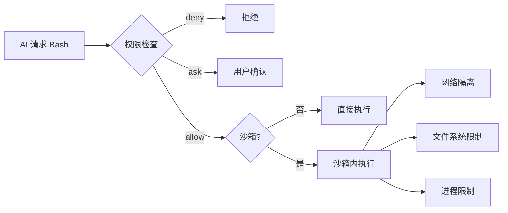

# 第三章：权限模型 —— ask/allow/deny 与沙箱

想象这个场景：你让 Claude Code 帮你重构代码，它执行了 `rm -rf node_modules` 来"清理"——然后你发现它删掉了整个项目目录。这不是科幻，这是权限没有配置好的真实后果。

Claude Code 能执行 Bash 命令、写文件、搜索网络——这些能力非常强大，但也需要管控。权限模型就是回答一个问题：**AI 可以做什么，不可以做什么？**

## 三种权限模式

Claude Code 有三种权限决策：

| 决策 | 含义 | 用户体验 |
|------|------|---------|
| `ask` | 每次都问用户 | 弹出确认提示 |
| `allow` | 自动允许 | 无提示直接执行 |
| `deny` | 拒绝执行 | 操作被阻止 |

### 默认行为

默认情况下，Claude Code 采用**最小信任**原则：

- **Read/Grep/Glob**：自动允许（只读安全）
- **Write/Edit**：需要确认（修改有风险）
- **Bash**：需要确认（命令有风险）
- **WebSearch/WebFetch**：需要确认（网络有风险）

## 设置层级

权限配置分布在三个层级，优先级从高到低：



| 层级 | 文件位置 | 作用域 | 典型用途 |
|------|---------|--------|---------|
| Enterprise | managed-settings.json | 全公司 | 安全策略、禁用绕过 |
| User | ~/.claude/settings.json | 当前用户 | 个人偏好、常用工具 |
| Project | .claude/settings.json | 当前项目 | 项目特定规则 |
| Local | .claude/settings.local.json | 当前项目（不提交） | 个人覆盖 |

**高优先级可以收紧权限，但不能放松企业级限制。**

## 权限配置示例

### 宽松模式（settings-lax.json）

源码中的宽松配置，适合个人开发：

```json
{
  "permissions": {
    "disableBypassPermissionsMode": "disable",
    "deny": [
      "WebSearch",
      "WebFetch"
    ]
  },
  "strictKnownMarketplaces": []
}
```

关键点：
- 禁用了 `--dangerously-skip-permissions` 标志
- 拒绝了 WebSearch 和 WebFetch
- 不限制插件市场来源

### 严格模式（settings-strict.json）

源码中的严格配置，适合团队/企业：

```json
{
  "permissions": {
    "disableBypassPermissionsMode": "disable",
    "ask": [
      "Bash"
    ],
    "deny": [
      "WebSearch",
      "WebFetch"
    ]
  },
  "allowManagedPermissionRulesOnly": true,
  "allowManagedHooksOnly": true,
  "strictKnownMarketplaces": []
}
```

比宽松模式多了：
- `ask: ["Bash"]` — 每个 Bash 命令都要确认
- `allowManagedPermissionRulesOnly: true` — 只有企业级可以定义 allow/ask/deny
- `allowManagedHooksOnly: true` — 只有企业级可以定义钩子

### 沙箱模式（settings-bash-sandbox.json）

最严格的配置，Bash 命令在沙箱中运行：

```json
{
  "permissions": {
    "ask": ["Bash"]
  },
  "allowManagedPermissionRulesOnly": true,
  "sandbox": {
    "autoAllowBashIfSandboxed": false,
    "network": {
      "allowUnixSockets": [],
      "allowAllUnixSockets": false,
      "allowLocalBinding": false,
      "allowedDomains": [],
      "httpProxyPort": null,
      "socksProxyPort": null
    },
    "enableWeakerNestedSandbox": false
  }
}
```

沙箱限制：
- **网络隔离**：禁止所有出站网络连接
- **Unix Socket**：默认禁止
- **本地端口绑定**：禁止
- **代理**：未配置
- **嵌套沙箱**：不允许降级

## Bash 工具权限细化

Bash 权限可以按命令前缀控制：

```json
{
  "permissions": {
    "allow": [
      "Bash(git:*)",      // 允许所有 git 命令
      "Bash(npm test:*)"  // 允许 npm test
    ],
    "deny": [
      "Bash(rm -rf:*)"    // 拒绝 rm -rf
    ]
  }
}
```

格式：`Bash(命令前缀:*)`，支持通配符。

### 常见配置模式

```json
{
  "permissions": {
    "allow": [
      "Bash(git:*)",
      "Bash(npm:*)",
      "Bash(node:*)",
      "Bash(cargo:*)",
      "Read",
      "Grep",
      "Glob"
    ],
    "ask": [
      "Write",
      "Edit"
    ],
    "deny": [
      "Bash(rm -rf:*)",
      "Bash(sudo:*)",
      "Bash(curl|wget:*)"
    ]
  }
}
```

## --dangerously-skip-permissions

有一个特殊标志可以跳过所有权限检查：

```bash
claude --dangerously-skip-permissions
```

这个名字就在告诉你：**不要用**。它跳过所有安全检查，AI 可以执行任何操作。

在企业配置中，可以通过 `disableBypassPermissionsMode: "disable"` 永久禁用这个标志。

## 沙箱机制

沙箱是 Bash 工具的额外保护层，限制命令的系统能力：



### 沙箱网络配置

```json
{
  "sandbox": {
    "network": {
      "allowedDomains": ["api.github.com", "registry.npmjs.org"],
      "allowLocalBinding": true,
      "allowUnixSockets": ["/var/run/docker.sock"],
      "httpProxyPort": 8080
    }
  }
}
```

- `allowedDomains`：白名单域名
- `allowLocalBinding`：允许绑定本地端口
- `allowUnixSockets`：允许的 Unix Socket
- `httpProxyPort`/`socksProxyPort`：代理配置

### 沙箱注意事项

- 沙箱**只适用于 Bash 工具**，不影响 Read、Write、WebSearch 等
- 沙箱不适用于钩子和内部命令
- `autoAllowBashIfSandboxed: true` 可以让沙箱内的 Bash 自动允许（因为已经在安全环境中了）

## 企业级管控关键字段

| 字段 | 作用 | 只在 enterprise 生效 |
|------|------|---------------------|
| `disableBypassPermissionsMode` | 禁用 `--dangerously-skip-permissions` | 是 |
| `allowManagedPermissionRulesOnly` | 只允许企业级定义权限规则 | 是 |
| `allowManagedHooksOnly` | 只允许企业级定义钩子 | 是 |
| `strictKnownMarketplaces` | 限制插件市场来源 | 是 |

这些字段如果出现在用户/项目级配置中，会被忽略。只有企业级配置才能设置这些限制。

## 实操：配置你的权限

### 选哪个配置？一个决策流程

```
你是个人开发者还是团队？
├─ 个人
│  └─ 项目是公开的还是私有的？
│     ├─ 公开/实验性 → 宽松模式（省心）
│     └─ 私有/含密钥 → 个人推荐配置（平衡）
├─ 团队
│  └─ 有安全合规要求吗？
│     ├─ 有 → 严格模式 + 沙箱
│     └─ 没有 → 严格模式（够用）
└─ 企业
   └─ 需要禁用 --dangerously-skip-permissions？
      ├─ 是 → 企业级配置（管控字段生效）
      └─ 否 → 严格模式即可
```

### 个人开发（推荐起步配置）

在 `~/.claude/settings.json` 中：

```json
{
  "permissions": {
    "allow": [
      "Read",
      "Grep",
      "Glob",
      "Bash(git:*)",
      "Bash(npm:*)",
      "Bash(node:*)"
    ],
    "deny": [
      "Bash(rm -rf:*)",
      "Bash(sudo:*)"
    ]
  }
}
```

### 团队项目

在 `.claude/settings.json` 中（提交到 Git）：

```json
{
  "permissions": {
    "allow": [
      "Bash(npm test:*)",
      "Bash(npm run lint:*)",
      "Bash(npm run build:*)"
    ]
  }
}
```

### 企业级（管理员配置）

在 managed-settings.json 中：

```json
{
  "permissions": {
    "disableBypassPermissionsMode": "disable",
    "deny": [
      "WebSearch",
      "WebFetch"
    ]
  },
  "allowManagedPermissionRulesOnly": true,
  "allowManagedHooksOnly": true,
  "sandbox": {
    "network": {
      "allowedDomains": ["api.github.com"]
    }
  }
}
```

## 本章小结

**一句话记住**：权限模型 = 告诉 AI "能做什么、不能做什么、不确定时问我"。

**决策规则**：
- 个人开发 → 用"个人推荐配置"起步，按需放松
- 团队项目 → `allow` 只放只读工具 + 构建/测试命令
- 企业 → 严格模式 + 沙箱，管控字段只在这里生效

**最容易踩的坑**：`allow` 里写了 `Bash` 而不是 `Bash(git:*)`——前者等于给 AI 完整的 shell 权限，后者才限定到 git 命令。

**现在就试**：在 `~/.claude/settings.json` 里加上"个人推荐配置"，然后让 AI 执行 `Bash(rm -rf /tmp/test)`，观察权限拦截效果。

👉 接下来我们深入斜杠命令系统

---

**系列目录**：
- [第一章：Claude Code 是什么 —— 终端里的 AI 编码伙伴](./01-what-is-claude-code.md)
- [第二章：安装与上手 —— 从 curl 到第一个命令](./02-installation-setup.md)
- 第三章：权限模型 —— ask/allow/deny 与沙箱 👈 当前位置
- [第四章：斜杠命令 —— 自定义提示词的标准化方法](./../02-core/04-slash-commands.md) 👉 下一章
- [第五章：Hooks 系统 —— 事件驱动的自动化引擎](./../02-core/05-hooks-system.md)
- [第六章：两种钩子对比 —— Prompt 钩子 vs Command 钩子](./../02-core/06-prompt-hooks-vs-command-hooks.md)
- [第七章：插件架构 —— 目录结构、自动发现与清单](./../03-plugins/07-plugin-architecture.md)
- [第八章：插件命令开发 —— frontmatter、动态参数、bash 执行](./../03-plugins/08-plugin-commands.md)
- [第九章：插件代理开发 —— 触发机制、系统提示词设计](./../03-plugins/09-plugin-agents.md)
- [第十章：插件技能开发 —— 渐进式披露与 SKILL.md](./../03-plugins/10-plugin-skills.md)
- [第十一章：插件钩子开发 —— hooks.json 与可移植路径](./../03-plugins/11-plugin-hooks.md)
- [第十二章：MCP 集成 —— stdio/SSE/HTTP/WebSocket 四种模式](./../03-plugins/12-mcp-integration.md)
- [第十三章：插件配置 —— .local.md 模式与 YAML frontmatter](./../03-plugins/13-plugin-settings.md)
- [第十六章：commit-commands —— 最简命令插件](./../04-plugin-deep-dives/16-commit-commands.md)
- [第十七章：security-guidance —— 安全钩子实战](./../04-plugin-deep-dives/17-security-guidance.md)
- [第十八章：code-review —— 多代理并行审查](./../04-plugin-deep-dives/18-code-review.md)
- [第十九章：feature-dev —— 7 阶段功能开发工作流](./../04-plugin-deep-dives/19-feature-dev.md)
- [第二十章：hookify —— 零代码创建钩子规则](./../04-plugin-deep-dives/20-hookify.md)
- [第二十一章：plugin-dev —— 用插件开发插件的元工具](./../04-plugin-deep-dives/21-plugin-dev-toolkit.md)
- [第二十二章：设置层级 —— 企业/用户/项目三层配置](./../05-enterprise/22-settings-hierarchy.md)
- [第二十三章：MDM 部署 —— Jamf/Intune/Group Policy 推送](./../05-enterprise/23-mdm-deployment.md)
- [第二十四章：Marketplace —— 插件发布与分发](./../05-enterprise/24-marketplace.md)
- [第二十五章：多代理模式 —— 并行代理编排与工作流](./../06-advanced/25-multi-agent-patterns.md)
- [第二十六章：Hookify 进阶 —— 多条件规则与操作符](./../06-advanced/26-hookify-advanced-rules.md)
- [第二十七章：从零构建完整插件 —— 端到端实战](./../06-advanced/27-building-complete-plugin.md)

