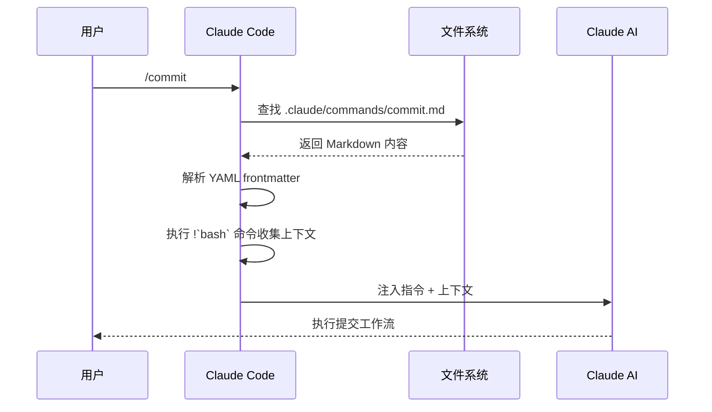
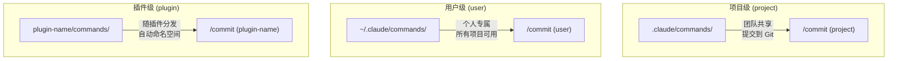
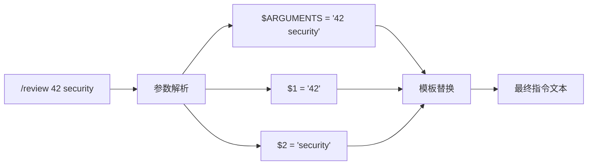
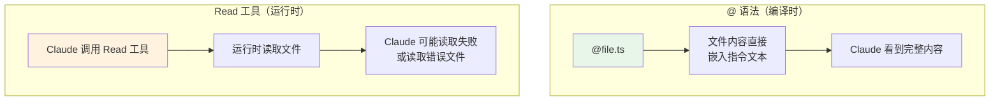
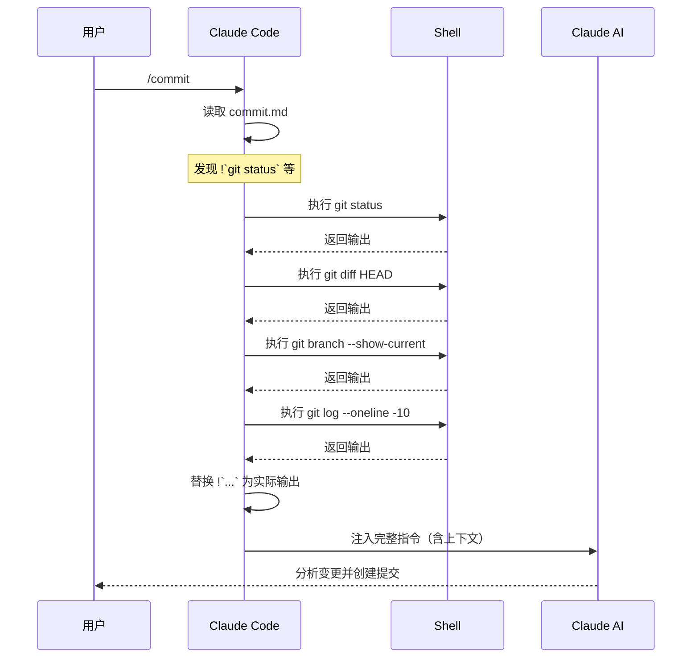
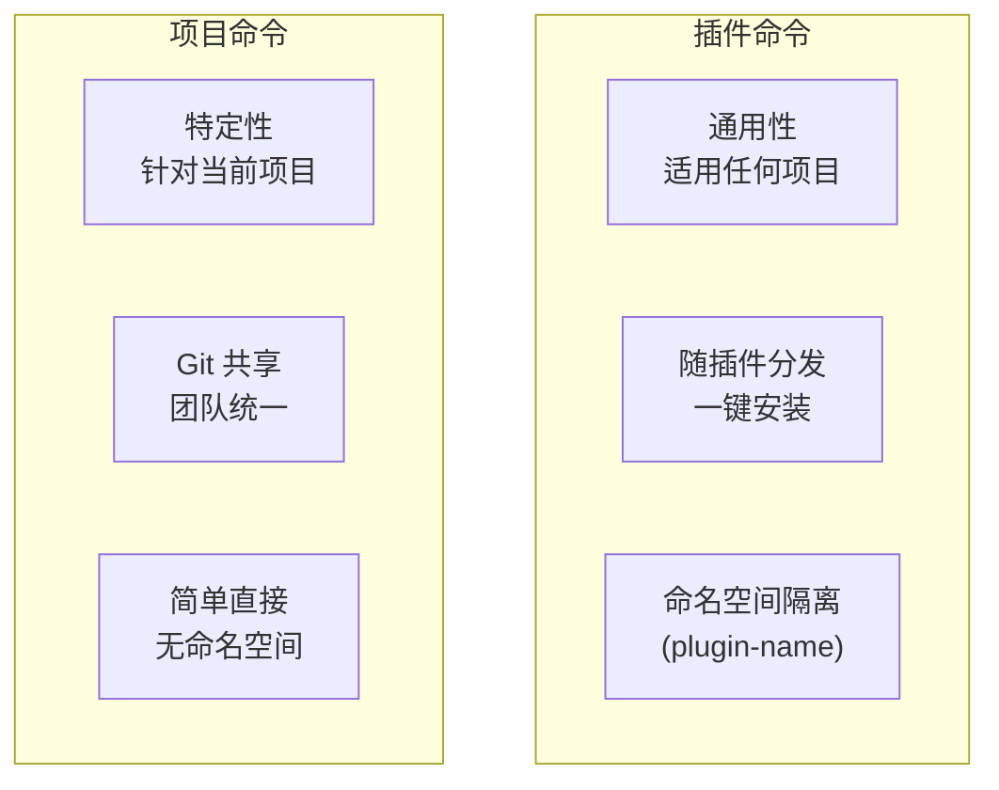
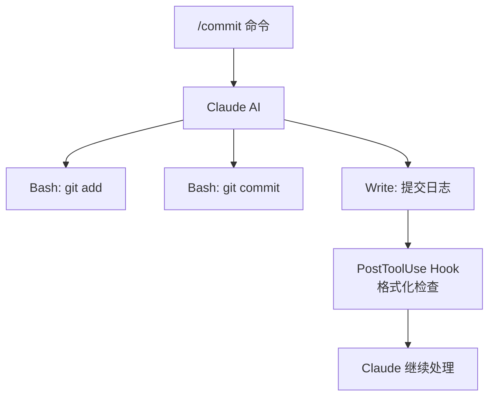

你每天都在重复同样的指令："帮我提交代码"、"审查这个 PR"、"按照规范重构"……每次都要打一长串自然语言，效率低下而且结果不稳定。

**斜杠命令（Slash Commands）** 就是解决这个问题的方案：把你最常用的操作封装成一条标准命令，输入 `/commit` 就能自动完成一整套 git 工作流，输入 `/review` 就能启动代码审查。

但斜杠命令的本质是什么？**它们不是给用户看的消息，而是给 Claude 的指令。** 理解这一点，是掌握斜杠命令的关键。

## 什么是斜杠命令

斜杠命令是 Markdown 文件，存放在特定目录下，Claude Code 自动发现并注册。用户输入 `/command-name` 时，Claude Code 读取对应的 Markdown 文件内容，将其作为指令注入到对话上下文中。

换句话说：

- **不是** 用户界面的快捷方式
- **不是** 脚本或可执行文件
- **是** 给 Claude 的结构化指令文档
- **是** 把提示词工程（prompt engineering）标准化、可复用化



核心洞察：**斜杠命令 = 标准化的 prompt + 自动化的上下文收集**。它把"告诉 AI 做什么"和"给 AI 什么信息"统一到了一个文件里。

## 命令存放位置

Claude Code 从三个位置发现命令，每个位置有不同的作用域和标签：



| 位置 | 路径 | 标签 | 作用域 | Git |
|------|------|------|--------|-----|
| 项目 | `.claude/commands/` | `(project)` | 当前项目 | 可提交，团队共享 |
| 个人 | `~/.claude/commands/` | `(user)` | 所有项目 | 不提交，个人使用 |
| 插件 | `plugin-name/commands/` | `(plugin-name)` | 安装了该插件的项目 | 随插件分发 |

当用户输入 `/` 时，Claude Code 会列出所有可用命令，并标注来源：

```
/commit (project)        → 来自 .claude/commands/commit.md
/review (user)           → 来自 ~/./.claude/commands/review.md
/build (commit-commands) → 来自 commit-commands 插件
```

**同名命令的优先级**：项目级 > 用户级 > 插件级。这意味着你可以在项目中覆盖个人或插件命令的行为。

## 基本格式

斜杠命令就是一个 Markdown 文件，可选包含 YAML frontmatter：

```markdown
---
description: Create a git commit
allowed-tools: Bash(git add:*), Bash(git status:*), Bash(git commit:*)
---

## Context

- Current git status: !`git status`
- Current git diff: !`git diff HEAD`

## Your task

Based on the above changes, create a single git commit.
```

### 最简命令

没有 frontmatter 的命令也可以工作：

```markdown
<!-- .claude/commands/hello.md -->

向用户问好，并简要介绍当前项目的目录结构。
```

输入 `/hello` 后，Claude 就会执行这条简单指令。

### 完整结构

一个完整的命令通常包含：

```markdown
---
description: 命令描述，显示在 /help 中
allowed-tools: 限制可用工具
model: 指定模型
argument-hint: 参数提示
disable-model-invocation: 禁止程序调用
---

## Context

自动收集的上下文信息（bash 执行结果、文件引用等）

## Instructions

给 Claude 的核心指令

## Constraints

约束和限制条件

## Examples

可选的示例
```

## YAML Frontmatter 详解

Frontmatter 是命令的"元数据层"，控制命令的行为和约束。

### description

命令的简短描述，显示在 `/` 命令列表中：

```yaml
---
description: Create a git commit with conventional commit message
---
```

好的 description 应该：动词开头 + 说明输出格式或约束。

### allowed-tools

**这是最重要的安全字段。** 它限制命令执行时 Claude 可以使用哪些工具：

```yaml
---
allowed-tools: Bash(git add:*), Bash(git status:*), Bash(git commit:*)
---
```

格式规则：

- 用逗号分隔多个工具
- `Bash(前缀:*)` 限制 Bash 命令的前缀
- 只写工具名（如 `Read`）允许该工具的所有操作
- 未列出的工具**不可用**

实际效果：当命令指定了 `allowed-tools`，Claude 只能使用列表中的工具。这比全局权限配置更精细 —— 同一个项目里，`/commit` 只能用 git 命令，`/review` 只能读代码。

```yaml
# /commit: 只允许 git 操作
allowed-tools: Bash(git add:*), Bash(git status:*), Bash(git commit:*)

# /review: 只允许读取，不允许修改
allowed-tools: Read, Grep, Glob

# /deploy: 允许特定部署命令
allowed-tools: Bash(npm run build:*), Bash(npm run deploy:*)
```

### model

指定执行命令时使用的模型：

```yaml
---
model: sonnet
---
```

可选值：

| 值 | 模型 | 适用场景 |
|----|------|---------|
| `sonnet` | Claude Sonnet | 日常编码任务（默认） |
| `opus` | Claude Opus | 需要深度推理的复杂任务 |
| `haiku` | Claude Haiku | 简单快速的轻量任务 |

使用场景：代码审查需要深度推理，指定 `opus`；简单的格式化任务，指定 `haiku` 节省成本。

### argument-hint

文档化命令期望的参数格式：

```yaml
---
argument-hint: "[pr-number] [priority]"
---
```

这不会解析参数，只是告诉用户应该传什么参数。显示在命令列表中，类似于函数签名。

### disable-model-invocation

布尔值，阻止程序化调用：

```yaml
---
disable-model-invocation: true
---
```

默认情况下，其他命令或代理可以通过内部 API 调用你的命令。设置 `disable-model-invocation: true` 后，命令只能由用户手动触发。

适用场景：需要人工确认的危险操作、涉及安全审查的流程。

## 动态参数

命令可以接收用户输入的参数，这是实现可复用命令的关键。

### $ARGUMENTS

获取所有参数作为一个完整字符串：

```markdown
---
description: Search codebase for a pattern
---

Search the entire codebase for: $ARGUMENTS

Provide:
1. All matching files and line numbers
2. Context around each match
3. A summary of patterns found
```

使用方式：`/search authentication middleware`

此时 `$ARGUMENTS` = `"authentication middleware"`

### 位置参数 `$1`, `$2`, `$3`

获取按空格分割的位置参数：

```markdown
---
description: Review a pull request
argument-hint: "[pr-number] [focus-area] [severity]"
---

Review pull request #$1 with focus on $2 and $3 severity.

PR number: $1
Focus area: $2
Severity: $3
```

使用方式：`/review 42 security high`

此时 `$1` = `"42"`，`$2` = `"security"`，`$3` = `"high"`

### 混合使用

```markdown
---
description: Fix an issue
argument-hint: "[issue-number] [description]"
---

Fix issue #$1: $2

Additional context from remaining arguments: $ARGUMENTS
```

使用方式：`/fix 123 login-bug urgent priority`

- `$1` = `"123"`
- `$2` = `"login-bug"`
- `$ARGUMENTS` = `"123 login-bug urgent priority"`

> **注意**：`$1`、`$2` 等是 `$ARGUMENTS` 按空格分割后的结果。如果参数包含空格，需要用引号包裹。

### 参数传递流程



## 文件引用 @ 语法

命令可以用 `@` 语法将文件内容直接注入到指令中，给 Claude 提供精确的上下文。

### 引用参数指定的文件

```markdown
---
description: Review a specific file
argument-hint: "[file-path]"
---

Review the following file for code quality, security issues, and best practices:

@$1
```

使用方式：`/review-file src/auth/login.ts`

Claude 会读取 `src/auth/login.ts` 的内容，将其作为指令上下文的一部分。

### 引用已知文件

```markdown
---
description: Analyze project dependencies
---

Based on the package.json below, analyze the project's dependency health:

@package.json

Check for:
1. Outdated dependencies
2. Security vulnerabilities
3. Unnecessary dependencies
4. Missing dev dependencies
```

`@package.json` 会自动解析为项目根目录下的 `package.json` 文件。

### 多文件引用

```markdown
---
description: Compare API implementations
argument-hint: "[file-a] [file-b]"
---

Compare the API implementations in these two files:

File A: @$1
File B: @$2

Highlight:
- Differences in error handling
- API design patterns used
- Performance implications
```

### @ 语法 vs Read 工具



`@` 语法的优势：**在指令注入时就完成文件读取**，不消耗 Claude 的工具调用次数，也不受 `allowed-tools` 限制。

## Bash 执行 !`command` 语法

这是斜杠命令最强大的特性之一：在 Claude 处理指令之前，先执行 Bash 命令收集上下文。

### 基本语法

用 !\`command\` 包裹 Bash 命令：

```markdown
Current branch: !`git branch --show-current`
Recent commits: !`git log --oneline -5`
```

在 Claude 接收到指令时，这些 !\`...\` 已经被替换为命令的实际输出：

```markdown
Current branch: feature/slash-commands
Recent commits: a3f2b1c feat: add slash commands blog
               8e7d4a2 fix: update navigation links
               2c1f9e3 docs: add permission model chapter
```

### 实战：commit 命令的上下文收集

来自源码 `commit-commands/commands/commit.md` 的真实示例：

```markdown
---
allowed-tools: Bash(git add:*), Bash(git status:*), Bash(git commit:*)
description: Create a git commit
---

## Context

- Current git status: !`git status`
- Current git diff (staged and unstaged changes): !`git diff HEAD`
- Current branch: !`git branch --show-current`
- Recent commits: !`git log --oneline -10`

## Your task

Based on the above changes, create a single git commit.
```

注意四个 Bash 命令各自收集不同维度的上下文：

| 命令 | 收集的信息 | 为什么需要 |
|------|-----------|-----------|
| `git status` | 哪些文件被修改 | 确定提交范围 |
| `git diff HEAD` | 具体变更内容 | 撰写准确的提交消息 |
| `git branch --show-current` | 当前分支名 | 判断提交上下文 |
| `git log --oneline -10` | 最近提交风格 | 保持提交消息一致性 |

### 执行时机



**关键点**：Bash 命令在 Claude AI 处理指令**之前**执行。这意味着：

1. Bash 输出是"事实"，不是 AI 的推测
2. 即使 AI 没有执行 Bash 的权限，上下文仍然可用
3. 多条 Bash 命令按顺序执行，输出互不影响

### 安全考虑

Bash 执行使用系统的 Bash 环境，需要注意：

- 命令在用户的工作目录中执行
- 可以访问环境变量和 PATH
- 执行失败不会中断命令，而是保留原始 !\`command\` 文本
- 复杂命令建议用脚本文件替代

## 命令组织方式

### 平铺结构

最简单的组织方式，所有命令直接放在 `commands/` 目录下：

```
.claude/commands/
├── commit.md       → /commit (project)
├── review.md       → /review (project)
├── test.md         → /test (project)
└── deploy.md       → /deploy (project)
```

适合 5 个以内的命令。

### 命名空间结构

用子目录创建命名空间，避免命令名冲突：

```
.claude/commands/
├── ci/
│   ├── build.md    → /build (project:ci)
│   ├── test.md     → /test (project:ci)
│   └── deploy.md   → /deploy (project:ci)
├── git/
│   ├── commit.md   → /commit (project:git)
│   └── pr.md       → /pr (project:git)
└── review/
    ├── code.md     → /code (project:review)
    └── security.md → /security (project:review)
```

命令的标签会包含命名空间：`/build (project:ci)` 而非 `/build (project)`。

### 命名最佳实践

| 建议 | 示例 | 原因 |
|------|------|------|
| 使用动词 | `/commit`, `/review`, `/deploy` | 命令是动作，不是名词 |
| 简短明确 | `/commit` 而非 `/create-git-commit` | 减少输入，提高效率 |
| 命名空间分组 | `ci/build`, `git/commit` | 避免冲突，语义清晰 |
| 一致风格 | 全部用 kebab-case | 团队统一，降低认知负担 |

## 插件命令

插件中的命令遵循相同格式，但有额外的规则。

### 自动发现

插件的 `commands/` 目录下的 Markdown 文件自动注册为命令：

```
my-plugin/
├── .claude-plugin/
│   └── plugin.json
└── commands/
    ├── build.md    → /build (my-plugin)
    └── deploy.md   → /deploy (my-plugin)
```

插件命令自动带有插件名作为命名空间，不会与其他命令冲突。

### 可移植路径

插件命令中使用 `${CLAUDE_PLUGIN_ROOT}` 引用插件内部资源：

```markdown
---
description: Build the project using plugin config
---

Read the build configuration from:

@${CLAUDE_PLUGIN_ROOT}/config/build.json

Then execute the build steps defined in the configuration.
```

为什么需要这个？因为插件可能安装在不同位置：

- 本地开发：`~/plugins/my-plugin/`
- 全局安装：`~/.claude/plugins/my-plugin/`
- Marketplace：`~/.claude/marketplace/my-plugin/`

`${CLAUDE_PLUGIN_ROOT}` 在运行时解析为实际安装路径，确保文件引用始终有效。

### 插件命令 vs 项目命令



选择原则：

- **项目特有**的工作流 → 项目命令（如特定部署流程）
- **通用**的开发工作流 → 插件命令（如 git 提交、代码审查）
- **个人偏好**的辅助工具 → 用户命令（如个性化快捷操作）

## 多组件协作

斜杠命令不是孤岛，它可以和其他扩展组件协作。

### 命令启动代理

命令可以指示 Claude 启动专门的代理：

```markdown
---
description: Full code review with security analysis
allowed-tools: Read, Grep, Glob, Agent
---

Perform a comprehensive code review of @$1.

Launch the following agents in parallel:
1. Code quality reviewer - check for bugs and code smells
2. Security reviewer - check for vulnerabilities
3. Performance reviewer - check for performance issues

Aggregate all findings into a single report with severity levels.
```

### 命令引用技能

命令可以引用技能，让 Claude 使用特定领域知识：

```markdown
---
description: Build a React component
---

Build a React component following the patterns in the `frontend-design` skill.

Requirements: $ARGUMENTS

Make sure to follow the component structure, styling, and testing
patterns documented in the skill.
```

### 命令与钩子协同

命令的执行可以触发钩子。例如，命令中让 Claude 写文件，会触发 `PostToolUse` 钩子进行格式化或安全检查：



### 完整协作示例

```markdown
---
description: End-to-end feature development
allowed-tools: Read, Grep, Glob, Write, Edit, Bash(git:*), Agent
model: sonnet
argument-hint: "[feature-description]"
---

## Context

- Project structure: !`find . -type f -name "*.ts" | head -20`
- Current branch: !`git branch --show-current`
- Recent changes: !`git diff HEAD --stat`

## Workflow

1. Use the `planner` agent to create an implementation plan for: $ARGUMENTS
2. Write tests first (TDD approach)
3. Implement the feature
4. Launch `code-reviewer` agent for review
5. Commit with conventional commit format

## Constraints

- Follow project coding standards in CLAUDE.md
- Maintain test coverage above 80%
- No security vulnerabilities (security-reviewer will check)
```

## 真实案例解析

### 案例 1：极简提交命令

来自 `commit-commands/commands/commit.md`：

```markdown
---
allowed-tools: Bash(git add:*), Bash(git status:*), Bash(git commit:*)
description: Create a git commit
---

## Context

- Current git status: !`git status`
- Current git diff (staged and unstaged changes): !`git diff HEAD`
- Current branch: !`git branch --show-current`
- Recent commits: !`git log --oneline -10`

## Your task

Based on the above changes, create a single git commit.
```

设计亮点：

- **最小权限**：只允许 `git add`、`git status`、`git commit`，不能执行其他命令
- **自动上下文**：4 个 Bash 命令收集所有必要信息
- **风格一致性**：`git log --oneline -10` 让 Claude 了解团队提交风格
- **简洁指令**：一句话说明任务，上下文已经足够

### 案例 2：完整工作流命令

假设的项目级命令 `.claude/commands/pr-review.md`：

```markdown
---
description: Review a pull request with multi-agent analysis
allowed-tools: Read, Grep, Glob, Bash(git:*), Bash(gh:*)
argument-hint: "[pr-number]"
model: opus
---

## Context

- PR details: !`gh pr view $1`
- PR diff: !`gh pr diff $1`
- Changed files: !`gh pr diff $1 --name-only`
- CI status: !`gh pr checks $1`

## Review Process

1. Analyze the diff for code quality issues
2. Check for security vulnerabilities
3. Verify test coverage for new code
4. Validate API contract changes
5. Check for performance regressions

## Output Format

Provide a structured review with:
- CRITICAL: Must fix before merge
- HIGH: Should fix before merge
- MEDIUM: Consider fixing
- LOW: Optional suggestions

End with a merge recommendation: APPROVE, WARN, or BLOCK.
```

这个命令体现了斜杠命令的完整能力：

- `argument-hint` 引导用户传入 PR 编号
- `$1` 动态引用参数
- `model: opus` 使用最强推理模型
- `allowed-tools` 精确控制权限范围
- 4 个 `!\`...\`` 命令从 GitHub CLI 收集上下文
- 结构化的输出格式要求

### 案例 3：个人快捷命令

`~/.claude/commands/explain.md`：

```markdown
---
description: Explain code with diagrams
argument-hint: "[file-path]"
---

Explain the code in @$1 using:
1. A brief natural language summary
2. A mermaid flowchart showing the control flow
3. Key design patterns identified
4. Potential improvements

Use Chinese for the explanation, with English technical terms.
```

这是个人命令的典型用法：定制化的输出风格，跨项目可用。

## 命令设计原则

### 1. 最小权限原则

```yaml
# 好：只允许必要的工具
allowed-tools: Bash(git add:*), Bash(git status:*), Bash(git commit:*)

# 坏：给所有权限
allowed-tools: Bash
```

### 2. 自动上下文收集

让命令自己收集信息，而不是依赖用户手动提供：

```markdown
# 好：自动收集
- Current branch: !`git branch --show-current`
- Recent commits: !`git log --oneline -5`

# 坏：让用户手动说明
Please tell me the current branch and recent commits.
```

### 3. 明确输出格式

告诉 Claude 你期望什么样的输出：

```markdown
# 好：结构化要求
Provide findings in this format:
| Severity | File | Line | Issue | Suggestion |
|----------|------|------|-------|------------|

# 坏：模糊要求
Review the code and tell me what you think.
```

### 4. 适度抽象

```markdown
# 好：通用可复用
Review the file @$1 for $2 issues.

# 坏：过度特定
Review the file src/auth/login.ts for SQL injection issues.
```

## 常见陷阱

| 陷阱 | 问题 | 解决方案 |
|------|------|---------|
| 命令太长 | 指令过于详细，Claude 反而迷失 | 保持指令简洁，让上下文说话 |
| 权限过宽 | `allowed-tools: Bash` 等于没限制 | 按前缀精确控制 |
| 忽略 Bash 错误 | 命令执行失败但未处理 | 考虑备选上下文方案 |
| 硬编码路径 | `@/home/user/project/...` | 使用相对路径或 `@$1` |
| 参数未校验 | `$1` 可能为空 | 在指令中说明参数为空时的行为 |

## 本章小结

**一句话记住**：斜杠命令 = Markdown 文件 + YAML frontmatter，本质是给 Claude 的结构化指令。不是脚本，不是快捷方式，而是标准化的 prompt engineering。

**决策规则**：
- 项目特有工作流 → `.claude/commands/`（团队共享）
- 个人常用操作 → `~/.claude/commands/`（跨项目可用）
- 通用可分发工具 → 插件 `commands/`（自动命名空间）
- 需要上下文 → 用 `!\`command\`` 提前收集，不要让 AI 运行时猜
- 涉及危险操作 → 用 `allowed-tools` 限定权限，不要给 `Bash`

**最容易踩的坑**：命令里写了一大段指令但没提供上下文——AI 没有当前 diff、没有分支信息，只能凭空猜测。记住 commit.md 的设计：4 个 `!\`...\`` 收集上下文，指令只需要一句话。

**现在就试**：在 `.claude/commands/` 下创建一个 `review.md`，用 `!\`git diff HEAD\`` 收集变更，加上 `allowed-tools: Read, Grep, Glob`，然后 `/review` 感受自动化审查。

👉 接下来我们深入 Hooks 系统

---

**系列目录**：
- [第一章：Claude Code 是什么 —— 终端里的 AI 编码伙伴](../01-intro/01-what-is-claude-code.md)
- [第二章：安装与上手 —— 从 curl 到第一个命令](../01-intro/02-installation-setup.md)
- [第三章：权限模型 —— ask/allow/deny 与沙箱](../01-intro/03-permission-model.md)
- 第四章：斜杠命令 —— 自定义提示词的标准化方法 👈 当前位置
- [第五章：Hooks 系统 —— 事件驱动的自动化引擎](./05-hooks-system.md) 👉 下一章
- [第六章：两种钩子对比 —— Prompt 钩子 vs Command 钩子](./06-prompt-hooks-vs-command-hooks.md)
- [第七章：插件架构 —— 目录结构、自动发现与清单](../03-plugins/07-plugin-architecture.md)
- [第八章：插件命令开发 —— frontmatter、动态参数、bash 执行](../03-plugins/08-plugin-commands.md)
- [第九章：插件代理开发 —— 触发机制、系统提示词设计](../03-plugins/09-plugin-agents.md)
- [第十章：插件技能开发 —— 渐进式披露与 SKILL.md](../03-plugins/10-plugin-skills.md)
- [第十一章：插件钩子开发 —— hooks.json 与可移植路径](../03-plugins/11-plugin-hooks.md)
- [第十二章：MCP 集成 —— stdio/SSE/HTTP/WebSocket 四种模式](../03-plugins/12-mcp-integration.md)
- [第十三章：插件配置 —— .local.md 模式与 YAML frontmatter](../03-plugins/13-plugin-settings.md)
- [第十六章：commit-commands —— 最简命令插件](../04-plugin-deep-dives/16-commit-commands.md)
- [第十七章：security-guidance —— 安全钩子实战](../04-plugin-deep-dives/17-security-guidance.md)
- [第十八章：code-review —— 多代理并行审查](../04-plugin-deep-dives/18-code-review.md)
- [第十九章：feature-dev —— 7 阶段功能开发工作流](../04-plugin-deep-dives/19-feature-dev.md)
- [第二十章：hookify —— 零代码创建钩子规则](../04-plugin-deep-dives/20-hookify.md)
- [第二十一章：plugin-dev —— 用插件开发插件的元工具](../04-plugin-deep-dives/21-plugin-dev-toolkit.md)
- [第二十二章：设置层级 —— 企业/用户/项目三层配置](../05-enterprise/22-settings-hierarchy.md)
- [第二十三章：MDM 部署 —— Jamf/Intune/Group Policy 推送](../05-enterprise/23-mdm-deployment.md)
- [第二十四章：Marketplace —— 插件发布与分发](../05-enterprise/24-marketplace.md)
- [第二十五章：多代理模式 —— 并行代理编排与工作流](../06-advanced/25-multi-agent-patterns.md)
- [第二十六章：Hookify 进阶 —— 多条件规则与操作符](../06-advanced/26-hookify-advanced-rules.md)
- [第二十七章：从零构建完整插件 —— 端到端实战](../06-advanced/27-building-complete-plugin.md)

