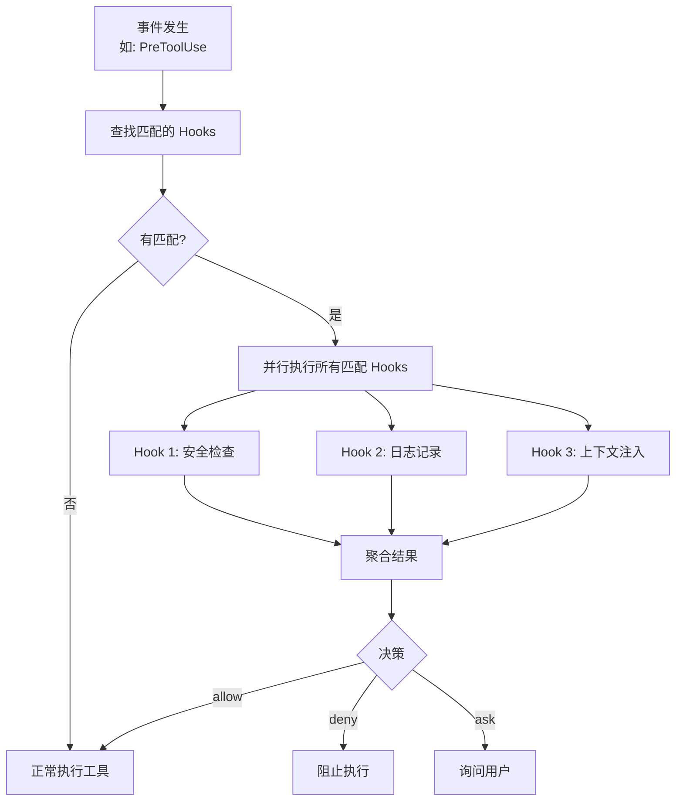
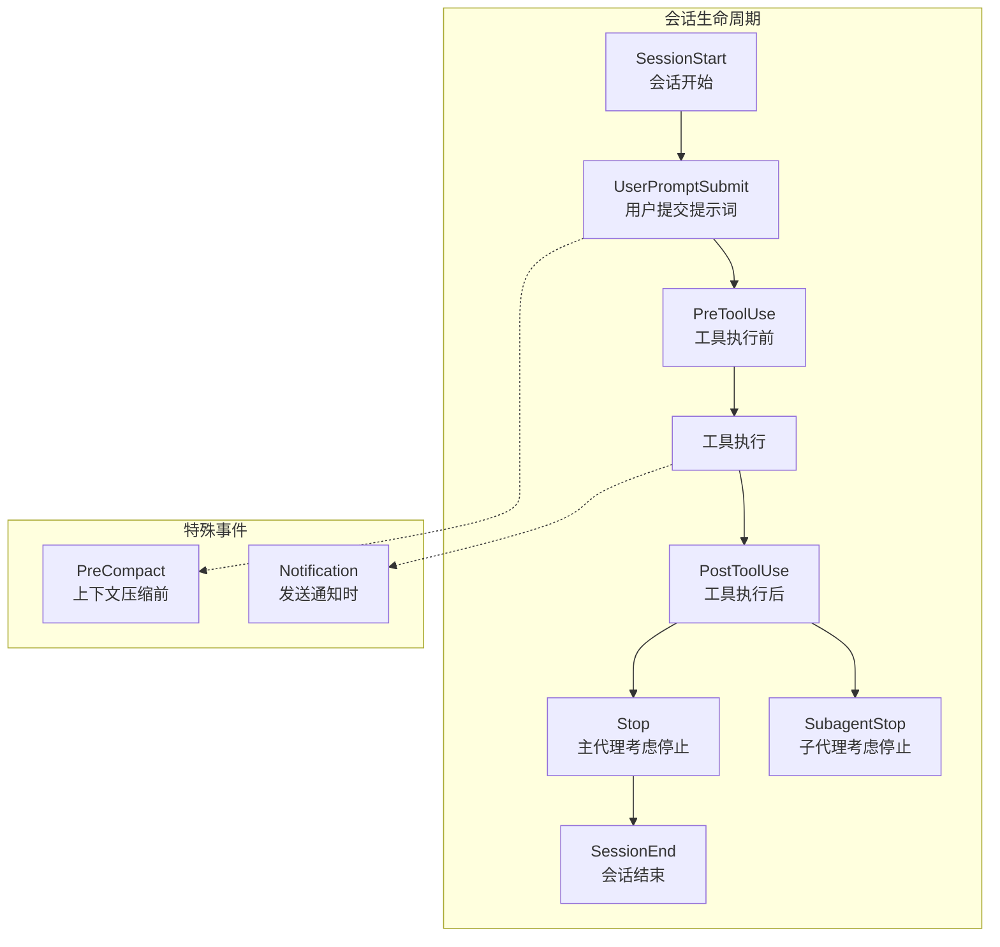
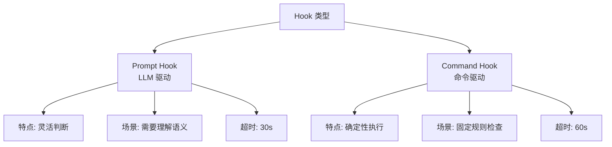
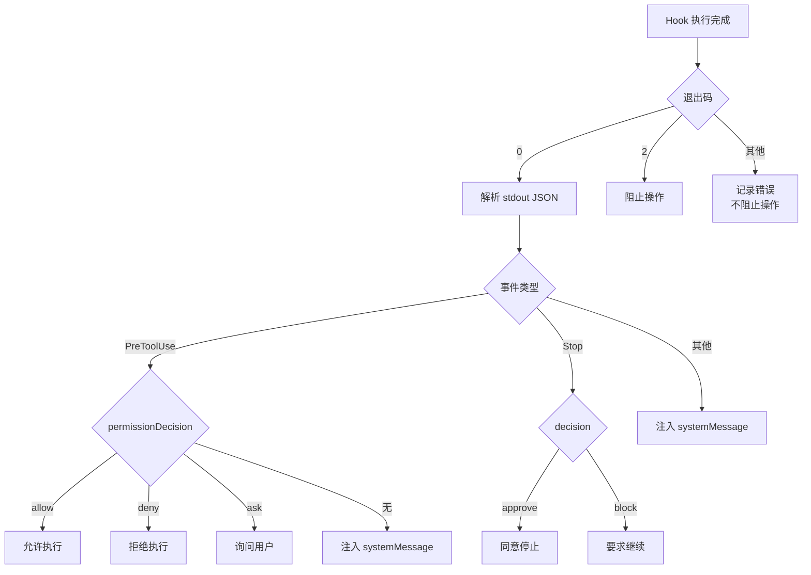
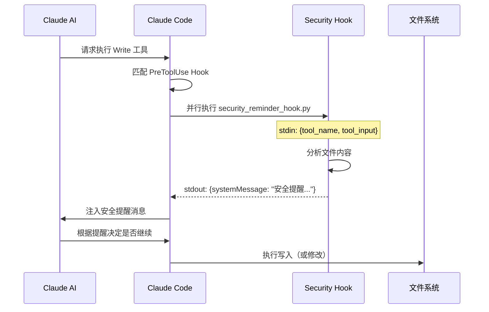
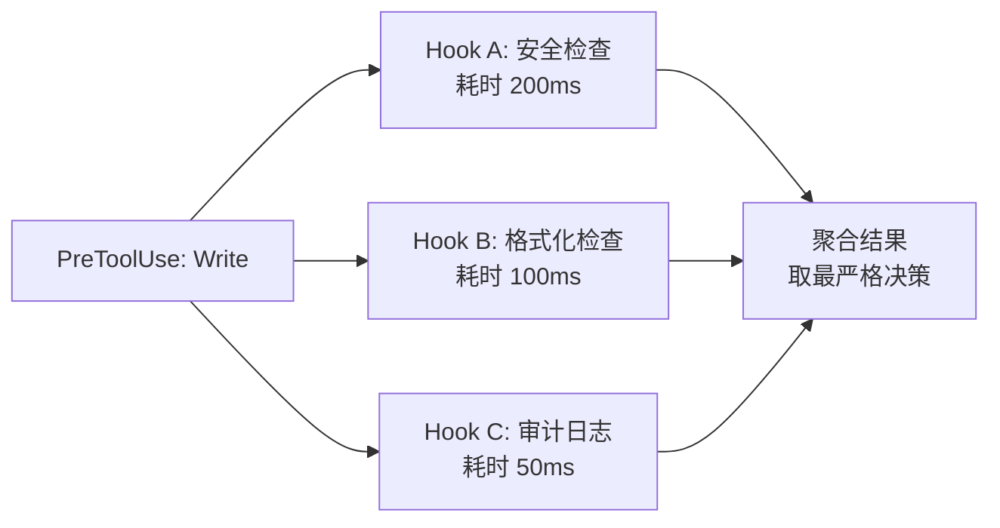

你写完代码，Claude Code 要执行 `Write` 工具保存文件——但在写入之前，你想先检查文件里有没有硬编码的密钥。怎么做到？

答案就是 **Hooks**。

Hooks 是 Claude Code 的事件驱动自动化机制。它们在关键时刻自动触发，无需用户手动操作，就能实现安全检查、上下文注入、完成度验证等逻辑。理解 Hooks，是掌握 Claude Code 自动化能力的核心。

## Hooks 是什么

Hooks 是**响应 Claude Code 事件的自动化脚本**。当特定事件发生时（比如工具即将执行、会话即将结束），Claude Code 会查找所有匹配的 Hook，并行执行它们，并根据返回结果决定后续行为。

核心特征：

- **事件驱动**：Hook 不是被主动调用的，而是在特定事件发生时自动触发
- **可干预**：PreToolUse Hook 可以允许、拒绝或修改即将执行的工具调用
- **并行执行**：同一事件的所有匹配 Hook 同时运行，互不阻塞
- **双向通信**：Hook 通过 stdin 接收结构化输入，通过 stdout 返回结构化输出



## 9 种 Hook 事件

Claude Code 定义了 9 种事件，覆盖了从会话生命周期到工具调用的完整链路：



### 事件详解

#### 1. PreToolUse —— 工具执行前

最强大的事件。在工具执行之前触发，可以**允许、拒绝或修改**工具调用。

典型用途：
- 安全审查：写入文件前检查是否包含密钥
- 权限控制：拒绝危险命令（如 `rm -rf`）
- 参数修改：自动修正工具输入参数
- 审计日志：记录所有工具调用

#### 2. PostToolUse —— 工具执行后

工具执行完成时触发，可以**对结果做出反应**。

典型用途：
- 格式化代码：Write 后自动运行 prettier
- 反馈注入：给 AI 提供工具执行的额外信息
- 结果验证：检查工具输出是否符合预期
- 通知发送：构建失败时发送通知

#### 3. Stop —— 主代理考虑停止

当主代理认为自己已经完成任务、准备停止时触发。可以**阻止停止**，要求 AI 继续工作。

典型用途：
- 完成度验证：确保测试都跑了、文档都更新了
- 质量门禁：检查是否满足代码审查标准
- 遗漏检查：确认没有遗漏的 TODO 项

#### 4. SubagentStop —— 子代理考虑停止

与 Stop 类似，但作用在子代理上。子代理完成任务后，可以通过这个事件验证其工作质量。

#### 5. SessionStart —— 会话开始

新会话启动时触发。只执行一次，是初始化环境的最佳时机。

典型用途：
- 加载项目上下文：注入项目特定的系统提示
- 环境检查：验证依赖是否安装
- 配置加载：设置环境变量（通过 `$CLAUDE_ENV_FILE`）

#### 6. SessionEnd —— 会话结束

会话关闭时触发。适合做清理和记录。

典型用途：
- 清理临时文件
- 记录会话日志
- 保存工作状态

#### 7. UserPromptSubmit —— 用户提交提示词

用户按下回车、提交提示词时触发。可以在 AI 处理之前**注入额外上下文或验证输入**。

典型用途：
- 上下文注入：自动附加当前分支名、最近提交等
- 输入验证：检查提示词是否包含敏感信息
- 提示增强：为简单问题添加详细上下文

#### 8. PreCompact —— 上下文压缩前

当上下文窗口快满时，Claude Code 会自动压缩历史对话。PreCompact 在压缩前触发，让你**保存关键信息**。

典型用途：
- 保留重要决策：将架构决定写入文件
- 保存进度状态：记录当前任务完成度
- 提取关键上下文：总结重要信息供压缩后使用

#### 9. Notification —— 通知发送时

Claude Code 向用户发送通知时触发。

典型用途：
- 自定义通知渠道：转发到 Slack/Teams
- 通知增强：添加额外上下文
- 通知过滤：只转发重要通知

### 事件对照表

| 事件 | 触发时机 | 能否阻止 | 特有能力 |
|------|---------|---------|---------|
| PreToolUse | 工具执行前 | 可以阻止 | 修改工具输入、控制权限决策 |
| PostToolUse | 工具执行后 | 不能阻止 | 注入反馈信息 |
| Stop | 主代理停止前 | 可以阻止 | 要求继续工作 |
| SubagentStop | 子代理停止前 | 可以阻止 | 要求子代理继续 |
| SessionStart | 会话开始 | 不能阻止 | 设置环境变量 |
| SessionEnd | 会话结束 | 不能阻止 | 清理、日志 |
| UserPromptSubmit | 用户提交时 | 不能阻止 | 注入上下文 |
| PreCompact | 压缩前 | 不能阻止 | 保存关键信息 |
| Notification | 发送通知时 | 不能阻止 | 自定义通知内容 |

## 两种 Hook 类型

Claude Code 提供了两种类型的 Hook，分别适合不同场景：



### Prompt Hook（推荐）

Prompt Hook 使用 LLM 来做决策。你写一段提示词，Claude Code 会调用 AI 来评估当前场景，做出智能判断。

```json
{
  "type": "prompt",
  "prompt": "Evaluate if this tool use is appropriate: $TOOL_INPUT. Check for: 1) hardcoded secrets, 2) dangerous file paths, 3) unnecessary file deletions. Respond with JSON.",
  "timeout": 30
}
```

优势：
- **语义理解**：能理解代码含义，不只是做字符串匹配
- **灵活判断**：同一套规则可以适应不同上下文
- **自然语言配置**：用描述性语言定义规则，不需要写代码

劣势：
- **延迟更高**：需要调用 LLM，增加约 2-5 秒延迟
- **不确定性**：LLM 输出可能不完全一致
- **成本增加**：每次触发都消耗 token

### Command Hook

Command Hook 执行 bash 命令。你写一个脚本，Claude Code 直接运行它，根据退出码和输出做决策。

```json
{
  "type": "command",
  "command": "python3 ${CLAUDE_PLUGIN_ROOT}/scripts/validate.sh",
  "timeout": 60
}
```

优势：
- **确定性**：同样的输入总是产生同样的输出
- **速度快**：直接执行脚本，无 LLM 调用延迟
- **功能丰富**：可以调用任何命令行工具

劣势：
- **需要写代码**：不能只用自然语言描述
- **不够灵活**：难以处理需要语义理解的场景
- **维护成本**：脚本需要单独维护

### 如何选择

| 场景 | 推荐类型 | 原因 |
|------|---------|------|
| 检查硬编码密钥 | Prompt | 需要理解代码语义 |
| 格式化代码 | Command | 确定性操作，prettier/eslint 即可 |
| 安全审查 | Prompt | 需要综合判断风险 |
| 运行 lint | Command | 固定规则，工具即可完成 |
| 完成度验证 | Prompt | 需要理解任务上下文 |
| 环境初始化 | Command | 确定性操作 |

## 配置格式

Hook 有两种配置格式，取决于你在哪里定义它。

### Plugin 格式（hooks.json）

插件中使用 **wrapper 格式**，外层有 `description` 和 `hooks` 包裹：

```json
{
  "description": "Security reminder hook that warns about potential security issues when editing files",
  "hooks": {
    "PreToolUse": [
      {
        "matcher": "Edit|Write|MultiEdit",
        "hooks": [
          {
            "type": "command",
            "command": "python3 ${CLAUDE_PLUGIN_ROOT}/hooks/security_reminder_hook.py"
          }
        ]
      }
    ],
    "Stop": [
      {
        "matcher": "",
        "hooks": [
          {
            "type": "prompt",
            "prompt": "Verify that all tests have been run before stopping."
          }
        ]
      }
    ]
  }
}
```

结构分解：

```mermaid
graph TD
    PJ[hooks.json] --> DESC[description<br/>插件描述]
    PJ --> HK[hooks<br/>钩子定义]
    HK --> E1[PreToolUse<br/>事件名]
    HK --> E2[Stop<br/>事件名]
    E1 --> G1[Matcher Group 1]
    G1 --> M1[matcher: Edit|Write|MultiEdit]
    G1 --> H1[Hook 定义]
    H1 --> T1[type: command]
    H1 --> C1[command: python3 ...]
    E2 --> G2[Matcher Group 2]
    G2 --> M2[matcher: 空 = 匹配所有]
    G2 --> H2[Hook 定义]
    H2 --> T2[type: prompt]
    H2 --> P2[prompt: Verify...]
```

关键点：每个事件下是一个**数组**，数组中每个元素是一个 **matcher group**，包含 `matcher`（匹配规则）和 `hooks`（该匹配下的 Hook 列表）。

### Settings 格式（settings.json）

在 settings.json 中使用**直接格式**，没有外层包裹，事件名直接在顶层：

```json
{
  "hooks": {
    "PreToolUse": [
      {
        "matcher": "Write",
        "hooks": [
          {
            "type": "command",
            "command": "bash ~/.claude/scripts/pre-write-check.sh"
          }
        ]
      }
    ],
    "Stop": [
      {
        "matcher": "",
        "hooks": [
          {
            "type": "prompt",
            "prompt": "Check if all changes have been committed to git."
          }
        ]
      }
    ]
  }
}
```

### 两种格式对比

| 维度 | Plugin 格式 | Settings 格式 |
|------|-----------|--------------|
| 文件 | hooks.json | settings.json |
| 外层 | `{"description": "...", "hooks": {...}}` | `{"PreToolUse": [...]}` |
| 用途 | 可分发插件 | 个人/项目配置 |
| 可移植性 | 高（`$CLAUDE_PLUGIN_ROOT`） | 低（硬编码路径） |

## Matcher 匹配器

Matcher 决定了 Hook **在什么条件下触发**。它对工具名称进行匹配，只在工具名满足条件时才执行 Hook。

### 匹配规则

| 语法 | 含义 | 示例 |
|------|------|------|
| 精确匹配 | 完全等于工具名 | `"Write"` |
| 多值匹配 | 匹配其中任意一个 | `"Write\|Edit"` |
| 通配符 | 匹配所有工具 | `"*"` 或 `""` |
| 正则表达式 | 正则匹配工具名 | `"mcp__.*__delete.*"` |

### 匹配示例

```json
[
  {
    "matcher": "Write",
    "hooks": [{"type": "command", "command": "check-write.sh"}]
  },
  {
    "matcher": "Write|Edit|MultiEdit",
    "hooks": [{"type": "command", "command": "security-check.sh"}]
  },
  {
    "matcher": "mcp__.*__delete.*",
    "hooks": [{"type": "prompt", "prompt": "Verify this deletion is safe"}]
  },
  {
    "matcher": "*",
    "hooks": [{"type": "command", "command": "audit-log.sh"}]
  }
]
```

解析：
- 第一个：只有 `Write` 工具触发
- 第二个：`Write`、`Edit`、`MultiEdit` 三个工具都会触发
- 第三个：任何名称匹配 `mcp__` 开头且包含 `delete` 的 MCP 工具触发
- 第四个：所有工具都会触发（审计日志）

### Matcher 与事件的对应关系

不同事件中，Matcher 的匹配对象不同：

| 事件 | Matcher 匹配对象 | 示例 |
|------|----------------|------|
| PreToolUse | 工具名称 | `Write`, `Bash`, `mcp__db__query` |
| PostToolUse | 工具名称 | 同上 |
| Stop | （通常为空） | `""` 或 `"*"` |
| SessionStart | （通常为空） | `""` 或 `"*"` |
| UserPromptSubmit | （通常为空） | `""` 或 `"*"` |

对于非工具事件（Stop、SessionStart 等），Matcher 通常设为空或 `*`，因为这些事件没有"工具名"可以匹配。

## Hook 输入

Hook 执行时，Claude Code 通过 **stdin** 传入 JSON 格式的输入数据。

### 公共字段

所有事件共享以下字段：

```json
{
  "session_id": "abc123",
  "transcript_path": "/tmp/claude/transcript_abc123.json",
  "cwd": "/Users/dev/my-project",
  "hook_event_name": "PreToolUse"
}
```

| 字段 | 类型 | 含义 |
|------|------|------|
| `session_id` | string | 当前会话唯一标识 |
| `transcript_path` | string | 会话记录文件路径 |
| `cwd` | string | 当前工作目录 |
| `hook_event_name` | string | 触发的事件名 |

### 事件特定字段

不同事件携带不同的额外数据：

**PreToolUse / PostToolUse：**

```json
{
  "tool_name": "Write",
  "tool_input": {
    "file_path": "/src/config.js",
    "content": "const API_KEY = 'sk-xxx';"
  },
  "tool_result": "File written successfully"
}
```

| 字段 | 含义 | 出现事件 |
|------|------|---------|
| `tool_name` | 工具名称 | PreToolUse, PostToolUse |
| `tool_input` | 工具输入参数 | PreToolUse, PostToolUse |
| `tool_result` | 工具执行结果 | PostToolUse |

**UserPromptSubmit：**

```json
{
  "user_prompt": "帮我重构这个函数，提取成独立模块"
}
```

| 字段 | 含义 |
|------|------|
| `user_prompt` | 用户提交的原始提示词 |

**Stop / SubagentStop：**

```json
{
  "reason": "Task completed successfully"
}
```

| 字段 | 含义 |
|------|------|
| `reason` | 代理认为可以停止的原因 |

### 读取输入的脚本示例

Python 脚本中读取 Hook 输入：

```python
#!/usr/bin/env python3
import json
import sys

# 从 stdin 读取 JSON 输入
hook_input = json.load(sys.stdin)

tool_name = hook_input.get("tool_name", "")
tool_input = hook_input.get("tool_input", {})

# 检查是否包含敏感信息
file_content = tool_input.get("content", "")
if "API_KEY" in file_content and "sk-" in file_content:
    # 输出拒绝决策
    result = {
        "hookSpecificOutput": {
            "permissionDecision": "deny"
        }
    }
    print(json.dumps(result))
    sys.exit(0)
```

Bash 脚本中使用 `jq` 解析：

```bash
#!/bin/bash

# 读取 stdin 的 JSON
INPUT=$(cat)

# 提取工具名
TOOL_NAME=$(echo "$INPUT" | jq -r '.tool_name')

# 提取文件路径
FILE_PATH=$(echo "$INPUT" | jq -r '.tool_input.file_path')

# 检查文件扩展名
if [[ "$FILE_PATH" == *.env ]]; then
  echo '{"hookSpecificOutput": {"permissionDecision": "deny"}}'
  exit 0
fi
```

## Hook 输出

Hook 通过 **stdout** 返回 JSON 结果。不同事件的输出格式不同。

### 标准输出

所有 Hook 都可以返回标准格式：

```json
{
  "continue": true,
  "suppressOutput": false,
  "systemMessage": "安全检查通过，继续执行"
}
```

| 字段 | 类型 | 含义 |
|------|------|------|
| `continue` | boolean | 是否继续执行（默认 true） |
| `suppressOutput` | boolean | 是否对 AI 隐藏 Hook 输出 |
| `systemMessage` | string | 注入给 AI 的系统消息 |

`systemMessage` 非常有用——它可以给 AI 提供额外指令或上下文，而用户看不到这些消息。比如在 PostToolUse 中注入格式化提示。

### PreToolUse 专用输出

PreToolUse 事件有额外的决策能力：

```json
{
  "continue": true,
  "systemMessage": "检测到潜在安全问题",
  "hookSpecificOutput": {
    "permissionDecision": "deny",
    "updatedInput": {
      "file_path": "/src/config.js",
      "content": "const API_KEY = process.env.API_KEY;"
    }
  }
}
```

| 字段 | 值 | 含义 |
|------|-----|------|
| `permissionDecision` | `"allow"` | 允许工具执行 |
| `permissionDecision` | `"deny"` | 阻止工具执行 |
| `permissionDecision` | `"ask"` | 询问用户 |
| `updatedInput` | object | 替换工具输入参数 |

**`updatedInput` 是一个强大的特性**——它让你在工具执行前修改参数。比如自动把硬编码密钥替换为环境变量引用。

### Stop 专用输出

Stop 事件可以阻止代理停止：

```json
{
  "decision": "block",
  "reason": "测试尚未运行，请先执行 npm test"
}
```

| 字段 | 值 | 含义 |
|------|-----|------|
| `decision` | `"approve"` | 同意停止 |
| `decision` | `"block"` | 阻止停止，要求继续 |
| `reason` | string | 决策原因（展示给 AI） |

### 退出码

Hook 脚本的退出码也有含义：

| 退出码 | 含义 | 行为 |
|--------|------|------|
| 0 | 成功 | 正常处理 Hook 输出 |
| 2 | 阻塞错误 | 阻止操作继续 |
| 其他 | 非阻塞错误 | 记录错误，但不阻止 |

```python
# 成功，返回结果
sys.exit(0)

# 阻塞错误，强制阻止操作
sys.exit(2)

# 非阻塞错误，记录但不阻止
sys.exit(1)
```

### 输出流程图



## 环境变量

Hook 执行时可以访问以下环境变量：

| 变量 | 含义 | 可用事件 |
|------|------|---------|
| `$CLAUDE_PROJECT_DIR` | 项目根目录 | 所有 |
| `$CLAUDE_PLUGIN_ROOT` | 插件根目录（仅插件 Hook） | 插件 Hook |
| `$CLAUDE_ENV_FILE` | 环境变量文件路径 | 仅 SessionStart |
| `$CLAUDE_CODE_REMOTE` | 是否远程运行 | 所有 |

### $CLAUDE_PROJECT_DIR

当前项目的根目录。无论 Hook 在哪里定义，这个变量都指向用户运行 `claude` 命令的目录。

```bash
# 在 Hook 脚本中使用
PROJECT_DIR=$CLAUDE_PROJECT_DIR
CONFIG_FILE="$PROJECT_DIR/.claude/project-context.md"
```

### $CLAUDE_PLUGIN_ROOT

插件根目录，只在插件定义的 Hook 中可用。这是**可移植性的关键**——使用这个变量代替硬编码路径：

```json
{
  "type": "command",
  "command": "python3 ${CLAUDE_PLUGIN_ROOT}/hooks/security_reminder_hook.py"
}
```

这样无论插件安装在哪里，路径都能正确解析。

### $CLAUDE_ENV_FILE

**只在 SessionStart 事件中可用**。指向一个文件，Hook 可以向这个文件写入环境变量，这些变量会在后续会话中生效：

```bash
#!/bin/bash
# SessionStart Hook: 设置项目特定的环境变量

echo "PROJECT_STAGE=development" >> "$CLAUDE_ENV_FILE"
echo "DEPLOY_ENV=staging" >> "$CLAUDE_ENV_FILE"
```

这非常适合在会话开始时根据项目状态动态配置环境。

## 实战：security-guidance 插件

让我们看看源码中真实存在的安全钩子插件——`security-guidance`。它的功能是：**当 AI 编辑文件时，自动提醒安全注意事项**。

### 插件结构

```
security-guidance/
├── hooks.json              # Hook 配置
└── hooks/
    └── security_reminder_hook.py  # Hook 脚本
```

### hooks.json 配置

```json
{
  "description": "Security reminder hook that warns about potential security issues when editing files",
  "hooks": {
    "PreToolUse": [
      {
        "hooks": [
          {
            "type": "command",
            "command": "python3 ${CLAUDE_PLUGIN_ROOT}/hooks/security_reminder_hook.py"
          }
        ],
        "matcher": "Edit|Write|MultiEdit"
      }
    ]
  }
}
```

逐行分析：
- `description`：描述插件功能，面向人类阅读
- `hooks.PreToolUse`：监听 PreToolUse 事件
- `matcher: "Edit|Write|MultiEdit"`：只在文件编辑操作时触发
- `type: "command"`：使用命令类型的 Hook
- `command`：执行 Python 脚本，路径使用 `$CLAUDE_PLUGIN_ROOT` 保证可移植性
- **没有设置 timeout**：使用默认的 60 秒超时

### 执行流程



这个插件的设计哲学是**提醒而非阻止**——它通过 `systemMessage` 给 AI 注入安全提示，但不使用 `permissionDecision: "deny"` 强制阻止。AI 收到提醒后自行判断。

## 并行执行与冲突处理

同一事件的所有匹配 Hook **并行执行**，这是设计上的重要决策：



关键规则：

1. **所有 Hook 同时启动**，不按顺序等待
2. **Hook 之间不可见**——每个 Hook 看不到其他 Hook 的输出
3. **超时不影响其他 Hook**——一个 Hook 超时不阻塞其他
4. **决策聚合**——如果有多个 PreToolUse Hook 返回不同决策，取**最严格**的（deny > ask > allow）

## 性能考量

### 默认超时

| Hook 类型 | 默认超时 | 原因 |
|----------|---------|------|
| Command | 60 秒 | 脚本可能执行复杂操作 |
| Prompt | 30 秒 | LLM 调用需要时间 |

可以在配置中覆盖：

```json
{
  "type": "command",
  "command": "npm run lint",
  "timeout": 120
}
```

### 超时行为

Hook 超时后：
- 该 Hook 被视为**非阻塞错误**
- 不影响其他并行 Hook 的执行
- 操作照常继续（不会被超时阻止）

### 延迟优化建议

1. **Command Hook 优于 Prompt Hook**：对于确定性检查，用命令脚本比 LLM 快得多
2. **精确 Matcher**：用 `"Write"` 而不是 `"*"`，避免不必要的 Hook 执行
3. **脚本轻量化**：Hook 脚本应该快速完成，耗时操作放到后台
4. **合理超时**：根据实际需要设置 timeout，不要盲目使用默认值

## 最佳实践

### 1. 提醒而非阻止

对于不紧急的问题，使用 `systemMessage` 注入提醒，而不是 `permissionDecision: "deny"` 强制阻止。这尊重 AI 的判断力。

```json
{
  "type": "prompt",
  "prompt": "Remind the user about security best practices if the code contains potential issues, but don't block the operation."
}
```

### 2. 使用可移植路径

插件中始终使用 `$CLAUDE_PLUGIN_ROOT`：

```json
// 好
"command": "python3 ${CLAUDE_PLUGIN_ROOT}/scripts/check.py"

// 差 — 硬编码路径不可移植
"command": "python3 /Users/dev/.claude/plugins/security/scripts/check.py"
```

### 3. 精确匹配

Matcher 应该尽量精确，避免对无关工具触发：

```json
// 好 — 只匹配文件编辑
"matcher": "Edit|Write|MultiEdit"

// 过于宽泛 — 所有工具都会触发
"matcher": "*"
```

### 4. 处理好退出码

脚本中正确使用退出码：

```python
import sys

if critical_error:
    # 阻塞错误，阻止操作
    print(json.dumps({"hookSpecificOutput": {"permissionDecision": "deny"}}))
    sys.exit(2)
elif warning:
    # 非阻塞错误，记录但不阻止
    print(json.dumps({"systemMessage": "Warning: ..."}))
    sys.exit(1)
else:
    # 成功
    print(json.dumps({"systemMessage": "Check passed"}))
    sys.exit(0)
```

### 5. SessionStart 用环境变量文件

SessionStart 中设置环境变量，不要直接 `export`：

```bash
# 好 — 通过 CLAUDE_ENV_FILE 设置
echo "MY_VAR=value" >> "$CLAUDE_ENV_FILE"

# 差 — export 在子进程中无效
export MY_VAR=value
```

### 6. Stop Hook 要有明确原因

阻止停止时，给出清晰的原因，让 AI 知道该做什么：

```json
{
  "type": "prompt",
  "prompt": "Before stopping, verify: 1) All modified files have been linted, 2) Tests have been run and pass, 3) Git status is clean. If any check fails, explain what needs to be done and block the stop."
}
```

### 7. 幂等设计

Hook 可能被多次触发（比如 AI 重试操作），确保脚本是幂等的：

```python
# 好 — 检查状态再行动
if not already_formatted(file_path):
    format_file(file_path)

# 差 — 无条件执行可能造成重复
format_file(file_path)
```

## 本章小结

**一句话记住**：Hooks = 在关键时刻自动执行的脚本。你可以允许、拒绝、修改 AI 的操作，也可以阻止 AI 过早停止。

**决策规则**：
- 需要语义判断（安全审查、完成度验证）→ Prompt Hook
- 固定规则检查（格式化、lint、路径校验）→ Command Hook
- 写文件前要干预 → PreToolUse
- 写完文件要处理 → PostToolUse
- AI 说"做完了"但你想确认 → Stop

**最容易踩的坑**：在 Matcher 里写 `"*"` 监听所有工具——每次工具调用都触发 Hook，延迟会迅速累积。精确匹配 `Edit|Write|MultiEdit` 才对。

**现在就试**：在 `.claude/settings.json` 的 `hooks` 里加一个 Stop Hook，让 AI 停止前先检查 git status 是否干净。

👉 接下来我们深入对比两种钩子类型

---

**系列目录**：
- [第一章：Claude Code 是什么 —— 终端里的 AI 编码伙伴](./../01-intro/01-what-is-claude-code.md)
- [第二章：安装与上手 —— 从 curl 到第一个命令](./../01-intro/02-installation-setup.md)
- [第三章：权限模型 —— ask/allow/deny 与沙箱](./../01-intro/03-permission-model.md)
- [第四章：斜杠命令 —— 自定义提示词的标准化方法](./04-slash-commands.md)
- 第五章：Hooks 系统 —— 事件驱动的自动化引擎 👈 当前位置
- [第六章：两种钩子对比 —— Prompt 钩子 vs Command 钩子](./06-prompt-hooks-vs-command-hooks.md) 👉 下一章
- [第七章：插件架构 —— 目录结构、自动发现与清单](./../03-plugins/07-plugin-architecture.md)
- [第八章：插件命令开发 —— frontmatter、动态参数、bash 执行](./../03-plugins/08-plugin-commands.md)
- [第九章：插件代理开发 —— 触发机制、系统提示词设计](./../03-plugins/09-plugin-agents.md)
- [第十章：插件技能开发 —— 渐进式披露与 SKILL.md](./../03-plugins/10-plugin-skills.md)
- [第十一章：插件钩子开发 —— hooks.json 与可移植路径](./../03-plugins/11-plugin-hooks.md)
- [第十二章：MCP 集成 —— stdio/SSE/HTTP/WebSocket 四种模式](./../03-plugins/12-mcp-integration.md)
- [第十三章：插件配置 —— .local.md 模式与 YAML frontmatter](./../03-plugins/13-plugin-settings.md)
- [第十六章：commit-commands —— 最简命令插件](./../04-plugin-deep-dives/16-commit-commands.md)
- [第十七章：security-guidance —— 安全钩子实战](./../04-plugin-deep-dives/17-security-guidance.md)
- [第十八章：code-review —— 多代理并行审查](./../04-plugin-deep-dives/18-code-review.md)
- [第十九章：feature-dev —— 7 阶段功能开发工作流](./../04-plugin-deep-dives/19-feature-dev.md)
- [第二十章：hookify —— 零代码创建钩子规则](./../04-plugin-deep-dives/20-hookify.md)
- [第二十一章：plugin-dev —— 用插件开发插件的元工具](./../04-plugin-deep-dives/21-plugin-dev-toolkit.md)
- [第二十二章：设置层级 —— 企业/用户/项目三层配置](./../05-enterprise/22-settings-hierarchy.md)
- [第二十三章：MDM 部署 —— Jamf/Intune/Group Policy 推送](./../05-enterprise/23-mdm-deployment.md)
- [第二十四章：Marketplace —— 插件发布与分发](./../05-enterprise/24-marketplace.md)
- [第二十五章：多代理模式 —— 并行代理编排与工作流](./../06-advanced/25-multi-agent-patterns.md)
- [第二十六章：Hookify 进阶 —— 多条件规则与操作符](./../06-advanced/26-hookify-advanced-rules.md)
- [第二十七章：从零构建完整插件 —— 端到端实战](./../06-advanced/27-building-complete-plugin.md)

