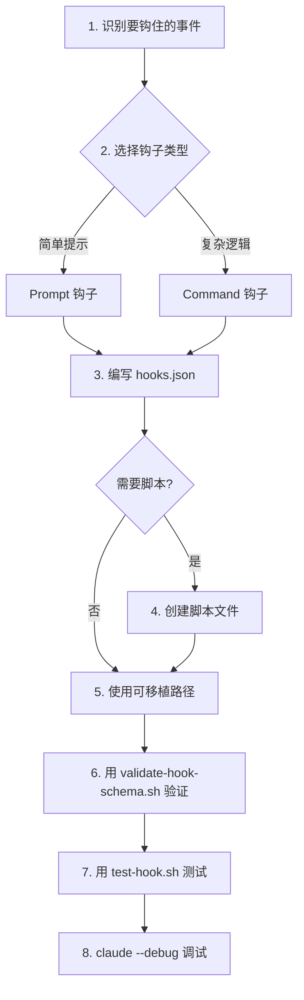

前几章我们学了命令、代理、技能的开发。但有些场景不是"用户主动调用"的——你需要在**特定事件发生时自动介入**。比如：每次写入文件前自动检查安全风险，每次会话结束时自动清理临时状态。这就是插件钩子的战场。

## 插件钩子 vs 设置钩子

你可能已经读过第五章和第六章，了解了 Claude Code 的 hooks 系统。插件钩子是同一套机制，但配置格式有**关键区别**：

| 维度 | 设置钩子（settings.json） | 插件钩子（hooks.json） |
|------|--------------------------|----------------------|
| 配置位置 | `~/.claude/settings.json` | 插件 `hooks/hooks.json` |
| 格式 | 事件名直接在顶层 | 包裹在 `"hooks"` 字段内 |
| 作用范围 | 全局或项目级 | 插件级，随插件分发 |
| 可移植性 | 依赖用户手动配置 | 随插件安装自动生效 |

**最关键的区别在格式**。设置钩子把事件名放在顶层：

```json
// settings.json 格式（不是插件格式！）
{
  "PreToolUse": [{
    "matcher": "Edit|Write",
    "hooks": [{ "type": "command", "command": "my-script.sh" }]
  }]
}
```

插件钩子多了一层 `"hooks"` 包裹：

```json
// hooks.json 插件格式
{
  "description": "Brief explanation (optional)",
  "hooks": {
    "PreToolUse": [{
      "matcher": "Edit|Write",
      "hooks": [{ "type": "command", "command": "my-script.sh" }]
    }]
  }
}
```

为什么？因为插件需要额外的 `description` 字段来说明钩子的用途，而 `"hooks"` 包裹层把事件定义和元数据清晰分开。**搞混这两种格式是最常见的错误之一**。

## hooks.json 完整格式

```json
{
  "description": "Brief explanation of what this hook does (optional but recommended)",
  "hooks": {
    "PreToolUse": [
      {
        "matcher": "Edit|Write|MultiEdit",
        "hooks": [
          {
            "type": "command",
            "command": "python3 ${CLAUDE_PLUGIN_ROOT}/hooks/security_check.py"
          }
        ]
      }
    ],
    "Stop": [
      {
        "hooks": [
          {
            "type": "command",
            "command": "bash ${CLAUDE_PLUGIN_ROOT}/hooks/cleanup.sh"
          }
        ]
      }
    ],
    "SessionStart": [
      {
        "hooks": [
          {
            "type": "prompt",
            "prompt": "Remember to follow the project's coding standards."
          }
        ]
      }
    ]
  }
}
```

### 格式要点

1. **`description`**：可选，但强烈建议填写——团队协作时帮助他人理解钩子用途
2. **`"hooks"` 包裹层**：所有事件定义必须在这个字段内
3. **事件数组**：每个事件（PreToolUse、Stop 等）接受一个数组，可以有多个 matcher 规则
4. **`matcher`**：正则表达式，匹配工具名。省略则匹配所有工具
5. **`type`**：`"command"`（执行脚本）或 `"prompt"`（注入提示词）
6. **`${CLAUDE_PLUGIN_ROOT}`**：所有文件引用**必须**使用此变量

## 真实案例：security-guidance 插件

这是 Anthropic 官方的 `security-guidance` 插件的 hooks.json：

```json
{
  "description": "Security reminder hook that warns about potential security issues when editing files",
  "hooks": {
    "PreToolUse": [
      {
        "hooks": [
          {
            "type": "command",
            "command": "python3 ${CLAUDE_PLUGIN_ROOT}/hooks/security_reminder_hook.py"
          }
        ],
        "matcher": "Edit|Write|MultiEdit"
      }
    ]
  }
}
```

这个钩子在**每次文件编辑操作前**自动触发，运行一个 Python 脚本来检查潜在的安全问题。它只匹配文件写入相关的工具（Edit、Write、MultiEdit），不影响其他操作。

对应的 Python 脚本核心逻辑：

```python
#!/usr/bin/env python3
"""Security reminder hook - warns about potential security issues."""
import json
import sys

def main():
    # 读取 stdin 中的工具调用信息
    input_data = json.load(sys.stdin)
    tool_name = input_data.get("tool_name", "")
    tool_input = input_data.get("tool_input", {})

    # 只关注文件写入操作
    file_path = tool_input.get("file_path", "")
    content = tool_input.get("content", "") or tool_input.get("old_string", "")

    issues = []

    # 检查硬编码密钥
    if any(kw in content.lower() for kw in ["api_key =", "password =", "secret ="]):
        issues.append("Possible hardcoded credential detected")

    # 检查 SQL 拼接
    if "f\"" in content and "SELECT" in content.upper():
        issues.append("Possible SQL injection via string formatting")

    if issues:
        print(json.dumps({
            "decision": "ask",
            "reason": "Security concerns: " + "; ".join(issues)
        }))
    else:
        print(json.dumps({"decision": "allow"}))

if __name__ == "__main__":
    main()
```

## 真实案例：ralph-wiggum 插件的 Stop 钩子

`ralph-wiggum` 是一个迭代循环插件，它的 Stop 钩子做了一个巧妙的事：**拦截停止信号，让迭代继续运行**。

```json
{
  "description": "Iteration loop plugin - continues until task is complete",
  "hooks": {
    "Stop": [
      {
        "hooks": [
          {
            "type": "command",
            "command": "bash ${CLAUDE_PLUGIN_ROOT}/hooks/continue_loop.sh"
          }
        ]
      }
    ]
  }
}
```

对应的 shell 脚本：

```bash
#!/bin/bash
# continue_loop.sh - 检查是否应该继续迭代

SETTINGS_FILE="${CLAUDE_PROJECT_DIR}/.claude/ralph-wiggum.local.md"

# 如果设置文件不存在或循环未启用，允许正常停止
if [ ! -f "$SETTINGS_FILE" ]; then
  echo '{"decision":"allow"}'
  exit 0
fi

# 解析设置中的 enabled 字段
ENABLED=$(sed -n '/^---$/,/^---$/p' "$SETTINGS_FILE" | grep 'enabled:' | awk '{print $2}')

if [ "$ENABLED" != "true" ]; then
  echo '{"decision":"allow"}'
  exit 0
fi

# 检查完成标志
if [ -f "${CLAUDE_PROJECT_DIR}/.claude/ralph-wiggum-done" ]; then
  echo '{"decision":"allow"}'
  exit 0
fi

# 继续迭代
echo '{"decision":"deny","reason":"Iteration loop is active. Continue until the task is complete. If you believe the task is done, create the file .claude/ralph-wiggum-done to signal completion."}'
```

这个模式展示了 **"临时激活钩子"** 的核心思路——钩子始终注册，但通过外部配置决定是否生效。

## 钩子开发工作流



### 步骤 1：识别事件

先问自己：我想在什么时候介入？

| 事件 | 典型用例 |
|------|---------|
| PreToolUse | 安全检查、参数修改、权限控制 |
| PostToolUse | 自动格式化、结果验证、反馈注入 |
| Stop | 防止过早停止、完成度检查 |
| SessionStart | 加载上下文、设置环境 |
| UserPromptSubmit | 提示词增强、上下文注入 |

### 步骤 2：选择 Prompt 还是 Command

| 维度 | Prompt 钩子 | Command 钩子 |
|------|-----------|-------------|
| 复杂度 | 简单 | 复杂 |
| 执行方式 | 注入文本到上下文 | 执行外部脚本 |
| 返回结果 | 文本提示 | 结构化 JSON |
| 适用场景 | 提醒、指导 | 验证、修改、自动化 |
| 可靠性 | 依赖 AI 理解 | 确定性执行 |

**选择原则**：如果只需要"提醒 AI 注意某事"，用 Prompt；如果需要"确定性地执行逻辑"，用 Command。

### 步骤 3-5：编写配置和脚本

以一个 PreToolUse Command 钩子为例：

```json
{
  "description": "Validate file paths before write operations to prevent path traversal",
  "hooks": {
    "PreToolUse": [
      {
        "matcher": "Write|Edit|MultiEdit",
        "hooks": [
          {
            "type": "command",
            "command": "bash ${CLAUDE_PLUGIN_ROOT}/hooks/validate-path.sh"
          }
        ]
      }
    ]
  }
}
```

```bash
#!/bin/bash
# validate-path.sh - 验证文件路径安全性
set -euo pipefail

# 读取输入
INPUT=$(cat)
TOOL_NAME=$(echo "$INPUT" | jq -r '.tool_name // empty')
FILE_PATH=$(echo "$INPUT" | jq -r '.tool_input.file_path // empty')

# 安全检查
if [ -z "$FILE_PATH" ]; then
  echo '{"decision":"allow"}'
  exit 0
fi

# 检查路径遍历
if [[ "$FILE_PATH" == *"../"* ]] || [[ "$FILE_PATH" == *"/etc/"* ]]; then
  echo "{\"decision\":\"deny\",\"reason\":\"Path traversal detected: $FILE_PATH\"}"
  exit 0
fi

echo '{"decision":"allow"}'
```

### 步骤 6-8：验证、测试、调试

```bash
# 验证 JSON schema
bash ${CLAUDE_PLUGIN_ROOT}/scripts/validate-hook-schema.sh hooks/hooks.json

# 测试单个钩子脚本
echo '{"tool_name":"Write","tool_input":{"file_path":"../etc/passwd","content":"test"}}' \
  | bash hooks/validate-path.sh

# 用 jq 验证输出格式
echo '{"tool_name":"Write","tool_input":{"file_path":"../etc/passwd"}}' \
  | bash hooks/validate-path.sh | jq .

# 启动调试模式
claude --debug
```

## Command 钩子安全最佳实践

Command 钩子执行外部脚本，安全是第一优先级：

### 1. 始终验证输入

```bash
#!/bin/bash
# BAD - 直接使用未验证的输入
FILE_PATH=$(echo "$INPUT" | jq -r '.tool_input.file_path')
eval "cat $FILE_PATH"  # 危险！命令注入风险

# GOOD - 验证后再使用
FILE_PATH=$(echo "$INPUT" | jq -r '.tool_input.file_path // empty')
if [ -z "$FILE_PATH" ]; then
  echo '{"decision":"allow"}'
  exit 0
fi
# 验证路径不包含危险字符
if [[ "$FILE_PATH" =~ [\;\|\&\$\`] ]]; then
  echo '{"decision":"deny","reason":"Invalid characters in path"}'
  exit 0
fi
```

### 2. 检查路径遍历

```bash
# 解析真实路径并验证在项目内
REAL_PATH=$(realpath "$FILE_PATH" 2>/dev/null || echo "")
PROJECT_ROOT="${CLAUDE_PROJECT_DIR:-$(pwd)}"
if [[ "$REAL_PATH" != "$PROJECT_ROOT"* ]]; then
  echo '{"decision":"deny","reason":"Path outside project directory"}'
  exit 0
fi
```

### 3. 引用所有 Bash 变量

```bash
# BAD
echo $FILE_PATH
cat $FILE_PATH

# GOOD
echo "$FILE_PATH"
cat "$FILE_PATH"
```

### 4. 设置超时

```bash
#!/bin/bash
# 钩子不应运行太久
TIMEOUT=5

# 使用 timeout 命令
RESULT=$(timeout "$TIMEOUT" python3 "${CLAUDE_PLUGIN_ROOT}/hooks/check.py" <<< "$INPUT" 2>/dev/null)
if [ $? -eq 124 ]; then
  echo '{"decision":"allow","reason":"Hook timed out, defaulting to allow"}'
  exit 0
fi
echo "$RESULT"
```

### 5. 返回结构化 JSON

```bash
# 三种决策
echo '{"decision":"allow"}'                           # 允许继续
echo '{"decision":"deny","reason":"..."}'             # 拒绝执行
echo '{"decision":"ask","reason":"..."}'              # 询问用户
```

## 临时激活钩子模式

有些钩子你不想始终生效——只在特定条件下才激活。有三种实现方式：

### 模式 1：标志文件激活

```bash
#!/bin/bash
# 只在标志文件存在时激活
FLAG_FILE="${CLAUDE_PROJECT_DIR}/.claude/strict-mode-active"

if [ ! -f "$FLAG_FILE" ]; then
  echo '{"decision":"allow"}'
  exit 0
fi

# 严格模式逻辑
# ...
```

用命令创建/删除标志文件：

```markdown
---
description: Toggle strict validation mode
---

Enable strict mode:
Write an empty file to `.claude/strict-mode-active`

Disable strict mode:
Delete the file `.claude/strict-mode-active`
```

### 模式 2：配置文件激活

```bash
#!/bin/bash
# 从 .local.md 读取配置
SETTINGS="${CLAUDE_PROJECT_DIR}/.claude/my-plugin.local.md"

if [ -f "$SETTINGS" ]; then
  STRICT=$(sed -n '/^---$/,/^---$/p' "$SETTINGS" | grep 'strict_mode:' | awk '{print $2}')
  if [ "$STRICT" != "true" ]; then
    echo '{"decision":"allow"}'
    exit 0
  fi
fi

# 严格模式逻辑
# ...
```

### 模式 3：Feature Flag 模式

```bash
#!/bin/bash
# 通过环境变量控制
if [ "${MY_PLUGIN_STRICT:-false}" != "true" ]; then
  echo '{"decision":"allow"}'
  exit 0
fi

# 严格模式逻辑
# ...
```

### 三种模式对比

| 维度 | 标志文件 | 配置文件 | 环境变量 |
|------|---------|---------|---------|
| 持久性 | 手动删除才消失 | 随配置持久化 | 随会话结束 |
| 适用场景 | 临时调试 | 项目级开关 | CI/CD 环境 |
| 可移植性 | 项目内 | 项目内 | 跨环境 |
| 用户友好度 | 中 | 高 | 低 |

## 调试技巧

### 使用 claude --debug

这是最强大的调试工具。启动后，所有钩子的执行过程都会输出到日志：

```bash
claude --debug
# 日志中会显示：
# [hooks] Loading hooks from: /path/to/plugin/hooks/hooks.json
# [hooks] PreToolUse matcher "Edit|Write" matched tool "Edit"
# [hooks] Executing command: bash /path/to/plugin/hooks/check.sh
# [hooks] Hook returned: {"decision":"allow"}
```

### 直接测试脚本

不需要启动 Claude Code，直接用 echo 管道测试：

```bash
# 模拟 PreToolUse 事件输入
echo '{"tool_name":"Write","tool_input":{"file_path":"/tmp/test.py","content":"api_key = 12345"}}' \
  | python3 hooks/security_reminder_hook.py

# 预期输出
# {"decision":"ask","reason":"Security concerns: Possible hardcoded credential detected"}
```

### 用 jq 验证输出

```bash
# 验证 JSON 格式正确
echo '{"tool_name":"Write","tool_input":{"file_path":"test.py","content":"hello"}}' \
  | bash hooks/validate-path.sh \
  | jq .

# 如果输出不是合法 JSON，jq 会报错
```

### 使用 /hooks 命令

在 Claude Code 会话中，使用 `/hooks` 命令查看当前加载的所有钩子：

```
> /hooks

Loaded hooks:
  PreToolUse: security-guidance (matcher: Edit|Write|MultiEdit)
  Stop: ralph-wiggum (no matcher)
  SessionStart: my-plugin (no matcher)
```

## 重要限制：钩子不能热替换

**钩子在会话启动时加载，会话期间无法热替换。** 如果你修改了 hooks.json 或脚本文件，需要**重启 Claude Code 会话**才能生效。


这意味着开发工作流应该是：

1. 编写钩子配置和脚本
2. 用脚本直接测试（不需要启动会话）
3. 启动新会话验证集成效果
4. 如需修改，修改后重启会话

## 完整案例：文件安全验证钩子

把所有知识整合成一个完整的插件钩子：

```
my-security-plugin/
├── .claude-plugin/
│   └── plugin.json
├── hooks/
│   ├── hooks.json
│   ├── security_check.py
│   └── path_validator.sh
└── scripts/
    ├── validate-hook-schema.sh
    └── test-hook.sh
```

**hooks.json：**

```json
{
  "description": "Security hooks that validate file writes and prevent dangerous operations",
  "hooks": {
    "PreToolUse": [
      {
        "matcher": "Write|Edit|MultiEdit",
        "hooks": [
          {
            "type": "command",
            "command": "bash ${CLAUDE_PLUGIN_ROOT}/hooks/path_validator.sh"
          },
          {
            "type": "command",
            "command": "python3 ${CLAUDE_PLUGIN_ROOT}/hooks/security_check.py"
          }
        ]
      }
    ],
    "Stop": [
      {
        "hooks": [
          {
            "type": "prompt",
            "prompt": "Before stopping, verify that all security-sensitive files have been reviewed."
          }
        ]
      }
    ]
  }
}
```

注意 PreToolUse 中有两个钩子——path_validator.sh 和 security_check.py **并行执行**，两者的结果会被聚合。任何一个返回 `deny` 都会阻止工具执行。

## 本章小结

**一句话记住**：插件钩子 = 设置钩子 + 一层 `"hooks"` 包裹 + `${CLAUDE_PLUGIN_ROOT}` 可移植路径——格式差一层的 JSON 就全盘失效。

**决策规则**：
- 只需提醒 Claude 注意某事 → Prompt 钩子
- 需要确定性验证/修改/自动化 → Command 钩子
- 钩子只在特定条件下生效 → 临时激活模式（标志文件/配置文件/环境变量）
- 钩子需要持久化开关 → 配置文件模式；临时调试 → 标志文件模式；CI/CD → 环境变量模式

**最容易踩的坑**：搞混插件钩子和设置钩子的 JSON 格式——插件钩子必须多一层 `"hooks"` 包裹，直接把事件名放顶层会导致整个钩子静默失效。

**现在就试**：用 `echo '{"tool_name":"Write","tool_input":{"file_path":"../etc/passwd"}}' | bash your-hook.sh | jq .` 直接测试一个 Command 钩子脚本，验证它返回合法的 JSON 决策。

👉 接下来我们看 MCP 集成，让插件连接外部服务

---

**系列目录**：
- [第一章：Claude Code 是什么 —— 终端里的 AI 编码伙伴](./../01-intro/01-what-is-claude-code.md)
- [第二章：安装与上手 —— 从 curl 到第一个命令](./../01-intro/02-installation-setup.md)
- [第三章：权限模型 —— ask/allow/deny 与沙箱](./../01-intro/03-permission-model.md)
- [第四章：斜杠命令 —— 自定义提示词的标准化方法](./../02-core/04-slash-commands.md)
- [第五章：Hooks 系统 —— 事件驱动的自动化引擎](./../02-core/05-hooks-system.md)
- [第六章：两种钩子对比 —— Prompt 钩子 vs Command 钩子](./../02-core/06-prompt-hooks-vs-command-hooks.md)
- [第七章：插件架构 —— 目录结构、自动发现与清单](./07-plugin-architecture.md)
- [第八章：插件命令开发 —— frontmatter、动态参数、bash 执行](./08-plugin-commands.md)
- [第九章：插件代理开发 —— 触发机制、系统提示词设计](./09-plugin-agents.md)
- [第十章：插件技能开发 —— 渐进式披露与 SKILL.md](./10-plugin-skills.md)
- 第十一章：插件钩子开发 —— hooks.json 与可移植路径 👈 当前位置
- [第十二章：MCP 集成 —— stdio/SSE/HTTP/WebSocket 四种模式](./12-mcp-integration.md) 👉 下一章
- [第十三章：插件配置 —— .local.md 模式与 YAML frontmatter](./13-plugin-settings.md)
- [第十六章：commit-commands —— 最简命令插件](./../04-plugin-deep-dives/16-commit-commands.md)
- [第十七章：security-guidance —— 安全钩子实战](./../04-plugin-deep-dives/17-security-guidance.md)
- [第十八章：code-review —— 多代理并行审查](./../04-plugin-deep-dives/18-code-review.md)
- [第十九章：feature-dev —— 7 阶段功能开发工作流](./../04-plugin-deep-dives/19-feature-dev.md)
- [第二十章：hookify —— 零代码创建钩子规则](./../04-plugin-deep-dives/20-hookify.md)
- [第二十一章：plugin-dev —— 用插件开发插件的元工具](./../04-plugin-deep-dives/21-plugin-dev-toolkit.md)
- [第二十二章：设置层级 —— 企业/用户/项目三层配置](./../05-enterprise/22-settings-hierarchy.md)
- [第二十三章：MDM 部署 —— Jamf/Intune/Group Policy 推送](./../05-enterprise/23-mdm-deployment.md)
- [第二十四章：Marketplace —— 插件发布与分发](./../05-enterprise/24-marketplace.md)
- [第二十五章：多代理模式 —— 并行代理编排与工作流](./../06-advanced/25-multi-agent-patterns.md)
- [第二十六章：Hookify 进阶 —— 多条件规则与操作符](./../06-advanced/26-hookify-advanced-rules.md)
- [第二十七章：从零构建完整插件 —— 端到端实战](./../06-advanced/27-building-complete-plugin.md)

