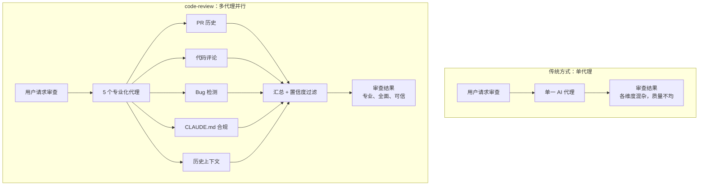
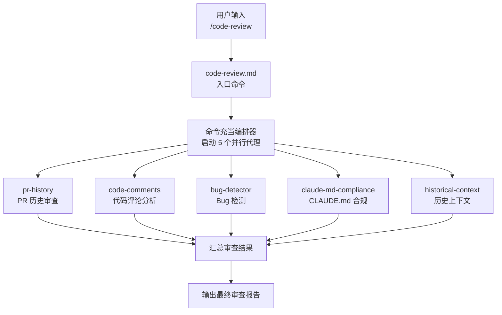
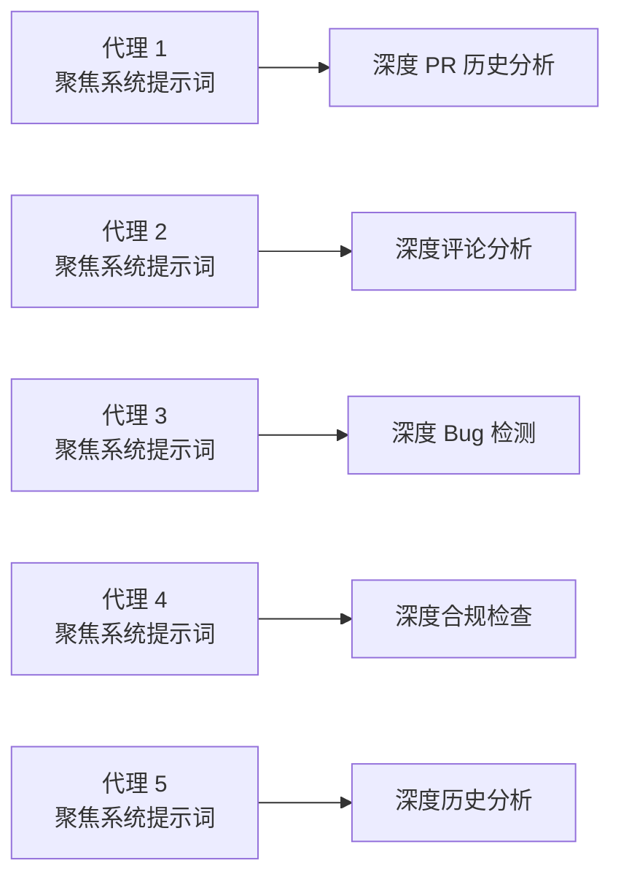
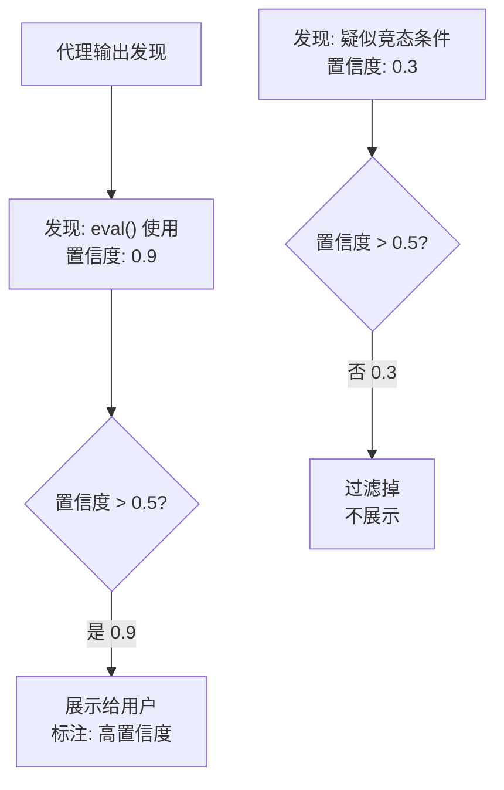
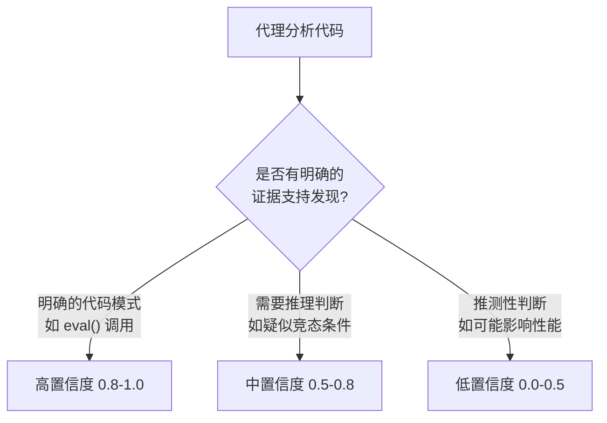
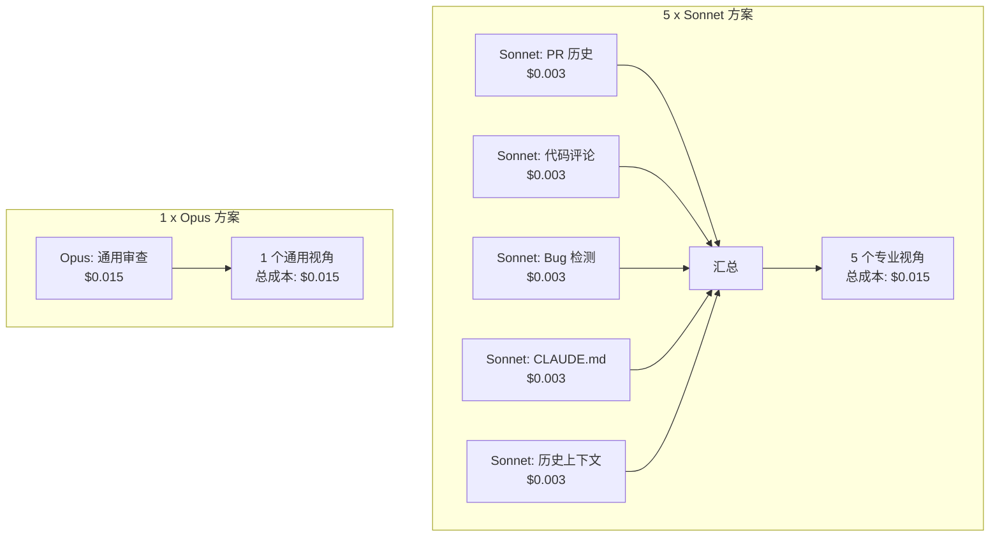
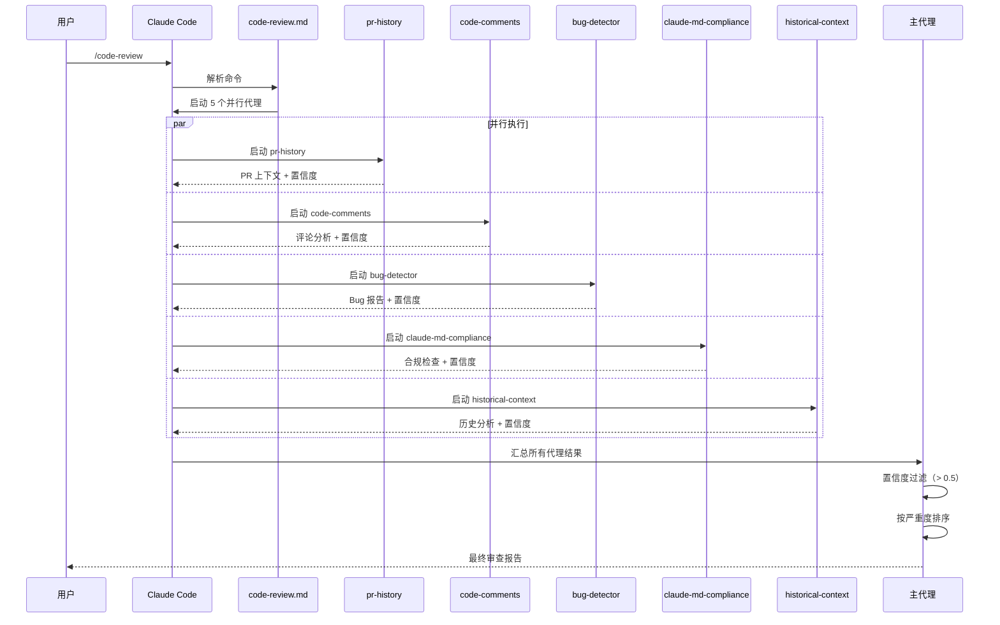
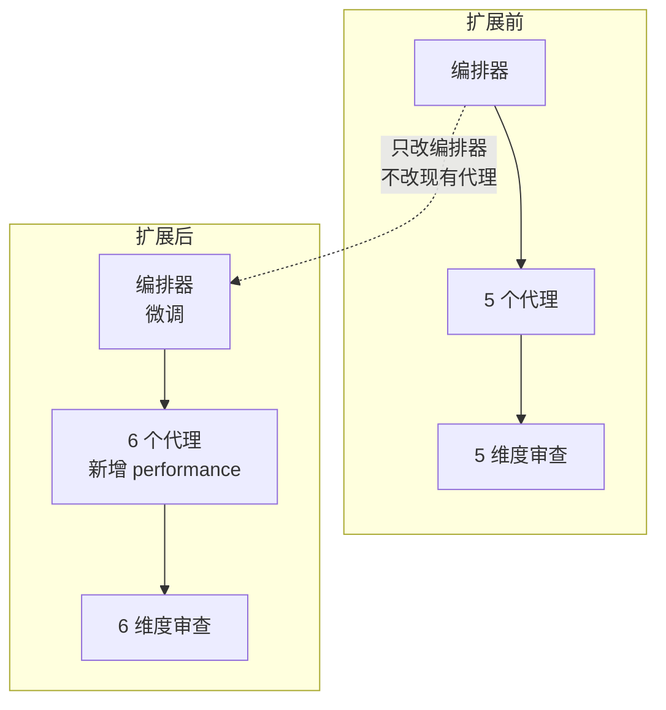
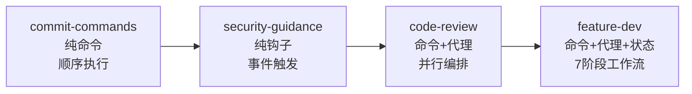

前两章我们看了最简命令插件和最简钩子插件。这一章进入**中等复杂度**领域：code-review 插件。它只有 1 个命令和 5 个代理，但这些代理的并行协作模式，是 Claude Code 多代理架构的教科书级实现。

## 为什么代码审查需要多代理

传统的 AI 代码审查是"一个模型做所有事"——读 diff、找 bug、查风格、审安全、写评论。问题在于，一个通用的系统提示词无法同时精通所有审查维度。

code-review 插件的答案是**分而治之**：5 个专业化代理并行工作，每个代理只负责一个维度，最后汇总结果。



## 插件结构全貌

```
code-review/
├── .claude-plugin/
│   └── plugin.json
├── commands/
│   └── code-review.md
├── agents/
│   ├── pr-history.md
│   ├── code-comments.md
│   ├── bug-detector.md
│   ├── claude-md-compliance.md
│   └── historical-context.md
└── README.md
```

| 文件 | 作用 | 复杂度 |
|------|------|--------|
| `plugin.json` | 插件清单 | 5 行 JSON |
| `code-review.md` | 入口命令：触发审查工作流 | ~30 行 Markdown |
| `pr-history.md` | 代理：审查 PR 上下文和历史 | ~20 行 Markdown |
| `code-comments.md` | 代理：分析代码评论质量 | ~20 行 Markdown |
| `bug-detector.md` | 代理：查找 bug 和问题 | ~20 行 Markdown |
| `claude-md-compliance.md` | 代理：检查 CLAUDE.md 合规性 | ~20 行 Markdown |
| `historical-context.md` | 代理：提供历史上下文 | ~20 行 Markdown |

总共 7 个文件，没有 Python 脚本，没有 JSON 配置——纯 Markdown 驱动的多代理系统。这体现了 Claude Code 插件开发的核心哲学：**用自然语言定义智能行为**。

## plugin.json

```json
{
  "name": "code-review",
  "description": "Automated code review for pull requests using multiple specialized agents with confidence-based scoring",
  "version": "1.0.0",
  "author": {"name": "Boris Cherny", "email": "boris@anthropic.com"}
}
```

注意描述中的两个关键词：
- **"multiple specialized agents"** —— 明确声明多代理架构
- **"confidence-based scoring"** —— 核心创新：置信度评分机制

## 架构：1 + 5 模式

code-review 的架构是"1 个命令 + 5 个代理"的编排模式：



命令文件（`code-review.md`）是**编排器**——它定义工作流的启动逻辑和代理调度策略，但不执行具体的审查工作。5 个代理是**执行者**——每个代理专注于一个审查维度，独立运行并输出结构化结果。

### 为什么是 5 个而不是 1 个

这是一个关键的架构决策。让我们分析两种方案的成本：

**单代理方案：**


问题：
1. 系统提示词过长，AI 在长提示词中容易"注意力稀释"
2. 各审查维度的重要性不同，但单一代理无法差异化处理
3. 串行执行，总延迟 = 所有维度检查时间之和
4. 无法针对特定维度选择最优模型

**5 代理并行方案：**



优势：
1. 每个代理的提示词简短聚焦，AI 专注度更高
2. 并行执行，总延迟 = 最慢单个代理的时间
3. 各代理可以独立调整和优化
4. 新增审查维度只需添加新代理，不影响现有逻辑

### 单一职责原则在代理设计中的应用

5 个代理的设计遵循了软件工程中的单一职责原则（SRP）：

| 代理 | 职责 | 关注点 |
|------|------|--------|
| `pr-history` | PR 上下文审查 | 这个 PR 改了什么？为什么改？关联哪些 issue？ |
| `code-comments` | 代码评论质量 | 代码中的注释是否准确？是否过时？是否缺少关键注释？ |
| `bug-detector` | Bug 和问题检测 | 代码中是否有逻辑错误、边界条件、竞态条件？ |
| `claude-md-compliance` | CLAUDE.md 合规 | 代码是否遵循项目的 CLAUDE.md 约定？ |
| `historical-context` | 历史上下文 | 代码的历史变更模式是否合理？是否引入了回归？ |

每个代理只回答**一个类别的问题**。这种聚焦带来了深度的审查质量——一个专门找 bug 的代理，比一个同时找 bug、查风格、审安全的代理，更善于发现隐蔽的逻辑错误。

## 5 个代理详解

### 代理 1：pr-history —— PR 历史审查

这个代理审查 PR 的整体上下文，回答"这个 PR 做了什么"这个最基本的问题。

**典型输出：**
- PR 的目的和范围总结
- 关联的 issue 或 feature request
- 变更的影响面评估
- 提交历史的连贯性

**为什么需要单独的代理？** 理解 PR 上下文是所有审查的基础。如果审查者不理解"为什么改"，就无法判断"改得对不对"。把上下文理解独立出来，确保每次审查都先建立全局理解。

### 代理 2：code-comments —— 代码评论分析

这个代理检查代码中的注释质量，发现过时、误导或缺失的注释。

**典型输出：**
- 注释与代码不一致的地方
- 缺少必要注释的复杂逻辑
- 过时注释的标记
- 注释质量的改进建议

**为什么注释质量重要？** AI 生成代码时常会出现注释与实现不匹配的情况——注释说的是旧的逻辑，代码已经改了。这种不一致比没有注释更危险，因为它会误导未来的维护者。

### 代理 3：bug-detector —— Bug 检测

这是最关键的代理。它专注于发现代码中的 bug、逻辑错误和潜在问题。

**典型输出：**
- 逻辑错误（条件判断、循环边界）
- 空指针/未定义访问
- 类型不匹配
- 竞态条件
- 资源泄漏
- 错误处理缺失

**为什么 bug 检测需要专属代理？** Bug 检测需要深度推理——它不只是模式匹配，而是理解代码的控制流和数据流。专属代理的简短提示词让 AI 更专注于推理，而不是在"查风格"和"找 bug"之间分心。

### 代理 4：claude-md-compliance —— CLAUDE.md 合规检查

这是最有 Claude Code 特色的一个代理。它检查代码是否遵循项目 `CLAUDE.md` 中定义的规范。

**典型输出：**
- 违反项目编码标准的代码
- 不符合架构约定的实现
- 缺少必要的测试覆盖
- 命名约定不合规

**为什么 CLAUDE.md 合规很重要？** `CLAUDE.md` 是项目的"AI 可读规范"——它定义了代码风格、架构约定、测试要求等。如果 AI 生成的代码违反了自己项目的规范，那就是"知行不一"。专属代理确保代码不仅"能跑"，还"符合项目约定"。

### 代理 5：historical-context —— 历史上下文

这个代理从 git 历史中提取上下文，评估变更是否引入了回归风险。

**典型输出：**
- 类似变更的历史模式
- 曾经因此类变更引入的 bug
- 代码的变更频率和稳定性
- 潜在的回归风险点

**为什么历史上下文重要？** 代码不是凭空存在的——它有历史。一个看似简单的变更，可能在过去已经引发过 bug。历史上下文代理让审查不再"只见树木不见森林"。

## 核心创新：置信度评分

code-review 插件最精妙的设计不是多代理本身，而是**置信度评分（Confidence-based Scoring）**。

### 问题：AI 审查的误报困境

AI 生成的代码审查有一个根本性问题：**误报率太高**。一个代理可能说"这里有竞态条件"，但实际上这段代码是单线程的。如果直接展示所有发现，用户很快会对审查结果失去信任。

### 解决方案：每个发现附带置信度

每个代理的每个发现都有一个 **0 到 1 的置信度分数**：

| 置信度范围 | 含义 | 处理方式 |
|-----------|------|---------|
| 0.8 - 1.0 | 高置信度 | 几乎确定有问题，直接展示 |
| 0.5 - 0.8 | 中置信度 | 可能有问题，展示但标注不确定性 |
| 0.0 - 0.5 | 低置信度 | 不太确定，**过滤掉** |



### 为什么置信度过滤至关重要

没有置信度过滤的多代理审查是这样的：

```
审查结果（无过滤）:
- 🔴 eval() 使用 — 置信度 0.95 ✓
- 🟡 疑似内存泄漏 — 置信度 0.4 ✗（误报）
- 🔴 缺少错误处理 — 置信度 0.9 ✓
- 🟡 疑似竞态条件 — 置信度 0.3 ✗（误报）
- 🟡 命名不规范 — 置信度 0.6 △（可改可不改）
- 🟡 疑似类型不匹配 — 置信度 0.2 ✗（误报）
```

2 个误报混在 3 个真实问题中。用户需要自己分辨哪些是真问题，审查体验很差。

有置信度过滤的审查：

```
审查结果（置信度 > 0.5）:
- 🔴 eval() 使用 — 置信度 0.95 ✓
- 🔴 缺少错误处理 — 置信度 0.9 ✓
- 🟡 命名不规范 — 置信度 0.6 △
```

3 个发现，2 个确定的问题，1 个可改可不改的。过滤掉了 3 个低置信度的噪音，审查结果的可信度大幅提升。

### 置信度如何设定

代理不是"随便给"置信度。置信度来自代理对自身推理过程的评估：



关键原则：
- **确定性**发现给高分：`eval()` 的存在是确定性的，置信度 0.95
- **推理性**发现给中分：疑似竞态需要推理，置信度 0.5-0.8
- **推测性**发现给低分：性能影响是推测，置信度 < 0.5

## 模型选择：Sonnet vs Opus

code-review 插件使用 **Sonnet** 模型运行所有 5 个代理。这是一个深思熟虑的成本-质量权衡：

| 维度 | Sonnet | Opus |
|------|--------|------|
| 代码理解能力 | 优秀 | 更优秀 |
| 推理深度 | 足够应对大多数审查 | 最深 |
| 单次调用成本 | ~$0.003 | ~$0.015 |
| 5 个代理总成本 | ~$0.015 | ~$0.075 |
| 速度 | 快 | 慢 |

5 个 Sonnet 代理的总成本约等于 1 个 Opus 代理。但 5 个 Sonnet 代理提供了**5 个专业视角**，而 1 个 Opus 代理只有 1 个通用视角。



同样的成本，5 倍的视角。这是多代理架构的核心经济优势。

**什么时候该用 Opus？** 当单一审查维度需要**最深度推理**时——比如审查加密算法的正确性，或者审计认证流程的安全性。在这些场景下，把 bug-detector 代理升级为 Opus 模型是合理的。

## 执行流程全链路

让我们追踪一次完整的代码审查从用户输入到最终输出的全过程：



关键时序：
1. **用户触发**：输入 `/code-review`
2. **命令解析**：Claude Code 读取 `code-review.md`，提取工作流指令
3. **并行启动**：5 个代理同时启动，各自独立运行
4. **结果汇总**：所有代理完成后，主代理汇总结果
5. **置信度过滤**：去掉低置信度发现
6. **排序输出**：按严重度排序，输出最终报告

## 多代理编排的关键设计决策

### 决策 1：代理之间不可见

5 个代理互相看不到对方的输出。这是有意为之的设计：

- 避免代理 A 的判断影响代理 B——每个维度需要独立评估
- 防止"锚定效应"——如果 bug-detector 先说"没有 bug"，claude-md-compliance 可能因此放松标准
- 简化故障排查——某个代理的输出异常不会传染给其他代理

### 决策 2：并行而非串行

所有 5 个代理同时启动，不按顺序执行。这意味着：

- 总延迟 = max(代理延迟)，不是 sum(代理延迟)
- 5 个代理各 5 秒 = 总计 5 秒，不是 25 秒
- 但也意味着代理之间不能传递信息——这是独立性的代价

### 决策 3：命令充当编排器

`code-review.md` 命令文件不是直接执行审查，而是**编排代理**：

```markdown
---
description: Automated code review using multiple specialized agents
allowed-tools: Agent
---

## Context

Review the current changes using multiple specialized agents.
Launch all 5 agents in parallel for a comprehensive review.

## Your task

Launch the following agents in parallel:
1. pr-history agent
2. code-comments agent
3. bug-detector agent
4. claude-md-compliance agent
5. historical-context agent

After all agents complete, aggregate their findings, filter by confidence (> 0.5),
and present a prioritized review report.
```

注意 `allowed-tools: Agent` —— 命令只能启动代理，不能直接执行其他操作。这是一个**纯编排命令**，它的唯一职责是调度和汇总。

### 决策 4：结果聚合在主代理中完成

5 个代理的输出在**主代理**中汇总，而不是在命令文件中。这是因为汇总需要智能判断——去重、排序、格式化——这些需要 AI 的推理能力，不是简单的字符串拼接。

## 可扩展性：添加新的审查维度

code-review 的架构使得添加新维度极其简单。假设你想添加一个"性能审查"维度：

```
code-review/
├── agents/
│   ├── pr-history.md
│   ├── code-comments.md
│   ├── bug-detector.md
│   ├── claude-md-compliance.md
│   ├── historical-context.md
│   └── performance-review.md    ← 新增
```

只需：
1. 创建 `performance-review.md` 代理文件
2. 在 `code-review.md` 命令中添加 "6. performance-review agent"
3. 完成

不需要修改任何现有代理，不需要修改 Python 代码，不需要调整配置。这是**开放-封闭原则**的最佳实践——对扩展开放，对修改封闭。



## 分类：productivity 而非 development

code-review 插件的分类是 **productivity**（生产力），不是 development（开发）。这个区分很重要：

| 分类 | 含义 | 代表插件 |
|------|------|---------|
| development | 帮助写代码的工具 | feature-dev, agent-sdk-dev |
| productivity | 帮助检查代码的工具 | code-review, pr-review-toolkit |
| safety | 帮助保护代码的工具 | security-guidance |

code-review 是一个**质量门禁**，不是开发工具。它不帮 AI 写代码，而是帮 AI（和人类）审查代码。这种定位意味着：

- 它应该在代码写完**之后**运行，不是之前
- 它的输出是**建议**，不是命令
- 它的价值是**过滤噪音**（通过置信度），不是产生更多噪音

## 和前两个插件的对比

三个插件代表了递增的复杂度层级：

| 维度 | commit-commands | security-guidance | code-review |
|------|----------------|-------------------|-------------|
| 核心组件 | commands | hooks | commands + agents |
| 组件数量 | 3 个命令 | 1 个钩子 | 1 命令 + 5 代理 |
| 触发方式 | 用户主动 | 事件自动 | 用户主动 |
| 执行模式 | 单次顺序 | 单次自动 | 多次并行 |
| 输出复杂度 | 简单（git 结果） | 简单（提醒消息） | 复杂（汇总报告） |
| 设计模式 | 最小权限 + 禁言 | 提醒不阻止 + 最小匹配 | 分而治之 + 置信度过滤 |
| 编程语言 | Markdown | Python + JSON | Markdown |
| 可扩展性 | 添加新命令 | 添加新模式 | 添加新代理 |



从 commit-commands 的"一条路走到底"，到 code-review 的"多条路并行走"，我们看到了 Claude Code 插件从简单工具到复杂系统的演化。

## 本章小结

**一句话记住**：多代理审查 = 分而治之 + 置信度过滤，5 个专业代理比 1 个全能代理更准更便宜。

**决策规则**：
- 审查维度之间独立（bug、风格、安全互不影响）→ 拆成多个并行代理
- 代理的发现可能不可靠 → 加置信度评分，低于阈值直接过滤
- 某个维度需要最深度推理（如审计加密算法）→ 只把那个代理升级为 Opus，其余保持 Sonnet

**最容易踩的坑**：不加置信度过滤就展示所有发现，误报和真问题混在一起，用户很快对审查结果失去信任。

**现在就试**：在你的项目中创建一个最简的双代理审查命令——一个查 bug，一个查代码风格，汇总后只展示置信度 > 0.5 的发现。

👉 接下来我们看 7 阶段功能开发工作流：feature-dev

---

**系列目录**：
- [第一章：Claude Code 是什么 —— 终端里的 AI 编码伙伴](./../01-intro/01-what-is-claude-code.md)
- [第二章：安装与上手 —— 从 curl 到第一个命令](./../01-intro/02-installation-setup.md)
- [第三章：权限模型 —— ask/allow/deny 与沙箱](./../01-intro/03-permission-model.md)
- [第四章：斜杠命令 —— 自定义提示词的标准化方法](./../02-core/04-slash-commands.md)
- [第五章：Hooks 系统 —— 事件驱动的自动化引擎](./../02-core/05-hooks-system.md)
- [第六章：两种钩子对比 —— Prompt 钩子 vs Command 钩子](./../02-core/06-prompt-hooks-vs-command-hooks.md)
- [第七章：插件架构 —— 目录结构、自动发现与清单](./../03-plugins/07-plugin-architecture.md)
- [第八章：插件命令开发 —— frontmatter、动态参数、bash 执行](./../03-plugins/08-plugin-commands.md)
- [第九章：插件代理开发 —— 触发机制、系统提示词设计](./../03-plugins/09-plugin-agents.md)
- [第十章：插件技能开发 —— 渐进式披露与 SKILL.md](./../03-plugins/10-plugin-skills.md)
- [第十一章：插件钩子开发 —— hooks.json 与可移植路径](./../03-plugins/11-plugin-hooks.md)
- [第十二章：MCP 集成 —— stdio/SSE/HTTP/WebSocket 四种模式](./../03-plugins/12-mcp-integration.md)
- [第十三章：插件配置 —— .local.md 模式与 YAML frontmatter](./../03-plugins/13-plugin-settings.md)
- [第十六章：commit-commands —— 最简命令插件](./16-commit-commands.md)
- [第十七章：security-guidance —— 安全钩子实战](./17-security-guidance.md)
- 第十八章：code-review —— 多代理并行审查 👈 当前位置
- [第十九章：feature-dev —— 7 阶段功能开发工作流](./19-feature-dev.md) 👉 下一章
- [第二十章：hookify —— 零代码创建钩子规则](./20-hookify.md)
- [第二十一章：plugin-dev —— 用插件开发插件的元工具](./21-plugin-dev-toolkit.md)
- [第二十二章：设置层级 —— 企业/用户/项目三层配置](./../05-enterprise/22-settings-hierarchy.md)
- [第二十三章：MDM 部署 —— Jamf/Intune/Group Policy 推送](./../05-enterprise/23-mdm-deployment.md)
- [第二十四章：Marketplace —— 插件发布与分发](./../05-enterprise/24-marketplace.md)
- [第二十五章：多代理模式 —— 并行代理编排与工作流](./../06-advanced/25-multi-agent-patterns.md)
- [第二十六章：Hookify 进阶 —— 多条件规则与操作符](./../06-advanced/26-hookify-advanced-rules.md)
- [第二十七章：从零构建完整插件 —— 端到端实战](./../06-advanced/27-building-complete-plugin.md)

