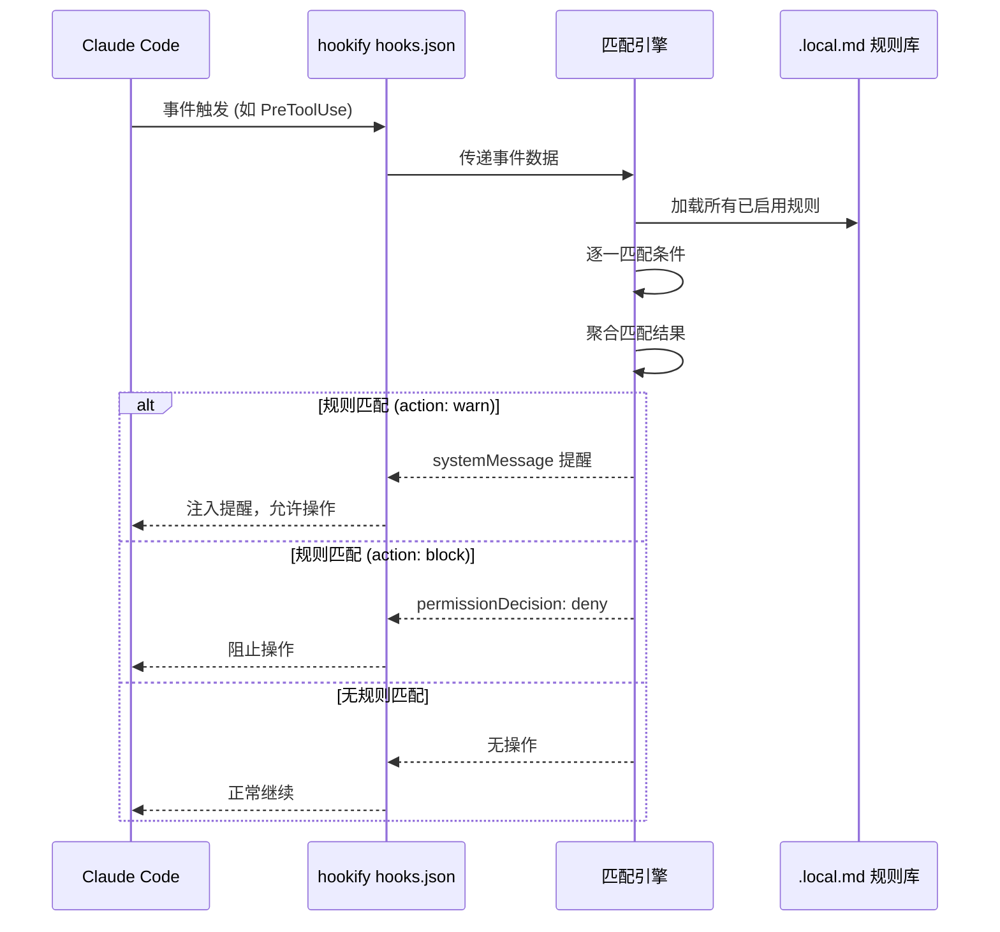
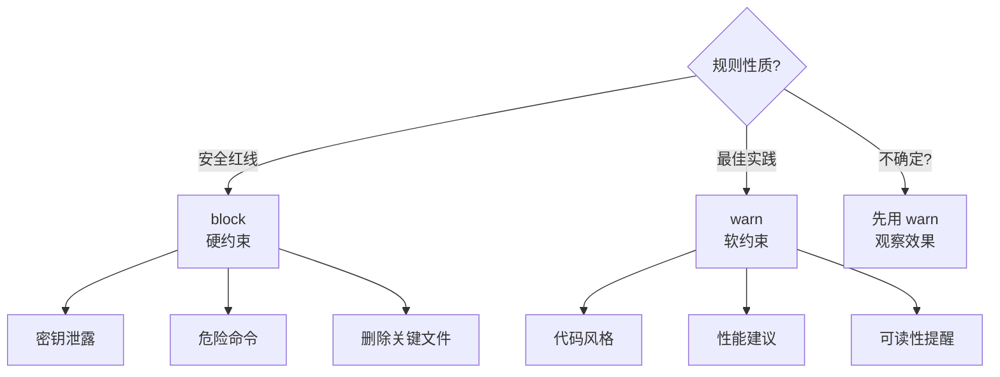
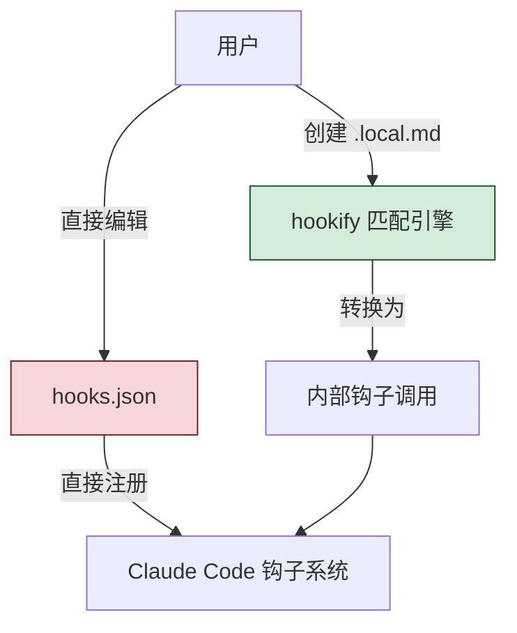

你在代码审查时发现，Claude Code 又在 TypeScript 文件里写 `console.log` 了。你纠正它，它改了。下一次对话，它又犯了。你不想每次都手动检查，但又不想去编辑 `hooks.json`——那个 JSON 结构太复杂了，写错一个逗号就全部失效。

**hookify** 插件就是为解决这个痛点而生的。它让你用**纯 Markdown 文件**创建钩子规则，无需编写任何代码，无需编辑 JSON，无需重启 Claude Code。创建一个 `.local.md` 文件，规则立即生效。

## 插件结构

hookify 是复杂度较高的插件，拥有 4 个命令、1 个代理、1 个技能、1 个钩子，以及完整的示例库：

```
hookify/
├── .claude-plugin/
│   └── plugin.json
├── commands/
│   ├── hookify.md           # 主命令: /hookify [description]
│   ├── configure.md         # /hookify:configure
│   ├── list.md              # /hookify:list
│   └── help.md              # /hookify:help
├── agents/
│   └── conversation-analyzer.md  # 分析对话模式
├── skills/
│   └── writing-rules/
│       └── SKILL.md         # 规则语法指南
├── hooks/
│   └── hooks.json           # 处理规则的钩子
├── core/
│   └── (匹配引擎)
├── matchers/
│   └── (模式匹配器)
├── utils/
│   └── (工具脚本)
└── examples/
    ├── console-log-warning.local.md
    ├── dangerous-rm.local.md
    ├── require-tests-stop.local.md
    └── sensitive-files-warning.local.md
```

这个结构揭示了一个重要的设计理念：hookify 不仅有用户入口（commands），还有**自处理能力**（hooks/hooks.json 会读取并执行 `.local.md` 规则），以及**AI 辅助**（conversation-analyzer 可以从对话中自动提取规则模式）。

## 核心创新：规则即 Markdown 文件

hookify 最根本的创新是**用 Markdown 文件替代 JSON 配置**来定义钩子规则。

### 传统方式（hooks.json）

创建一个"阻止危险 rm 命令"的钩子，你需要：

```json
{
  "description": "Block dangerous rm commands",
  "hooks": {
    "PreToolUse": [
      {
        "matcher": "Bash",
        "hooks": [
          {
            "type": "command",
            "command": "python3 /path/to/script.py",
            "timeout": 30
          }
        ]
      }
    ]
  }
}
```

然后你还需要写一个 Python 脚本来检查命令内容。整个过程涉及 JSON 配置 + Python 脚本，门槛不低。

### hookify 方式（.local.md）

同样的规则，用 hookify 只需要：

```markdown
---
name: block-dangerous-rm
enabled: true
event: bash
pattern: rm\s+-rf
action: block
---

⚠️ **Dangerous rm command detected!**
This command could delete important files.
```

保存为 `dangerous-rm.local.md`，规则立即生效。没有 JSON，没有脚本，没有重启。

## 规则配置格式

每个 `.local.md` 文件由两部分组成：**YAML frontmatter**（配置）和 **Markdown body**（提示消息）。

### Frontmatter 字段

```yaml
---
name: rule-name           # 必需：规则名称
enabled: true             # 可选：是否启用，默认 true
event: bash               # 必需：事件类型
pattern: regex-pattern    # 简单规则：匹配模式
action: warn              # 简单规则：warn 或 block
conditions:               # 高级规则：多条件组合
  - field: command
    operator: regex_match
    pattern: rm\s+-rf
---
```

### Markdown Body

frontmatter 之后的 Markdown 内容就是规则触发时显示给 AI 的消息。这个消息会作为 `systemMessage` 注入，AI 看到后会根据消息内容调整行为。

```markdown
---
name: console-log-warning
enabled: true
event: file
pattern: console\.log
action: warn
---

🚫 **console.log detected in code!**
Production code should not contain console.log statements.
Use a proper logging library instead, or remove before committing.
```

### 事件类型

hookify 支持 5 种事件类型：

| 事件 | 触发时机 | 可用字段 |
|------|---------|----------|
| `bash` | 执行 bash 命令时 | `command` |
| `file` | 编辑/写入文件时 | `file_path`, `new_text`, `old_text`, `content` |
| `stop` | 会话即将停止时 | 通用会话状态 |
| `prompt` | 用户提交提示词时 | `user_prompt` |
| `all` | 所有事件 | 所有字段 |

### Action 类型

| Action | 效果 | 适用场景 |
|--------|------|----------|
| `warn` | 注入提醒消息，**允许操作继续** | 代码风格、最佳实践提醒 |
| `block` | 注入拒绝消息，**阻止操作执行** | 安全红线、危险操作 |

`warn` 是软约束——AI 看到提醒后自行判断；`block` 是硬约束——操作被强制阻止。选择哪个取决于规则的严重程度。

## 简单规则 vs 高级规则

hookify 支持两种规则复杂度，适应不同需求。

### 简单规则：pattern + action

当规则只需要匹配一个模式时，使用 `pattern` 和 `action` 字段：

```markdown
---
name: no-console-log
enabled: true
event: file
pattern: console\.log
action: warn
---

🚫 **console.log detected!**
Use a proper logging library.
```

这种规则等价于"如果文件操作中包含 `console.log`，发出警告"。

### 高级规则：conditions 多条件组合

当规则需要同时满足多个条件时，使用 `conditions` 数组：

```markdown
---
name: api-key-in-typescript
enabled: true
event: file
conditions:
  - field: file_path
    operator: regex_match
    pattern: \.tsx?$
  - field: new_text
    operator: regex_match
    pattern: (API_KEY|SECRET|TOKEN)\s*=\s*["']
action: block
---

🔐 **Hardcoded credential in TypeScript!**
Never hardcode API keys, secrets, or tokens in source code.
Use environment variables instead:
  const apiKey = process.env.API_KEY;
```

这条规则的含义是：**同时**满足两个条件才触发——文件路径是 TypeScript，且新写入的文本包含硬编码密钥。两个条件是 AND 关系，全部满足才触发。

### 操作符一览

| 操作符 | 含义 | 示例 |
|--------|------|------|
| `regex_match` | 正则表达式匹配 | `pattern: \.tsx?$` |
| `contains` | 包含子串 | `pattern: console.log` |
| `equals` | 完全相等 | `pattern: production` |
| `not_contains` | 不包含子串 | `pattern: TODO` |
| `starts_with` | 以指定字符串开头 | `pattern: /etc/` |
| `ends_with` | 以指定字符串结尾 | `pattern: .env` |

### 字段与事件类型的对应

不同事件类型提供不同的可匹配字段：

**bash 事件：**

| 字段 | 含义 | 示例值 |
|------|------|--------|
| `command` | 即将执行的命令 | `rm -rf /tmp/old-builds` |

**file 事件：**

| 字段 | 含义 | 示例值 |
|------|------|--------|
| `file_path` | 文件路径 | `src/auth/config.ts` |
| `new_text` | 新写入的文本 | `const API_KEY = "sk-..."` |
| `old_text` | 被替换的旧文本 | `const API_KEY = ""` |
| `content` | 文件完整内容 | （整个文件） |

**prompt 事件：**

| 字段 | 含义 | 示例值 |
|------|------|--------|
| `user_prompt` | 用户输入的提示词 | `删除所有临时文件` |

## 4 个命令的使用

hookify 提供 4 个斜杠命令，覆盖规则的创建、查看、配置和帮助。

### /hookify [description] —— 创建规则

这是主命令，有两种用法：

**用法 1：直接描述规则**

```
/hookify Don't use console.log in TypeScript files
```

hookify 会根据你的描述自动生成一个 `.local.md` 规则文件：

```markdown
---
name: no-console-log-typescript
enabled: true
event: file
conditions:
  - field: file_path
    operator: regex_match
    pattern: \.tsx?$
  - field: new_text
    operator: regex_match
    pattern: console\.log
action: warn
---

🚫 **console.log in TypeScript detected!**
Avoid using console.log in TypeScript files.
Use a proper logging library or the project's logger utility instead.
```

**用法 2：分析对话自动提取规则**

```
/hookify
```

不带描述时，hookify 启动 **conversation-analyzer** 代理，它会分析当前对话中你做过的纠正，自动提取出规则模式。

比如你在对话中三次纠正 Claude Code 不要在代码中使用 `var`，conversation-analyzer 会识别出这个模式，建议你创建一条规则：

```markdown
---
name: no-var-keyword
enabled: true
event: file
conditions:
  - field: new_text
    operator: regex_match
    pattern: \bvar\s+\w+
action: warn
---

⚠️ **var keyword detected!**
Always use `const` or `let` instead of `var`.
`var` has function scoping which can lead to subtle bugs.
```

这是 hookify 最智能的用法——它从你的**行为模式**中学习，把重复的纠正固化成自动规则。

### /hookify:list —— 列出所有规则

```
/hookify:list
```

输出当前所有已创建的规则及其状态：

```
📋 Hookify Rules
────────────────────────────────
1. no-console-log-typescript  [ENABLED]  [warn]  file
2. block-dangerous-rm         [ENABLED]  [block] bash
3. api-key-in-typescript      [ENABLED]  [block] file
4. require-tests-before-stop  [DISABLED] [block] stop
────────────────────────────────
Total: 4 rules (3 enabled, 1 disabled)
```

### /hookify:configure —— 交互式配置

```
/hookify:configure
```

启动交互式配置流程，可以：
- 启用/禁用特定规则
- 修改规则的 action（warn ↔ block）
- 删除不再需要的规则
- 调整规则的优先级

### /hookify:help —— 帮助信息

```
/hookify:help
```

显示完整的使用指南和规则语法说明。

## 内置示例

hookify 附带 4 个精心设计的示例，覆盖了最常见的规则场景：

### 1. console-log-warning.local.md

```markdown
---
name: console-log-warning
enabled: true
event: file
conditions:
  - field: new_text
    operator: regex_match
    pattern: console\.(log|debug|info)
action: warn
---

🚫 **Console logging detected!**
Consider using a proper logging library instead of console.log/debug/info.
```

适用：任何不希望出现 console 调试语句的项目。

### 2. dangerous-rm.local.md

```markdown
---
name: dangerous-rm
enabled: true
event: bash
pattern: rm\s+-rf\s+(/|~/|/home|/usr|/etc|/var)
action: block
---

⚠️ **Dangerous rm command detected!**
This command could delete important system files.
Use more specific paths and avoid -rf with root directories.
```

适用：任何项目——这是安全红线。

### 3. require-tests-stop.local.md

```markdown
---
name: require-tests-before-stop
enabled: true
event: stop
conditions:
  - field: general
    operator: not_contains
    pattern: tests_passed
action: block
---

🧪 **Tests not yet run!**
Before finishing, please run the project's test suite and ensure all tests pass.
```

适用：重视测试覆盖的项目——防止 AI 在没跑测试的情况下就宣告完成。

### 4. sensitive-files-warning.local.md

```markdown
---
name: sensitive-files-warning
enabled: true
event: file
conditions:
  - field: file_path
    operator: regex_match
    pattern: \.(env|pem|key|p12|jks)$
action: block
---

🔐 **Sensitive file detected!**
This file type typically contains secrets or credentials.
Never commit these files to version control.
```

适用：任何项目——防止敏感文件被意外修改或提交。

## 工作原理

hookify 的核心是一个**规则处理引擎**，它通过自己的 hooks.json 注册为 Claude Code 的钩子，然后在内部读取和执行 `.local.md` 规则：



关键点：hookify 自己的 `hooks.json` 是**固定的**——它监听所有事件，然后内部通过匹配引擎分发到具体的 `.local.md` 规则。用户不需要修改 `hooks.json`，只需要创建/修改 Markdown 文件。

## 为什么 hookify 如此精妙

hookify 解决了传统钩子开发的 5 个核心痛点。

### 痛点 1：JSON 配置复杂

编辑 `hooks.json` 需要理解嵌套的 matcher group 结构，一个逗号错误就导致整个钩子失效。`.local.md` 文件是扁平的 YAML frontmatter，语法简单直观。

### 痛点 2：需要写代码

传统 Command Hook 需要写 Python 或 Bash 脚本来做模式匹配。hookify 的匹配引擎内置了正则、包含、相等、前缀、后缀等操作符，90% 的规则不需要写任何代码。

### 痛点 3：修改需要重启

修改 `hooks.json` 后通常需要重新加载 Claude Code。`.local.md` 文件的变更是**即时生效**的——因为 hookify 的匹配引擎在每次事件触发时重新读取规则库。

### 痛点 4：难以启用/禁用

传统钩子的启用/禁用需要编辑 JSON、注释代码、或修改文件名。hookify 只需要改一个字段：`enabled: false`。

### 痛点 5：规则不可发现

`hooks.json` 中可能定义了十几条规则，但不打开文件你不知道都有什么。`/hookify:list` 让所有规则一目了然。

### 6 个核心优势总结

| 优势 | 说明 |
|------|------|
| 零代码 | 只需描述行为，不需要写脚本 |
| 即时生效 | 创建 `.local.md` 后立即生效，无需重启 |
| 轻松启停 | `enabled: true/false` 一键切换 |
| 对话分析 | 自动从纠正行为中提取规则模式 |
| 多条件匹配 | conditions 数组支持复杂的 AND 组合 |
| 灵活执行 | warn（建议）vs block（强制）两种力度 |

## warn vs block 的选择哲学

选择 `warn` 还是 `block` 不是技术问题，是管理哲学问题。



**实用策略**：新规则先用 `warn` 观察几天，确认误报率可接受后再升级为 `block`。`warn` 的好处是不会中断工作流——AI 看到提醒后可以选择忽略（如果场景合理），而 `block` 会强制中断，可能阻碍正当操作。

## conversation-analyzer 代理

hookify 的 conversation-analyzer 是一个精巧的 agent，它的工作是**从对话历史中发现模式**。

### 工作流程

```mermaid
graph TD
    START[/hookify 无参数] --> CA[conversation-analyzer]
    CA --> SCAN[扫描对话历史]
    SCAN --> PAT[识别重复纠正模式]
    PAT --> GEN[生成规则建议]
    GEN --> USER{用户确认?}
    USER -->|接受| CREATE[创建 .local.md 文件]
    USER -->|拒绝| DISCARD[丢弃建议]
    USER -->|修改| EDIT[调整规则内容]
    EDIT --> CREATE
```

### 识别的模式类型

- **重复纠正**：你多次告诉 AI 不要做某事
- **风格偏好**：你总是要求特定的代码风格
- **安全关注**：你反复检查某类安全问题
- **流程遗漏**：你总是在 AI 停止后补充检查

这个代理让 hookify 从"被动配置"进化为"主动学习"——不需要你事先想好所有规则，它帮你发现你需要但没意识到的规则。

## 与传统 Hooks 的关系

hookify 不是要替代 `hooks.json`，而是在它之上提供了一层更友好的抽象：



- hookify 适合：模式匹配类的规则（正则、包含、相等）
- hooks.json 适合：需要执行复杂脚本的场景（调用外部工具、API 请求、多步验证）
- 两者可以共存——hookify 处理简单规则，hooks.json 处理复杂场景

## 实战演练

### 场景 1：防止在 Python 代码中使用 `print()` 调试

```
/hookify Don't use print() for debugging in Python files
```

生成：

```markdown
---
name: no-print-debug-python
enabled: true
event: file
conditions:
  - field: file_path
    operator: regex_match
    pattern: \.py$
  - field: new_text
    operator: regex_match
    pattern: print\s*\(
action: warn
---

🐍 **print() debugging detected in Python!**
Use the project's logging module instead of print() for debugging:
  import logging
  logging.debug("message")
```

### 场景 2：阻止修改 .env 文件

```
/hookify Never modify .env files
```

生成：

```markdown
---
name: protect-env-files
enabled: true
event: file
conditions:
  - field: file_path
    operator: regex_match
    pattern: \.env($|\.)
action: block
---

🔐 **.env file modification blocked!**
Environment files should not be modified through code editing.
Use proper secret management tools or manual configuration.
```

### 场景 3：从对话中学习

你在对话中多次纠正 Claude Code 要给函数添加类型注解。运行：

```
/hookify
```

conversation-analyzer 分析后建议：

```markdown
---
name: require-type-annotations
enabled: true
event: file
conditions:
  - field: file_path
    operator: regex_match
    pattern: \.py$
  - field: new_text
    operator: regex_match
    pattern: def\s+\w+\([^)]*\)\s*:
action: warn
---

📝 **Function missing type annotations!**
All Python functions should have type annotations for parameters and return values:
  def function_name(param: type) -> return_type:
```

## 本章小结

**一句话记住**：hookify = 用一个 Markdown 文件替代 hooks.json + Python 脚本，写完即生效。

**决策规则**：
- 规则是模式匹配（正则、包含、前缀）→ 用 hookify 的 `.local.md`
- 规则需要执行复杂脚本（调 API、多步验证）→ 还是用传统 hooks.json
- 不确定规则会不会误报 → 先设 `action: warn`，观察几天再决定是否升级为 `block`

**最容易踩的坑**：新规则一上来就设 `action: block`，误报直接阻断工作流，被迫反复修改规则甚至删除——正确做法是先用 warn 观察误报率。

**现在就试**：运行 `/hookify Don't use console.log in TypeScript files`，30 秒内创建你的第一条零代码钩子规则，体验写完即生效的快感。

👉 接下来我们看 plugin-dev，一个"用插件开发插件"的元工具

---

**系列目录**：
- [第一章：Claude Code 是什么 —— 终端里的 AI 编码伙伴](./../01-intro/01-what-is-claude-code.md)
- [第二章：安装与上手 —— 从 curl 到第一个命令](./../01-intro/02-installation-setup.md)
- [第三章：权限模型 —— ask/allow/deny 与沙箱](./../01-intro/03-permission-model.md)
- [第四章：斜杠命令 —— 自定义提示词的标准化方法](./../02-core/04-slash-commands.md)
- [第五章：Hooks 系统 —— 事件驱动的自动化引擎](./../02-core/05-hooks-system.md)
- [第六章：两种钩子对比 —— Prompt 钩子 vs Command 钩子](./../02-core/06-prompt-hooks-vs-command-hooks.md)
- [第七章：插件架构 —— 目录结构、自动发现与清单](./../03-plugins/07-plugin-architecture.md)
- [第八章：插件命令开发 —— frontmatter、动态参数、bash 执行](./../03-plugins/08-plugin-commands.md)
- [第九章：插件代理开发 —— 触发机制、系统提示词设计](./../03-plugins/09-plugin-agents.md)
- [第十章：插件技能开发 —— 渐进式披露与 SKILL.md](./../03-plugins/10-plugin-skills.md)
- [第十一章：插件钩子开发 —— hooks.json 与可移植路径](./../03-plugins/11-plugin-hooks.md)
- [第十二章：MCP 集成 —— stdio/SSE/HTTP/WebSocket 四种模式](./../03-plugins/12-mcp-integration.md)
- [第十三章：插件配置 —— .local.md 模式与 YAML frontmatter](./../03-plugins/13-plugin-settings.md)
- [第十六章：commit-commands —— 最简命令插件](./16-commit-commands.md)
- [第十七章：security-guidance —— 安全钩子实战](./17-security-guidance.md)
- [第十八章：code-review —— 多代理并行审查](./18-code-review.md)
- [第十九章：feature-dev —— 7 阶段功能开发工作流](./19-feature-dev.md)
- 第二十章：hookify —— 零代码创建钩子规则 👈 当前位置
- [第二十一章：plugin-dev —— 用插件开发插件的元工具](./21-plugin-dev-toolkit.md) 👉 下一章
- [第二十二章：设置层级 —— 企业/用户/项目三层配置](./../05-enterprise/22-settings-hierarchy.md)
- [第二十三章：MDM 部署 —— Jamf/Intune/Group Policy 推送](./../05-enterprise/23-mdm-deployment.md)
- [第二十四章：Marketplace —— 插件发布与分发](./../05-enterprise/24-marketplace.md)
- [第二十五章：多代理模式 —— 并行代理编排与工作流](./../06-advanced/25-multi-agent-patterns.md)
- [第二十六章：Hookify 进阶 —— 多条件规则与操作符](./../06-advanced/26-hookify-advanced-rules.md)
- [第二十七章：从零构建完整插件 —— 端到端实战](./../06-advanced/27-building-complete-plugin.md)

