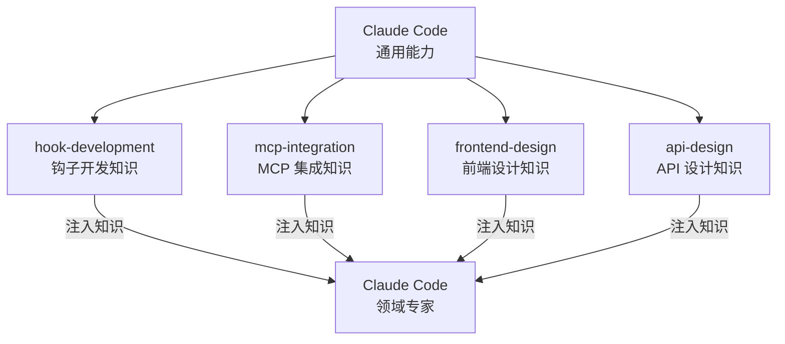
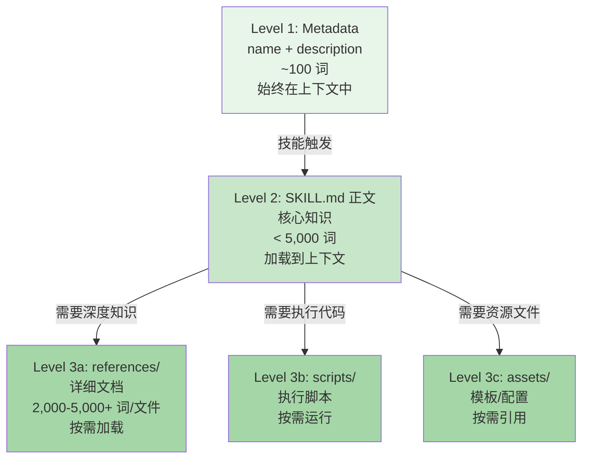
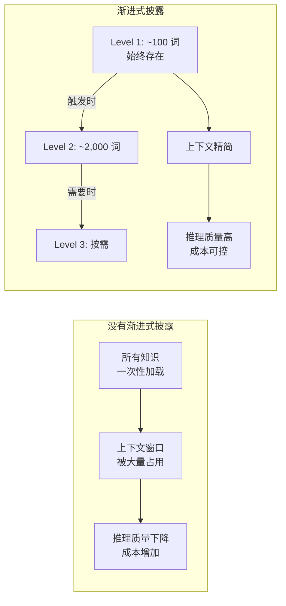
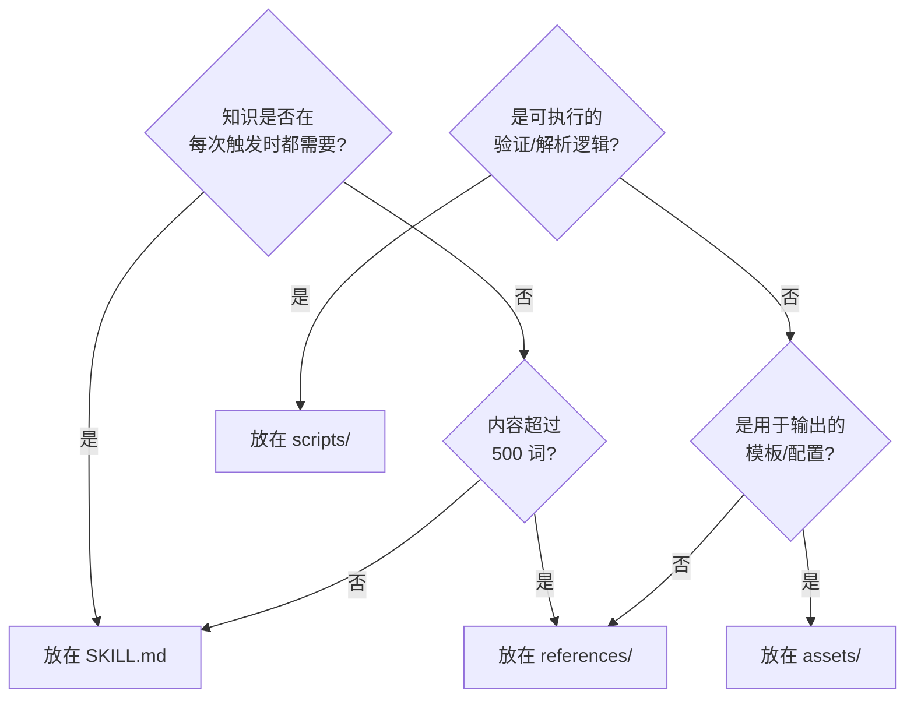
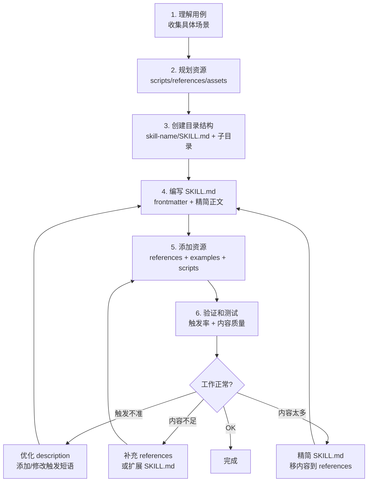

命令让 Claude **做**什么，代理让 Claude **成为**谁，技能让 Claude **知道**什么。技能是模块化的知识包，它把 Claude 从通用的编码助手转变为领域专家。而实现这一切的核心设计模式，叫做**渐进式披露**。

## 技能是什么

技能是**模块化的、自包含的知识包**，通过提供专业领域知识来扩展 Claude 的能力。

> "Skills are modular, self-contained packages that extend Claude's capabilities by providing specialized knowledge. They transform Claude from a general-purpose assistant into a specialized agent for specific domains."

三个关键词：
- **模块化**：每个技能聚焦一个领域，独立可组合
- **自包含**：技能自带所需的所有资源和引用
- **知识包**：它提供的是知识，不是行为



## 技能的目录结构

```
skill-name/
├── SKILL.md              # 必需：核心知识文件
│   ├── YAML frontmatter  # name + description（必需）
│   └── Markdown 正文     # 核心指令和知识（必需）
└── Bundled Resources     # 可选：捆绑资源
    ├── scripts/          # 可执行代码（验证、测试、解析）
    ├── references/       # 详细文档（按需加载到上下文）
    └── assets/           # 输出使用的文件（模板、图标）
```

### 各部分职责

| 目录/文件 | 必需 | 用途 | 加载时机 |
|----------|:----:|------|---------|
| `SKILL.md` | 是 | 核心概念、关键流程、快速参考 | 技能被触发时 |
| `scripts/` | 否 | 确定性任务的执行脚本 | Claude 需要运行时 |
| `references/` | 否 | 深度文档、高级模式、API 参考 | Claude 需要详细知识时 |
| `assets/` | 否 | 模板文件、配置样板、图标 | 生成输出时引用 |

**关键区别**：
- `scripts/` 里的内容是 Claude **执行**的
- `references/` 里的内容是 Claude **阅读**的
- `assets/` 里的内容是 Claude **使用**的

## 渐进式披露：技能的核心设计模式

这是技能系统最精妙的设计。三级加载机制确保 Claude 的上下文始终聚焦，同时在需要时能获取深度知识。



### Level 1: Metadata —— 始终在上下文中

每个技能的 name 和 description 始终存在于 Claude 的上下文里。这意味着 Claude 知道所有可用技能的存在和用途，但不占用太多空间。

```yaml
---
name: Hook Development
description: This skill should be used when the user asks to "create a hook",
"add a PreToolUse hook", "configure a PostToolUse hook", "write a hook rule",
or "debug a hook".
---
```

大约 100 词，但对触发至关重要。Claude 根据这些信息决定是否激活技能。

### Level 2: SKILL.md 正文 —— 触发时加载

当技能被触发，SKILL.md 的完整正文被加载到上下文。这包含：
- 核心概念解释
- 关键流程步骤
- 快速参考信息
- **指向 references/ 的引用**（但不包含详细内容本身）

**关键约束：保持在 3,000 词以内，理想 1,500-2,000 词。**

### Level 3: Bundled Resources —— 按需加载

当 Claude 需要更深入的知识或具体资源时，才会读取 references/、运行 scripts/、使用 assets/。这一层没有大小限制，因为只有在需要时才加载。

### 为什么渐进式披露很重要



没有渐进式披露，10 个技能每个 5,000 词 = 50,000 词的上下文占用——无论是否需要。有了渐进式披露，只有被触发的技能才加载核心内容，深度知识按需获取。

## SKILL.md 写作风格

技能的写作风格和命令、代理都不同——它使用**祈使句/不定式**，不是第二人称。

### 三种写作风格对比

| 组件 | 写作视角 | 示例 |
|------|---------|------|
| 命令 | 祈使句（对 Claude 下指令） | "Analyze the diff and generate a commit message" |
| 代理 | 第二人称（定义角色） | "You are a code reviewer who analyzes..." |
| 技能 | 祈使句/不定式（客观指令） | "Start by reading the config file" |

### 正确 vs 错误

```markdown
# 错误：第二人称（"你应该..."）
You should start by reading the hook configuration file.
You need to validate the event type before proceeding.
You must ensure the script is executable.

# 正确：祈使句/不定式（客观指令）
Start by reading the hook configuration file.
Validate the event type before proceeding.
Ensure the script is executable.

# 错误：description 用第一人称
This skill helps you create hooks.

# 正确：description 用第三人称
This skill should be used when the user asks to "create a hook",
"add a PreToolUse hook", or "write a hook rule".
```

## 内容分层：什么放哪里

这是技能设计中最难的部分——决定哪些内容放在 SKILL.md，哪些放在 references/。



### SKILL.md 内容清单

**要放的：**
- 核心概念定义（1-2 段）
- 关键流程步骤（编号列表）
- 快速参考表格
- 指向 references/ 的链接和说明
- 常见陷阱（3-5 条）
- 验证清单

**不要放的：**
- 详细的 API 文档（移到 references/）
- 完整的代码示例（移到 examples/）
- 高级模式和技巧（移到 references/）
- 迁移指南（移到 references/）

### references/ 内容清单

每篇 2,000-5,000+ 词，覆盖一个深度主题：
- `advanced-patterns.md` —— 高级设计模式和技巧
- `api-reference.md` —— 完整的 API 文档
- `migration-guide.md` —— 版本迁移指南
- `troubleshooting.md` —— 深度问题排查
- `best-practices.md` —— 详细的最佳实践

### scripts/ 内容清单

确定性任务的自动化脚本：
- `validate.sh` —— 验证配置格式
- `parse-config.py` —— 解析和转换配置
- `test-hook.sh` —— 测试钩子是否正常工作
- `generate-template.py` —— 生成样板文件

### assets/ 内容清单

输出使用的静态资源：
- `template.json` —— 配置文件模板
- `default-config.yaml` —— 默认配置
- `badge.svg` —— 输出中使用的图标

## Frontmatter 格式

```yaml
---
name: Skill Name
description: This skill should be used when the user asks to "specific phrase 1",
"specific phrase 2", "specific phrase 3". Include exact trigger phrases that
users are likely to type.
version: 0.1.0
---
```

### 字段说明

| 字段 | 必需 | 说明 |
|------|:----:|------|
| `name` | 是 | 技能名称，人类可读，可用空格和大小写 |
| `description` | 是 | 触发描述，包含精确的触发短语 |
| `version` | 否 | 语义化版本号 |

### description 是触发关键

和代理的 description 一样，技能的 description 决定了 Claude 什么时候激活技能。但技能的 description 更侧重**精确的触发短语**：

```yaml
# 差：太宽泛
description: This skill is about hooks.

# 好：精确的触发短语
description: This skill should be used when the user asks to "create a hook",
"add a PreToolUse hook", "configure a PostToolUse hook", "write a hook rule",
"debug a hook", or "set up automated checks on tool usage".
```

**为什么精确短语重要**：Claude 做模式匹配时，用户的话越接近 description 中的短语，触发概率越高。这些短语就是"关键词"——但要写成用户真正会说的话。

## 源码实例：hook-development 技能

来自官方 plugin-dev 插件的真实技能结构：

```
hook-development/
├── SKILL.md                    # 1,619 词
├── references/
│   ├── hook-events.md          # 事件类型详细文档
│   ├── hook-patterns.md        # 常见钩子模式
│   └── hook-debugging.md       # 调试指南
├── examples/
│   ├── pre-tool-use.json       # PreToolUse 钩子示例
│   ├── post-tool-use.json      # PostToolUse 钩子示例
│   └── stop-hook.json          # Stop 钩子示例
└── scripts/
    ├── validate-hook.sh        # 验证钩子配置
    ├── test-hook.sh            # 测试钩子执行
    └── debug-hook.sh           # 调试钩子问题
```

### SKILL.md 摘要（1,619 词）

```markdown
---
name: Hook Development
description: This skill should be used when the user asks to "create a hook",
"add a PreToolUse hook", "configure a PostToolUse hook", "write a hook rule",
"debug a hook", or "set up automated checks on tool usage".
---

## Core Concepts

Hooks are event-driven automation points in Claude Code. They execute
custom logic before or after specific tool actions, enabling enforcement
of policies, validation of inputs, and automation of workflows.

## Hook Types

| Type | When | Use Case |
|------|------|----------|
| PreToolUse | Before tool execution | Validate, block, modify |
| PostToolUse | After tool execution | Auto-format, notify |
| Stop | Session ends | Final verification |

## Quick Start

1. Create hooks.json in the plugin's hooks/ directory
2. Define the event type and matcher pattern
3. Specify the command to execute
4. Test with a simple scenario first

## Common Patterns

For detailed patterns, see references/hook-patterns.md

## Validation Checklist

- [ ] Command uses ${CLAUDE_PLUGIN_ROOT} for paths
- [ ] Matcher pattern is specific enough
- [ ] Error handling exits with correct code
- [ ] Timeout is appropriate for the command

## Common Pitfalls

1. Forgetting to make scripts executable
2. Using hardcoded paths instead of ${CLAUDE_PLUGIN_ROOT}
3. Overly broad matcher patterns causing false triggers
```

**分析这个技能的设计：**

| 设计决策 | 分析 |
|---------|------|
| 1,619 词的正文 | 在 1,500-2,000 理想范围内 |
| 6 个精确触发短语 | 覆盖了钩子开发的所有常见请求 |
| 3 个 references 文件 | 深度知识按需加载，不在正文中 |
| 3 个 examples | 完整的工作配置，可以直接使用 |
| 3 个 scripts | 验证、测试、调试——覆盖开发全流程 |
| 正文引用 references | Claude 知道在哪里找到更详细的信息 |

## 常见错误

### 错误 1：触发描述太弱

```yaml
# 错误：没有具体短语，Claude 不知道什么时候该用
description: Hook development skill for Claude Code plugins.

# 正确：包含精确的触发短语
description: This skill should be used when the user asks to "create a hook",
"add a PreToolUse hook", "configure a PostToolUse hook", or "write a hook rule".
```

### 错误 2：SKILL.md 太长

```markdown
# 错误：把所有知识都塞进 SKILL.md（5,000+ 词）
## Hook Types
[3 段详细解释每种类型]

## All Hook Events
[完整的事件列表，20+ 个事件]

## Configuration Reference
[完整的 JSON Schema 说明]

## Migration from v1 to v2
[完整的迁移指南]
```

这会消耗大量上下文，降低 Claude 的推理质量。应该：

```markdown
# 正确：SKILL.md 只保留核心（< 3,000 词）
## Hook Types
| Type | When | Use Case |
|------|------|----------|
| PreToolUse | Before tool execution | Validate, block, modify |
| PostToolUse | After tool execution | Auto-format, notify |
| Stop | Session ends | Final verification |

For detailed event documentation, see references/hook-events.md.
For advanced patterns, see references/hook-patterns.md.
```

### 错误 3：用第二人称写作

```markdown
# 错误
You should start by reading the configuration file.
You need to validate the event type.

# 正确
Start by reading the configuration file.
Validate the event type.
```

### 错误 4：没有引用 resources

```markdown
# 错误：Claude 不知道 references/ 的存在
## Advanced Patterns
[试图在正文中简述高级模式]

# 正确：明确指出参考资源的位置
## Advanced Patterns

For advanced hook patterns including conditional execution,
chained hooks, and cross-hook communication, see
references/hook-patterns.md which covers:
- Conditional hook execution based on file type
- Chaining multiple hooks in sequence
- Sharing state between hooks
- Performance optimization patterns
```

**最后一点最容易被忽略**。如果你不告诉 Claude references/ 里有什么，它就不会去读。

## 技能创建流程



### Step 1: 理解用例

在写任何内容之前，先回答这些问题：
- 用户会在什么场景下需要这个技能？
- 他们会怎么描述他们的需求？（用他们的语言，不是技术术语）
- Claude 需要知道什么才能正确回答？
- 有哪些常见的错误需要避免？

### Step 2: 规划资源

确定需要哪些捆绑资源：
- 需要执行的验证/测试？→ `scripts/`
- 有详细的参考文档？→ `references/`
- 有可重用的模板？→ `assets/`
- 有完整的配置示例？→ `examples/`

### Step 3: 创建目录结构

```
my-skill/
├── SKILL.md
├── references/
├── examples/
├── scripts/
└── assets/
```

只创建需要的目录，不需要的可以省略。

### Step 4: 编写 SKILL.md

先写 frontmatter（确保触发短语准确），再写正文（控制 1,500-2,000 词）。

### Step 5: 添加资源

为每个 references 文件写完整的深度文档。为 scripts 写可执行的脚本。为 examples 写完整的配置示例。

### Step 6: 验证

用不同的表述测试触发率。检查 Claude 是否知道去哪里找详细知识。验证 scripts 是否可执行。

### Step 7: 迭代

根据测试结果调整：
- 触发太宽泛 → 收窄 description
- 触发太窄 → 添加更多触发短语
- 正文太简 → 适当扩展或确保 references 引用清晰
- 正文太长 → 移内容到 references

## 技能与代理的协作

技能和代理经常协作——代理执行任务，技能提供知识：

```mermaid
graph TD
    U[用户: "帮我开发一个钩子"] --> C[Claude 判断需要钩子开发]
    C --> |启动| AG[hook-creator 代理<br/>执行钩子开发流程]
    AG --> |查询知识| SK[hook-development 技能<br/>提供钩子开发知识]
    SK --> |返回核心概念| AG
    AG --> |需要详细模式| REF[references/hook-patterns.md]
    REF --> |返回高级模式| AG
    AG --> |需要验证| SCR[scripts/validate-hook.sh]
    SCR --> |返回验证结果| AG
    AG --> |返回| C[Claude 整合结果]
    C --> U[用户获得完整的钩子]
```

**分工原则**：
- 代理定义**谁来做**和**怎么做**
- 技能定义**需要知道什么**
- 代理可以在系统提示词中引用技能获取领域知识

## 技能组织与命名空间

和命令、代理一样，技能也通过目录自动发现：

```
skills/
├── hook-development/
│   └── SKILL.md        → Hook Development 技能
├── mcp-integration/
│   └── SKILL.md        → MCP Integration 技能
└── advanced/
    ├── multi-hook/
    │   └── SKILL.md    → Multi Hook 技能（子目录）
    └── custom-events/
        └── SKILL.md    → Custom Events 技能（子目录）
```

**注意**：技能的发现基于**目录名**，不是 SKILL.md 中的 name 字段。目录名必须使用 kebab-case。

## 技能质量评估标准

| 维度 | 优秀 | 合格 | 需改进 |
|------|------|------|--------|
| 触发准确度 | 精确短语，5+ 个 | 有短语，3-4 个 | 模糊描述 |
| SKILL.md 长度 | 1,500-2,000 词 | 2,000-3,000 词 | > 3,000 词 |
| 写作风格 | 祈使句/不定式 | 大部分祈使句 | 大量第二人称 |
| 资源引用 | 明确列出 references | 有引用但不详细 | Claude 不知道 resources 存在 |
| 捆绑资源 | scripts + references + examples | 至少有 references | 只有 SKILL.md |
| 触发测试 | 多种表述都触发 | 主要场景触发 | 经常不触发 |

## 本章小结

**一句话记住**：技能是知识的三明治——Metadata 是菜单（始终可见），SKILL.md 是主菜（触发时上），references 是配菜（需要时才加）。

**决策规则**：
- 知识每次触发都需要 → 放 SKILL.md（< 3,000 词）
- 知识只在特定场景深入需要 → 放 references/
- 内容超过 500 词且不是每次需要 → 放 references/
- 是确定性验证/解析逻辑 → 放 scripts/
- 是输出用的模板/配置 → 放 assets/

**最容易踩的坑**：在 SKILL.md 中忘记引用 references/ 的内容——如果 Claude 不知道 references/ 里有什么，它永远不会去读，等于这些深度知识不存在。

**现在就试**：写一个 SKILL.md 的 frontmatter，在 description 中列出 5 个精确触发短语（用户真正会说的原话），然后写一段正文，末尾用 "For detailed X, see references/xxx.md" 的格式指向参考文档。

👉 接下来我们深入钩子开发，看看如何在特定事件发生时自动介入

---

**系列目录**：
- [第一章：Claude Code 是什么 —— 终端里的 AI 编码伙伴](./../01-intro/01-what-is-claude-code.md)
- [第二章：安装与上手 —— 从 curl 到第一个命令](./../01-intro/02-installation-setup.md)
- [第三章：权限模型 —— ask/allow/deny 与沙箱](./../01-intro/03-permission-model.md)
- [第四章：斜杠命令 —— 自定义提示词的标准化方法](./../02-core/04-slash-commands.md)
- [第五章：Hooks 系统 —— 事件驱动的自动化引擎](./../02-core/05-hooks-system.md)
- [第六章：两种钩子对比 —— Prompt 钩子 vs Command 钩子](./../02-core/06-prompt-hooks-vs-command-hooks.md)
- [第七章：插件架构 —— 目录结构、自动发现与清单](./07-plugin-architecture.md)
- [第八章：插件命令开发 —— frontmatter、动态参数、bash 执行](./08-plugin-commands.md)
- [第九章：插件代理开发 —— 触发机制、系统提示词设计](./09-plugin-agents.md)
- 第十章：插件技能开发 —— 渐进式披露与 SKILL.md 👈 当前位置
- [第十一章：插件钩子开发 —— hooks.json 与可移植路径](./11-plugin-hooks.md) 👉 下一章
- [第十二章：MCP 集成 —— stdio/SSE/HTTP/WebSocket 四种模式](./12-mcp-integration.md)
- [第十三章：插件配置 —— .local.md 模式与 YAML frontmatter](./13-plugin-settings.md)
- [第十六章：commit-commands —— 最简命令插件](./../04-plugin-deep-dives/16-commit-commands.md)
- [第十七章：security-guidance —— 安全钩子实战](./../04-plugin-deep-dives/17-security-guidance.md)
- [第十八章：code-review —— 多代理并行审查](./../04-plugin-deep-dives/18-code-review.md)
- [第十九章：feature-dev —— 7 阶段功能开发工作流](./../04-plugin-deep-dives/19-feature-dev.md)
- [第二十章：hookify —— 零代码创建钩子规则](./../04-plugin-deep-dives/20-hookify.md)
- [第二十一章：plugin-dev —— 用插件开发插件的元工具](./../04-plugin-deep-dives/21-plugin-dev-toolkit.md)
- [第二十二章：设置层级 —— 企业/用户/项目三层配置](./../05-enterprise/22-settings-hierarchy.md)
- [第二十三章：MDM 部署 —— Jamf/Intune/Group Policy 推送](./../05-enterprise/23-mdm-deployment.md)
- [第二十四章：Marketplace —— 插件发布与分发](./../05-enterprise/24-marketplace.md)
- [第二十五章：多代理模式 —— 并行代理编排与工作流](./../06-advanced/25-multi-agent-patterns.md)
- [第二十六章：Hookify 进阶 —— 多条件规则与操作符](./../06-advanced/26-hookify-advanced-rules.md)
- [第二十七章：从零构建完整插件 —— 端到端实战](./../06-advanced/27-building-complete-plugin.md)

