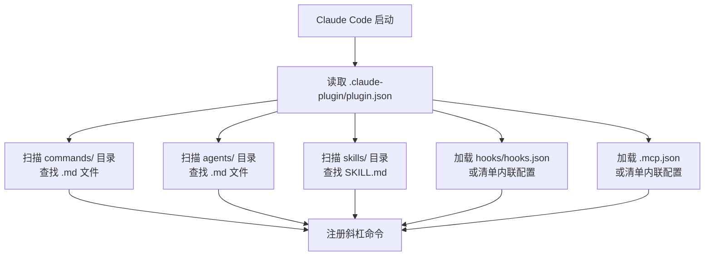

Claude Code 的插件系统是它最强大的扩展能力。理解插件架构，你就掌握了让 AI 按你的方式工作的钥匙。

## 插件是什么

Claude Code 插件是**扩展包**，它们通过自定义命令、代理、技能、钩子和 MCP 服务器来增强 Claude Code 的能力。

> "Claude Code plugins are extensions that enhance Claude Code with custom slash commands, specialized agents, hooks, and MCP servers. Plugins can be shared across projects and teams, providing consistent tooling and workflows." —— 官方文档

一句话：**插件 = 命令 + 代理 + 技能 + 钩子 + MCP 服务的有机组合**。

## 目录结构

每个插件遵循标准的目录布局：

```
plugin-name/
├── .claude-plugin/
│   └── plugin.json          # 必需：插件清单
├── commands/                 # 斜杠命令（.md 文件）
├── agents/                   # 子代理定义（.md 文件）
├── skills/                   # 代理技能（子目录）
│   └── skill-name/
│       └── SKILL.md         # 每个技能必需
├── hooks/
│   └── hooks.json           # 事件处理器配置
├── .mcp.json                # MCP 服务器定义
├── scripts/                 # 辅助脚本和工具
└── README.md                # 插件文档
```

### 关键规则

1. **清单位置**：`plugin.json` **必须**在 `.claude-plugin/` 目录下
2. **组件位置**：所有组件目录（commands、agents、skills、hooks）**必须**在插件根目录，**不是**嵌套在 `.claude-plugin/` 里
3. **可选组件**：只创建插件实际用到的目录
4. **命名约定**：全部使用 kebab-case

## 插件清单（plugin.json）

清单是插件的身份证，定义元数据和配置。

### 必需字段

```json
{
  "name": "plugin-name"
}
```

**name 要求：**
- kebab-case 格式（小写 + 连字符）
- 在已安装插件中必须唯一
- 无空格和特殊字符
- 例如：`code-review-assistant`、`test-runner`

### 推荐元数据

```json
{
  "name": "plugin-name",
  "version": "1.0.0",
  "description": "Brief explanation of plugin purpose",
  "author": {
    "name": "Author Name",
    "email": "author@example.com",
    "url": "https://example.com"
  },
  "homepage": "https://docs.example.com",
  "repository": "https://github.com/user/plugin-name",
  "license": "MIT",
  "keywords": ["testing", "automation", "ci-cd"]
}
```

### 组件路径配置

可以自定义组件路径（补充默认目录，不替换）：

```json
{
  "name": "plugin-name",
  "commands": "./custom-commands",
  "agents": ["./agents", "./specialized-agents"],
  "hooks": "./config/hooks.json",
  "mcpServers": "./.mcp.json"
}
```

**路径规则：**
- 必须相对于插件根目录
- 必须以 `./` 开头
- 不支持绝对路径
- 支持数组指定多个位置

### 源码实例

来自 `code-review` 插件的清单：

```json
{
  "name": "code-review",
  "description": "Automated code review for pull requests using multiple specialized agents with confidence-based scoring",
  "version": "1.0.0",
  "author": {
    "name": "Boris Cherny",
    "email": "boris@anthropic.com"
  }
}
```

来自 `hookify` 插件的清单：

```json
{
  "name": "hookify",
  "description": "Easily create custom hooks to prevent unwanted behaviors by analyzing conversation patterns or from explicit instructions. Define rules via simple markdown files.",
  "version": "0.1.0",
  "author": {
    "name": "Daisy Hollman",
    "email": "daisy@anthropic.com"
  }
}
```

## 自动发现机制

Claude Code 自动发现和加载组件，无需手动注册：



**发现时机：**
- 插件安装时：组件注册到 Claude Code
- 插件启用时：组件变为可用
- 无需重启：变更在下一个会话生效

## 可移植路径：${CLAUDE_PLUGIN_ROOT}

这是插件开发中**最重要的概念**。

插件安装在不同位置，取决于：
- 用户安装方式（marketplace、本地、npm）
- 操作系统约定
- 用户偏好

所以**永远不要硬编码路径**，使用 `${CLAUDE_PLUGIN_ROOT}` 环境变量：

```json
{
  "type": "command",
  "command": "bash ${CLAUDE_PLUGIN_ROOT}/scripts/validate.sh"
}
```

### 使用场景

| 位置 | 格式 | 示例 |
|------|------|------|
| 清单 JSON 字段 | `${CLAUDE_PLUGIN_ROOT}/path` | `"command": "${CLAUDE_PLUGIN_ROOT}/scripts/run.sh"` |
| 组件 Markdown | `${CLAUDE_PLUGIN_ROOT}/path` | `Reference: ${CLAUDE_PLUGIN_ROOT}/docs/api.md` |
| 执行脚本 | 环境变量 | `source "${CLAUDE_PLUGIN_ROOT}/lib/common.sh"` |

### 绝对不要

- 硬编码绝对路径：`/Users/name/plugins/...`
- 相对工作目录的路径：`./scripts/...`
- Home 目录快捷方式：`~/plugins/...`

## 文件命名约定

### 组件文件

| 组件 | 格式 | 示例 |
|------|------|------|
| 命令 | kebab-case `.md` | `code-review.md` → `/code-review` |
| 代理 | kebab-case `.md` | `test-generator.md` |
| 技能 | kebab-case 目录名 | `api-testing/` |

### 支持文件

| 类型 | 格式 | 示例 |
|------|------|------|
| 脚本 | kebab-case + 扩展名 | `validate-input.sh`、`generate-report.py` |
| 文档 | kebab-case `.md` | `api-reference.md` |
| 配置 | 标准名称 | `hooks.json`、`.mcp.json`、`plugin.json` |

## 三种插件模式

### 最小插件

只有一个命令，没有其他依赖：

```
my-plugin/
├── .claude-plugin/
│   └── plugin.json    # 只有 name 字段
└── commands/
    └── hello.md       # 单个命令
```

适合：简单工具、单一功能。

### 标准插件

有多个组件类型：

```
my-plugin/
├── .claude-plugin/
│   └── plugin.json
├── commands/          # 用户命令
├── agents/            # 专业化代理
└── skills/            # 自动激活技能
```

适合：大多数插件。

### 完整插件

包含所有组件类型：

```
my-plugin/
├── .claude-plugin/
│   └── plugin.json
├── commands/          # 用户命令
├── agents/            # 专业化代理
├── skills/            # 自动激活技能
├── hooks/
│   ├── hooks.json
│   └── scripts/
├── .mcp.json          # 外部集成
└── scripts/           # 共享工具
```

适合：复杂的企业级插件。

### 技能专用插件

只提供技能：

```
my-plugin/
├── .claude-plugin/
│   └── plugin.json
└── skills/
    ├── skill-one/
    │   └── SKILL.md
    └── skill-two/
        └── SKILL.md
```

适合：纯知识注入型插件。

## 官方插件结构总览

源码中 12 个官方插件的结构对比：

| 插件 | commands | agents | skills | hooks | MCP | 复杂度 |
|------|:-------:|:------:|:------:|:-----:|:---:|--------|
| commit-commands | 3 | - | - | - | - | 简单 |
| security-guidance | - | - | - | 1 | - | 简单 |
| explanatory-output-style | - | - | - | 1 | - | 简单 |
| learning-output-style | - | - | - | 1 | - | 简单 |
| claude-opus-4-5-migration | - | - | 1 | - | - | 简单 |
| frontend-design | - | - | 1 | - | - | 简单 |
| code-review | 1 | 5 | - | - | - | 中等 |
| pr-review-toolkit | 1 | 6 | - | - | - | 中等 |
| feature-dev | 1 | 3 | - | - | - | 复杂 |
| agent-sdk-dev | 1 | 2 | - | - | - | 复杂 |
| ralph-wiggum | 2 | - | - | 1 | - | 复杂 |
| hookify | 4 | 1 | 1 | 1 | - | 复杂 |
| plugin-dev | 1 | 3 | 7 | - | - | 最复杂 |

规律：
- **简单插件**：通常只有一种组件（命令或钩子）
- **中等插件**：命令 + 代理组合
- **复杂插件**：多种组件协同，有状态管理
- **最复杂**：plugin-dev 有 7 个技能，是"用插件开发插件"的元工具

## 常见问题排查

**组件未加载：**
- 确认文件在正确目录，扩展名正确
- 检查 YAML frontmatter 语法
- 确认技能目录下有 `SKILL.md`（不是 README.md）
- 确认插件在设置中已启用

**路径解析错误：**
- 把所有硬编码路径替换为 `${CLAUDE_PLUGIN_ROOT}`
- 确认路径是相对路径，以 `./` 开头
- 检查引用的文件是否存在

**自动发现不工作：**
- 确认目录在插件根目录（不是 `.claude-plugin/` 里）
- 检查文件命名遵循 kebab-case
- 重启 Claude Code 重新加载

**插件冲突：**
- 使用唯一、描述性的组件名称
- 必要时给命令加插件名前缀
- 在 README 中记录潜在冲突

## 本章小结

**一句话记住**：插件是一个标准目录结构的扩展包——清单是身份证，组件是能力，`${CLAUDE_PLUGIN_ROOT}` 是通行证。

**决策规则**：
- 只需一个斜杠命令 → 最小插件（plugin.json + commands/）
- 命令 + 代理 + 技能组合 → 标准插件
- 还需要钩子、MCP、共享脚本 → 完整插件
- 只注入知识不需要行为 → 技能专用插件

**最容易踩的坑**：把组件目录放在 `.claude-plugin/` 里面——组件必须在插件根目录，只有 `plugin.json` 住在 `.claude-plugin/` 下。

**现在就试**：用 `echo '{"name":"my-first-plugin"}' > .claude-plugin/plugin.json && mkdir commands` 创建一个最小插件骨架，感受自动发现的工作方式。

👉 接下来我们深入插件命令开发，看看 Markdown 文件如何变成 Claude 的操作手册

---

**系列目录**：
- [第一章：Claude Code 是什么 —— 终端里的 AI 编码伙伴](./../01-intro/01-what-is-claude-code.md)
- [第二章：安装与上手 —— 从 curl 到第一个命令](./../01-intro/02-installation-setup.md)
- [第三章：权限模型 —— ask/allow/deny 与沙箱](./../01-intro/03-permission-model.md)
- [第四章：斜杠命令 —— 自定义提示词的标准化方法](./../02-core/04-slash-commands.md)
- [第五章：Hooks 系统 —— 事件驱动的自动化引擎](./../02-core/05-hooks-system.md)
- [第六章：两种钩子对比 —— Prompt 钩子 vs Command 钩子](./../02-core/06-prompt-hooks-vs-command-hooks.md)
- 第七章：插件架构 —— 目录结构、自动发现与清单 👈 当前位置
- [第八章：插件命令开发 —— frontmatter、动态参数、bash 执行](./08-plugin-commands.md) 👉 下一章
- [第九章：插件代理开发 —— 触发机制、系统提示词设计](./09-plugin-agents.md)
- [第十章：插件技能开发 —— 渐进式披露与 SKILL.md](./10-plugin-skills.md)
- [第十一章：插件钩子开发 —— hooks.json 与可移植路径](./11-plugin-hooks.md)
- [第十二章：MCP 集成 —— stdio/SSE/HTTP/WebSocket 四种模式](./12-mcp-integration.md)
- [第十三章：插件配置 —— .local.md 模式与 YAML frontmatter](./13-plugin-settings.md)
- [第十六章：commit-commands —— 最简命令插件](./../04-plugin-deep-dives/16-commit-commands.md)
- [第十七章：security-guidance —— 安全钩子实战](./../04-plugin-deep-dives/17-security-guidance.md)
- [第十八章：code-review —— 多代理并行审查](./../04-plugin-deep-dives/18-code-review.md)
- [第十九章：feature-dev —— 7 阶段功能开发工作流](./../04-plugin-deep-dives/19-feature-dev.md)
- [第二十章：hookify —— 零代码创建钩子规则](./../04-plugin-deep-dives/20-hookify.md)
- [第二十一章：plugin-dev —— 用插件开发插件的元工具](./../04-plugin-deep-dives/21-plugin-dev-toolkit.md)
- [第二十二章：设置层级 —— 企业/用户/项目三层配置](./../05-enterprise/22-settings-hierarchy.md)
- [第二十三章：MDM 部署 —— Jamf/Intune/Group Policy 推送](./../05-enterprise/23-mdm-deployment.md)
- [第二十四章：Marketplace —— 插件发布与分发](./../05-enterprise/24-marketplace.md)
- [第二十五章：多代理模式 —— 并行代理编排与工作流](./../06-advanced/25-multi-agent-patterns.md)
- [第二十六章：Hookify 进阶 —— 多条件规则与操作符](./../06-advanced/26-hookify-advanced-rules.md)
- [第二十七章：从零构建完整插件 —— 端到端实战](./../06-advanced/27-building-complete-plugin.md)

