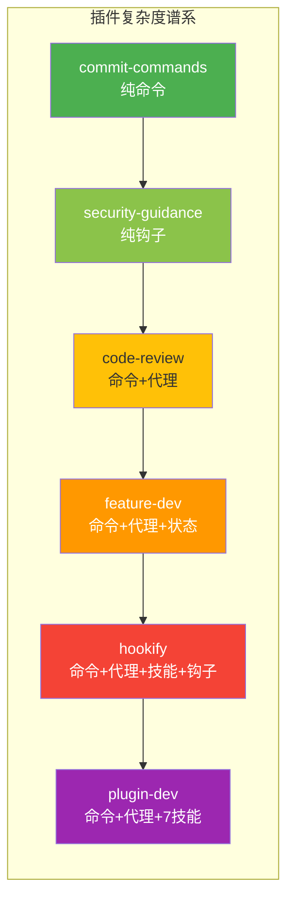
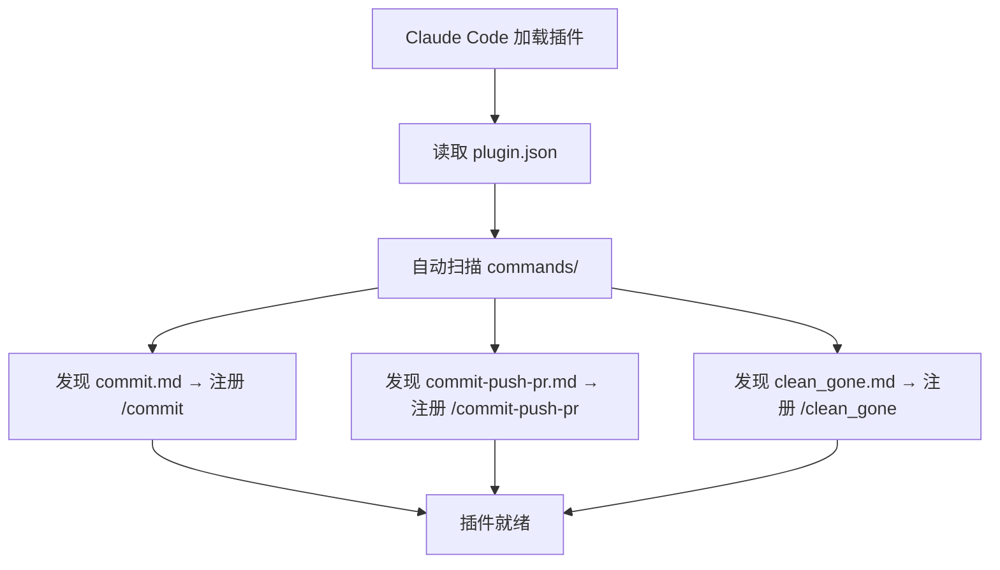
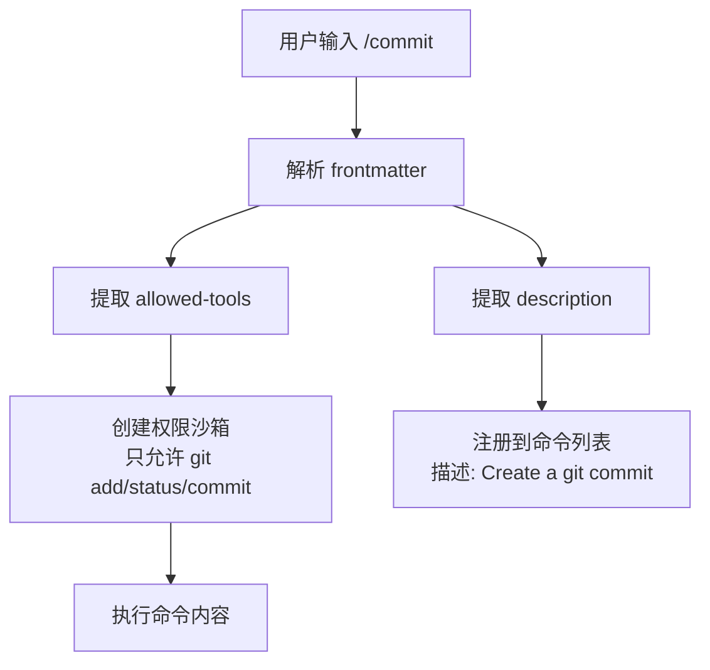
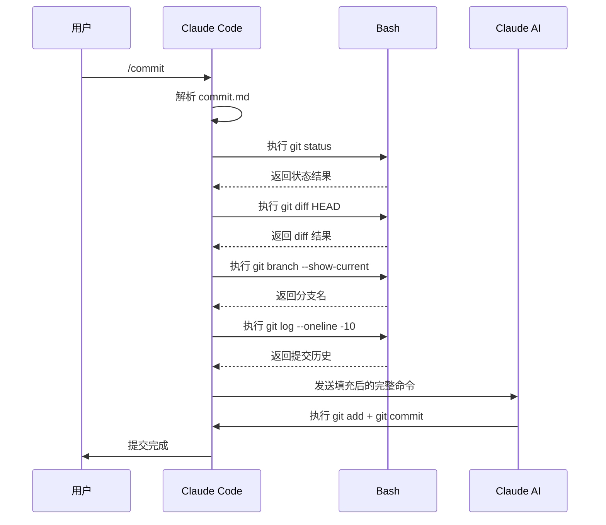
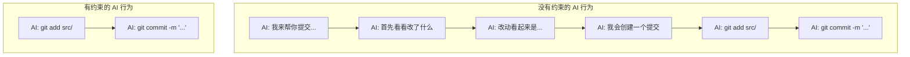
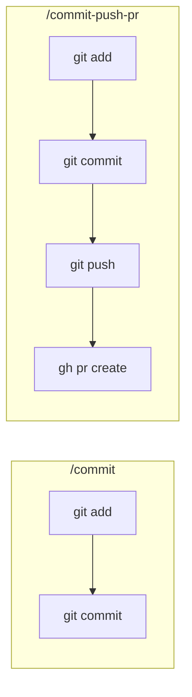
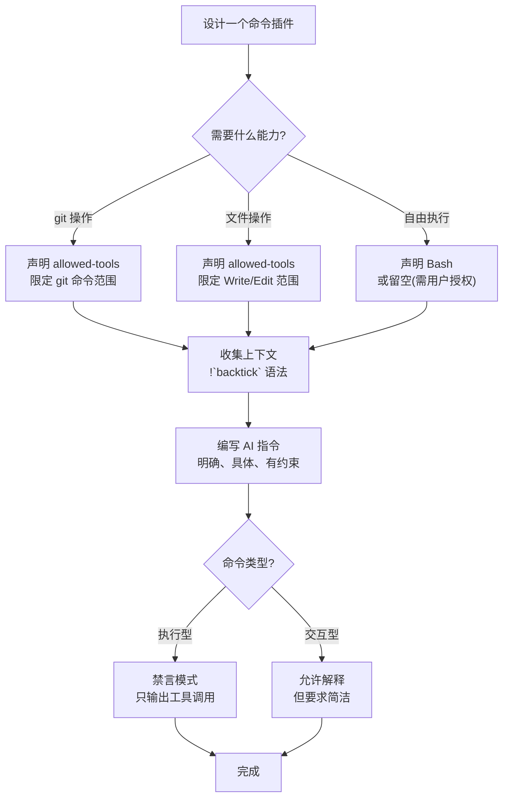

学习插件开发，从哪里开始？答案就在你眼前：**commit-commands**，官方 12 个插件中最简单的一个。它只有 `plugin.json` 和 3 个命令文件，没有任何代理、技能或钩子。但恰恰是这种极简，让它成为理解插件机制的完美起点。

## 为什么从最简插件开始

插件开发最大的陷阱是"一次做太多"。很多人一上来就想做命令 + 代理 + 钩子的全功能插件，结果在组件交互中迷失。commit-commands 证明了：**一个好的插件不需要复杂，只需要做对一件事**。



commit-commands 位于最左端，是整个谱系的起点。掌握它，你就掌握了插件的核心骨架。

## 插件结构全貌

```
commit-commands/
├── .claude-plugin/
│   └── plugin.json
├── commands/
│   ├── commit.md
│   ├── commit-push-pr.md
│   └── clean_gone.md
└── README.md
```

整个插件只有 **5 个文件**，其中 `README.md` 是文档，真正起作用的只有 4 个：

| 文件 | 作用 | 行数 |
|------|------|------|
| `.claude-plugin/plugin.json` | 插件身份证 | 5 行 JSON |
| `commands/commit.md` | `/commit` 命令 | ~20 行 Markdown |
| `commands/commit-push-pr.md` | `/commit-push-pr` 命令 | ~25 行 Markdown |
| `commands/clean_gone.md` | `/clean_gone` 命令 | ~10 行 Markdown |

没有 Python 脚本，没有 TypeScript 代码，没有配置文件——纯 Markdown 驱动。这就是 Claude Code 插件系统的优雅之处：**命令的本质是写给 AI 的指令文档**。

## plugin.json 解析

```json
{
  "name": "commit-commands",
  "description": "Commands for git commit workflows including commit, push, and PR creation",
  "version": "1.0.0",
  "author": {"name": "Anthropic", "email": "support@anthropic.com"}
}
```

这是**最小可用的清单**。只有 4 个字段：

| 字段 | 必需？ | 说明 |
|------|--------|------|
| `name` | 必需 | 插件唯一标识，kebab-case 格式 |
| `description` | 推荐 | 一句话说明插件用途 |
| `version` | 推荐 | 语义化版本号 |
| `author` | 推荐 | 作者信息 |

注意这里**没有** `commands`、`agents`、`hooks` 等路径配置。为什么？因为 Claude Code 的自动发现机制——它默认扫描 `commands/` 目录下的 `.md` 文件，无需手动注册。



零配置，全自动。这是插件开发的"约定优于配置"哲学。

## 核心：commit.md 逐行解析

`commit.md` 是这个插件的核心，也是理解命令开发机制的最佳教材。让我们逐行拆解：

```markdown
---
allowed-tools: Bash(git add:*), Bash(git status:*), Bash(git commit:*)
description: Create a git commit
---

## Context

- Current git status: !`git status`
- Current git diff (staged and unstaged changes): !`git diff HEAD`
- Current branch: !`git branch --show-current`
- Recent commits: !`git log --oneline -10`

## Your task

Based on the above changes, create a single git commit.

You have the capability to call multiple tools in a single response. Stage and create the commit using a single message. Do not use any other tools or do anything else. Do not send any other text or messages besides these tool calls.
```

### YAML Frontmatter：权限声明

```yaml
allowed-tools: Bash(git add:*), Bash(git status:*), Bash(git commit:*)
description: Create a git commit
```

这两行至关重要：

**`allowed-tools`** —— 最小权限原则的体现。它声明这个命令**只能**使用三种 Bash 操作：

| 允许的工具 | 通配符含义 | 对应操作 |
|-----------|-----------|---------|
| `Bash(git add:*)` | 任何 `git add` 参数 | 暂存文件 |
| `Bash(git status:*)` | 任何 `git status` 参数 | 查看状态 |
| `Bash(git commit:*)` | 任何 `git commit` 参数 | 创建提交 |

注意模式：`Bash(命令前缀:*)`。冒号前是命令前缀，星号是通配符。这意味着：
- `git add src/` 允许
- `git add -A` 允许
- `git push` **不允许**——不在 `allowed-tools` 列表中
- `rm -rf /` **不允许**——不是 `git` 命令

**`description`** —— 命令的一句话描述，显示在命令列表中。



### 动态上下文：!`backtick` 语法

```markdown
- Current git status: !`git status`
- Current git diff (staged and unstaged changes): !`git diff HEAD`
- Current branch: !`git branch --show-current`
- Recent commits: !`git log --oneline -10`
```

这是 Claude Code 命令中最强大的特性之一：**在命令执行前，动态注入 bash 执行结果**。

语法规则：
- `!`command`` —— 感叹号 + 反引号包裹的命令
- 在命令发送给 AI 之前，Claude Code 先执行这些 bash 命令
- 执行结果替换掉 `!`command`` 语法，成为 AI 看到的实际内容

举个例子，如果当前仓库状态是：

```bash
# AI 实际收到的内容（不是原始模板）
## Context

- Current git status: On branch feature/auth
Changes not staged for commit:
  modified:   src/auth/login.ts
  modified:   src/auth/logout.ts

- Current git diff (staged and unstaged changes):
  diff --git a/src/auth/login.ts b/src/auth/login.ts
  - const API_KEY = 'hardcoded-key';
  + const API_KEY = process.env.API_KEY;

- Current branch: feature/auth

- Recent commits:
  a1b2c3d Add logout functionality
  e4f5g6h Initialize auth module
```

AI 看到的是**实时数据**，不是模板。这就像在写一个函数时预先绑定了参数——命令执行的那一刻，所有上下文已经就位。



### 指令设计：写给 AI 的"系统提示词"

```markdown
## Your task

Based on the above changes, create a single git commit.

You have the capability to call multiple tools in a single response.
Stage and create the commit using a single message.
Do not use any other tools or do anything else.
Do not send any other text or messages besides these tool calls.
```

这段指令包含了三个精心设计的关键约束：

**约束 1：单次提交** —— "create a single git commit"

防止 AI 创建多个小提交。对于一个命令来说，原子性操作比细粒度更安全。

**约束 2：合并调用** —— "Stage and create the commit using a single message"

Claude Code 支持在一条消息中调用多个工具。这个约束要求 AI 把 `git add` 和 `git commit` 放在同一条回复中，避免多轮对话的开销。

**约束 3：禁言模式** —— "Do not send any other text or messages besides these tool calls"

这是**最关键的约束**。它要求 AI 只输出工具调用，不输出任何解释文字。为什么？

- **可靠性**：AI 如果输出文字解释，可能忘记执行工具调用
- **简洁性**：用户不需要 AI 解释它要做什么，只需要它做
- **确定性**：减少 AI "思考过多"导致偏离指令的风险



这种"禁言模式"的设计模式，适用于所有**纯执行型命令**——命令的目的是让 AI 完成操作，不是让它解释操作。

## 进阶：commit-push-pr.md

理解了 `commit.md` 的核心模式后，`commit-push-pr.md` 就是同一模式的自然延伸：

```markdown
---
allowed-tools: Bash(git add:*), Bash(git status:*), Bash(git commit:*), Bash(git push:*), Bash(gh pr create:*)
description: Create a git commit, push, and create a PR
---
```

对比 `commit.md` 的 `allowed-tools`，多了两个：

| 新增工具 | 用途 |
|---------|------|
| `Bash(git push:*)` | 推送到远程仓库 |
| `Bash(gh pr create:*)` | 使用 GitHub CLI 创建 PR |

上下文收集也更丰富——除了 git 状态和 diff，还会获取远程仓库信息和当前分支的追踪状态，以便正确推送和创建 PR。

**模式总结**：当你需要扩展一个命令的能力时，只需：
1. 在 `allowed-tools` 中添加新工具
2. 在 `!`backtick`` 中添加新的上下文
3. 在指令中描述新的任务步骤



## 补充：clean_gone.md

第三个命令处理的是 Git 工作流中的另一个痛点——清理已删除的远程分支的本地追踪引用：

```markdown
---
allowed-tools: Bash(git remote prune:*), Bash(git branch:*), Bash(git worktree:*)
description: Clean up local tracking references for deleted remote branches
---
```

这个命令体现了命令设计的另一个原则：**一个命令只做一件事**。`/commit` 负责提交，`/commit-push-pr` 负责提交+推送+PR，`/clean_gone` 负责分支清理。三个命令，三个独立的职责，而不是一个大而全的 `/git-all` 命令。

## 插件设计模式提炼

从 commit-commands 的源码中，我们可以提炼出**最简命令插件**的设计模式：



### 模式 1：最小权限

`allowed-tools` 只声明命令需要的工具。这不是安全 theater——它有实际好处：

- **防止意外**：AI 不能执行 `git push` 当你只想 `commit`
- **减少权限弹窗**：预声明的工具自动获得授权，用户无需确认
- **文档化意图**：从 `allowed-tools` 就能看出命令做什么

### 模式 2：预填上下文

用 `!`backtick`` 在命令执行前收集所有必要信息，AI 无需多轮提问：

```markdown
# 差：让 AI 自己问
Please check the current git status and create a commit.

# 好：预先提供上下文
Current git status: !`git status`
Current diff: !`git diff HEAD`
Based on the above, create a commit.
```

### 模式 3：明确约束

告诉 AI 不能做什么，比告诉它能做什么更重要：

```markdown
# 关键约束模板
Do not use any other tools or do anything else.       # 限制工具范围
Do not send any other text or messages besides...      # 限制输出格式
Stage and create the commit using a single message.    # 限制执行方式
```

### 模式 4：单一职责

每个命令只做一件事。复杂工作流通过多个命令组合实现，而不是把所有功能塞进一个命令。

## 动手：5 分钟创建你的第一个命令

理解了 commit-commands 的模式，你可以立刻创建自己的命令插件：

```bash
# 1. 创建插件目录
mkdir -p my-first-plugin/.claude-plugin
mkdir -p my-first-plugin/commands

# 2. 写清单
cat > my-first-plugin/.claude-plugin/plugin.json << 'EOF'
{
  "name": "my-first-plugin",
  "description": "My first Claude Code plugin",
  "version": "0.1.0"
}
EOF

# 3. 写命令
cat > my-first-plugin/commands/hello.md << 'EOF'
---
allowed-tools: Bash(echo:*)
description: Say hello with current time
---

## Context

- Current time: !`date`
- Current directory: !`pwd`
- Current user: !`whoami`

## Your task

Greet the user with the current time and directory. Use echo to output the greeting. Do not use any other tools.
EOF
```

安装后，`/hello` 命令就可以用了。整个过程没有写一行 Python 或 TypeScript。

## commit-commands 不做的事

理解一个插件"不做什么"同样重要：

| 不做的事 | 为什么不做 | 谁来做 |
|---------|-----------|--------|
| 安全审查提交内容 | 不在命令职责范围内 | security-guidance 插件的 Hook |
| 代码质量检查 | 不是 commit 的关注点 | code-review 插件的代理 |
| 生成 CHANGELOG | 需要额外逻辑和模板 | 可以写一个独立命令 |
| 交互式选择文件 | 命令设计为非交互式 | AI 自行判断哪些文件需要暂存 |

这种"不做"的克制，正是好插件的标志。它让每个组件保持聚焦，让组合成为可能。

## 本章小结

**一句话记住**：命令插件 = 给 AI 写一份带权限声明和预填数据的指令文档。

**决策规则**：
- 需要用户主动触发的操作 → 用命令插件（如 `/commit`）
- 命令只需执行不需解释 → 加禁言模式（"Do not send any other text"）
- 命令需要多个不相关能力 → 拆成多个单一职责命令，别做大而全

**最容易踩的坑**：在 `allowed-tools` 里写 `Bash` 而不加命令前缀限制，等于给了 AI 完全的 shell 权限，最小权限形同虚设。

**现在就试**：用 5 分钟创建一个 `commands/hello.md`，体验 `plugin.json` + `!`backtick`` + `allowed-tools` 三件套的完整流程。

👉 接下来我们看最简钩子插件：security-guidance

---

**系列目录**：
- [第一章：Claude Code 是什么 —— 终端里的 AI 编码伙伴](./../01-intro/01-what-is-claude-code.md)
- [第二章：安装与上手 —— 从 curl 到第一个命令](./../01-intro/02-installation-setup.md)
- [第三章：权限模型 —— ask/allow/deny 与沙箱](./../01-intro/03-permission-model.md)
- [第四章：斜杠命令 —— 自定义提示词的标准化方法](./../02-core/04-slash-commands.md)
- [第五章：Hooks 系统 —— 事件驱动的自动化引擎](./../02-core/05-hooks-system.md)
- [第六章：两种钩子对比 —— Prompt 钩子 vs Command 钩子](./../02-core/06-prompt-hooks-vs-command-hooks.md)
- [第七章：插件架构 —— 目录结构、自动发现与清单](./../03-plugins/07-plugin-architecture.md)
- [第八章：插件命令开发 —— frontmatter、动态参数、bash 执行](./../03-plugins/08-plugin-commands.md)
- [第九章：插件代理开发 —— 触发机制、系统提示词设计](./../03-plugins/09-plugin-agents.md)
- [第十章：插件技能开发 —— 渐进式披露与 SKILL.md](./../03-plugins/10-plugin-skills.md)
- [第十一章：插件钩子开发 —— hooks.json 与可移植路径](./../03-plugins/11-plugin-hooks.md)
- [第十二章：MCP 集成 —— stdio/SSE/HTTP/WebSocket 四种模式](./../03-plugins/12-mcp-integration.md)
- [第十三章：插件配置 —— .local.md 模式与 YAML frontmatter](./../03-plugins/13-plugin-settings.md)
- 第十六章：commit-commands —— 最简命令插件 👈 当前位置
- [第十七章：security-guidance —— 安全钩子实战](./17-security-guidance.md) 👉 下一章
- [第十八章：code-review —— 多代理并行审查](./18-code-review.md)
- [第十九章：feature-dev —— 7 阶段功能开发工作流](./19-feature-dev.md)
- [第二十章：hookify —— 零代码创建钩子规则](./20-hookify.md)
- [第二十一章：plugin-dev —— 用插件开发插件的元工具](./21-plugin-dev-toolkit.md)
- [第二十二章：设置层级 —— 企业/用户/项目三层配置](./../05-enterprise/22-settings-hierarchy.md)
- [第二十三章：MDM 部署 —— Jamf/Intune/Group Policy 推送](./../05-enterprise/23-mdm-deployment.md)
- [第二十四章：Marketplace —— 插件发布与分发](./../05-enterprise/24-marketplace.md)
- [第二十五章：多代理模式 —— 并行代理编排与工作流](./../06-advanced/25-multi-agent-patterns.md)
- [第二十六章：Hookify 进阶 —— 多条件规则与操作符](./../06-advanced/26-hookify-advanced-rules.md)
- [第二十七章：从零构建完整插件 —— 端到端实战](./../06-advanced/27-building-complete-plugin.md)

