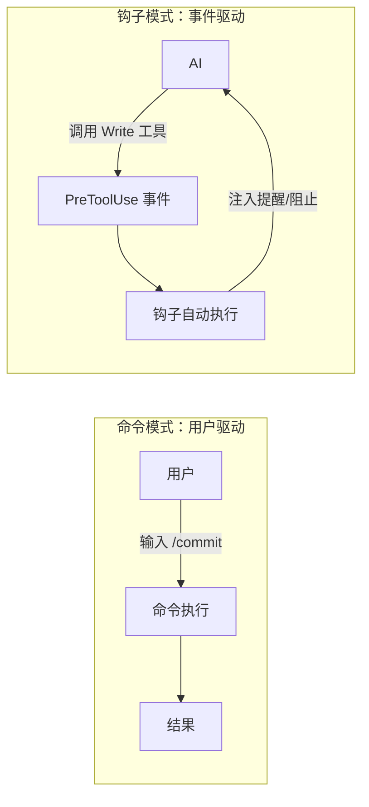
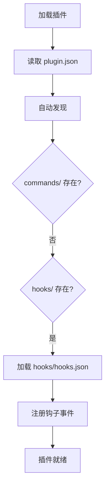
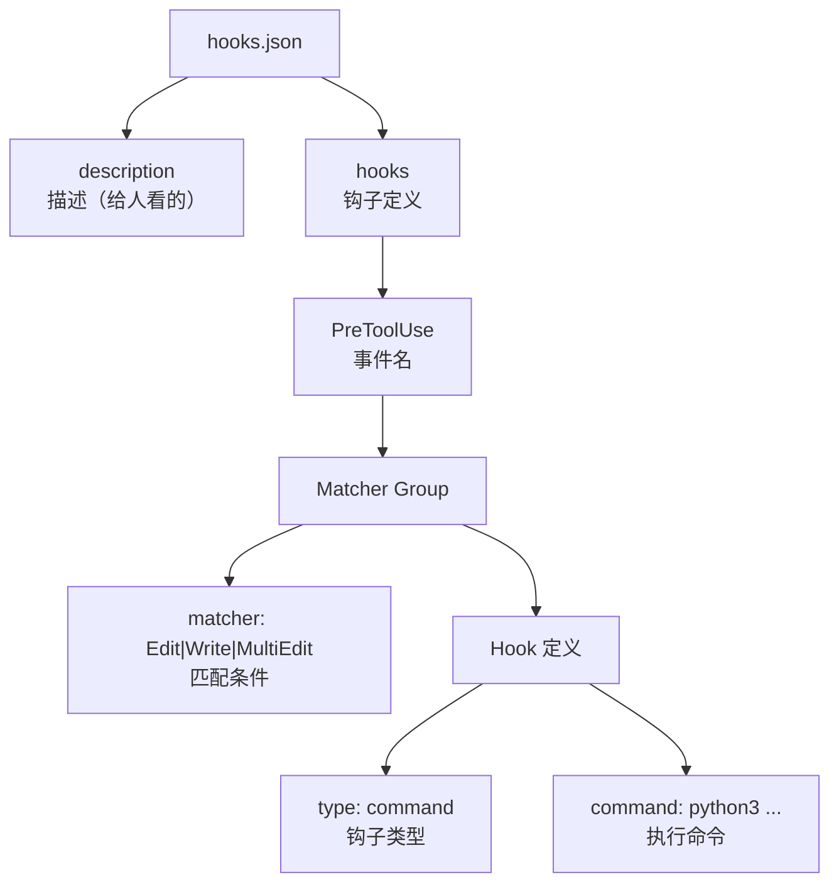
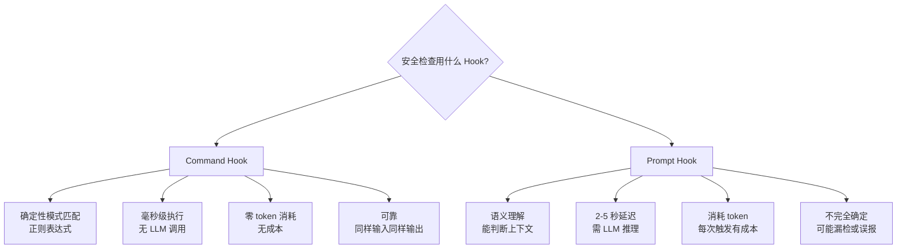
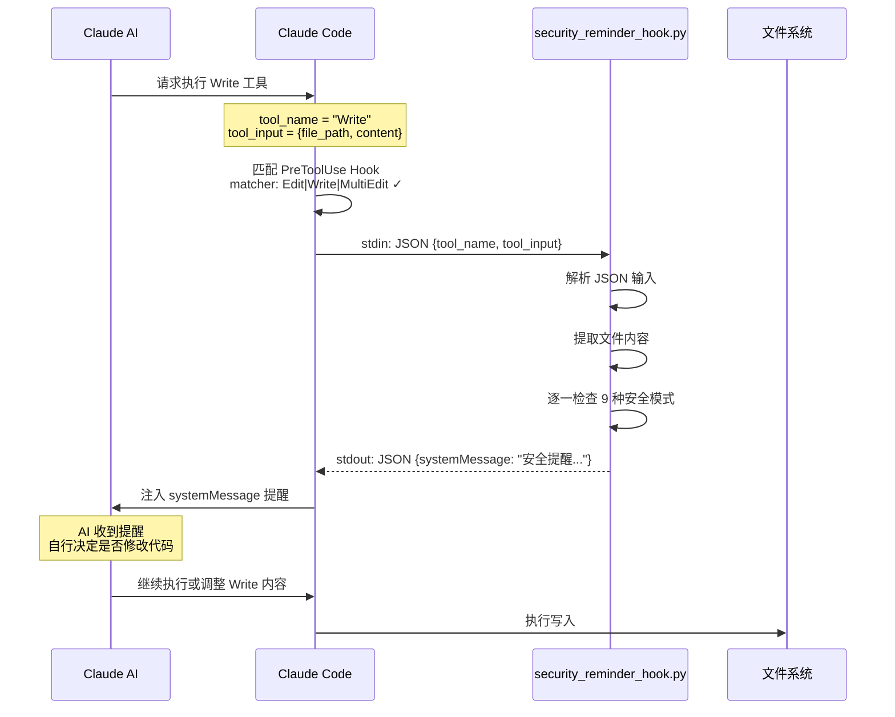
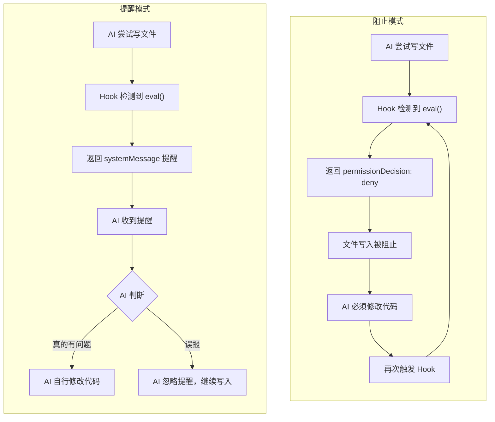
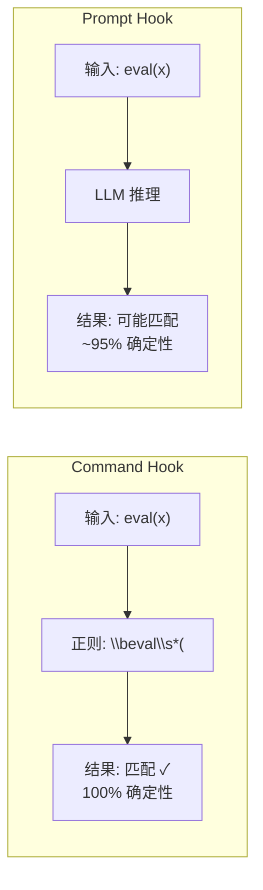
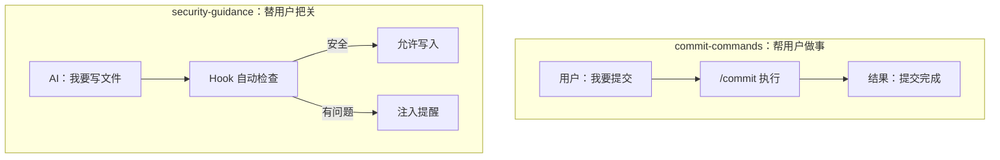

上一章我们看了最简命令插件 commit-commands。这一章转向插件的另一面：**钩子（Hooks）**。security-guidance 是官方 12 个插件中最简单的钩子插件——一个事件、一个匹配器、一个 Python 脚本。但"简单"不等于"浅显"，它完整展示了钩子插件从配置到执行的全链路。

## 从命令到钩子：思维转换

命令插件是**用户主动触发**的：你输入 `/commit`，命令才执行。钩子插件是**事件自动触发**的：AI 尝试写文件时，钩子自动介入。这两种模式解决的是不同的问题：



安全检查天然适合钩子模式——因为安全问题不该依赖用户"记得去检查"。每次 AI 编辑文件时自动提醒安全注意事项，比事后审查有效得多。

## 插件结构全貌

```
security-guidance/
├── .claude-plugin/
│   └── plugin.json
├── hooks/
│   ├── hooks.json
│   └── security_reminder_hook.py
└── README.md
```

注意和 commit-commands 的结构差异：

| 维度 | commit-commands | security-guidance |
|------|----------------|-------------------|
| 核心目录 | `commands/` | `hooks/` |
| 核心文件 | `.md` 命令文件 | `hooks.json` + Python 脚本 |
| 触发方式 | 用户输入斜杠命令 | AI 操作文件时自动触发 |
| 可见性 | 用户明确知道命令在执行 | 钩子在后台静默运行 |

没有 `commands/`，没有 `agents/`，没有 `skills/`——这是**纯钩子插件**的最小形态。

## plugin.json：极简清单

```json
{
  "name": "security-guidance",
  "description": "Security guidance hook that warns about potential security issues",
  "version": "1.0.0",
  "author": {"name": "Anthropic", "email": "support@anthropic.com"}
}
```

和 commit-commands 的清单一样简洁。注意这里**没有** `hooks` 路径配置——因为 Claude Code 默认在 `hooks/` 目录下查找 `hooks.json`。自动发现机制再次发挥作用。



## hooks.json：钩子的核心配置

```json
{
  "description": "Security reminder hook that warns about potential security issues when editing files",
  "hooks": {
    "PreToolUse": [{
      "hooks": [{
        "type": "command",
        "command": "python3 ${CLAUDE_PLUGIN_ROOT}/hooks/security_reminder_hook.py"
      }],
      "matcher": "Edit|Write|MultiEdit"
    }]
  }
}
```

让我们逐层拆解这个配置的结构：



### 事件选择：PreToolUse

为什么选择 `PreToolUse` 而不是 `PostToolUse`？

| 时机 | 效果 | 适合场景 |
|------|------|---------|
| **PreToolUse** | 在文件写入**之前**提醒 | 安全提醒、权限控制、参数修改 |
| PostToolUse | 在文件写入**之后**提醒 | 格式化、审计日志、结果验证 |

安全检查必须在写入前介入——如果文件已经写入了带有漏洞的代码，事后提醒的意义大打折扣。PreToolUse 让 AI 在写代码**之前**就收到安全提醒，有机会调整行为。

### 匹配器：Edit|Write|MultiEdit

`"Edit|Write|MultiEdit"` 匹配所有三种文件编辑工具：

| 工具 | 操作 |
|------|------|
| `Write` | 创建新文件或完整覆写 |
| `Edit` | 精确字符串替换 |
| `MultiEdit` | 多处同时替换 |

这三个工具是 AI 修改代码的唯一途径。匹配它们意味着**每次代码修改都会触发安全检查**，无一遗漏。

注意这里**没有**匹配 `Bash` 工具。如果 AI 通过 `bash echo "..." > file` 写文件，钩子不会触发。这是一个权衡：匹配所有工具（`"*"`）会增加不必要的性能开销，而通过 Bash 写文件在实践中很少见。

### 钩子类型：command

```json
"type": "command",
"command": "python3 ${CLAUDE_PLUGIN_ROOT}/hooks/security_reminder_hook.py"
```

这里选择了 **command hook** 而不是 prompt hook。为什么？



安全模式检查的核心需求是**确定性**——"代码里有没有 `eval()`？" 这个问题不需要 AI 来回答，正则表达式就够了。command hook 在这类场景下有三个显著优势：

1. **速度快**：Python 正则匹配是微秒级，LLM 推理是秒级
2. **零成本**：不消耗 token，可以频繁触发
3. **可靠性高**：正则不会"看漏"或"过度解读"

什么时候该用 prompt hook？当安全检查需要**理解语义**时——比如"这段代码是否有认证绕过的逻辑？" 这类问题需要 AI 的推理能力，正则无法胜任。

### 路径：${CLAUDE_PLUGIN_ROOT}

```json
"command": "python3 ${CLAUDE_PLUGIN_ROOT}/hooks/security_reminder_hook.py"
```

`${CLAUDE_PLUGIN_ROOT}` 是插件可移植性的关键。无论插件安装在哪里——用户目录、项目目录、npm 全局包——这个变量都会正确指向插件根目录。

对比错误写法：

```json
// 错误：硬编码路径
"command": "python3 /Users/bob/.claude/plugins/security-guidance/hooks/security_reminder_hook.py"

// 错误：相对路径（相对于什么？）
"command": "python3 ./hooks/security_reminder_hook.py"

// 正确：使用插件根变量
"command": "python3 ${CLAUDE_PLUGIN_ROOT}/hooks/security_reminder_hook.py"
```

## security_reminder_hook.py：安全模式引擎

这个 Python 脚本是插件的核心逻辑。它通过 stdin 接收 Hook 输入，分析文件内容，检测安全模式，然后通过 stdout 返回提醒消息。

### 执行流程



### 9 种安全检测模式

security_reminder_hook.py 检测 9 类常见安全问题：

| 模式 | 检测内容 | 严重度 | 示例 |
|------|---------|--------|------|
| 命令注入 | 未净化的用户输入拼接命令 | 高 | `os.system(user_input)` |
| XSS | 未转义的用户输入渲染 HTML | 高 | `innerHTML = userInput` |
| eval 使用 | 动态执行字符串代码 | 高 | `eval(user_data)` |
| 危险 HTML | 危险的 HTML 标签/属性 | 中 | `<iframe src="...">` |
| pickle 反序列化 | 加载不可信 pickle 数据 | 高 | `pickle.loads(data)` |
| os.system 调用 | 直接调用系统命令 | 中 | `os.system("rm -rf")` |
| 硬编码密钥 | 代码中的 API key/token | 高 | `API_KEY = "sk-..."` |
| SQL 注入 | 字符串拼接 SQL 查询 | 高 | `f"SELECT * FROM {table}"` |
| 路径遍历 | 未净化的文件路径 | 中 | `open(user_path)` |

### 脚本核心逻辑（伪代码）

```python
#!/usr/bin/env python3
import json
import sys
import re

# 安全模式定义
SECURITY_PATTERNS = [
    {
        "name": "Command Injection",
        "pattern": r"os\.system\s*\(|subprocess\.call\s*\([^)]*shell\s*=\s*True',
        "message": "Potential command injection: avoid os.system() or shell=True. Use subprocess with list args instead.",
    },
    {
        "name": "XSS Vulnerability",
        "pattern": r'innerHTML\s*=|\.html\s*\(\s*[^)]*\$|v-html\s*=',
        "message": "Potential XSS: avoid innerHTML or v-html with user input. Use textContent or template literals.",
    },
    {
        "name": "eval() Usage",
        "pattern": r'\beval\s*\(',
        "message": "Avoid eval(): it can execute arbitrary code. Use safer alternatives like ast.literal_eval() or JSON.parse().",
    },
    # ... 更多模式
]

def main():
    # 从 stdin 读取 Hook 输入
    hook_input = json.load(sys.stdin)

    # 提取工具输入中的文件内容
    tool_input = hook_input.get("tool_input", {})
    content = tool_input.get("content", "") or tool_input.get("new_string", "")

    if not content:
        # 没有内容可检查，正常放行
        print(json.dumps({}))
        sys.exit(0)

    # 逐一检查安全模式
    warnings = []
    for pattern_def in SECURITY_PATTERNS:
        if re.search(pattern_def["pattern"], content):
            warnings.append(f"- **{pattern_def['name']}**: {pattern_def['message']}")

    if warnings:
        # 生成安全提醒
        result = {
            "systemMessage": (
                "Security reminder - potential issues detected:\n\n"
                + "\n".join(warnings)
                + "\n\nPlease review and address these issues if they pose a real risk."
            )
        }
        print(json.dumps(result))
    else:
        # 没有问题，静默放行
        print(json.dumps({}))

    sys.exit(0)

if __name__ == "__main__":
    main()
```

### 设计决策：提醒而非阻止

注意脚本的核心设计：**它只提醒，不阻止**。

```python
# 提醒模式（当前实现）
result = {
    "systemMessage": "Security reminder - potential issues detected: ..."
}

# 阻止模式（未采用）
result = {
    "hookSpecificOutput": {
        "permissionDecision": "deny"  # 这会阻止文件写入
    }
}
```

为什么选择提醒模式？



阻止模式的问题是**误报会阻断工作流**。正则匹配是机械的，它无法区分：

- `eval(user_input)` —— 真正的危险
- `eval("2 + 2")` —— 无害的硬编码表达式
- `# Don't use eval()` —— 注释中的提及

提醒模式尊重 AI 的判断力。AI 收到安全提醒后，可以结合上下文决定是修改代码还是忽略误报。这是"Human-in-the-loop"的延伸——让 AI 自己充当安全审查的 first pass。

## 为什么没有用 prompt hook

如果用 prompt hook 来做安全检查，配置会是这样：

```json
{
  "type": "prompt",
  "prompt": "Check the code being written for security issues: command injection, XSS, eval usage, dangerous HTML, pickle deserialization, os.system calls, hardcoded secrets, SQL injection, and path traversal. Warn about any issues found but don't block the operation."
}
```

一行配置 vs 一个 Python 脚本，看起来 prompt hook 更简洁。但在安全检查场景下，command hook 有三个决定性优势：

### 优势 1：确定性

正则匹配是确定性的——同样的代码永远触发同样的结果。prompt hook 依赖 LLM 推理，可能今天检测到的问题明天漏了。安全检查最不能容忍的就是不确定性。



### 优势 2：性能

安全检查在**每次文件编辑时**都触发。假设一个开发者每天触发 50 次文件编辑：

| 维度 | Command Hook | Prompt Hook |
|------|-------------|-------------|
| 单次延迟 | ~10ms | ~3s |
| 每日总延迟 | ~0.5s | ~150s |
| Token 消耗 | 0 | ~50,000 |
| 成本（Sonnet） | $0 | ~$0.15/天 |

Command hook 的性能优势在频繁触发场景下非常显著。

### 优势 3：可审计性

正则模式是明确的规则，可以审查、测试和版本控制。Prompt hook 的行为依赖 LLM，难以编写回归测试。

### 什么时候 prompt hook 更适合

prompt hook 在需要**语义理解**的安全场景下更合适：

| 场景 | 适合的 Hook | 原因 |
|------|------------|------|
| 检测硬编码密钥 | Prompt | 需要理解什么是"看起来像密钥"的字符串 |
| 检测认证绕过逻辑 | Prompt | 需要理解代码的控制流和业务逻辑 |
| 检测 eval() 调用 | Command | 确定性模式匹配即可 |
| 检测不安全的反序列化 | Command | 固定的 API 调用模式 |
| 检测过度权限授予 | Prompt | 需要理解权限模型的语义 |

实际上，最理想的方案是**混合使用**：command hook 做第一轮快速确定性检查，prompt hook 做第二轮深度语义分析。这正是可组合性的力量——两种 hook 可以在同一事件上并行运行。

## 实战：扩展 security-guidance

理解了源码后，让我们看看如何扩展它。

### 扩展 1：添加新的安全模式

在 Python 脚本中添加新模式非常直接：

```python
SECURITY_PATTERNS = [
    # ... 现有模式 ...
    {
        "name": "Insecure CORS",
        "pattern": r'Access-Control-Allow-Origin\s*:\s*["\']?\*["\']?',
        "message": "Wildcard CORS header detected: avoid Access-Control-Allow-Origin: *. Specify explicit origins.",
    },
    {
        "name": "Debug Mode",
        "pattern": r'DEBUG\s*=\s*True|debug\s*=\s*true|app\.run\(.*debug\s*=\s*True',
        "message": "Debug mode enabled in production code. Set DEBUG=False for production deployments.",
    },
]
```

### 扩展 2：从提醒升级为阻止

对于高风险模式（如硬编码密钥），可以升级为阻止模式：

```python
CRITICAL_PATTERNS = ["eval\\s*\\(", "pickle\\.loads", "API_KEY\\s*=\\s*['\"]"]

# 在检查逻辑中
for pattern_def in SECURITY_PATTERNS:
    if re.search(pattern_def["pattern"], content):
        if pattern_def["name"] in CRITICAL_PATTERNS:
            # 关键问题：阻止执行
            result = {
                "hookSpecificOutput": {
                    "permissionDecision": "deny"
                },
                "systemMessage": f"BLOCKED: {pattern_def['message']}"
            }
            print(json.dumps(result))
            sys.exit(0)
        else:
            # 一般问题：仅提醒
            warnings.append(f"- **{pattern_def['name']}**: {pattern_def['message']}")
```

### 扩展 3：添加 PostToolUse 格式化检查

在 `hooks.json` 中添加另一个事件监听：

```json
{
  "description": "Security and quality hooks for file operations",
  "hooks": {
    "PreToolUse": [{
      "hooks": [{
        "type": "command",
        "command": "python3 ${CLAUDE_PLUGIN_ROOT}/hooks/security_reminder_hook.py"
      }],
      "matcher": "Edit|Write|MultiEdit"
    }],
    "PostToolUse": [{
      "hooks": [{
        "type": "command",
        "command": "python3 ${CLAUDE_PLUGIN_ROOT}/hooks/post_format_check.py"
      }],
      "matcher": "Write"
    }]
  }
}
```

## 和 commit-commands 的对比

两个最简插件分别代表了 Claude Code 扩展的两大范式：

| 维度 | commit-commands | security-guidance |
|------|----------------|-------------------|
| 扩展类型 | 命令 | 钩子 |
| 触发方式 | 用户主动 `/commit` | AI 编辑文件时自动触发 |
| 核心文件 | `.md` 命令文件 | `hooks.json` + Python 脚本 |
| 编程语言 | 纯 Markdown | Python + JSON |
| 权限模型 | `allowed-tools` 限制工具范围 | `matcher` 限制触发条件 |
| 用户感知 | 明确知道命令在执行 | 钩子在后台静默运行 |
| 设计哲学 | 帮用户做事 | 替用户把关 |
| 适用场景 | 标准化工作流 | 安全/质量门禁 |



## 本章小结

**一句话记住**：钩子插件 = 事件驱动的自动门禁，AI 每次操作都过一遍你的检查清单。

**决策规则**：
- 检查内容是确定性模式（如有没有 `eval()`）→ 用 command hook，微秒级零成本
- 检查内容需要语义理解（如"这段代码有没有认证绕过"）→ 用 prompt hook
- 不确定会不会误报 → 先用 `systemMessage` 提醒，别用 `permissionDecision: deny` 阻止

**最容易踩的坑**：用阻止模式拦截所有 `eval()` 匹配，结果注释中的 `# Don't use eval()` 也被拦截，工作流频频中断。

**现在就试**：在现有项目的 `.claude/hooks/` 下加一个 PreToolUse 钩子，匹配 `Write|Edit`，检测硬编码密钥模式，用 `systemMessage` 提醒而非阻止。

👉 接下来我们看多代理并行审查：code-review

---

**系列目录**：
- [第一章：Claude Code 是什么 —— 终端里的 AI 编码伙伴](./../01-intro/01-what-is-claude-code.md)
- [第二章：安装与上手 —— 从 curl 到第一个命令](./../01-intro/02-installation-setup.md)
- [第三章：权限模型 —— ask/allow/deny 与沙箱](./../01-intro/03-permission-model.md)
- [第四章：斜杠命令 —— 自定义提示词的标准化方法](./../02-core/04-slash-commands.md)
- [第五章：Hooks 系统 —— 事件驱动的自动化引擎](./../02-core/05-hooks-system.md)
- [第六章：两种钩子对比 —— Prompt 钩子 vs Command 钩子](./../02-core/06-prompt-hooks-vs-command-hooks.md)
- [第七章：插件架构 —— 目录结构、自动发现与清单](./../03-plugins/07-plugin-architecture.md)
- [第八章：插件命令开发 —— frontmatter、动态参数、bash 执行](./../03-plugins/08-plugin-commands.md)
- [第九章：插件代理开发 —— 触发机制、系统提示词设计](./../03-plugins/09-plugin-agents.md)
- [第十章：插件技能开发 —— 渐进式披露与 SKILL.md](./../03-plugins/10-plugin-skills.md)
- [第十一章：插件钩子开发 —— hooks.json 与可移植路径](./../03-plugins/11-plugin-hooks.md)
- [第十二章：MCP 集成 —— stdio/SSE/HTTP/WebSocket 四种模式](./../03-plugins/12-mcp-integration.md)
- [第十三章：插件配置 —— .local.md 模式与 YAML frontmatter](./../03-plugins/13-plugin-settings.md)
- [第十六章：commit-commands —— 最简命令插件](./16-commit-commands.md)
- 第十七章：security-guidance —— 安全钩子实战 👈 当前位置
- [第十八章：code-review —— 多代理并行审查](./18-code-review.md) 👉 下一章
- [第十九章：feature-dev —— 7 阶段功能开发工作流](./19-feature-dev.md)
- [第二十章：hookify —— 零代码创建钩子规则](./20-hookify.md)
- [第二十一章：plugin-dev —— 用插件开发插件的元工具](./21-plugin-dev-toolkit.md)
- [第二十二章：设置层级 —— 企业/用户/项目三层配置](./../05-enterprise/22-settings-hierarchy.md)
- [第二十三章：MDM 部署 —— Jamf/Intune/Group Policy 推送](./../05-enterprise/23-mdm-deployment.md)
- [第二十四章：Marketplace —— 插件发布与分发](./../05-enterprise/24-marketplace.md)
- [第二十五章：多代理模式 —— 并行代理编排与工作流](./../06-advanced/25-multi-agent-patterns.md)
- [第二十六章：Hookify 进阶 —— 多条件规则与操作符](./../06-advanced/26-hookify-advanced-rules.md)
- [第二十七章：从零构建完整插件 —— 端到端实战](./../06-advanced/27-building-complete-plugin.md)

