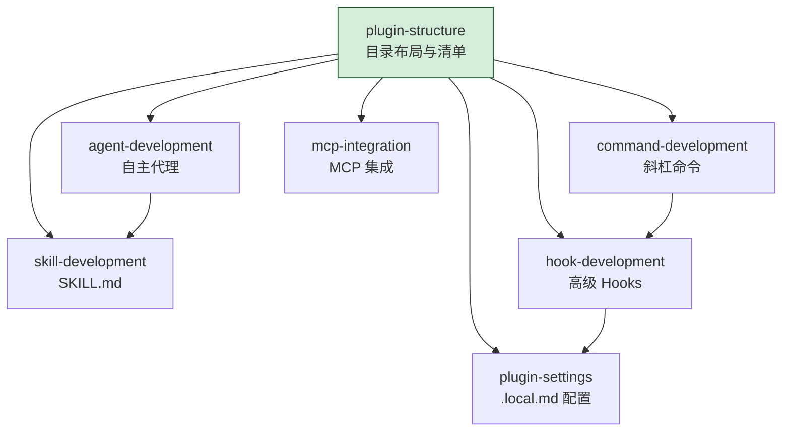
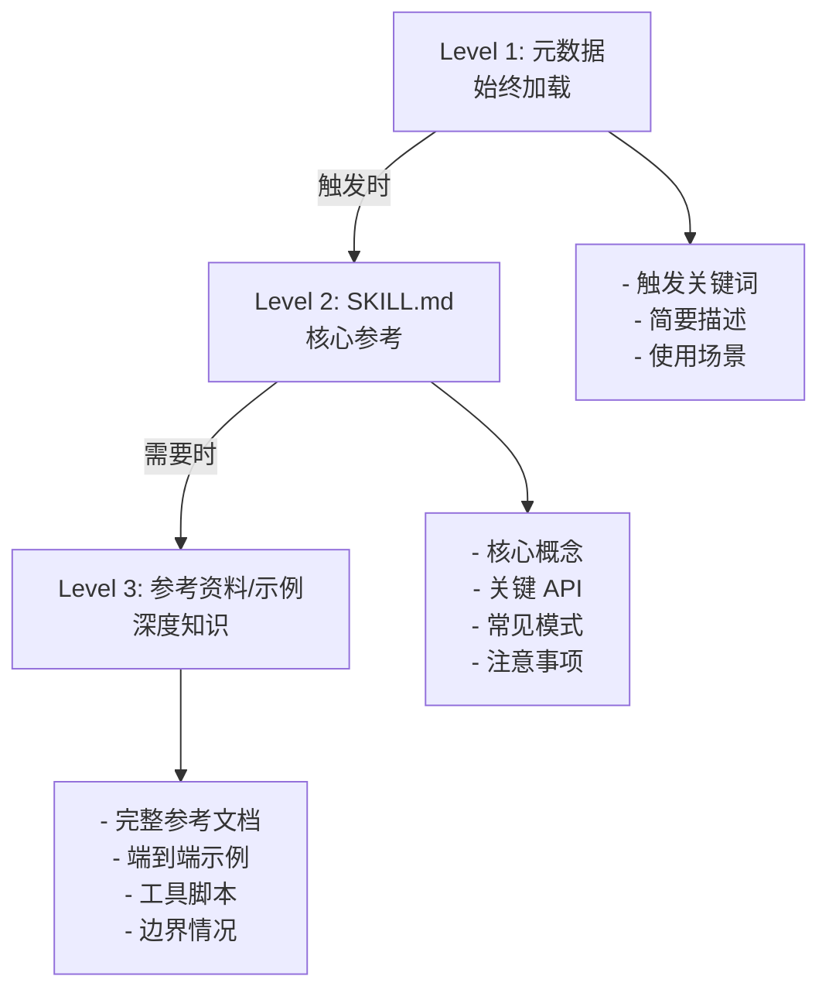
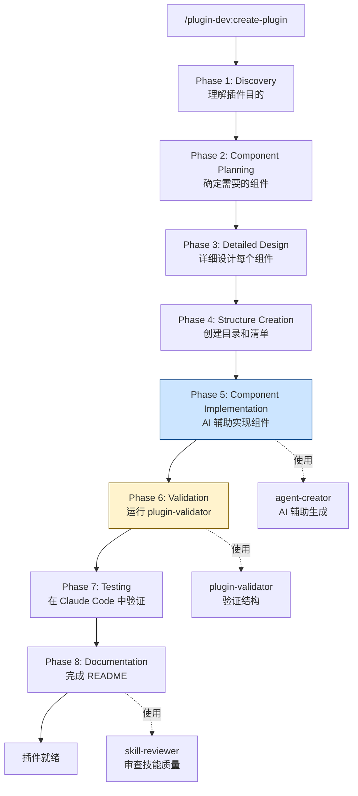
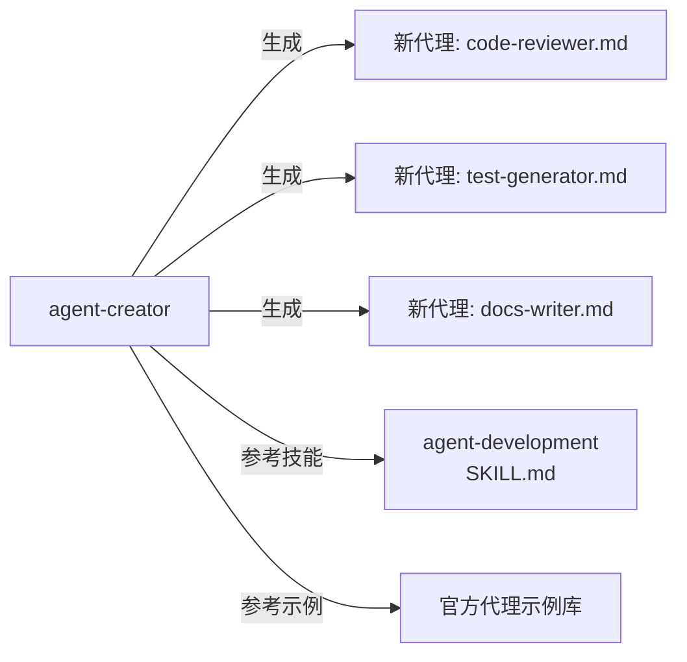

你学完了命令开发、代理开发、技能开发、钩子开发，也看了 6 个实战插件的源码。现在你想自己写一个插件，却发现仍然不知道从哪里开始——7 种组件类型、不同的 frontmatter 格式、复杂的目录结构、微妙的清单配置……知识点都在，但组装起来还是一头雾水。

**plugin-dev** 插件就是为解决这个"最后一公里"问题而存在的。它是一个**元工具**——一个帮你构建插件的插件。它用 7 个技能覆盖插件开发的每个方面，用 3 个代理提供 AI 辅助的生成和验证，用一个 8 阶段命令引导你从零到完整插件。最妙的是，它本身就是一个精心设计的插件——**学习 plugin-dev 的最佳方式就是研究 plugin-dev 的源码**。

## 插件结构

plugin-dev 是官方插件中**最复杂**的，拥有 1 个命令、3 个代理和 7 个技能：

```
plugin-dev/
├── .claude-plugin/
│   └── plugin.json
├── commands/
│   └── create-plugin.md   # /plugin-dev:create-plugin
├── agents/
│   ├── agent-creator.md      # AI 辅助生成代理
│   ├── plugin-validator.md   # 验证插件结构
│   └── skill-reviewer.md     # 审查技能质量
├── skills/
│   ├── hook-development/
│   │   └── SKILL.md          # (1,619 字)
│   ├── mcp-integration/
│   │   └── SKILL.md          # (1,666 字)
│   ├── plugin-structure/
│   │   └── SKILL.md          # (1,619 字)
│   ├── plugin-settings/
│   │   └── SKILL.md          # (1,623 字)
│   ├── command-development/
│   │   └── SKILL.md          # (1,535 字)
│   ├── agent-development/
│   │   └── SKILL.md          # (1,438 字)
│   └── skill-development/
│       └── SKILL.md          # (1,232 字)
└── README.md
```

## 7 个技能：知识体系的完整覆盖

plugin-dev 的 7 个技能覆盖了插件开发的每一个方面。每个技能都遵循相同的结构：核心知识 + 参考资料 + 示例 + 工具脚本。

### 技能总览

| 技能 | 覆盖内容 | 字数 | 参考资料 | 示例 | 脚本 |
|------|---------|------|---------|------|------|
| hook-development | 高级 Hooks API | 1,619 | 3 | 3 | 3 |
| mcp-integration | MCP Server 集成 | 1,666 | 3 | 3 | - |
| plugin-structure | 目录布局与清单 | 1,619 | 2 | 3 | - |
| plugin-settings | .local.md 配置 | 1,623 | 2 | 3 | 2 |
| command-development | 斜杠命令开发 | 1,535 | 有 | 有 | - |
| agent-development | 自主代理开发 | 1,438 | 3 | 2 | 1 |
| skill-development | SKILL.md 创建 | 1,232 | 有 | - | - |

**总计**：核心内容约 11,065 字，参考资料 10,000+ 字，12+ 个完整示例，6 个工具脚本。

### 技能间的依赖关系

7 个技能不是孤立的，它们构成了一个知识网络：



`plugin-structure` 是根基——所有其他技能都依赖于对插件目录结构的理解。`command-development` 和 `hook-development` 有交叉（命令可以触发钩子），`agent-development` 和 `skill-development` 有交叉（代理需要技能来扩展知识）。

### 渐进式披露的实例

每个技能都展示了渐进式披露的三层系统：



**Level 1**（元数据）：始终在上下文中，只占几十个 token。包含触发关键词和一句话描述，让 AI 知道"有这个技能可用"。

**Level 2**（SKILL.md）：当话题触发该技能时加载，包含核心知识和关键 API。约 1,200-1,600 字，是一个"刚好够用"的参考手册。

**Level 3**（参考资料/示例）：只有在需要深度信息时才加载。完整的代码示例、边缘情况处理、工具脚本等。可能数千字，但只在必要时消耗 token。

### 技能内容深度剖析

以 **hook-development** 技能为例（1,619 字 + 3 份参考资料 + 3 个示例 + 3 个脚本）：

**核心知识（SKILL.md 1,619 字）**：
- hooks.json 的 wrapper 格式详解
- 9 种事件的触发时机和输入输出
- matcher 的 4 种匹配语法
- Prompt Hook vs Command Hook 的选择策略
- `$CLAUDE_PLUGIN_ROOT` 可移植路径的使用

**3 份参考资料**：
- 完整的 hooks.json schema 文档
- 各事件的输入/输出字段完整列表
- 高级模式：链式 Hook、条件 Hook、动态 Hook

**3 个示例**：
- 简单：写入文件时的安全提醒
- 中等：PostToolUse 自动格式化
- 复杂：Stop Hook 的完成度验证

**3 个工具脚本**：
- `validate-hooks.sh`：验证 hooks.json 语法
- `test-hook.sh`：在本地测试 Hook 执行
- `debug-hook.sh`：输出 Hook 的输入/输出用于调试

这种结构确保了**按需加载**——日常开发只需要 1,619 字的核心知识，遇到复杂场景再深入参考资料。

## /plugin-dev:create-plugin 命令

这个命令是一个 8 阶段的交互式工作流，引导你从零构建一个完整的插件。

### 8 阶段流程



### 阶段详解

**Phase 1: Discovery** — 理解你要构建什么插件。命令会询问插件的目标用户、核心功能、与现有插件的区别。

**Phase 2: Component Planning** — 根据需求确定需要哪些组件类型。不是所有插件都需要所有组件——一个简单的工具可能只需要 1 个命令，而一个复杂的工作流可能需要命令 + 代理 + 技能 + 钩子的组合。

**Phase 3: Detailed Design** — 为每个组件编写详细的规格说明。这个阶段会引用对应的技能作为参考——设计命令时参考 `command-development`，设计代理时参考 `agent-development`，以此类推。

**Phase 4: Structure Creation** — 自动创建目录结构和 `plugin.json` 清单。这一步确保基础结构完全符合 Claude Code 的自动发现规范。

**Phase 5: Component Implementation** — 这是最核心的阶段。命令会启动 **agent-creator** 代理，AI 辅助生成每个组件的内容。agent-creator 拥有相关技能的引用，确保生成的组件遵循最佳实践。

**Phase 6: Validation** — 启动 **plugin-validator** 代理，检查：
- 目录结构是否正确
- plugin.json 是否有效
- 每个组件的 frontmatter 格式是否正确
- 引用的文件路径是否存在
- 工具列表是否合法

**Phase 7: Testing** — 在 Claude Code 中实际加载和测试插件。验证命令是否可调用、代理是否正确触发、技能是否按预期加载。

**Phase 8: Documentation** — 完善插件的 README，使用 **skill-reviewer** 审查技能文档的质量。

### 与 feature-dev 的对比

| 维度 | feature-dev | plugin-dev |
|------|------------|------------|
| 目标 | 开发功能 | 开发插件 |
| 阶段数 | 7 | 8 |
| 代理数量 | 3 类 | 3 类 |
| 技能数量 | 0 | 7 |
| 用户画像 | 功能开发者 | 插件开发者 |
| 产物 | 代码 | 插件包 |

关键差异：plugin-dev 多了**技能引用**这个维度——7 个技能在恰当的阶段被加载，为 AI 提供上下文知识。feature-dev 的代理不需要技能，因为功能开发的模式相对通用；plugin-dev 的代理需要技能，因为插件开发涉及特定格式和约定。

## 3 个代理

### agent-creator：AI 辅助的代理生成

agent-creator 是一个"递归"代理——它是一个帮你创建其他代理的代理。



它的核心能力：
- 根据需求描述生成代理的 frontmatter（name、description、tools、model、color）
- 设计代理的系统提示词结构
- 选择合适的工具集（最小权限原则）
- 生成触发条件和使用场景说明

### plugin-validator：结构验证

plugin-validator 检查插件是否符合 Claude Code 的规范。它执行一系列验证规则：

```
✓ plugin.json 在 .claude-plugin/ 目录下
✓ plugin.json 包含 name 字段
✓ name 使用 kebab-case 格式
✓ commands/ 目录下的文件都是 .md 格式
✓ agents/ 目录下的文件都是 .md 格式
✓ skills/ 下的子目录都有 SKILL.md
✓ hooks/hooks.json 格式正确（如果存在）
✓ .mcp.json 格式正确（如果存在）
✓ 所有 ${CLAUDE_PLUGIN_ROOT} 引用的路径存在
✗ agents/my-agent.md 缺少 name frontmatter 字段
✗ skills/empty-dir/ 下没有 SKILL.md
```

最后两行是**错误发现**——validator 会明确告诉你哪些地方不对，以及如何修复。

### skill-reviewer：技能质量审查

skill-reviewer 评估技能文档的质量，检查：

- SKILL.md 的字数是否在合理范围（太短不够用，太长浪费 token）
- 触发关键词是否足够精确（避免误触发或漏触发）
- 是否包含代码示例（抽象描述不如具体示例）
- 参考资料是否完整（高级场景的深度文档）
- 工具脚本是否存在（实践导向的技能需要配套脚本）

## "元"的本质：自指与自演示

plugin-dev 最独特的特质是它的**自指性**（self-referential）——它是一个插件，用插件的所有模式来教你构建插件。

### 自演示的三层对照

| 概念 | plugin-dev 如何演示 | 你学到的 |
|------|-------------------|---------|
| 命令开发 | `/plugin-dev:create-plugin` 本身就是命令 | frontmatter 格式、参数设计 |
| 代理开发 | agent-creator 本身就是代理 | 工具选择、系统提示词 |
| 技能开发 | 7 个 SKILL.md 就是技能范例 | 渐进式披露、触发设计 |
| 目录结构 | plugin-dev 的目录就是标准结构 | 命名约定、组件位置 |
| 清单配置 | plugin-dev 的 plugin.json 就是示范 | 必需字段、路径配置 |

**最佳学习路径**：打开 plugin-dev 的源码，逐个文件阅读。每个文件都是一个"活文档"——你看到 `agent-creator.md` 的 frontmatter，就知道代理的 frontmatter 长什么样；你看到 `hook-development/SKILL.md`，就知道技能的核心结构怎么写；你看到 `commands/create-plugin.md`，就知道多阶段命令如何编排。

### 递归的知识架构

plugin-dev 的知识架构是递归的：

```
plugin-dev 教你 → 如何创建插件 → 包括如何创建技能 → 包括如何创建 SKILL.md
                                    ↑
                         plugin-dev 的 7 个 SKILL.md 就是示范
```

这种递归不是循环论证，而是**分层参考**——你不需要理解所有层才能开始。先看 plugin-structure 技能了解基础，然后创建一个最简插件，再逐步添加组件，每一步都有对应的技能做参考。

## 渐进式披露的工程实践

plugin-dev 是渐进式披露模式最完整的工程实践。让我们看一个具体的例子：当你正在开发一个需要钩子的插件时，AI 如何分层加载知识。

### 场景：你正在开发一个带 PreToolUse 钩子的插件

**Level 1：始终加载的元数据**

AI 的上下文中始终包含所有 7 个技能的元数据（约 70 个 token 每个）：

```yaml
hook-development:
  triggers: [hooks.json, PreToolUse, PostToolUse, matcher, hook]
  description: "Advanced hooks API for Claude Code plugins"
```

当你说"我想给插件添加一个钩子，在写入文件前检查是否有密钥"，`hooks.json`、`PreToolUse`、`hook` 等关键词触发了 `hook-development` 技能。

**Level 2：SKILL.md 加载**

AI 加载 `hook-development/SKILL.md`（1,619 字），获得：

- hooks.json 的 wrapper 格式
- PreToolUse 事件的输入输出结构
- matcher 匹配语法
- Prompt Hook vs Command Hook 的选择
- 可移植路径的用法

基于这些知识，AI 可以帮你写出一个基本的钩子配置。

**Level 3：参考资料和示例（按需）**

如果你需要更高级的功能——比如"我想在 Hook 中修改工具参数"，AI 加载参考资料，获得 `updatedInput` 的完整用法和示例代码。

### Token 预算对比

| 加载层级 | 大约 Token 数 | 覆盖场景 |
|---------|-------------|---------|
| Level 1（7 个技能元数据） | ~500 | 识别技能触发 |
| Level 2（1 个 SKILL.md） | ~2,000 | 日常开发 |
| Level 3（参考资料 + 示例） | ~5,000-10,000 | 复杂场景 |

如果一次性加载所有 7 个技能的完整内容（Level 2 + Level 3），可能需要 50,000+ token。渐进式披露把日常开发的 token 消耗控制在 2,500 以内——**效率提升 20 倍**。

## 从 plugin-dev 到你的插件：实战路径

### 路径 1：最小插件

```
/plugin-dev:create-plugin
→ Phase 1: "我要一个快速提交代码的命令"
→ Phase 2: 只需要 1 个命令
→ Phase 3-8: 快速生成
```

结果：一个只有 `commands/` 目录和 `plugin.json` 的最简插件。5 分钟完成。

### 路径 2：中等插件

```
/plugin-dev:create-plugin
→ Phase 1: "我要一个代码审查插件，启动多个专业代理"
→ Phase 2: 命令 + 多个代理
→ Phase 3: 设计每个代理的职责和工具集
→ Phase 4-8: 逐步构建
```

结果：类似 code-review 的插件。1-2 小时完成。

### 路径 3：复杂插件

```
/plugin-dev:create-plugin
→ Phase 1: "我要一个功能开发工作流插件"
→ Phase 2: 命令 + 代理 + 技能 + 钩子
→ Phase 3: 设计 7 阶段工作流
→ Phase 4-8: 复杂的多组件实现
```

结果：类似 feature-dev 的插件。半天到一天完成。

### 关键洞察

plugin-dev 的存在改变了插件开发的经济学。在没有它的情况下，开发一个中等复杂度的插件可能需要：
- 反复查文档确认格式
- 试错调试清单配置
- 手动验证目录结构
- 来回修改 frontmatter

有了 plugin-dev，AI 带着完整的知识来帮你——它知道正确的格式、合适的工具集、最佳的结构。开发时间可以缩短 5-10 倍。

## plugin-dev 的局限

### 技能不能创造技能

plugin-dev 的 7 个技能教你怎么写 SKILL.md，但它们**不能替你决定技能的内容**。一个好的技能需要领域专业知识——你是测试专家，才能写出好的测试技能；你是安全专家，才能写出好的安全技能。plugin-dev 帮你把知识组织成正确的格式，但知识本身还得你来提供。

### 验证不能替代测试

plugin-validator 检查结构合规性，但不检查功能正确性。一个结构完美但逻辑错误的插件，validator 会全部标绿，但实际运行时可能完全不能工作。Phase 7 的手动测试仍然是不可替代的。

### 代理生成需要迭代

agent-creator 生成的代理初稿通常需要迭代修改。系统提示词的微调、工具集的增删、触发条件的细化——这些都是 AI 难以一次性做对的。把 agent-creator 的输出当成**起点**，而不是**终点**。

## 本章小结

**一句话记住**：plugin-dev = 自指的元工具——它用插件的所有模式教你构建插件，源码本身就是最佳教材。

**决策规则**：
- 想快速创建最简插件 → 用 `/plugin-dev:create-plugin`，5 分钟出结果
- 想了解某个组件类型的正确格式 → 打开 plugin-dev 源码中对应的文件当活文档看
- agent-creator 生成的代理初稿 → 当起点而非终点，系统提示词和工具集需要迭代微调

**最容易踩的坑**：以为 plugin-validator 全绿就等于插件能正常工作——结构验证不等于功能测试，Phase 7 的手动测试不可跳过。

**现在就试**：打开 plugin-dev 的源码目录，从 `plugin.json` 开始逐文件阅读——你看到的每个文件都是一个"活文档"，展示它所教的那类组件应该怎么写。

👉 接下来我们进入企业级配置的世界

---

**系列目录**：
- [第一章：Claude Code 是什么 —— 终端里的 AI 编码伙伴](./../01-intro/01-what-is-claude-code.md)
- [第二章：安装与上手 —— 从 curl 到第一个命令](./../01-intro/02-installation-setup.md)
- [第三章：权限模型 —— ask/allow/deny 与沙箱](./../01-intro/03-permission-model.md)
- [第四章：斜杠命令 —— 自定义提示词的标准化方法](./../02-core/04-slash-commands.md)
- [第五章：Hooks 系统 —— 事件驱动的自动化引擎](./../02-core/05-hooks-system.md)
- [第六章：两种钩子对比 —— Prompt 钩子 vs Command 钩子](./../02-core/06-prompt-hooks-vs-command-hooks.md)
- [第七章：插件架构 —— 目录结构、自动发现与清单](./../03-plugins/07-plugin-architecture.md)
- [第八章：插件命令开发 —— frontmatter、动态参数、bash 执行](./../03-plugins/08-plugin-commands.md)
- [第九章：插件代理开发 —— 触发机制、系统提示词设计](./../03-plugins/09-plugin-agents.md)
- [第十章：插件技能开发 —— 渐进式披露与 SKILL.md](./../03-plugins/10-plugin-skills.md)
- [第十一章：插件钩子开发 —— hooks.json 与可移植路径](./../03-plugins/11-plugin-hooks.md)
- [第十二章：MCP 集成 —— stdio/SSE/HTTP/WebSocket 四种模式](./../03-plugins/12-mcp-integration.md)
- [第十三章：插件配置 —— .local.md 模式与 YAML frontmatter](./../03-plugins/13-plugin-settings.md)
- [第十六章：commit-commands —— 最简命令插件](./16-commit-commands.md)
- [第十七章：security-guidance —— 安全钩子实战](./17-security-guidance.md)
- [第十八章：code-review —— 多代理并行审查](./18-code-review.md)
- [第十九章：feature-dev —— 7 阶段功能开发工作流](./19-feature-dev.md)
- [第二十章：hookify —— 零代码创建钩子规则](./20-hookify.md)
- 第二十一章：plugin-dev —— 用插件开发插件的元工具 👈 当前位置
- [第二十二章：设置层级 —— 企业/用户/项目三层配置](./../05-enterprise/22-settings-hierarchy.md) 👉 下一章
- [第二十三章：MDM 部署 —— Jamf/Intune/Group Policy 推送](./../05-enterprise/23-mdm-deployment.md)
- [第二十四章：Marketplace —— 插件发布与分发](./../05-enterprise/24-marketplace.md)
- [第二十五章：多代理模式 —— 并行代理编排与工作流](./../06-advanced/25-multi-agent-patterns.md)
- [第二十六章：Hookify 进阶 —— 多条件规则与操作符](./../06-advanced/26-hookify-advanced-rules.md)
- [第二十七章：从零构建完整插件 —— 端到端实战](./../06-advanced/27-building-complete-plugin.md)

