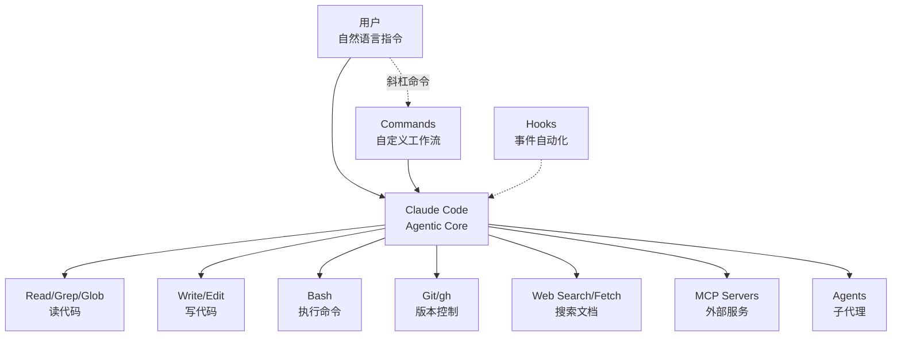
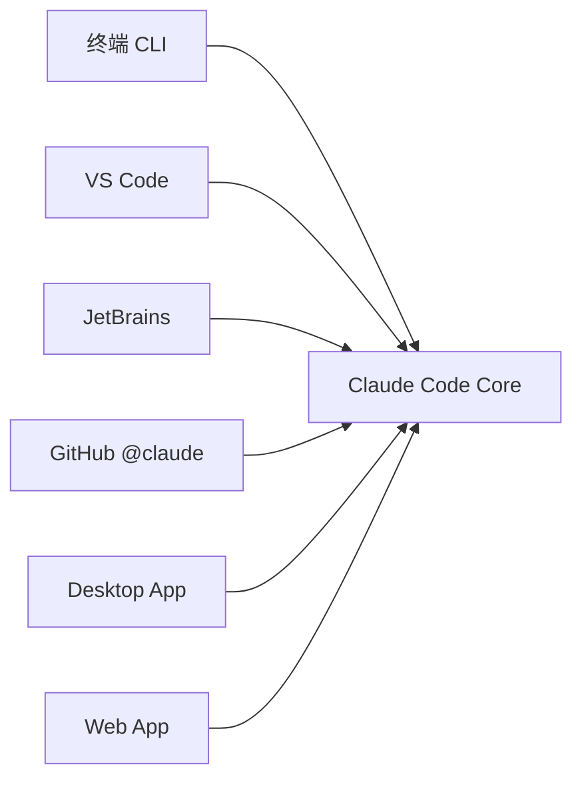
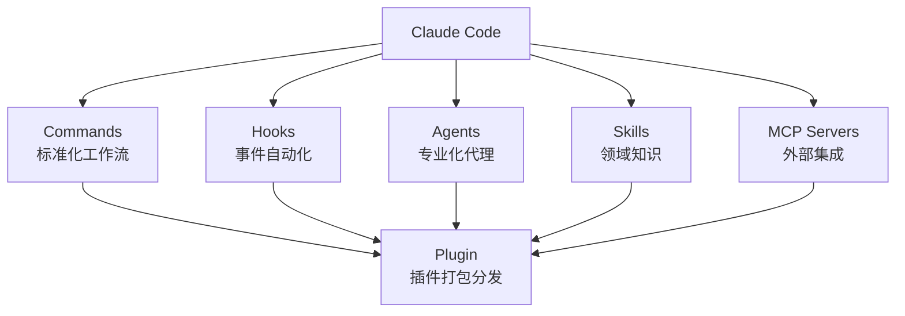

昨天你花了两小时手动审查 PR、写提交消息、跑测试。今天你还是在做这些。如果有人能帮你——

```bash
> 帮我审查这个 PR 里有没有安全漏洞
> 把这些改动提交了，消息按 conventional commits 格式
> 找到所有 TODO 注释，列个清单

✓ 3 分钟后，全部完成。
```

这就是 **Claude Code**：住在你终端里的 AI，能理解代码库、写代码、操作 Git、搜索文档，并且——和其他 AI 编码工具最大的不同——**可以自主执行多步任务**。你不是在"提问-回答"，而是在"委托-完成"。

## Claude Code 定义

Claude Code 是 Anthropic 官方的 **agentic coding tool**，直接运行在你的终端里，用自然语言理解需求，然后自主执行编码任务。

> "Claude Code is an agentic coding tool that lives in your terminal, understands your codebase, and helps you code faster by executing routine tasks, explaining complex code, and handling git workflows -- all through natural language commands." —— 官方 README

关键词拆解：

- **Agentic**：不只是问答，它能自主规划、执行多步操作
- **In your terminal**：原生 CLI 体验，不依赖 IDE 插件
- **Understands your codebase**：可以读文件、搜代码、跑命令，拥有完整上下文
- **Natural language commands**：说人话就行，不需要记特殊语法

## 核心架构

Claude Code 的设计哲学是：**让 AI 拥有和开发者一样的工具**。



核心工具集：

| 工具类别 | 具体工具 | 作用 |
|---------|---------|------|
| 文件读取 | Read, Grep, Glob | 理解代码库 |
| 文件写入 | Write, Edit, NotebookEdit | 修改代码 |
| 命令执行 | Bash | 运行构建、测试、部署 |
| 版本控制 | git, gh | 提交、推送、PR |
| 网络搜索 | WebSearch, WebFetch | 查文档、找答案 |
| 外部集成 | MCP Servers | 连接数据库、API 等 |
| 子代理 | Agents | 并行处理复杂任务 |

## 五种使用方式

Claude Code 不只是终端工具，它有五种入口：

### 1. 终端（主力）

```bash
claude
```

进入交互式 REPL，直接和 AI 对话。这是最常用的方式。

### 2. IDE 集成

- **VS Code**：侧边栏面板，边看代码边和 AI 聊
- **JetBrains**：同样有面板集成

### 3. GitHub @claude

在 GitHub PR/Issue 里 `@claude`，AI 就会自动审查代码、回复问题。

### 4. 桌面应用

macOS/Windows 原生桌面应用。

### 5. Web 应用

通过 claude.ai/code 访问。



## 扩展性：不只是聊天

Claude Code 最强大的地方在于它的**扩展系统**：

### 斜杠命令（Slash Commands）

把常用操作封装成一条命令：

```
/commit        → 自动分析变更，生成提交
/review        → 代码审查
/feature-dev   → 7阶段功能开发工作流
```

### Hooks（事件钩子）

在关键时刻自动执行逻辑：

```
PreToolUse  → 写文件前检查安全
Stop        → 退出前确认测试都跑了
SessionStart → 启动时加载项目上下文
```

### Agents（子代理）

启动专门化的 AI 代理并行工作：

```
code-reviewer   → 审查代码质量
code-architect  → 设计架构方案
security-reviewer → 安全审计
```

### Skills（技能）

给 AI 注入专业领域知识：

```
hook-development → 钩子开发指南
mcp-integration  → MCP 服务器集成
frontend-design  → 前端设计最佳实践
```

### MCP 服务器

连接外部服务：

```
Asana MCP   → 项目管理
GitHub MCP  → 代码托管
Database MCP → 数据库操作
```



所有这些扩展都可以**打包成插件**，通过 Marketplace 分享给团队或社区。

## Claude Code 的三个独特设计选择

市面上 AI 编码工具很多，Claude Code 做了三个与众不同的设计选择：

### 选择 1：终端原生，不绑 IDE

不用装 VS Code 扩展，不用切换到专用 IDE。在终端里 `claude` 一敲就能用——这在 SSH 远程服务器、Docker 容器、CI 环境里同样生效。你的工作流不需要改变。

### 选择 2：工具使用能力，而不只是代码生成

Claude Code 不只是"写代码给你看"。它能调用 7 种工具：读文件、写文件、执行命令、搜索代码、查 Git 历史、搜索网络、连接外部服务。这意味着它能**完成端到端的任务**——从分析问题到提交代码，一条指令搞定。

### 选择 3：可编程的扩展系统

自定义命令、事件钩子、专业化代理、领域知识注入、外部服务集成——五种扩展机制可以**打包成插件**，通过 Marketplace 分享。这不是"配置文件"级别的定制，而是"构建你自己的 AI 工作流"。

## 官方插件生态

源码仓库自带 12 个官方插件，从 3 个命令的极简插件到包含 7 个技能的元工具，覆盖 git 工作流、安全检查、代码审查、功能开发等全场景。我们会在[第七章](./../03-plugins/07-official-plugin-ecosystem.md)逐一解析官方插件，并在[第十五章](./../03-plugins/15-community-plugins.md)单独讨论社区优秀插件。

## 这个系列讲什么

本系列从 Claude Code 的基础概念出发，逐步深入到插件开发和企业级部署：

1. **入门认识**：Claude Code 是什么、怎么装、权限模型
2. **核心机制**：斜杠命令、Hooks 系统、两种钩子对比
3. **插件系统**：架构、命令、代理、技能、钩子、MCP、配置 —— 7大组件逐一讲解
4. **实战插件解析**：12个官方插件的源码级分析
5. **企业级部署**：设置层级、MDM、Marketplace
6. **高级模式**：多代理编排、Hookify 进阶、从零构建完整插件

## 本章小结

**一句话记住**：Claude Code = 终端里的 AI 开发者，不只是补全代码，而是用工具完成端到端任务。

**决策规则**：
- 需要在远程服务器/CI 中用 AI → 终端原生是唯一选择
- 需要端到端执行（不只看代码）→ 工具使用能力是关键
- 需要自定义工作流 → 可编程扩展系统

**最容易踩的坑**：把 Claude Code 当作"问答工具"——问它代码怎么写，然后手动复制粘贴。正确用法是让它**直接执行**：修 bug、写测试、提交代码，一条指令完成端到端任务。

**现在就试**：`claude` → 输入"这个项目是做什么的？" → 感受 AI 如何理解你的代码库。

👉 接下来我们安装并上手

