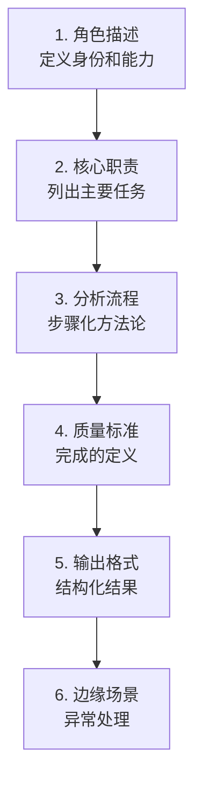
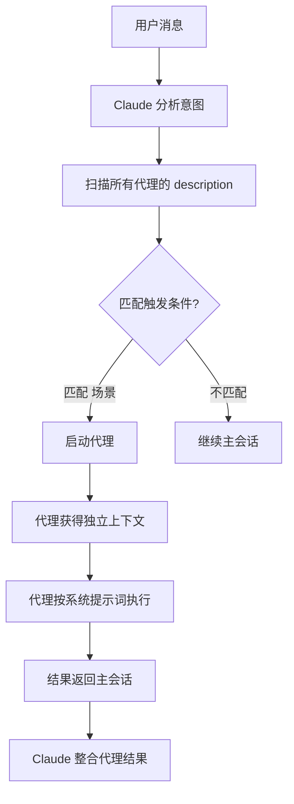
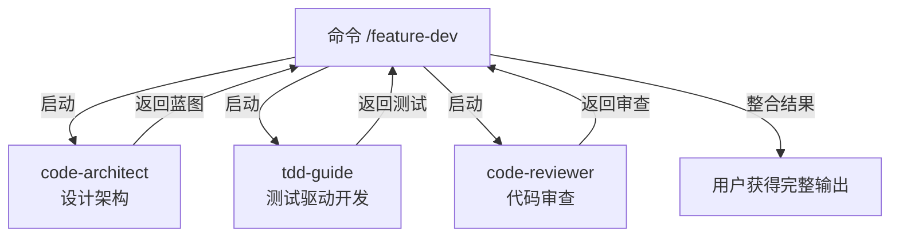
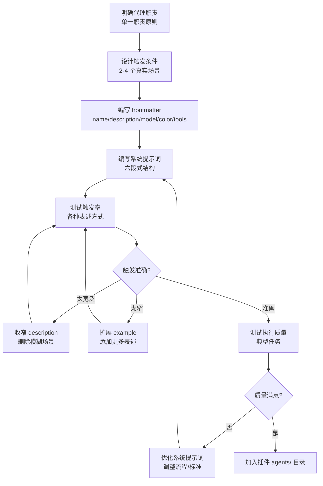

命令是用户主动调用的，代理是 Claude 自主决策启动的。理解这个区别，就理解了代理的本质——它是 Claude 的**自主子进程**，独立处理复杂的多步骤任务。

## 命令 vs 代理：本质区别

```mermaid
graph TD
    subgraph "命令：用户驱动"
        U1[用户输入 /review] --> CMD1[命令内容加载]
        CMD1 --> C1[Claude 执行指令]
    end
    subgraph "代理：Claude 驱动"
        U2[用户: "帮我审查这个 PR"] --> C2[Claude 判断需要审查]
        C2 --> |自动触发| AG1[启动 code-reviewer 代理]
        AG1 --> |独立执行| R1[审查结果返回]
        R1 --> C2
    end
```

| 维度 | 命令 (Command) | 代理 (Agent) |
|------|---------------|-------------|
| 触发方式 | 用户显式调用 `/command-name` | Claude 自主判断需要启动 |
| 执行模式 | 在主会话中执行 | 作为独立子进程执行 |
| 上下文 | 共享主会话上下文 | 获得独立的上下文窗口 |
| 用途 | 用户已知要做什么 | Claude 判断需要专业帮助 |
| 设计视角 | 写给 Claude 的指令 | 定义一个专业角色的完整人格 |

**一句话总结**：命令是 FOR 用户启动的操作，代理是 FOR Claude 自主调用的专家。

## 代理文件格式

代理是 Markdown 文件，包含 YAML frontmatter 和系统提示词：

```markdown
---
name: agent-identifier
description: Use this agent when [conditions]. Examples:
<example>
Context: [Situation description]
user: "[What the user might say]"
assistant: "[How Claude should respond]"
<commentary>[Why this triggers the agent]</commentary>
</example>
model: inherit
color: blue
tools: ["Read", "Write", "Grep"]
---

You are [role description]...

## Core Responsibilities
1. [Responsibility 1]
2. [Responsibility 2]

## Analysis Process
[Step-by-step methodology]

## Quality Standards
[What "done right" looks like]

## Output Format
[How to structure the response]

## Edge Cases
[What to watch out for]
```

## Frontmatter 字段详解

### name（必需）

代理的标识符，Claude 用它来引用和调用代理。

**规则：**
- 3-50 个字符
- 只允许小写字母、数字和连字符
- 必须以字母或数字开头和结尾
- 使用 kebab-case

```yaml
# 合法
name: code-reviewer
name: security-audit-agent
name: test-gen-v2

# 非法
name: Code Reviewer      # 大写和空格
name: code_reviewer      # 下划线
name: -code-reviewer     # 连字符开头
name: ab                 # 太短（少于3个字符）
```

### description（必需）—— 最关键的字段

**description 是 Claude 决定是否启动代理的唯一依据。** 写得不好，代理永远不会被触发；写得模糊，代理会在错误的时候被触发。

description 必须包含：
1. **触发条件**：在什么情况下应该使用这个代理
2. **`<example>` 块**：2-4 个具体的触发场景示例

```yaml
description: Use this agent when the user asks for code review, quality analysis,
or when significant code changes need evaluation. Examples:
<example>
Context: User has made changes to a pull request and wants feedback
user: "Can you review my PR?"
assistant: "I'll launch the code-reviewer agent to perform a thorough review."
<commentary>User explicitly requests code review</commentary>
</example>
<example>
Context: User is about to commit security-sensitive code
user: "I just finished the auth module, let me commit it"
assistant: "Before committing, let me run the security-reviewer agent on the auth code."
<commentary>Security-sensitive code warrants specialized review</commentary>
</example>
<example>
Context: User asks about code quality patterns
user: "Is this function too complex?"
assistant: "Let me analyze the complexity using the code-reviewer agent."
<commentary>Code quality question triggers specialized analysis</commentary>
</example>
```

**`<example>` 块结构：**

| 字段 | 含义 | 写法 |
|------|------|------|
| `Context` | 场景背景 | 简述什么情况下发生 |
| `user` | 用户可能说的话 | 用引号包裹的自然语言 |
| `assistant` | Claude 应该如何回应 | 说明会启动代理 |
| `<commentary>` | 为什么触发 | 解释触发逻辑 |

**触发设计的核心原则**：覆盖主要场景，但不覆盖边缘场景。过度触发比触发不足更糟糕。

### model（必需）

指定代理使用的模型：

| 值 | 含义 | 适用场景 |
|----|------|---------|
| `inherit` | 继承父会话的模型 | **推荐默认选择** |
| `sonnet` | Claude Sonnet | 平衡能力与速度 |
| `opus` | Claude Opus | 需要深度推理 |
| `haiku` | Claude Haiku | 轻量快速任务 |

**选择建议**：除非有明确理由，否则用 `inherit`。原因：
- 代理启动时可能不知道用户当前用的什么模型
- `inherit` 保持一致性，避免意外成本
- 只在代理确实需要特定模型能力时才指定

### color（必需）

代理在终端中显示的颜色标识，帮助用户区分不同的代理活动：

| 颜色 | 语义 | 典型用途 |
|------|------|---------|
| `blue` | 分析/信息 | 代码分析、架构评审 |
| `cyan` | 分析/信息（变体） | 数据分析、日志解析 |
| `green` | 成功/构建 | 代码生成、架构设计 |
| `yellow` | 验证/警告 | 测试、代码审查、质量检查 |
| `magenta` | 创意/设计 | UI 设计、创意写作 |
| `red` | 关键/安全 | 安全审计、紧急修复 |

```yaml
# 代码生成：绿色（创造/构建）
color: green

# 安全审计：红色（关键/安全）
color: red

# 代码审查：黄色（验证/质量）
color: yellow

# 架构设计：蓝色（分析/深度思考）
color: blue
```

### tools（可选）

限制代理可用的工具集。**省略此字段表示允许所有工具。**

```yaml
# 只读分析：最小权限
tools: ["Glob", "Grep", "Read", "NotebookRead"]

# 代码生成：读写能力
tools: ["Read", "Write", "Edit", "Grep", "Glob", "Bash"]

# 全能力：省略 tools 字段
# （不推荐，除非确实需要全部工具）
```

**最小权限原则同样适用**：一个只做分析的代理不需要 `Write` 和 `Edit`。

## 系统提示词设计

系统提示词是代理的"人格"——它定义了代理是谁、知道什么、怎么工作。

### 写作视角：第二人称

和命令不同，代理的系统提示词使用**第二人称**：

```markdown
# 命令风格（祈使句，对 Claude 下达指令）
Analyze the code and identify security vulnerabilities.

# 代理风格（第二人称，定义角色）
You are a security specialist who analyzes code for vulnerabilities.
```

### 六段式结构

一个完整的系统提示词应该包含这六个部分：



#### 1. 角色描述

用一到两句话定义代理的身份：

```markdown
You are a senior software architect who delivers comprehensive, actionable
architecture blueprints. You combine deep technical expertise with practical
implementation experience, ensuring every design can be built and maintained.
```

#### 2. 核心职责

用编号列表明确代理要做什么：

```markdown
## Core Responsibilities

1. Analyze existing codebase patterns and conventions
2. Design feature architectures that align with project patterns
3. Produce complete implementation blueprints with file-level detail
4. Identify risks and propose mitigations
5. Ensure designs are testable and maintainable
```

#### 3. 分析流程

定义代理的工作方法论——按步骤执行：

```markdown
## Analysis Process

### Step 1: Codebase Pattern Analysis
- Scan project structure for architectural patterns
- Identify naming conventions, directory organization
- Understand technology stack and framework choices

### Step 2: Requirements Analysis
- Parse the feature request into functional requirements
- Identify non-functional requirements (performance, security)
- Map requirements to existing system components

### Step 3: Architecture Design
- Propose component structure and relationships
- Define interfaces and data flows
- Select appropriate design patterns

### Step 4: Implementation Blueprint
- Specify exact files to create or modify
- Provide code skeletons for key components
- Define test strategy
```

#### 4. 质量标准

明确"做好"的标准：

```markdown
## Quality Standards

- Every architectural decision must include rationale
- Designs must reference existing codebase patterns
- File paths must be specific, not hypothetical
- Must address error handling and edge cases
- Must include testing strategy
```

#### 5. 输出格式

规定代理如何呈现结果：

```markdown
## Output Format

Structure your output as:

1. **Executive Summary** - 2-3 sentence overview
2. **Architecture Overview** - Component diagram in mermaid
3. **Implementation Plan** - Ordered list of files to create/modify
4. **Code Skeletons** - Key interface definitions
5. **Risk Assessment** - Table of risks and mitigations
6. **Testing Strategy** - Unit, integration, and E2E approach
```

#### 6. 边缘场景

告诉代理在异常情况下怎么办：

```markdown
## Edge Cases

- If existing codebase patterns conflict, prefer the more recent pattern
- If the feature requires dependencies not in the project, note them
  explicitly and suggest alternatives
- If architecture changes are needed beyond the feature scope, flag them
  separately rather than silently including them
- If insufficient context exists, ask for clarification rather than
  making assumptions
```

### 系统提示词长度指南

| 代理复杂度 | 提示词长度 | 适用场景 |
|-----------|-----------|---------|
| 简单 | 200-500 词 | 单一功能、流程明确 |
| 中等 | 500-1500 词 | 多步骤、需要方法论 |
| 复杂 | 1500-3000 词 | 综合分析、多领域 |

**上限 3000 词**。如果超过，考虑：
- 拆分为多个专职代理
- 把详细知识移到技能（Skill）中
- 用引用代替内联

## 源码实例：code-architect 代理

来自官方插件的真实代理定义：

```markdown
---
name: code-architect
description: Designs feature architectures by analyzing existing codebase patterns
and producing complete, actionable implementation blueprints. Use when planning
new features, designing system components, or making architectural decisions.
Examples:
<example>
Context: User wants to add a new feature to the application
user: "I need to add user authentication"
assistant: "I'll launch the code-architect agent to design the authentication architecture."
<commentary>New feature requires architectural planning</commentary>
</example>
<example>
Context: User is planning a significant refactoring
user: "We need to migrate from REST to GraphQL"
assistant: "Let me use the code-architect agent to design the migration architecture."
<commentary>Architectural change requires expert planning</commentary>
</example>
model: sonnet
color: green
tools: Glob, Grep, LS, Read, NotebookRead, WebFetch, TodoWrite, WebSearch, BashOutput
---

You are a senior software architect who delivers comprehensive, actionable
architecture blueprints. You combine deep technical expertise with practical
implementation experience, ensuring every design can be built and maintained.

## Core Process

1. **Codebase Pattern Analysis**
   - Scan directory structure to understand project organization
   - Identify technology stack, frameworks, and conventions
   - Note existing architectural patterns and design decisions

2. **Architecture Design**
   - Propose component structure aligned with existing patterns
   - Define clear interfaces and data flow
   - Select appropriate design patterns with rationale

3. **Complete Implementation Blueprint**
   - Specify exact files to create or modify with full paths
   - Provide code skeletons for all key components
   - Include testing strategy for each component
   - Document dependencies and integration points
```

**分析这个代理的设计：**

| 设计决策 | 理由 |
|---------|------|
| `model: sonnet` | 架构设计需要强推理能力 |
| `color: green` | 绿色 = 构建和创造 |
| `tools` 只有读操作 | 架构师只分析不修改——分析结果由主会话执行 |
| 2 个 `<example>` | 覆盖了"新功能"和"架构变更"两大场景 |
| 三步核心流程 | 清晰的分析 → 设计 → 蓝图递进 |

## 触发机制深度解析

Claude 决定是否启动代理的过程：



**触发匹配的关键：`<example>` 块**

Claude 用 `<example>` 块做模式匹配——用户的话越接近 example 中的 `user` 字段，触发概率越高。所以：

- **要具体**：不要写 "when user needs help"，写 "when user asks to review code"
- **要多样**：2-4 个 example 覆盖不同的表述方式
- **要真实**：用用户实际会说的语言，不是技术术语

```yaml
# 差：过于宽泛
description: Use this agent when the user needs code help.

# 好：具体且有示例
description: Use this agent when the user asks for code review,
pull request feedback, or code quality analysis. Examples:
<example>
Context: User wants feedback on their changes
user: "Can you review this PR?"
assistant: "I'll launch the code-reviewer agent for a thorough review."
<commentary>Explicit review request</commentary>
</example>
```

## 代理组织与命名空间

### 自动发现

所有 `agents/` 目录下的 `.md` 文件都被自动发现：

```
agents/
├── code-reviewer.md       → code-reviewer (plugin:plugin-name)
├── security-auditor.md    → security-auditor (plugin:plugin-name)
└── analysis/
    ├── performance.md     → performance (plugin:plugin-name:analysis)
    └── complexity.md      → complexity (plugin:plugin-name:analysis)
```

### 命名空间规则

- 单一插件：代理名就是 `agent-name`
- 带子目录：代理名变成 `plugin:subdir:agent-name`
- 和命令一样使用插件命名空间避免冲突

### 代理数量建议

| 插件规模 | 建议代理数 | 组织方式 |
|---------|-----------|---------|
| 小型 | 1-3 | 扁平放在 agents/ |
| 中型 | 4-8 | 按功能分子目录 |
| 大型 | 8+ | 子目录 + 清晰的命名约定 |

## AI 辅助生成代理配置

可以用 Claude 自身来生成代理的初始配置，然后精调：

```
请帮我设计一个代理，用于 [描述用途]。

要求：
1. 代理名为 [name]
2. 触发场景：[列出场景]
3. 核心能力：[列出能力]
4. 工具需求：[列出工具]
5. 输出格式：[描述格式]

请生成完整的 frontmatter 和系统提示词。
```

Claude 会生成一个初始版本，你需要：
1. **精调 description**：确保触发条件准确
2. **添加 `<example>` 块**：补充 2-4 个真实场景
3. **精简系统提示词**：去掉重复内容，控制在 3000 词内
4. **校验 tools**：确认最小权限
5. **测试触发**：用不同的表述验证触发率

## 多代理协同模式

当代理需要其他代理配合时：



**注意**：代理之间的协调由命令或主会话完成，代理之间**不直接通信**。每个代理都是独立执行，结果返回给调用者。

## 常见陷阱

### 1. description 太弱

```yaml
# 差：没有触发条件，没有示例
description: Code review agent

# 好：具体条件 + 示例
description: Use this agent when the user asks for code review,
quality analysis, or when code changes need evaluation. Examples:
<example>
Context: User requests PR review
user: "Review this pull request"
assistant: "I'll launch the code-reviewer agent."
<commentary>Explicit review request</commentary>
</example>
```

### 2. 系统提示词太长

超过 3000 词的系统提示词会消耗大量上下文，降低代理的推理质量。把详细知识移到技能中，代理通过技能引用获取。

### 3. tools 权限过大

```yaml
# 危险：分析型代理不该修改文件
tools: ["*"]

# 安全：只给需要的工具
tools: ["Read", "Grep", "Glob"]
```

### 4. 缺少边缘场景指导

代理遇到无法处理的情况时会"创造性"解决问题——这可能不是你想要的。明确的边缘场景指导让代理知道何时该提问而非猜测。

### 5. example 场景过于相似

```yaml
# 差：两个 example 本质上是同一个场景
<example>
Context: User wants code review
user: "Review my code"
</example>
<example>
Context: User wants code checked
user: "Check my code"
</example>

# 好：覆盖不同触发角度
<example>
Context: User explicitly requests review
user: "Review my pull request"
</example>
<example>
Context: User is about to commit sensitive code
user: "I finished the auth module, time to commit"
<commentary>Security-sensitive code auto-triggers review</commentary>
</example>
```

## 代理开发流程



**开发检查清单：**
- [ ] name 符合格式要求（3-50 字符，kebab-case）
- [ ] description 包含具体触发条件
- [ ] description 包含 2-4 个 `<example>` 块
- [ ] model 使用 inherit（除非有特殊需求）
- [ ] color 语义与代理职责匹配
- [ ] tools 使用最小权限
- [ ] 系统提示词使用第二人称
- [ ] 系统提示词包含六段式结构
- [ ] 系统提示词不超过 3000 词
- [ ] 边缘场景有明确处理指引

## 本章小结

**一句话记住**：代理 = 触发器（description + example）+ 人格（系统提示词）——触发器决定它何时醒来，人格决定它醒来后怎么做事。

**决策规则**：
- 用户显式调用 → 用命令；Claude 自主判断需要专家 → 用代理
- 分析型代理 → tools 只给读操作（Read/Grep/Glob）；生成型代理 → 加 Write/Edit
- 需要深度推理 → model: opus；平衡能力与速度 → model: sonnet；无特殊需求 → model: inherit
- 代理之间需要协作 → 由命令或主会话编排，代理间不直接通信

**最容易踩的坑**：description 写得太宽泛（如 "Use when user needs help"），导致代理在错误的时候被触发；或者 example 场景雷同，覆盖面不足。

**现在就试**：为一个 code-reviewer 代理写 description，包含 3 个 `<example>` 块——覆盖"主动请求审查"、"安全敏感代码提交前"、"代码质量提问"三种不同触发角度。

👉 接下来我们深入技能开发，看看如何用渐进式披露让 Claude 按需获取领域知识

