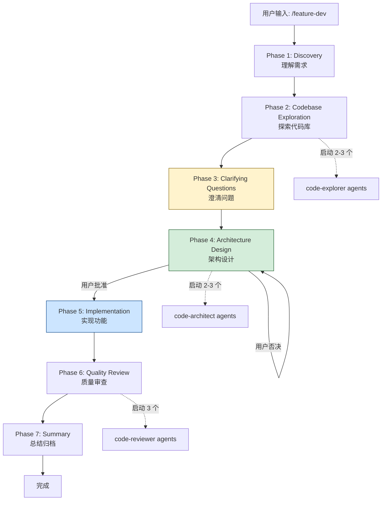
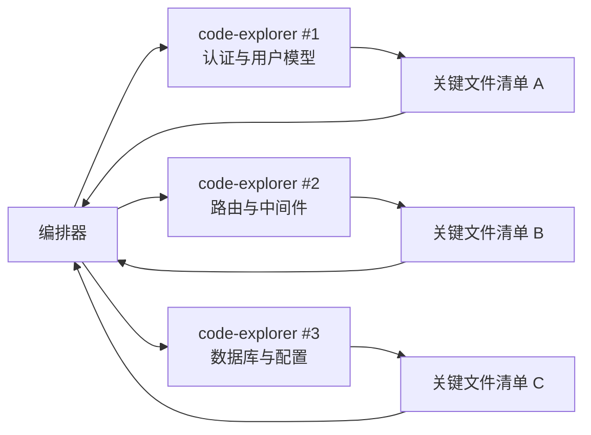
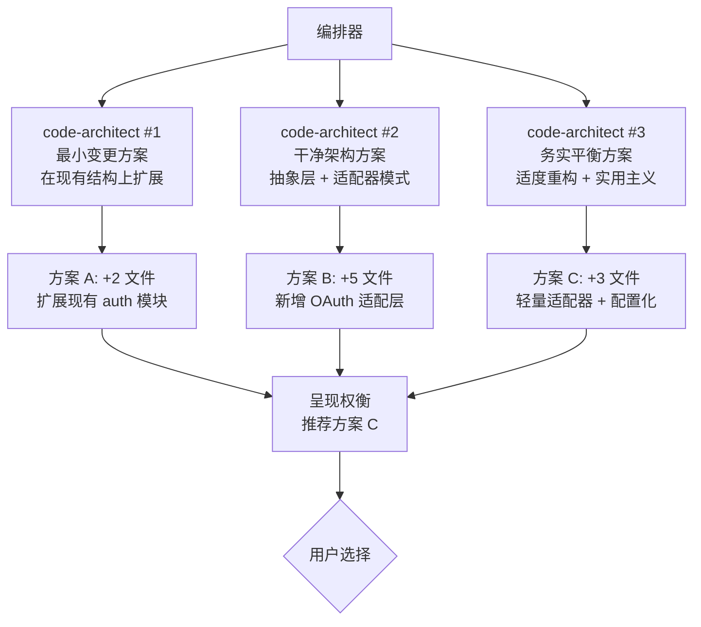
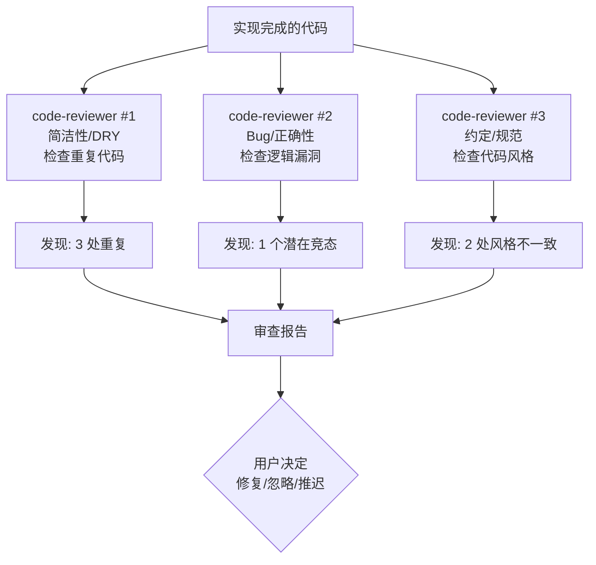
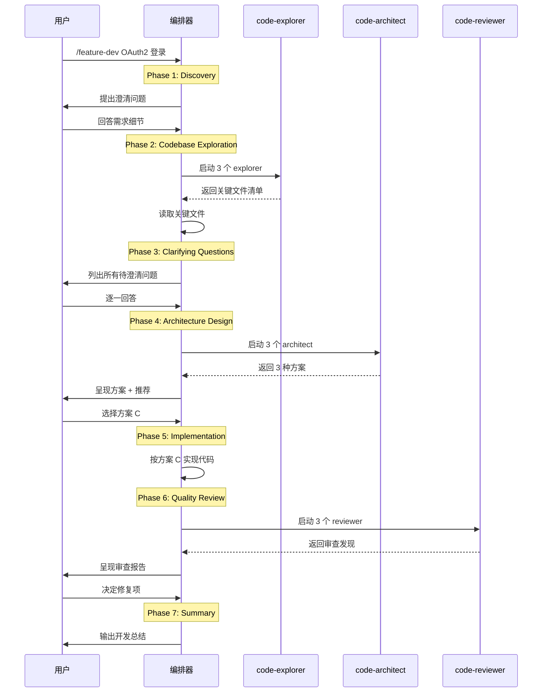

你接到了一个新功能需求：给项目添加 OAuth2 登录支持。你从哪里开始？先看代码？先问问题？先设计架构？如果顺序错了，轻则返工，重则整个方向跑偏。

**feature-dev** 插件就是为解决这个问题而生的。它把功能开发拆解为 7 个精确的阶段，每个阶段有明确的输入、输出和决策门禁，并通过 3 个专业化 agent 并行工作来加速每个环节。这不是一个简单的斜杠命令——它是一个**完整的功能开发方法论**，用插件的形式固化在 Claude Code 中。

## 插件结构

```
feature-dev/
├── .claude-plugin/
│   └── plugin.json
├── commands/
│   └── feature-dev.md       # /feature-dev 入口
├── agents/
│   ├── code-explorer.md     # 代码探索代理
│   ├── code-architect.md    # 架构设计代理
│   └── code-reviewer.md     # 代码审查代理
└── README.md
```

结构看似简洁——1 个命令 + 3 个代理——但别被表面迷惑。命令 `feature-dev.md` 是整个 7 阶段工作流的**编排器**，它协调 3 个代理在恰当的时机并行启动，在关键节点等待用户决策，确保每一步都踏实推进。

## 7 阶段工作流全景

在深入每个阶段之前，先看完整的流程图：



注意三个关键设计：

1. **并行代理启动**：Phase 2、4、6 各自启动多个代理，每个瞄准不同角度
2. **用户批准门禁**：Phase 4 到 Phase 5 必须经过用户明确批准
3. **Phase 3 不可跳过**：用黄色标记，这是一个 CRITICAL 阶段

接下来逐阶段深入。

## Phase 1: Discovery —— 理解需求

这是工作流的起点。当你输入 `/feature-dev` 后，编排器首先创建一个 todo list 来跟踪整个流程，然后进入发现阶段。

### 核心任务

1. **创建 todo list**：用 TodoWrite 工具列出 7 个阶段的待办项
2. **提出澄清问题**：理解功能范围、目标用户、验收标准
3. **总结理解**：向用户复述对需求的理解，确认没有偏差

### 典型输出

```
## 我对需求的理解

你要给项目添加 OAuth2 登录，具体包括：
- 支持 Google 和 GitHub 两个 Provider
- 用户首次登录自动创建账号
- 已有账号通过邮箱关联
- 需要一个设置页面让用户管理关联的社交账号

请确认我的理解是否正确，或者补充遗漏的部分。
```

这个阶段看似简单，却是最容易出问题的环节。很多开发者在没有完全理解需求前就动手写代码，结果做出来的东西与预期南辕北辙。feature-dev 把这个阶段**显式化**，强制你在写一行代码前先确认理解。

## Phase 2: Codebase Exploration —— 探索代码库

理解需求之后，下一步是理解现有代码。这一步的目的是找到：代码库中已有的模式、可以复用的组件、需要修改的模块、以及潜在的冲突点。

### 并行启动 code-explorer

编排器会启动 2-3 个 code-explorer agent，每个聚焦不同方面：



为什么要并行？因为代码探索是**只读操作**，多个代理同时读取不同模块不会冲突，而串行探索可能需要数分钟，并行只需最慢那个的时间。

### code-explorer 的能力

code-explorer agent 的工具集经过精心设计，**只包含只读工具**：

```yaml
tools: Glob, Grep, LS, Read, NotebookRead, WebFetch, WebSearch
model: sonnet
```

注意这里**没有** Write、Edit、Bash（执行类）工具。这是刻意的限制——探索代理只负责看，不负责改。这种工具级隔离确保代码探索过程不会意外修改代码库。

### 返回格式

每个 code-explorer 返回一个关键文件清单，编排器随后读取这些文件获取深层上下文：

```
## code-explorer #1 返回的关键文件

- src/auth/session.ts — 现有 session 管理逻辑
- src/models/user.ts — 用户模型定义
- src/middleware/auth.ts — 认证中间件
- src/config/env.ts — 环境变量配置
```

编排器拿到清单后，自己读取这些文件，理解代码的细节模式（命名约定、错误处理方式、依赖注入风格等），为下一阶段做准备。

## Phase 3: Clarifying Questions —— 澄清问题

这是整个工作流中**最关键**的阶段，在源码中被标记为 CRITICAL，**绝对不可跳过**。

### 为什么如此重要

前两个阶段理解了"做什么"和"现有代码什么样"，但还有大量细节没有明确。如果直接跳到设计阶段，这些未明确的问题会在实现阶段集中爆发：

- 边界情况怎么处理？（OAuth 回调失败怎么办？）
- 错误处理策略？（token 过期是重定向还是刷新？）
- 集成点在哪里？（现有 session 系统怎么对接？）
- 非功能性需求？（并发量？延迟容忍度？）

### 关键原则：一次性提出所有问题

feature-dev 要求在这个阶段**把所有问题一次性列出**，而不是发现一个问题问一个。这避免了"挤牙膏式"的沟通：

```markdown
## 澄清问题

在开始设计之前，我需要确认以下几点：

1. **Token 存储**：OAuth token 存在服务端 session 还是客户端 cookie？
2. **账号合并**：如果用户先用邮箱注册，再用 Google 登录（同一邮箱），是否自动合并？
3. **回调 URL**：开发环境和生产环境用不同的回调路径吗？
4. **错误处理**：OAuth Provider 宕机时，显示什么给用户？
5. **数据保留**：用户解绑社交账号后，历史数据保留还是删除？
6. **速率限制**：是否需要对登录尝试做速率限制？

请逐一回答，这些答案会直接影响架构设计。
```

### 等待用户回答

列出问题后，编排器**等待用户回答所有问题**才进入下一阶段。这是"等待用户"模式（wait-for-user pattern）的第一次出现——在这个工作流中，用户不是旁观者，而是关键决策者。

## Phase 4: Architecture Design —— 架构设计

有了需求理解和澄清问题的答案，现在可以设计架构了。这一步同样采用并行代理策略。

### 并行启动 code-architect

编排器启动 2-3 个 code-architect agent，每个从不同角度设计方案：



三种方案的定位：

| 方案 | 思路 | 优势 | 风险 |
|------|------|------|------|
| 最小变更 | 在现有代码上打补丁 | 改动最少，风险最低 | 技术债累积，扩展性差 |
| 干净架构 | 引入抽象层和适配器 | 可扩展，易测试 | 改动大，可能过度设计 |
| 务实平衡 | 适度重构 + 实用主义 | 兼顾扩展性和效率 | 需要判断"适度"的边界 |

### code-architect 的核心流程

code-architect agent 的设计非常精密。它的系统提示词定义了三步核心流程：

```markdown
## Core Process
1. Codebase Pattern Analysis — 分析现有代码的模式和约定
2. Architecture Design — 设计架构方案
3. Complete Implementation Blueprint — 产出完整实现蓝图
```

与 code-explorer 不同，code-architect 拥有**更多工具**：

```yaml
tools: Glob, Grep, LS, Read, NotebookRead, WebFetch, TodoWrite, WebSearch, KillShell, BashOutput
model: sonnet
color: green
```

增加了 `TodoWrite`（追踪设计决策）、`KillShell`（终止子进程）和 `BashOutput`（读取命令输出）。这让它不仅能看代码，还能执行一些轻量级的验证命令（比如检查依赖版本）。

### 呈现权衡与用户决策

编排器汇总所有 architect 的方案后，会向用户呈现：

1. 每种方案的核心思路
2. 改动范围估算（文件数量、代码行数）
3. 权衡分析（扩展性 vs 复杂度）
4. **编排器的推荐**（通常是最务实的方案）

用户做最终选择。这是工作流中**最重要的用户决策点**——选错方案意味着后续所有工作都在错误方向上进行。

### "不要在没有用户批准的情况下开始"

源码中有明确的指令：

> Do not start implementation without user approval.

这不是建议，是**硬性约束**。编排器不会自动进入 Phase 5，必须等用户说"按方案 C 开始"。

## Phase 5: Implementation —— 实现功能

用户批准架构方案后，进入实现阶段。

### 执行策略

1. **遵循选定架构**：按照用户选择的方案逐步实现
2. **更新 todo**：每完成一个子任务，用 TodoWrite 标记进度
3. **渐进式实现**：先骨架后细节，保持每步可验证

### 典型实现流程

```
[1/6] 创建 OAuth 配置模块 → src/auth/oauth-config.ts
[2/6] 实现 Google Provider 适配器 → src/auth/providers/google.ts
[3/6] 实现 GitHub Provider 适配器 → src/auth/providers/github.ts
[4/6] 添加 OAuth 路由和回调 → src/routes/oauth.ts
[5/6] 修改用户模型支持社交账号 → src/models/user.ts
[6/6] 集成到现有认证中间件 → src/middleware/auth.ts
```

这个阶段是唯一一个**不启动并行代理**的阶段——代码实现需要串行推进，因为每一步的输出是下一步的输入。但编排器仍然通过 TodoWrite 保持进度透明，用户随时知道当前进展。

## Phase 6: Quality Review —— 质量审查

实现完成后，启动 3 个 code-reviewer agent 并行审查代码：



### 三个审查者的分工

| 审查者 | 聚焦点 | 典型发现 |
|--------|--------|----------|
| #1 简洁性/DRY | 代码重复、过度抽象、不必要的复杂度 | "这两个 Provider 有 80% 相同代码，可提取基类" |
| #2 Bug/正确性 | 边界条件、错误处理、竞态条件、类型安全 | "回调中的 state 参数没验证，存在 CSRF 风险" |
| #3 约定/规范 | 命名风格、文件组织、导入顺序、注释质量 | "新文件的导入顺序与项目约定不一致" |

### 发现的处理

审查结果呈现给用户后，用户决定哪些修复、哪些忽略、哪些推迟。这体现了 feature-dev 的核心理念——**AI 做分析，人做决策**。

注意审查者之间**互不可见**——每个审查者独立评估，不会因为其他审查者没提某个问题就忽略它。这种独立审查比串行审查更容易发现交叉问题。

## Phase 7: Summary —— 总结归档

最后阶段是收尾和文档化。

### 核心动作

1. **标记 todo 完成**：所有 7 个阶段的待办项标记为完成
2. **总结构建了什么**：功能描述、解决的问题
3. **记录关键决策**：选择了哪个架构方案、为什么
4. **列出修改的文件**：新增、修改、删除的文件清单
5. **建议后续步骤**：测试、部署、文档更新等

### 典型输出

```markdown
## 功能开发总结

### 构建了什么
OAuth2 登录支持，支持 Google 和 GitHub Provider

### 关键决策
- 选择方案 C（务实平衡）：轻量适配器模式，而非完整抽象层
- Token 存储在服务端 session（回答了 Phase 3 的问题 #1）
- 账号自动合并（回答了 Phase 3 的问题 #2）

### 修改的文件
- 新增: src/auth/oauth-config.ts
- 新增: src/auth/providers/google.ts
- 新增: src/auth/providers/github.ts
- 新增: src/routes/oauth.ts
- 修改: src/models/user.ts
- 修改: src/middleware/auth.ts

### 后续步骤
- [ ] 添加 OAuth 集成测试
- [ ] 更新 API 文档
- [ ] 配置生产环境的 OAuth 凭据
```

这个总结不仅是对本次工作的记录，也是团队协作的重要信息——其他开发者可以通过这份总结快速理解"为什么这样实现"。

## 5 个关键设计模式

feature-dev 插件的背后是 5 个精心设计的工作流模式，这些模式可以迁移到任何复杂的多步骤工作流中。

### 模式 1：多阶段工作流 + 显式用户批准门禁


不是每个阶段都需要用户批准。低风险阶段（探索、提问）自动流转，高风险阶段（实现、架构选择）设置门禁。这种**渐进式管控**既保持了效率，又确保了关键决策由人来做。

### 模式 2：并行代理启动

```
# 串行：3 个 explorer 各 30 秒 = 90 秒
explorer_1(30s) → explorer_2(30s) → explorer_3(30s)

# 并行：3 个 explorer 同时运行 = 30 秒
explorer_1(30s) ┐
explorer_2(30s) ├→ 汇总
explorer_3(30s) ┘
```

适用条件：
- 操作之间没有依赖关系
- 操作是只读的（不会互相干扰）
- 操作耗时相对较长（并行收益明显）

### 模式 3："Wait for User" 模式

在关键决策点，编排器不自动推进，而是**停下来等待用户输入**。这在源码中通过明确的指令实现：

```markdown
## Phase 4: Architecture Design

CRITICAL: Do not proceed to implementation without explicit user approval.
Present all options and wait for the user to choose.
```

这种模式打破了"AI 尽可能自动化"的直觉，但在高风险场景中，**人工介入是最安全的保障**。

### 模式 4：代理返回文件清单 → 编排器读取深层上下文

这是一个巧妙的上下文管理策略：

1. 代理返回关键文件清单（轻量级）
2. 编排器拿到清单后自己读取文件内容（获取深层上下文）
3. 编排器基于完整上下文做下一步决策

为什么不直接让代理读取所有文件并返回完整内容？因为**token 预算有限**。代理可能探索大量文件，但只有部分是关键的。让编排器决定读哪些，实现了上下文的**精准分配**。

### 模式 5：TodoWrite 进度追踪

整个 7 阶段流程使用 TodoWrite 工具维持进度透明：

```
Phase 1: Discovery .................. ✅ 完成
Phase 2: Codebase Exploration ....... ✅ 完成
Phase 3: Clarifying Questions ....... ✅ 完成
Phase 4: Architecture Design ........ ✅ 完成
Phase 5: Implementation ............. 🔄 进行中 (4/6)
Phase 6: Quality Review ............. ⬜ 待开始
Phase 7: Summary .................... ⬜ 待开始
```

用户随时可以看到当前进度，不需要问"做到哪了"。这对长时间运行的工作流尤为重要。

## 代理间的工具隔离

feature-dev 的三个代理拥有不同的工具集，这不是随意安排，而是**按职责最小权限原则**设计的：

| 代理 | 只读工具 | 写入工具 | 执行工具 | 原因 |
|------|---------|---------|---------|------|
| code-explorer | Glob, Grep, LS, Read, WebFetch, WebSearch | 无 | 无 | 探索不应修改代码 |
| code-architect | 同上 | TodoWrite | BashOutput, KillShell | 需要记录决策、验证方案 |
| code-reviewer | Read, Grep, Glob | TodoWrite | 无 | 需要记录发现、不应执行代码 |

这种工具隔离确保了每个代理"只做自己该做的事"，减少了跨阶段的意外副作用。

## 完整执行时序

把所有阶段放在一起，完整的执行时序如下：



## 与 code-review 插件的对比

上一章我们分析了 code-review 插件，它也是多代理并行模式。两者有什么区别？

| 维度 | code-review | feature-dev |
|------|------------|-------------|
| 目标 | 审查已有代码 | 开发新功能 |
| 代理数量 | 5 个 reviewer | 3 类代理（explorer/architect/reviewer） |
| 代理角色 | 同质（都是 reviewer，不同角度） | 异质（不同类型，不同工具） |
| 用户交互 | 一次审查，一次决策 | 7 阶段，多次决策 |
| 工作流复杂度 | 低（启动 → 审查 → 报告） | 高（7 阶段状态机） |
| 适用场景 | 代码质量保障 | 端到端功能交付 |

核心差异：code-review 是**单次爆发式**工作（启动、审查、结束），feature-dev 是**多阶段推进式**工作（发现、探索、提问、设计、实现、审查、总结）。前者关注"好不好"，后者关注"从无到有"。

## 实践启示

### 什么时候用 feature-dev

- 新功能开发（不是 bug 修复）
- 跨多个模块的改动（不是单文件修改）
- 需要设计决策的功能（不是机械化实现）
- 对代码库不太熟悉时（探索阶段帮你快速了解）

### 什么时候不用

- 简单的 bug 修复（7 阶段太重了）
- 单文件修改（直接编辑更快）
- 对代码库非常熟悉的小改动（探索阶段是浪费时间）
- 紧急修复（走完 7 阶段太慢）

### 自定义扩展

feature-dev 的 7 阶段工作流不是金科玉律。你可以基于它创建自己的变体：

- **安全增强版**：在 Phase 5 和 Phase 6 之间增加 Security Review 阶段
- **测试优先版**：把 TDD 流程嵌入 Phase 5，先写测试再实现
- **轻量版**：合并 Phase 1 和 Phase 3，跳过 Phase 2（如果对代码库已经很熟悉）
- **团队版**：Phase 4 的架构方案通过 PR 讨论，而非单次对话决策

## 本章小结

**一句话记住**：feature-dev = 先问清楚再动手，每个高风险节点必须等人批准。

**决策规则**：
- 新功能跨多个模块、需要设计决策 → 用 feature-dev 的 7 阶段流程
- 简单 bug 修复或单文件改动 → 直接编辑，7 阶段太重
- 架构方案确定前 → 绝对不进实现阶段，这是不可逆的分叉点

**最容易踩的坑**：跳过 Phase 3 澄清问题就冲进设计，结果做出来的东西和需求南辕北辙——前期问题的遗漏会在后期成倍放大。

**现在就试**：下次接到新功能需求时，先别写代码，用 Phase 1-3 的思路列出所有澄清问题一次性问完，看看遗漏率降低了多少。

👉 接下来我们看 hookify，一个让创建钩子规则变得零代码的插件

