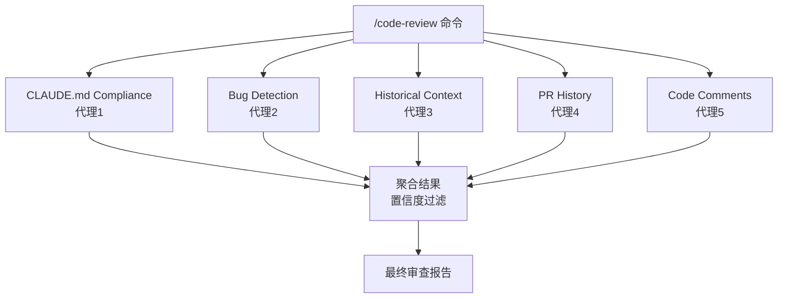
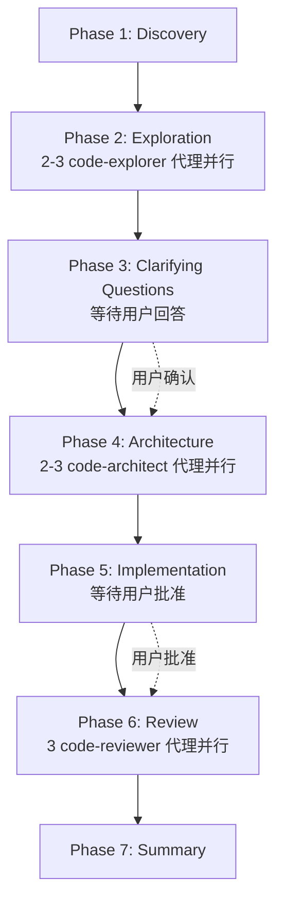
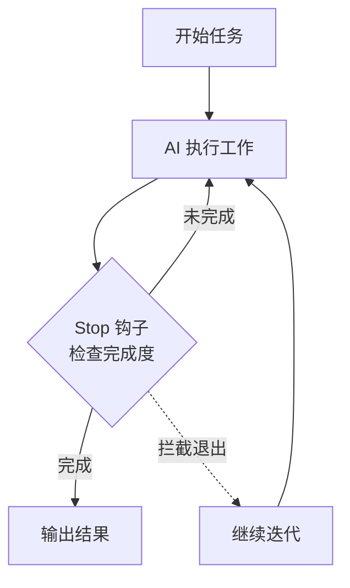

当单个 AI 代理无法应对复杂任务时，多代理协作就是答案。Claude Code 原生支持并行代理，让多个专业化的 AI 同时工作。

## 为什么需要多代理

单个代理的困境：

- **上下文有限**：一个代理无法同时关注代码质量、安全、性能
- **速度瓶颈**：串行处理多维度审查太慢
- **视角单一**：一个系统提示词无法覆盖所有视角

多代理的优势：

- **并行加速**：多个代理同时工作，速度翻倍
- **专业分工**：每个代理专注于一个维度，质量更高
- **独立评分**：每个代理独立判断，减少偏见
- **灵活组合**：按需组合不同专业代理

## 三种多代理模式

### 模式一：并行审查（最常见）

多个代理同时审查同一段代码，各自关注不同维度。



**源码实例：code-review 插件**

5 个 Sonnet 代理并行工作，各自独立审查：

| 代理 | 关注点 | 模型 |
|------|--------|------|
| claude-md-compliance | CLAUDE.md 规则遵守 | Sonnet |
| bug-detector | Bug 和缺陷检测 | Sonnet |
| historical-context | 代码历史上下文 | Sonnet |
| pr-history | PR 审查历史 | Sonnet |
| code-comments | 代码注释质量 | Sonnet |

**关键创新：置信度评分**

每个代理给出 0-1 的置信度分数。低置信度的发现被过滤掉，大幅减少误报。

### 模式二：流水线工作流（Phase-gated）

代理按阶段依次执行，每个阶段有用户确认关卡。



**源码实例：feature-dev 插件**

7 阶段工作流，3 个不同代理在不同阶段使用：

| 阶段 | 代理 | 数量 | 目的 |
|------|------|------|------|
| Exploration | code-explorer | 2-3 并行 | 理解代码库 |
| Architecture | code-architect | 2-3 并行 | 设计方案 |
| Review | code-reviewer | 3 并行 | 质量保障 |

**关键设计：用户确认关卡**

- Phase 3 之后：等待用户回答澄清问题
- Phase 5 之前：等待用户批准实现方案
- Phase 6 之后：用户决定是否修复问题

### 模式三：自主迭代（Self-loop）

AI 反复迭代同一任务，直到完成。



**源码实例：ralph-wiggum 插件**

核心机制：
- `/ralph-loop` 命令启动自主迭代
- Stop 钩子拦截 AI 的退出尝试
- AI 看到自己的前一次工作结果
- `/cancel-ralph` 命令终止循环

## 代理编排最佳实践

### 1. 每个代理单一职责

```markdown
# 好的设计
code-architect: 只做架构设计
bug-detector: 只做 Bug 检测
security-reviewer: 只做安全审查

# 差的设计
super-agent: 同时做架构 + Bug + 安全 + 性能
```

单一职责让系统提示词更聚焦，代理表现更好。

### 2. 并行优于串行

```markdown
# 好：3 个代理并行审查（快）
Phase 6: Launch 3 code-reviewer agents in parallel

# 差：3 个代理串行审查（慢）
Phase 6a: Review for simplicity
Phase 6b: Review for bugs
Phase 6c: Review for conventions
```

### 3. 结果聚合与过滤

多个代理返回结果后，需要聚合：

```markdown
# feature-dev 的聚合模式
1. Consolidate findings from all agents
2. Identify highest severity issues
3. Present to user with recommendations
4. Let user decide what to fix
```

code-review 的聚合模式：
```markdown
1. Each agent scores findings with confidence (0-1)
2. Filter out low-confidence findings
3. Present remaining findings grouped by category
```

### 4. 明确用户决策点

```markdown
# feature-dev 的用户决策点
Phase 3: "Wait for answers before proceeding" 
Phase 5: "DO NOT START WITHOUT USER APPROVAL"
Phase 6: "Present findings and ask what they want to do"
```

### 5. 代理间信息传递

代理不能直接通信，但可以通过：

- **Todo 列表**：`TodoWrite` 跟踪共享进度
- **文件系统**：代理写入文件，其他代理读取
- **编排器读取**：主进程读取代理返回的关键文件列表

```markdown
# feature-dev 的模式
1. Launch agents, ask them to "return list of 5-10 key files"
2. After agents complete, READ those files
3. Build deep context before next phase
```

## 代理模型选择

| 代理类型 | 推荐模型 | 原因 |
|---------|---------|------|
| 架构设计 | Sonnet | 平衡能力和成本 |
| Bug 检测 | Sonnet | 够用，不需要最深度推理 |
| 代码审查 | Sonnet | 需要多个并行，成本敏感 |
| 安全审查 | Opus | 安全问题需要最深度推理 |
| 探索分析 | Sonnet | 快速扫描，不需要深度 |
| 简单验证 | Haiku | 快速、便宜、确定性任务 |

## 复杂度对比

| 插件 | 代理数 | 并行模式 | 阶段数 | 复杂度 |
|------|--------|---------|--------|--------|
| code-review | 5 | 并行审查 | 1 | 中等 |
| pr-review-toolkit | 6 | 并行审查 | 1 | 中等 |
| feature-dev | 3 | 流水线 | 7 | 复杂 |
| ralph-wiggum | 0 | 自主迭代 | 循环 | 复杂 |

## 本章小结

**一句话记住**：多代理就像项目组开会 —— 同一个问题让不同专家并行回答，再由主持人聚合结论。

**决策规则**：
- 需要多维度审查（安全 + 质量 + 规范） → 并行审查模式
- 需要分阶段推进且每阶段要人确认 → 流水线模式（Phase-gated）
- 需要 AI 反复打磨直到满意 → 自主迭代模式（Self-loop）
- 只有一个维度要检查 → 别用多代理，单代理更简单更快

**最容易踩的坑**：给代理塞太多职责（"你同时负责安全、性能和代码风格"），系统提示词臃肿导致每个维度都做不好。记住：一个代理只干一件事。

**现在就试**：在项目中创建一个简单的并行审查命令 —— 用 2 个代理分别检查"CLAUDE.md 规则遵守"和"Bug 检测"，观察它们如何返回不同视角的结果。

👉 接下来我们深入 Hookify 的多条件规则，让钩子更精准

