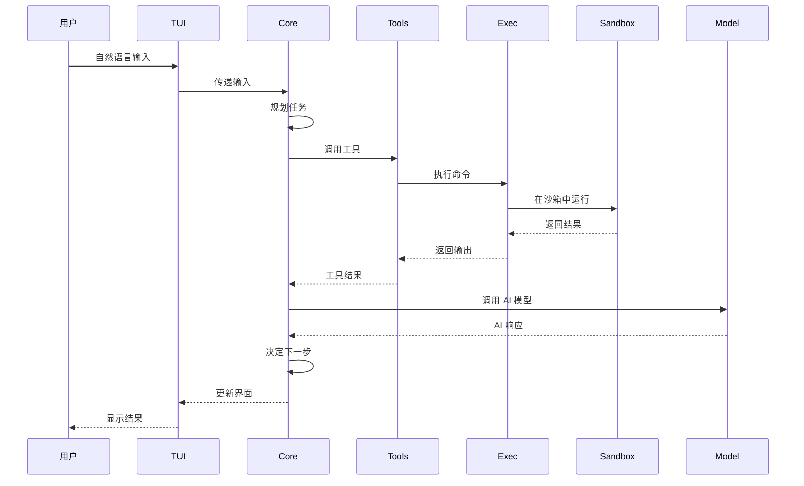

Codex 的 Rust 实现是一个巨大的 Cargo workspace，包含 100+ 个 crates。让我们拆解这个复杂的系统。

## 核心 Crate 分层

```mermaid
graph TB
    subgraph "用户界面层"
        TUI[tui<br/>终端 UI]
        CLI[cli<br/>命令行入口]
        AppServer[app-server<br/>应用服务器]
    end
    
    subgraph "业务逻辑层"
        Core[core<br/>核心业务逻辑]
        State[state<br/>状态管理]
        ThreadStore[thread-store<br/>对话存储]
    end
    
    subgraph "能力层"
        Tools[tools<br/>工具集]
        Skills[skills<br/>技能系统]
        Plugin[plugin<br/>插件系统]
        Hooks[hooks<br/>钩子系统]
        Memories[memories<br/>记忆系统]
    end
    
    subgraph "执行层"
        Exec[exec<br/>执行引擎]
        ExecPolicy[execpolicy<br/>执行策略]
        Sandboxing[sandboxing<br/>沙箱抽象]
        LinuxSandbox[linux-sandbox<br/>Linux 沙箱]
        WindowsSandbox[windows-sandbox-rs<br/>Windows 沙箱]
    end
    
    subgraph "协议与集成层"
        Protocol[protocol<br/>核心协议]
        AppServerProtocol[app-server-protocol<br/>应用服务器协议]
        CodexMCP[codex-mcp<br/>MCP 集成]
        MCPServer[mcp-server<br/>MCP 服务器]
        RMCPClient[rmcp-client<br/>RMCP 客户端]
        BackendClient[backend-client<br/>后端客户端]
        ChatGPT[chatgpt<br/>ChatGPT 集成]
    end
    
    subgraph "基础设施层"
        AsyncUtils[async-utils<br/>异步工具]
        Utils[utils<br/>工具函数]
        ANSI[ansi-escape<br/>ANSI 转义]
        FileSystem[file-system?<br/>文件系统]
        GitUtils[git-utils?<br/>Git 工具]
    end
    
    TUI --> Core
    CLI --> Core
    AppServer --> Core
    Core --> State
    Core --> ThreadStore
    Core --> Tools
    Core --> Skills
    Core --> Plugin
    Core --> Hooks
    Core --> Memories
    Core --> Exec
    Exec --> ExecPolicy
    Exec --> Sandboxing
    Sandboxing --> LinuxSandbox
    Sandboxing --> WindowsSandbox
    Core --> Protocol
    Core --> AppServerProtocol
    Core --> CodexMCP
    Core --> MCPServer
    Core --> RMCPClient
    Core --> BackendClient
    Core --> ChatGPT
    Core --> AsyncUtils
    Core --> Utils
```

## 关键 Crate 详解

### 1. core/ — 核心业务逻辑

这是最大的 crate，包含 Codex 的核心逻辑。

**主要职责**：
- Agent orchestration（代理编排）
- Tool use（工具使用）
- Turn management（对话轮管理）
- Context management（上下文管理）

**位置**：`source/codex/codex-rs/core/`

### 2. tui/ — 终端 UI

基于 Ratatui 的终端界面。

**主要组件**：
- App（主应用）
- ChatWidget（聊天组件）
- BottomPane（底部面板）
- Various widgets（各种小组件）

**位置**：`source/codex/codex-rs/tui/`

### 3. cli/ — 命令行入口

多工具 CLI，提供：
- `codex` → TUI
- `codex exec` → 非交互式执行
- `codex mcp` → MCP 管理
- `codex sandbox` → 沙箱测试
- `codex mcp-server` → MCP 服务器模式

**位置**：`source/codex/codex-rs/cli/`

### 4. exec/ — 执行引擎

"headless" CLI，用于自动化场景。

**位置**：`source/codex/codex-rs/exec/`

### 5. plugin/ — 插件系统

插件加载、管理、执行。

**位置**：`source/codex/codex-rs/plugin/`

### 6. skills/ — 技能系统

技能注入和管理。

**位置**：`source/codex/codex-rs/skills/`

### 7. hooks/ — 钩子系统

事件钩子执行。

**位置**：`source/codex/codex-rs/hooks/`

### 8. codex-mcp/ — MCP 集成

MCP 连接管理。

**位置**：`source/codex/codex-rs/codex-mcp/`

### 9. mcp-server/ — MCP 服务器

把 Codex 作为 MCP 服务器运行。

**位置**：`source/codex/codex-rs/mcp-server/`

### 10. execpolicy/ — 执行策略

沙箱策略定义和管理。

**位置**：`source/codex/codex-rs/execpolicy/`

### 11. linux-sandbox/ — Linux 沙箱

基于 Landlock 和 bubblewrap 的 Linux 沙箱实现。

**位置**：`source/codex/codex-rs/linux-sandbox/`

### 12. windows-sandbox-rs/ — Windows 沙箱

Windows 沙箱实现。

**位置**：`source/codex/codex-rs/windows-sandbox-rs/`

### 13. app-server/ — 应用服务器

支持 IDE 集成的后端服务器。

**位置**：`source/codex/codex-rs/app-server/`

### 14. protocol/ — 核心协议

Codex 的核心协议定义。

**位置**：`source/codex/codex-rs/protocol/`

### 15. app-server-protocol/ — 应用服务器协议

IDE 集成的协议定义。

**位置**：`source/codex/codex-rs/app-server-protocol/`

## 数据流向

## 配置系统

配置通过 `config.toml` 管理，相关 crate：
- `config/` — 配置定义和加载
- `config.schema.json` — JSON Schema（通过 `just write-config-schema` 生成）

**位置**：`source/codex/codex-rs/config/`

## 测试策略

- 单元测试：每个 crate 自己的测试
- 集成测试：`core-test-support` 提供辅助
- 快照测试：`insta` 用于 UI 测试
- Fuzz testing：部分 crate 有 fuzz target

## 本章小结

**一句话记住**：100+ crates 按层次组织，core 是中心，tui/cli 是入口，exec/sandbox 负责安全执行。

**关键点**：
- 模块化设计，职责分离
- 沙箱是安全执行的核心
- MCP 是扩展的主要方式
- 支持多种接口（TUI/IDE/Web）

---

**系列目录**：
- [第一章：Codex 是什么 —— OpenAI 的本地编码代理](./../01-intro/01-what-is-codex.md)
- [第二章：安装与上手 —— npm/brew/二进制三种方式](./../01-intro/02-installation-setup.md)
- [第三章：认证与配置 —— ChatGPT 账号 vs API Key](./../01-intro/03-authentication.md)
- [第四章：TUI 基础 —— 终端 UI 的交互方式](./../02-core/04-tui-basics.md)
- [第五章：codex exec —— 非交互式编程执行](./../02-core/05-codex-exec.md)
- [第六章：沙箱系统 —— 安全执行命令](./../02-core/06-sandbox.md)
- [第七章：MCP 客户端 —— 连接外部工具](./../03-cli/07-mcp-client.md)
- 第八章：架构概览 —— 100+ Crates 的模块化设计 👈 当前位置

