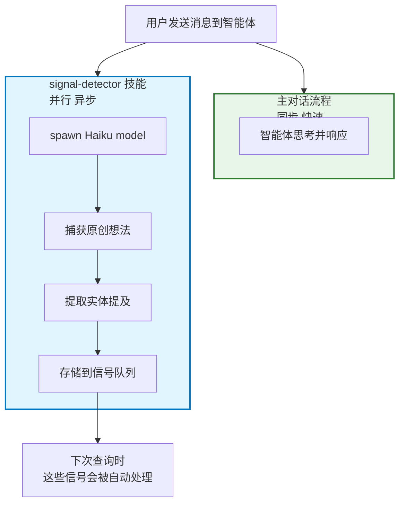
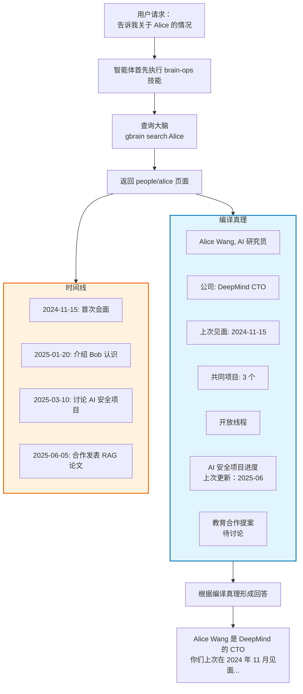
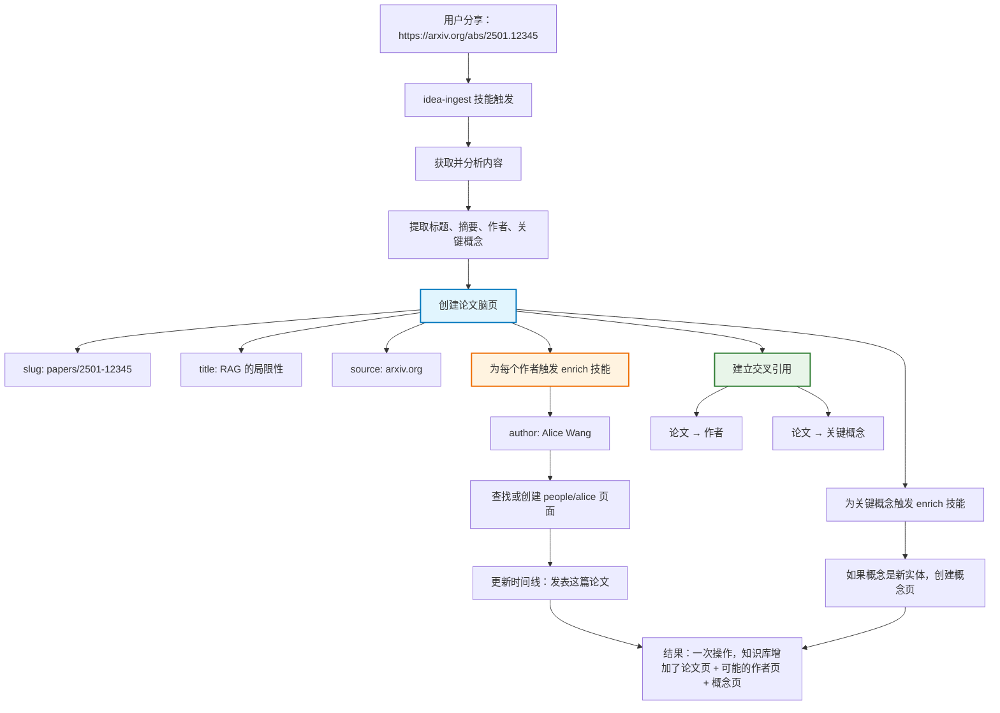
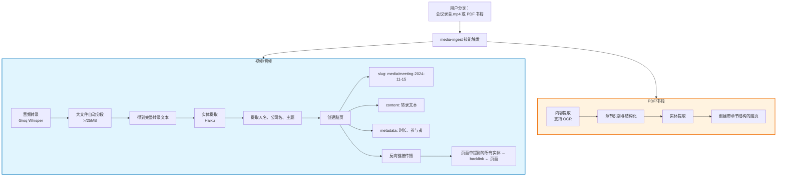
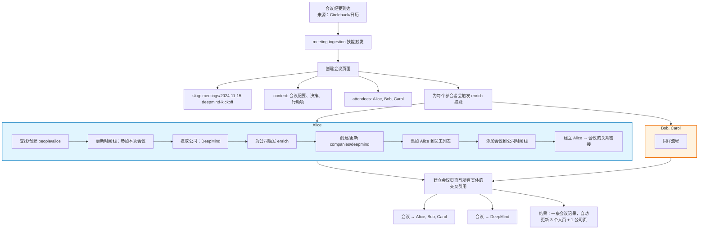
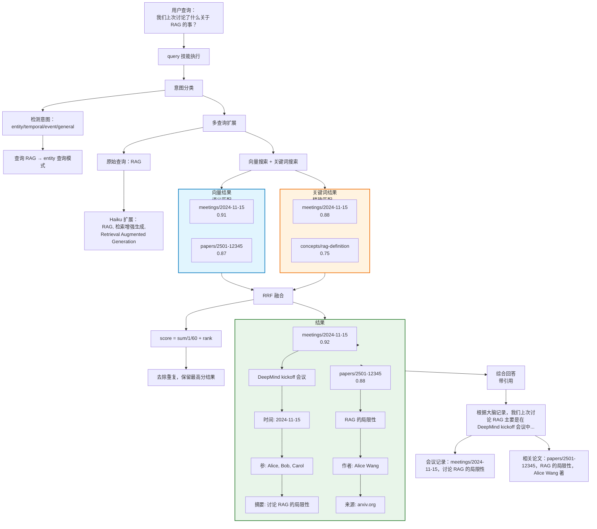
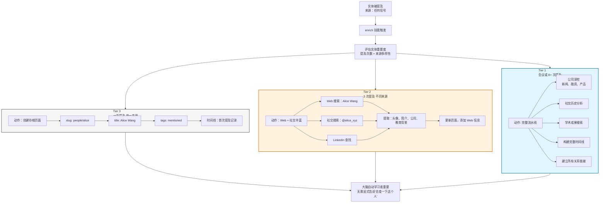
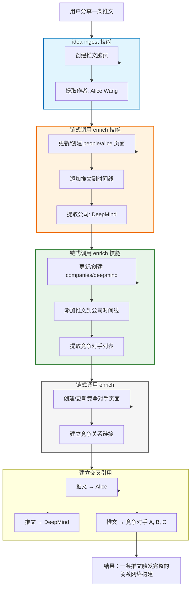
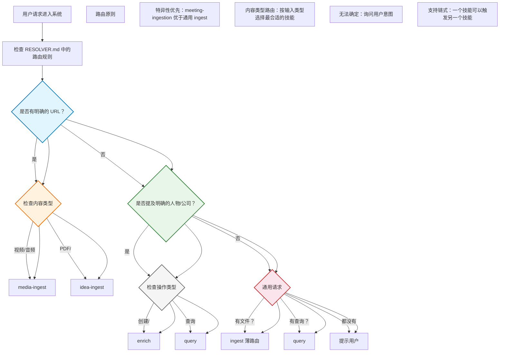

## 核心能力全景

GBrain 不是单一功能工具，而是一个完整的能力矩阵，覆盖知识管理的全生命周期。

```mermaid
flowchart LR
    subgraph Input[输入层]
        I1[多模态输入]
        I2[链接/文章]
        I3[推文/社交]
        I4[视频/音频]
        I5[PDF/书籍]
        I6[会议记录]
        I7[邮件/日历]
        I8[对话提及]
        
        I1 --> I2
        I1 --> I3
        I1 --> I4
        I1 --> I5
        I1 --> I6
        I1 --> I7
        I1 --> I8
    end
    
    subgraph Process[处理层]
        P1[25 个技能编排]
        P2[路由系统]
        P3[链式调用]
        P4[自动触发]
        P5[质量保证]
        
        P1 --> P2
        P1 --> P3
        P1 --> P4
        P1 --> P5
    end
    
    subgraph Output[输出层]
        O1[可检索的知识]
        O2[结构化页面]
        O3[交叉引用]
        O4[时间线记录]
        O5[实体关系]
        O6[版本控制]
        
        O1 --> O2
        O1 --> O3
        O1 --> O4
        O1 --> O5
        O1 --> O6
    end
    
    Input --> Process --> Output
    
    Process -.->|"始终能力"| Output
    
    style Input fill:#e1f5fe,stroke:#0277bd,stroke-width:2px
    style Process fill:#fff3e0,stroke:#ef6c00,stroke-width:2px
    style Output fill:#e8f5e9,stroke:#2e7d32,stroke-width:2px
```

在此过程中，知识库被动增长

## 信号捕获：总是开启

### signal-detector 技能

这是 GBrain 的"神经系统"——在每条消息上运行，捕获智能体可能错过的信息。

**设计要点：**
1. 永不阻塞主流程：用户等待响应时，信号检测器在后台运行
2. 使用便宜的 Haiku 模型：每个信号成本极低
3. 并行处理：不会因为信号捕获而变慢
4. 从不干扰：即使信号捕获失败，主对话照常进行

### brain-ops 技能

任何脑读/写/查找/引用操作都会触发 brain-ops 技能，执行"读-丰富-写循环"。

**关键特性：**
1. 脑优先：从不对外部 API，先查大脑
2. 读-丰富-写：查询后如果有新信息，自动更新
3. 来源引用：每个数据点都有来源，可追溯
4. 诚实地回答：大脑没有信息时，明确说"不知道"

## 内容摄取：多模态统一

### idea-ingest 技能

处理链接、文章、推文等文本内容，自动分析并建立关联。

### media-ingest 技能

处理视频、音频、PDF、书籍等非文本内容。

### meeting-ingestion 技能

会议记录处理是 GBrain 的核心用例之一，展示自动丰富能力。

**价值：**
- 一次录入，所有关联实体都被更新
- 无需手动"记得去更新 Alice 的页面"
- 知识库始终保持一致状态

## 知识检索：混合搜索

### query 技能

三层搜索带引用合成，确保结果可追溯且不产生幻觉。

## 实体丰富：分层自动

### enrich 技能

这是 GBrain 最核心的技能，实现分层丰富策略，确保重要实体获得深度信息。

**为什么要分层？**

1. 成本控制：不每个人都花 Tier 1 的成本
2. 演进机制：重要度提升后，下次自动升级
3. 避免垃圾：一次性提及的实体不会浪费 API 配额
4. 渐进深度：随时间推移，重要实体自然获得更完整信息

## 技能系统：可组合的工作流

### 技能链式调用

GBrain 的技能不是孤立的，而是可以相互调用，形成复杂工作流。

**链式调用的优势：**
1. 一次触发，完整处理：用户不需要分步操作
2. 自动深度：智能判断需要调用哪些技能
3. 幂等性：相同的操作幂等地产生相同结果
4. 可追溯：整个链式调用有清晰的审计日志

### 技能路由系统

RESOLVER.md 定义了技能与触发条件的映射，确保每个请求找到最合适的技能。

