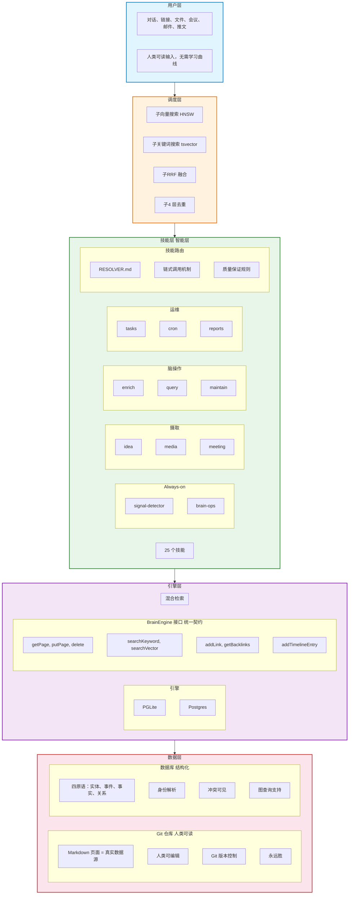
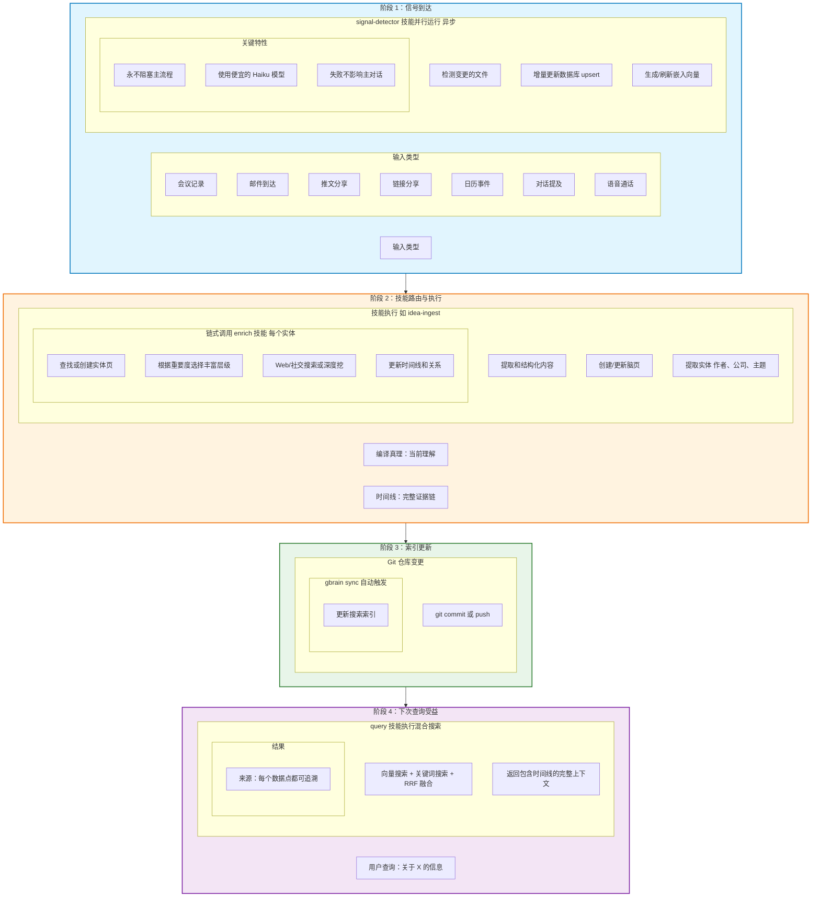
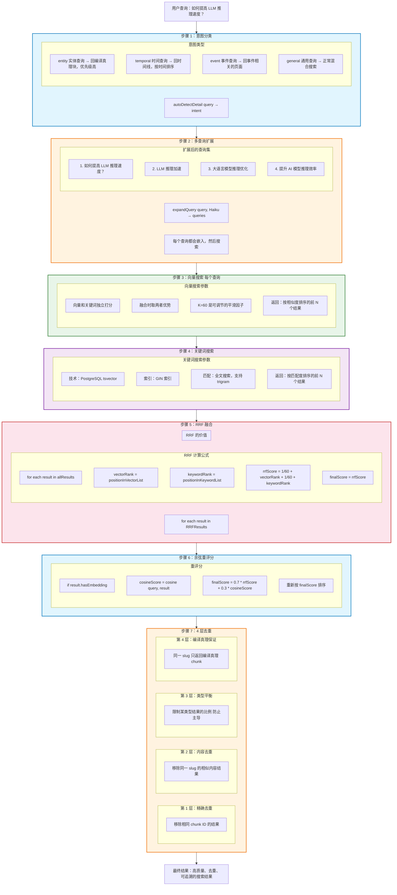
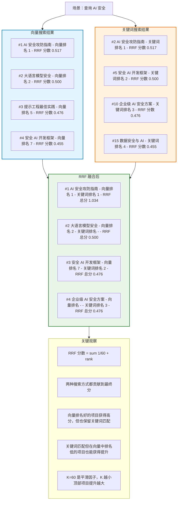
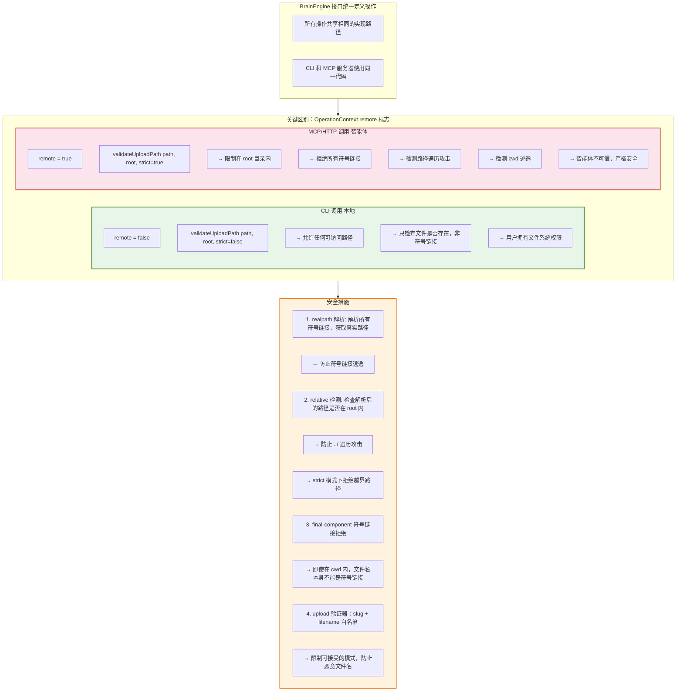

## 整体架构

GBrain 采用四层架构设计，每层有明确的职责边界。

**层间交互：**
- 用户 → 技能层：人类发起操作
- 技能层 → 引擎层：读写知识
- 调度层 → 技能层：后台自动运行
- 数据层 Git ↔ 数据库：双向同步，Git 优先

## 数据流转周期

GBrain 的核心是数据流转，每个信号都触发一系列处理步骤。

**核心特性：**
1. 幂等性：相同的输入产生相同的输出
2. 可追溯：每个信息点都有来源
3. 自动化：信号触发技能，技能触发丰富
4. 持久化：索引更新后，所有查询受益

## 混合检索原理

GBrain 的检索不是单一搜索，而是多通道融合的结果。

### RRF 为什么有效

## 信任边界与安全

GBrain 设计了明确的信任边界，区分可信和不可信的调用者。

