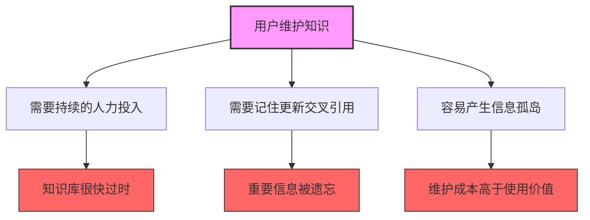
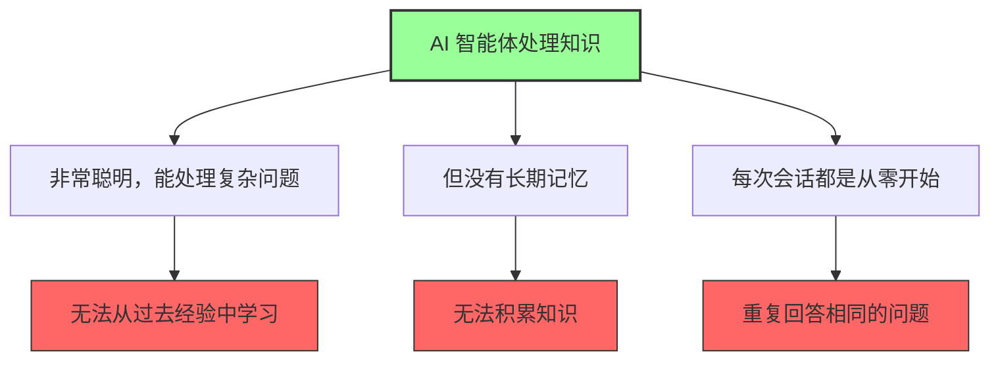
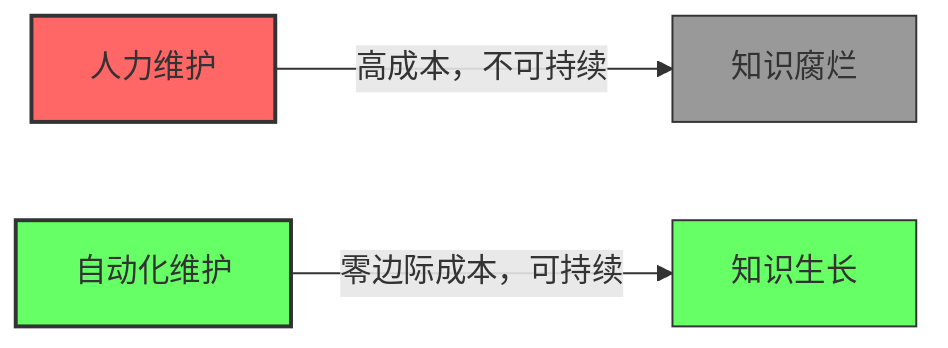
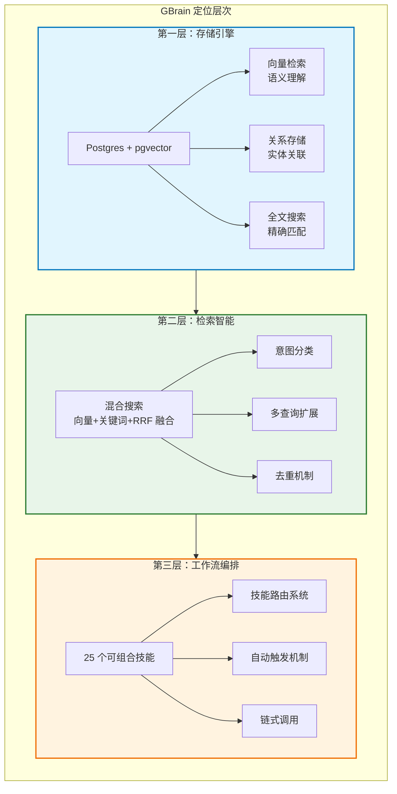
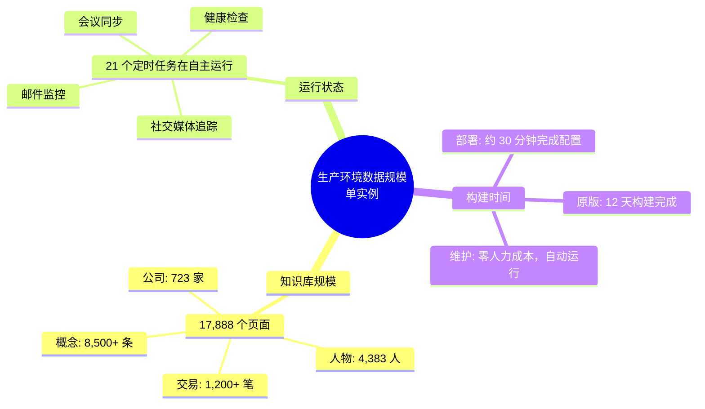
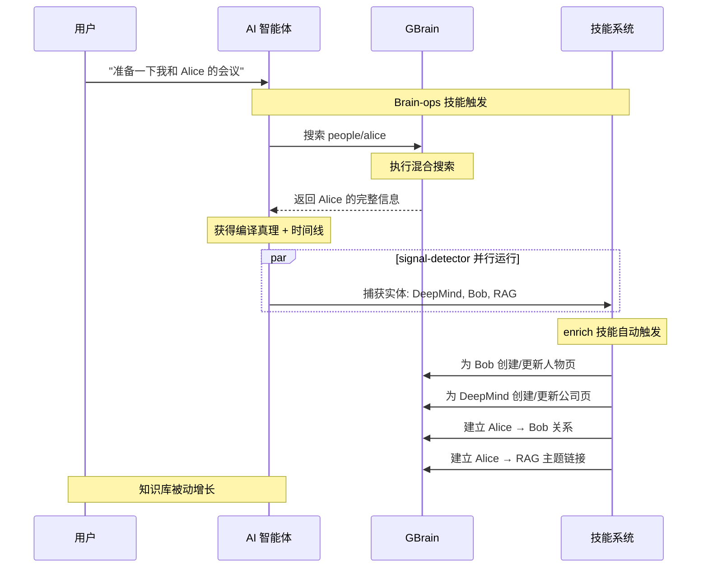
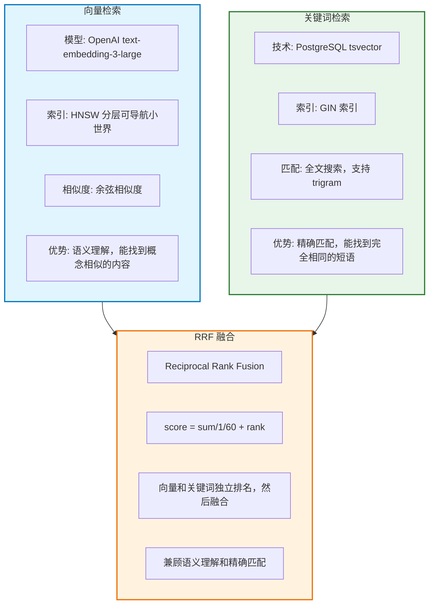

## 从问题说起

### 传统知识管理为什么失败

知识管理软件已经存在 30 年，但绝大多数人仍然无法有效维护自己的知识库。为什么？

### GBrain 的核心洞察

**将知识管理的维护成本降至近乎零，让维护成为正常操作的副作用。**

## 核心定位

GBrain 是为 AI 智能体提供个人知识大脑能力的模块化系统。它不只是一个存储系统，而是一个让知识能够**自我生长**的智能基础设施。

### 三层定位

## 实际应用案例

### 生产环境规模

GBrain 不是一个概念产品，它正在为 Y Combinator CEO 的实际 AI 智能体提供生产级支持。

### 实际工作流示例

## 技术基础

### 引擎对比

GBrain 支持两种引擎，满足不同场景的需求。

| 特性 | PGLite（默认） | Postgres（可选） |
|------|----------------|------------------|
| **技术** | 嵌入式 PostgreSQL 17.5 WASM | PostgreSQL + pgvector 扩展 |
| **存储** | ~/.gbrain/brain.pglite | Supabase Pro 或自托管 |
| **配置** | 零配置，开箱即用 | DATABASE_URL 环境变量 |
| **就绪时间** | 2 秒 | 需要数据库连接时间 |
| **适用规模** | 单设备，1000+ 文件前 | 多设备同步，无限规模 |
| **成本** | 免费 | Supabase Pro $25/月 |

**数据迁移：**
- PGLite → Postgres：`gbrain migrate --to supabase`
- Postgres → PGLite：`gbrain migrate --to pglite`

### 混合检索技术栈

**为什么需要混合检索？**

纯向量搜索的问题：
- 查询 "Steve Jobs" → 可能找到 "科技企业家列表"但错过精确姓名
- 查询 "2024 年" → 可能找到 "财务报告"但错过具体数字

纯关键词搜索的问题：
- 查询 "创业公司应该做什么" → 找不到 "Do Things That Don't Scale"
- 查询 "AI 安全" → 找不到 "LLM 对抗攻击"

## 核心价值主张

| 传统问题 | GBrain 的解决方案 |
|----------|------------------|
| **知识维护需要持续人力投入** 容易忘，需要手动提醒更新 | **AI 智能体自动维护，无需人力干预** 每个信号都触发丰富流水线 |
| **信息分散在不同地方** 难以建立关联，知识库成为信息孤岛 | **自动建立交叉引用和实体关系** 关系图支持图查询，"我认识谁也认识 X？" |
| **知识检索效率低下** 关键词搜索错过概念匹配 向量搜索错过精确匹配 | **混合检索兼顾语义理解和精确匹配** 向量搜索解决语义鸿沟 RRF 融合取两者优势 |
| **AI 无法从过去经验中学习** 每次会话都是从零开始 重复回答相同的问题 | **持久化记忆让知识随时间积累** 编译真理预计算，直接获取综合结果 时间线记录完整证据链 |
| **知识库很快过时** 维护成本高于使用价值 | **知识库在睡眠中自我增长** 维护成本为零，边际效益递增 |

### 关键差异化特性

1. **编译真理预计算**
   - 传统 RAG：每次查询都从头合成知识
   - GBrain：合成已预计算，直接返回
   - 优势：响应更快，质量更一致

2. **自动丰富而非手动维护**
   - 传统系统：需要记得去更新相关页面
   - GBrain：触及实体时自动触发
   - 优势：永远不会遗漏更新

3. **MECE 目录结构**
   - 传统系统：同一知识可能存在多个地方
   - GBrain：每个知识片段有一个主要归属
   - 优势：无歧义，无重复

4. **技能系统而非硬编码逻辑**
   - 传统系统：固定的工作流，难以扩展
   - GBrain：25 个可组合技能，易于定制
   - 优势：灵活，社区可贡献

