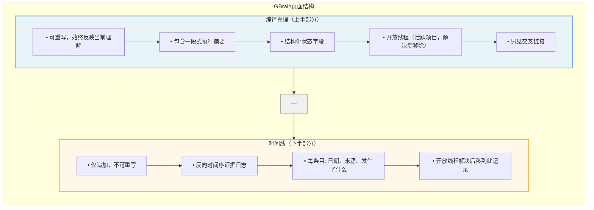
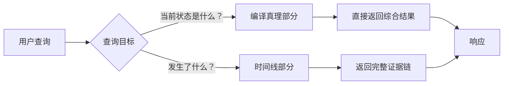
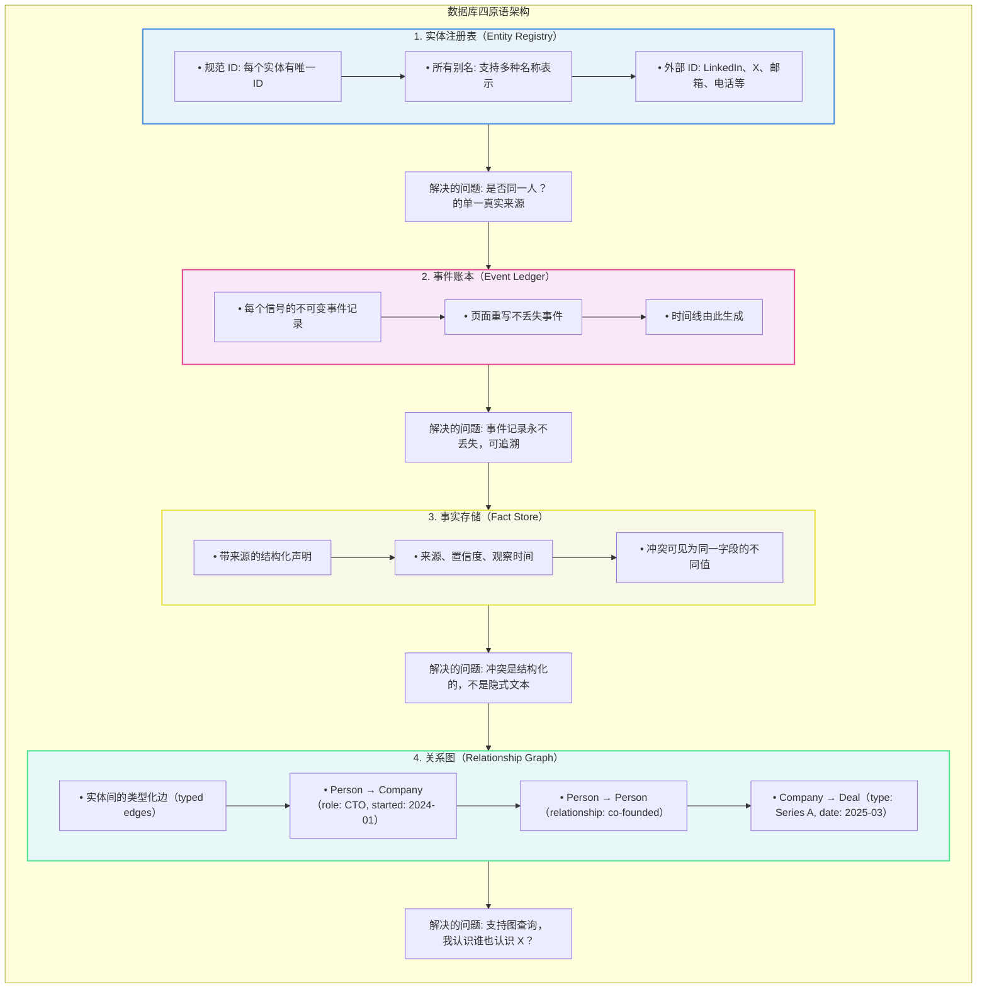
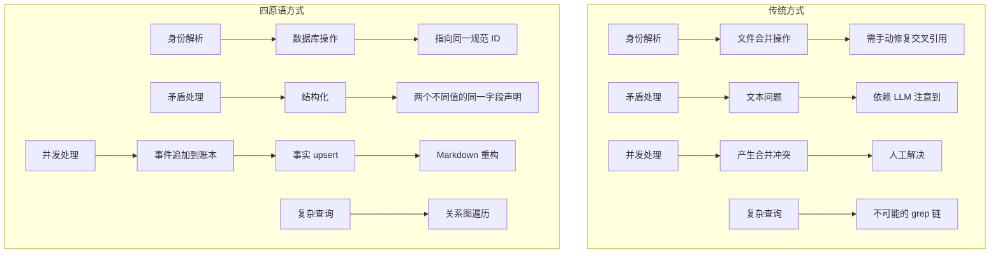
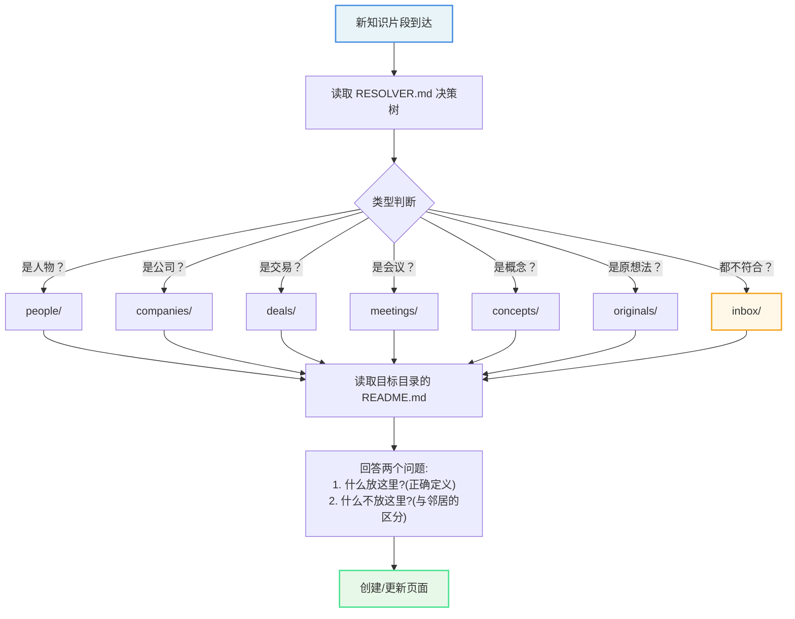
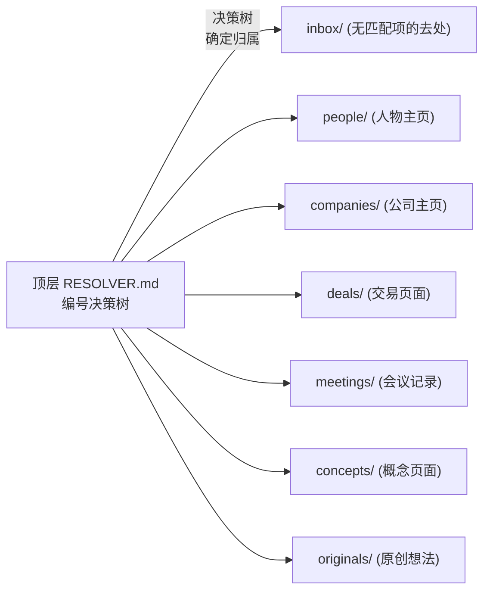
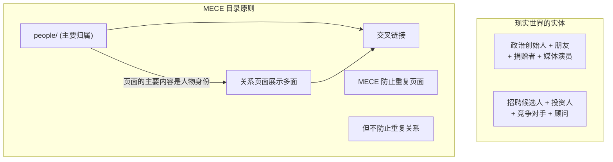
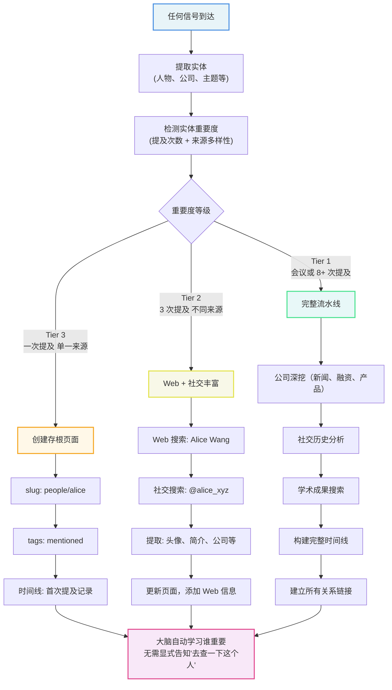
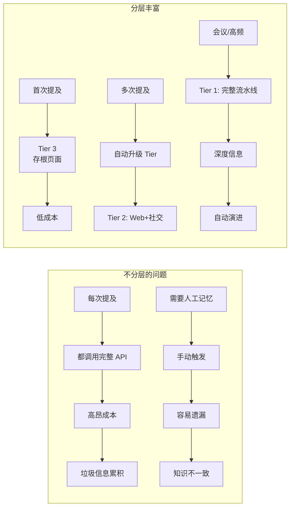

## 知识模型：两层页面结构

每个知识页面由两部分组成，用 `---` 分隔。

### 查询读取策略

### 设计优势

该设计是 Karpathy wiki 模式的杀手级特性：合成已预计算。

| 传统 RAG | GBrain |
|----------|---------|
| 每次查询都从头推导知识 | 合成已预计算 |
| 交叉引用需要实时查找 | 交叉引用已经建立 |
| 矛盾难以发现 | 矛盾已经标记 |
| 响应时间较长 | 智能体直接获取预计算的综合结果 |

## 数据库四原语

GBrain 不只是文件存储，而是完整的数据库四原语设计。

### 四原语的价值对比

## MECE 目录原则

MECE = Mutually Exclusive, Collectively Exhaustive（相互独立，完全穷尽）

这是 GBrain 目录结构的单一最重要设计决策。

### 标准目录结构

### MECE 的应用边界

MECE 原则适用于目录，不适用于现实。

| 方面 | 说明 |
|------|------|
| MECE 防止什么 | 重复页面、知识腐烂、信息孤岛 |
| MECE 不限制什么 | 实体的多重身份、丰富的关系网络 |
| 实现方式 | 页面主归属（people/）+ 类型化反向链接 |

## 丰富触发机制

每个信号（会议、邮件、推文、日历事件、联系人同步、对话提及）触及人物或公司时，丰富流水线自动触发。

### 为什么分层丰富重要

| 方式 | 问题 | GBrain 方式 |
|------|------|-----------|
| 依赖智能体记住更新 | 最终会被遗忘 | 自动触发，无需记忆 |
| 人工触发丰富 | 容易遗漏 | 每个信号都触发 |
| 无成本控制 | API 配额浪费 | 分层策略，Tier 1 仅对重要实体 |
| 无演进机制 | 始终是同一深度 | 重要度提升后自动升级 |

