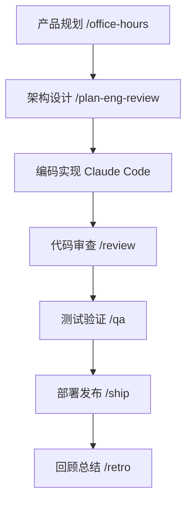

# 第一章：GStack简介与核心概念

## 引言

在 AI 编码工具日益普及的今天，很多开发者已经习惯让模型回答问题、生成代码、补测试、写文档。但当同一个助手同时承担产品思考、架构设计、编码实现、测试验证和部署发布时，输出很容易变成“什么都懂一点，但没有一个环节足够专业”。

GStack 试图解决的，正是这种“单一助手承担所有角色”带来的平均化问题。它不是单纯再提供一组提示词，而是把一套更接近真实软件团队协作方式的工作流交给 AI。

## 什么是 GStack？

GStack 是由 Y Combinator 总裁 Garry Tan 创建的开源技能包。它通过一组结构化技能，把 Claude Code 这类 AI 助手从“一个通用聊天对象”升级为“一个可切换角色、可执行流程、可组合协作的专业化工作系统”。

### 核心理念：认知齿轮

GStack 的核心创新是“认知齿轮”（Cognitive Gears）理念。它的基本判断很直接：

- 做产品定义时，AI 需要像产品经理一样追问问题
- 做系统设计时，AI 需要像架构师一样考虑边界和约束
- 做编码实现时，AI 需要像工程师一样关注可维护性
- 做测试和上线时，AI 需要像 QA 和运维一样关注风险

也就是说，GStack 的价值不在于“让 AI 更会说”，而在于“让 AI 在不同阶段进入更合适的工作模式”。

## GStack 的三大核心组件

### 技能系统

GStack 提供多个专业技能，每个技能都对应软件开发中的一种角色或一种工作流：

| 技能类别 | 代表角色 | 主要功能 |
|---------|---------|---------|
| 产品规划 | CEO / 产品经理 | 产品发现、范围定义、用户研究 |
| 工程设计 | 工程经理 / 架构师 | 系统设计、技术选型、架构审查 |
| 开发实现 | 高级工程师 | 编码、重构、性能优化 |
| 质量保障 | QA 工程师 | 测试自动化、缺陷发现、回归测试 |
| 安全审计 | 安全专家 | 漏洞扫描、威胁建模、合规检查 |
| 部署运维 | 运维工程师 | 部署流程、监控配置、故障恢复 |

### 持久化浏览器

GStack 的 `/browse` 技能基于 Chromium 持久化浏览器进程，提供以下能力：

- **低延迟**：命令响应通常在 100-200 毫秒量级
- **状态保持**：Cookie、登录会话、localStorage 可在命令间保留
- **可视化操作**：支持截图、元素识别、交互测试

这意味着 AI 不只是“知道网页长什么样”，而是能在真实页面里持续操作和验证。

### 技能标准

GStack 使用统一的技能文件格式（SKILL.md Standard），带来三点好处：

- **跨工具兼容**：可以迁移到 Claude Code、Codex CLI、Cursor 等环境
- **便于扩展**：团队可以补充自己的技能文件
- **方便沉淀知识**：技能本身就可以作为流程文档和工程规范

## GStack 如何组织开发流程

GStack 的重点不只是“提供命令”，而是把常见的软件交付过程拆成一条清晰的工作链路。

这条链路的意义在于：每一步的目标不同，AI 的判断标准也不同。GStack 用技能把这些阶段显式分开，减少“刚讨论需求就直接开始写代码”的混乱。

### 跨代理协作

在更复杂的项目里，GStack 也支持把外部 AI 一起拉进流程里协作。官方 README 明确提供了 `/pair-agent`，可以把另一个代理接入同一个浏览器环境，各自使用独立标签页并行工作。例如：

- 主会话负责推进实现
- 另一个代理负责页面验证
- 第二模型负责复核关键决策或高风险修改
- 人类开发者在同一个浏览器窗口里观察整个过程

这种能力会在后面的跨代理章节继续展开，这里先把它理解成“让多个 AI 围绕同一任务协作”的入口即可。

## 为什么选择 GStack？

### 与传统 AI 编码方式对比

| 维度 | GStack + Claude Code | 传统 AI 编码方式 |
|------|---------------------|-----------------|
| 工作模式 | 按角色和阶段切换 | 单一通用对话 |
| 覆盖范围 | 覆盖完整交付流程 | 以代码生成和问答为主 |
| 浏览器集成 | 持久化、可操作 | 往往依赖额外配置 |
| 团队协作 | 技能可沉淀、可共享 | 主要依赖个人提示词 |
| 可复制性 | 流程稳定、易复用 | 结果较依赖个人经验 |

### 适合什么样的读者？

GStack 最适合以下几类人：

- 已经在使用 Claude Code、Codex CLI 或类似工具的开发者
- 希望把 AI 从“补代码”升级到“参与完整流程”的团队
- 想把经验沉淀成标准化工作流，而不是只保存在个人 prompt 里的人

## 本系列的阅读路径

为了避免内容来回重复，这 12 章会按“先入门，再实践，再理解原理，最后看高级能力和未来”来展开：

| 章节范围 | 主题 | 你会得到什么 |
|---------|------|--------------|
| 第 1-4 章 | 入门框架 | 理解 GStack 是什么、完成安装、建立能力地图、掌握基本工作流 |
| 第 5-8 章 | 工作流原理 | 从角色、架构、浏览器能力和 learnings 理解 GStack 怎样稳定运行 |
| 第 9-10 章 | 高级能力 | 学会跨代理协作，以及发布、部署、监控和复盘闭环 |
| 第 11-12 章 | 应用与展望 | 看到真实场景中的落地方式，并理解未来趋势 |

读到这里，你只需要先建立一个整体认知：GStack 不是一个孤立命令集合，而是一套把 AI 引入复杂工作流程的方法论。

---

**下一篇预告**：第二章《环境搭建与基础配置》，把安装、验证和最小可用配置一次讲清楚。
