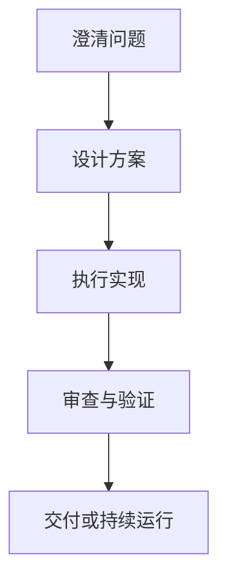

# 第四章：核心技能与工作流

第三章回答的是“GStack 能做什么”，这一章继续回答“知道它能做什么之后，实际该怎么用”。重点不再是罗列命令，而是建立一种更稳定的判断：什么时候该调用哪个技能，什么时候该切换阶段，什么时候该把多个技能串成流程。

## 不要把技能看成一排孤立命令

初学者最容易犯的一个错误，是把 GStack 理解成一张命令清单，像背 CLI 一样一个个去记。这样当然也能用，但很快就会碰到问题：

- 不知道什么时候该先想需求，什么时候该先做设计
- 不知道一个技能结束后，下一个技能应该接什么
- 不知道是该“继续同一个会话”，还是“切换到另一个角色”

更有效的理解方式是：技能只是入口，真正重要的是它们对应的阶段职责。

## 一条最基本的工作流

对大多数任务来说，最常见的路径大致如下：



把这条链路映射到 GStack，大致就是：

- `/office-hours`：澄清问题
- `/plan-eng-review`：设计方案
- Claude Code 执行：实现与改动
- `/review`、`/qa`：审查与验证
- `/ship`、`/land-and-deploy`、`/canary`：交付、部署与上线后验证

这里最重要的不是记住顺序本身，而是理解每一步在解决不同的问题。

## 几个最核心的技能

### `/office-hours`：先把问题说清楚

```bash
/office-hours
```

适合在这些时机使用：

- 你想做一个功能，但范围模糊
- 需求很多，不知道先做什么
- 你知道方向，却不知道怎样定义成功

它的职责不是替你拍板，而是迫使你把目标、边界和优先级讲清楚。

### `/plan-eng-review`：把想法变成可执行方案

```bash
/plan-eng-review
```

当问题已经明确后，这个技能更适合用来：

- 设计模块边界
- 定义 API 和数据结构
- 评估技术取舍
- 识别实现前的主要风险

它解决的是“怎样做更稳”，而不是“现在直接帮我写出来”。

### Claude Code 执行：把方案落地

到了实现阶段，核心不在某一条固定命令，而在于让 Claude Code 按前面的边界和方案去落地执行。

如果前两个阶段做得够扎实，这一步会明显更稳；如果前面没想清楚，这一步往往会变成一边生成一边返工。

### `/review`：从工程角度重新检查

```bash
/review
```

适合在代码或方案已经成形后使用，重点关注：

- 安全问题
- 性能风险
- 代码质量
- 与原设计是否一致

它最适合承担“第二双眼睛”的角色。

### `/qa`：验证关键路径和失败路径

```bash
/qa
```

当你想确认“功能不仅写出来了，而且真的站得住”时，应该引入 `/qa`。它适合：

- 回归关键功能
- 覆盖边界条件
- 检查失败路径
- 生成或补充测试思路

### `/browse`：把 AI 带到真实页面里

```bash
/browse
/browse navigate https://example.com
/browse screenshot
```

当任务不再局限于代码编辑器，而需要直接操作网页、查看界面、验证交互时，`/browse` 就会变得关键。

它对应的是“真实环境中的操作能力”，不是简单的信息检索。

### `/ship`：把完成状态推进到交付状态

```bash
/ship
```

很多任务的问题不在“做完了”，而在“怎么安全交付”。`/ship` 更适合放在流程末端，帮助你检查：

- 发布前准备
- 风险点
- 上线步骤
- 交付说明

### `/land-and-deploy`：把“可交付”推进成“生产已验证”

```bash
/land-and-deploy
```

当 PR 已经准备好、测试也过了，真正困难的地方往往变成：

- 怎样合并得更稳
- 怎样等 CI 和部署完成
- 怎样确认生产环境真的健康

这时就该把 `/land-and-deploy` 放到流程里，而不是停留在“代码已经写完”的状态。

### `/canary`：上线以后继续观察关键页面

```bash
/canary https://example.com
```

很多流程在上线后才真正暴露问题，所以 `/canary` 的职责是：

- 持续访问关键页面
- 检查控制台错误
- 观察性能回退
- 发现页面失败或视觉异常

它解决的是“上线后怎么继续看”，而不是“上线完就结束”。

### `/pair-agent`：当单角色不够时，再引入外部协作

```bash
/pair-agent
```

当任务复杂到需要第二个 AI 同时参与时，再引入 `/pair-agent`。它的意义不是再造一个总控台，而是把另一个代理接到同一个浏览器环境里，让双方在独立标签页里并行工作。

## 比“会用命令”更重要的是阶段判断

很多人觉得自己不会 GStack，是因为“命令太多记不住”。其实更常见的问题是阶段判断出了错，例如：

- 还没澄清需求，就直接让 AI 开始实现
- 还没定方案，就急着做代码审查
- 功能刚写完，就跳过测试直接准备上线

所以真正需要培养的不是记忆力，而是流程感。

## 一个通用的判断方法

如果你不知道当前该调用哪个技能，可以先问自己三个问题：

1. 我现在缺的是目标澄清，还是方案设计，还是执行验证？
2. 这个问题更像产品问题、工程问题，还是交付问题？
3. 我需要的是单角色推进，还是多角色协作？

只要这三个问题答清楚，大多数技能选择都不会偏太远。

## 这一章和后面的关系

到这里为止，前四章完成的应该是一套“入门框架”：

- 第一章说明 GStack 是什么
- 第二章解决怎样装起来
- 第三章说明它适合什么场景
- 第四章说明它怎样形成工作流

接下来的第五章到第八章，才开始进入智能体本身的原理层：为什么这些能力能成立，它们在系统内部是怎么组织的。

---

**上一篇**：第三章《GStack能做什么》  
**下一篇**：第五章《GStack如何把AI组织成虚拟团队》

---
---
**系列目录**：
- [第一章：GStack简介与核心概念](./2026-04-18-第01章-第一章GStack简介与核心概念.md) 👉 下一章
- [第二章：环境搭建与基础配置](./2026-04-18-第02章-第二章环境搭建与基础配置.md) 👉 下一章
- [第三章：GStack能做什么](./2026-04-18-第03章-第三章GStack能做什么.md) 👉 下一章
- [第四章：核心技能与工作流](./2026-04-18-第04章-第四章核心技能与工作流.md) 👉 下一章
- [第五章：GStack如何把AI组织成虚拟团队](./2026-04-18-第05章-第五章GStack如何把AI组织成虚拟团队.md) 👉 下一章
- [第六章：GStack架构与实现机制](./2026-04-18-第06章-第六章GStack架构与实现机制.md) 👉 下一章
- [第七章：GStack如何连接浏览器与外部能力](./2026-04-18-第07章-第七章GStack如何连接浏览器与外部能力.md) 👉 下一章
- [第八章：GStack的learnings与跨会话经验](./2026-04-18-第08章-第八章GStack的learnings与跨会话经验.md) 👉 下一章
- [第九章：GStack的跨代理协作与并行工作](./2026-04-18-第09章-第九章GStack的跨代理协作与并行工作.md) 👉 下一章
- [第十章：GStack的发布自动化与持续监控](./2026-04-18-第10章-第十章GStack的发布自动化与持续监控.md) 👉 下一章
- [第十一章：现实世界应用案例](./2026-04-18-第11章-第十一章现实世界应用案例.md) 👉 下一章
- [第十二章：未来发展趋势](./2026-04-18-第12章-第十二章未来发展趋势.md) 👈 当前位置

