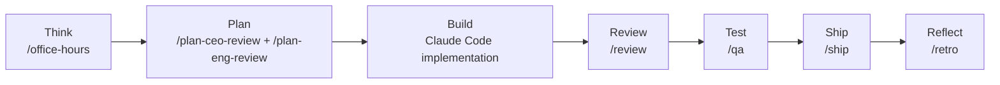

# 第五章：GStack如何把AI组织成虚拟团队

## 引言

前四章解决的是入门问题：GStack 是什么、怎么装、适合做什么、怎样形成一条基础工作流。到这一章，问题开始变成：

GStack 到底是怎样把一个通用 AI 助手，组织成一个更像“团队”的系统？

## 官方定义里的 GStack

GStack 官方 README 对它的定位非常清楚：它把 Claude Code 变成一个“虚拟工程团队”，由一组专业角色和一套固定工作流组成。

也就是说，GStack 的核心不是一个“万能智能体”，而是三层东西的组合：

- 一组带明确职责的技能
- 一条按冲刺节奏组织的工作流
- 若干支撑这些技能运行的基础设施

如果把这三层拆开来看，GStack 的思路就会比“AI 会自己思考并行动”这种泛化表述清晰得多。

## 第一层：专业角色

官方 `docs/skills.md` 把每个核心技能都定义成一种“专家角色”。例如：

| 技能 | 官方角色 | 官方职责摘要 |
|------|---------|-------------|
| `/office-hours` | YC Office Hours | 在写代码前重构问题，逼出真实需求和产品边界 |
| `/plan-ceo-review` | CEO / Founder | 重新审视问题，寻找更高价值的产品方向 |
| `/plan-eng-review` | Eng Manager | 锁定架构、数据流、边界条件与测试要求 |
| `/review` | Staff Engineer | 在合并前找出会在生产环境暴露的问题 |
| `/qa` | QA Lead | 测试、发现缺陷、修复并回归验证 |
| `/ship` | Release Engineer | 同步主分支、跑测试、审计覆盖率、推送并开 PR |
| `/browse` | QA Engineer | 给 AI “眼睛”，用真实 Chromium 浏览器执行交互 |
| `/learn` | Memory | 管理跨会话积累的项目模式、偏好和坑点 |

这里最重要的一点是：GStack 并不把所有任务都交给同一个模式处理。它的做法，是强制让 AI 在不同阶段切换角色和判断标准。

## 第二层：工作流，而不是散装命令

官方 README 有一句很关键的话：**gstack is a process, not a collection of tools.**

这句话基本可以看作理解 GStack 的第一原则。GStack 的重点不是“有很多 slash commands”，而是这些技能按冲刺流程彼此接力。

### 官方工作流

这张图对应官方 README 中 **Think → Plan → Build → Review → Test → Ship → Reflect** 这条流程。

## 第三层：上下游产物会传递

GStack 官方强调的不只是“按顺序调用”，还包括前一个阶段的产物会进入下一个阶段。

README 中给出的典型描述包括：

- `/office-hours` 会写出设计文档，供后续规划技能使用
- `/plan-eng-review` 会把架构、边界情况和测试要求明确下来
- `/review` 负责在代码落地后找问题
- `/qa` 在真实页面和流程里验证问题是否真的解决
- `/ship` 把测试、覆盖率和交付动作收口

这意味着 GStack 更像一条持续传递上下文的“工程管线”，而不是一组彼此独立的 prompt。

## GStack 里的“智能体”究竟是什么？

如果严格按照官方仓库来理解，GStack 里的“智能体”更接近下面这层含义：

- 一个带方法论约束的专业角色
- 一个会读写项目上下文的工作流节点
- 一个能调用工具并沿流程推进任务的执行单元

在 GStack 的语境里，“智能体”首先体现为**角色化工作流**：每个技能承担一种专业职责，并在整条流程里接力推进任务。

## GStack 为什么比普通提示词更稳？

根据官方文档，GStack 稳定性的来源主要有三点：

### 1. 角色被显式拆开

一个技能只负责一类判断，不试图同时扮演产品、架构、实现、QA 和发布所有角色。

### 2. 工作流顺序被显式规定

问题先澄清，方案后锁定，再实现、审查、测试和发布。这样可以减少“边做边改需求”的混乱。

### 3. 关键基础设施被产品化了

GStack 不是只靠文字提示驱动，它还提供了真实浏览器、技能模板系统、自动生成文档机制和跨会话 learnings 这类能力，让流程能够在多次会话之间延续。

## 官方真正公开了哪些基础能力？

从 README、`docs/skills.md` 和 `ARCHITECTURE.md` 来看，GStack 官方明确公开了至少这些基础能力：

- 一套按角色组织的技能系统
- 一条固定冲刺流程
- 一个持久化浏览器能力
- 用于支撑技能运行的模板和生成机制
- 用于积累项目经验的 learnings 机制

其中，浏览器和技能生成系统的实现细节在官方 `ARCHITECTURE.md` 中写得最完整；下一章就会专门讲这些内容。

## 总结

从官方仓库看，GStack 的核心并不是一个神秘的“超级智能体内核”，而是：

- 以专业角色为单位组织 AI
- 以冲刺流程为单位推进工作
- 以真实工具和基础设施来承接这些流程

这就是它为什么更像“虚拟团队”，而不是“一个更会聊天的代码助手”。

---

**下一篇预告**：第六章《GStack架构与实现机制》，继续基于官方 `ARCHITECTURE.md`，看 GStack 的持久化浏览器、技能模板系统和运行机制到底是怎样工作的。
