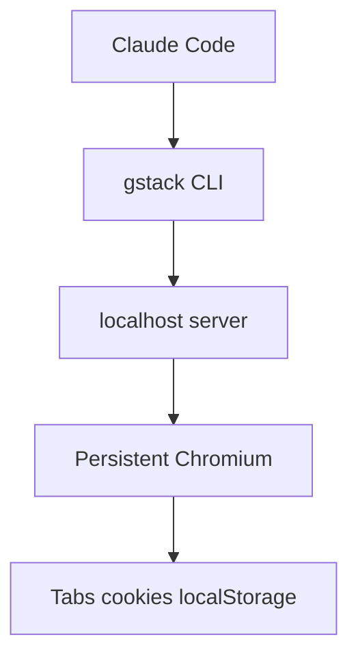

# 第七章：GStack如何连接浏览器与外部能力

## 引言

前两章已经把 GStack 的角色系统和运行机制拆开看过了。接下来最实际的问题是：这些技能怎样真正连到外部世界？

对 GStack 来说，最关键的答案不是一套抽象“工具调用框架”，而是那套已经被官方明确实现出来的浏览器能力。官方文档反复强调，浏览器是 GStack 最重要、也最有工程含量的一部分。

## GStack 的外部能力核心：持久化浏览器

官方 `ARCHITECTURE.md` 讲得很直接：GStack 给 Claude Code 提供了一个持久化 Chromium 守护进程。它不是每次命令临时启动一个浏览器，而是把浏览器持续跑在本地，由 CLI 和本地 HTTP 服务驱动。

这套链路带来的价值很明确：

- 浏览器状态可以在命令之间保留
- 后续操作不需要每次冷启动
- AI 可以持续查看页面、执行交互并回读结果

## `/browse`：让 AI 真正“去看”

官方把 `/browse` 定义成 QA Engineer 模式。它解决的问题不是“让 AI 知道网页存在”，而是让它真的去操作页面、看截图、读控制台、检查流程。

根据官方 `docs/skills.md`，`/browse` 的关键特点包括：

- 基于持久化 Chromium 守护进程
- 首次调用启动浏览器，后续调用大约 100-200ms
- Cookie、标签页和 localStorage 在命令之间延续
- 支持截图、页面快照、控制台检查和页面交互

这也是为什么 GStack 的网页能力和普通“帮我猜页面会怎样”完全不是一个层级。

## Refs 机制：让 AI 稳定操作页面

官方 `ARCHITECTURE.md` 还专门解释了 `@e1`、`@e2`、`@c1` 这类元素引用机制。

它的基本流程是：

1. 先对页面做快照
2. 基于可访问性树生成可引用元素
3. 给元素分配 `@e1` 这类引用名
4. 后续点击、填表、检查状态都通过这些引用完成

这能减少两类常见问题：

- 反复拼 CSS 选择器导致操作脆弱
- 页面变化后，旧引用仍被误用

在 GStack 的浏览器体系里，这层抽象非常关键，因为它是在给 AI 提供一种更稳的页面操作语言。

## `/setup-browser-cookies`：连接真实会话

浏览器能打开页面，并不代表它能进入需要登录的真实业务流程。官方为此提供了 `/setup-browser-cookies`。

根据 `docs/skills.md`，这个技能的职责是：

- 自动识别用户本机的 Chromium 浏览器
- 通过系统钥匙串解密 Cookie
- 把真实浏览器里的登录态导入到 GStack 的 Playwright 会话中
- 通过交互式选择器让用户挑选要导入的域名

这让 `/browse` 和 `/qa` 不再只能测试公开页面，而可以进入真实后台、已登录站点和受权限保护的流程。

## `/qa`：浏览器之上的测试方法论

官方文档有一句很准确的话：**`/browse` gives the agent eyes. `/qa` gives it a testing methodology.**

也就是说：

- `/browse` 负责让 AI 看见、点击、截图、检查
- `/qa` 负责把这些能力组织成系统化测试

官方 `docs/skills.md` 给出的 `/qa` 特点包括：

- 在功能分支上可按 diff 感知受影响页面
- 可以直接读取变更范围并测试相关页面
- 支持 Full、Quick、Regression 等模式
- 修复并验证缺陷后，会自动生成回归测试

在 GStack 里，真正的“外部集成能力”不是停留在“能调用浏览器”，而是进一步演进成“能围绕浏览器完成 QA 工作流”。

## `/open-gstack-browser`：让人和 AI 共视

官方还提供了 `/open-gstack-browser`。它不是另一个浏览器控制器，而是让用户看见 AI 正在做什么。

根据 `docs/skills.md` 和 README，它会：

- 启动带侧边栏的 GStack Browser
- 启用反机器人和更贴近日常浏览器的行为模式
- 保持 headed 模式，不走默认的无头会话
- 允许用户在侧边栏里直接给浏览器代理下指令

这意味着 GStack 的浏览器能力不只是 headless automation，也支持“人机共视”的工作方式。

## `/pair-agent`：把外部环境共享给其他 AI

官方 README 还公开了 `/pair-agent`。这部分非常重要，因为它说明 GStack 的浏览器不只是给 Claude Code 本地使用，还可以成为跨 AI 协作的共享环境。

README 对它的描述包括：

- 共享浏览器给其他 AI agent
- 不同 agent 各自拥有独立标签页
- 支持同机或远程连接
- 自动处理 token、隔离、速率限制和活动归因

也就是说，在 GStack 里，外部能力不只是“AI 调工具”，而是“把一个真实浏览器环境变成可共享的协作空间”。

## GStack 的外部能力到底覆盖了什么？

如果只根据官方文档，可以把这部分能力概括成四层：

### 1. 页面访问与状态保留

由持久化 Chromium 守护进程支撑。

### 2. 登录态与真实业务上下文

由 `/setup-browser-cookies` 提供接入。

### 3. 系统化测试和验证

由 `/qa` 建立流程，把浏览器能力变成可执行 QA。

### 4. 共视和跨代理共享

由 `/open-gstack-browser` 和 `/pair-agent` 把浏览器能力扩展成协作基础设施。

## 这一章里的关键结论

GStack 的“工具调用与外部集成”，在官方仓库里最扎实、最明确的实现，首先就是浏览器体系。

官方当前明确公开并已经产品化的核心能力包括：

- `/browse`
- `/setup-browser-cookies`
- `/qa`
- `/open-gstack-browser`
- `/pair-agent`

这些能力共同构成了 GStack 把 AI 从“只能读写文本”推进到“能够进入真实网页和真实流程”的那一层突破。

---

**下一篇预告**：第八章《GStack 的 learnings 与跨会话经验》，继续看 GStack 如何把跨会话积累下来的模式、偏好和经验真正沉淀下来。

---
---
**系列目录**：
- [第一章：GStack简介与核心概念](./2026-04-18-第01章-第一章GStack简介与核心概念.md) 👉 下一章
- [第二章：环境搭建与基础配置](./2026-04-18-第02章-第二章环境搭建与基础配置.md) 👉 下一章
- [第三章：GStack能做什么](./2026-04-18-第03章-第三章GStack能做什么.md) 👉 下一章
- [第四章：核心技能与工作流](./2026-04-18-第04章-第四章核心技能与工作流.md) 👉 下一章
- [第五章：GStack如何把AI组织成虚拟团队](./2026-04-18-第05章-第五章GStack如何把AI组织成虚拟团队.md) 👉 下一章
- [第六章：GStack架构与实现机制](./2026-04-18-第06章-第六章GStack架构与实现机制.md) 👉 下一章
- [第七章：GStack如何连接浏览器与外部能力](./2026-04-18-第07章-第七章GStack如何连接浏览器与外部能力.md) 👉 下一章
- [第八章：GStack的learnings与跨会话经验](./2026-04-18-第08章-第八章GStack的learnings与跨会话经验.md) 👉 下一章
- [第九章：GStack的跨代理协作与并行工作](./2026-04-18-第09章-第九章GStack的跨代理协作与并行工作.md) 👉 下一章
- [第十章：GStack的发布自动化与持续监控](./2026-04-18-第10章-第十章GStack的发布自动化与持续监控.md) 👉 下一章
- [第十一章：现实世界应用案例](./2026-04-18-第11章-第十一章现实世界应用案例.md) 👉 下一章
- [第十二章：未来发展趋势](./2026-04-18-第12章-第十二章未来发展趋势.md) 👈 当前位置

